

    
Universidad Peruana de Ciencias Aplicadas - Ingeniería de Software - 2025-20

    <h1 style="margin: 10px 0; border-bottom: none;">Aplicaciones para Dispositivos Móviles</h1>
    <h2>NRC 1807 - Profesor Mayta Guillermo, Jorge Luis</h2>
    
    <h2 style="margin: 10px 0; border-bottom: none;">Informe de Trabajo Final</h2>
    <h3 style="margin: 10px 0; border-bottom: none;">Startup: Soulware</h3>
    <h3 style="margin: 10px 0; border-bottom: none;">Producto: T'Compro</h3>
    <h4 style="margin: 10px 0; border-bottom: none;">Integrantes:</h4>
    <ul style="display: inline-block; text-align: left; padding: 0;">
        <li style="padding: 5px 0;">De Las Casas Latour, Sebastián</li>
        <li style="padding: 5px 0;">Guimaraes Escalante, Carlos Eduardo</li>
        <li style="padding: 5px 0;">López De La Cruz, Mauro Fabricio</li>
        <li style="padding: 5px 0;">Orozco Torres, Álvaro Joaquín</li>
        <li style="padding: 5px 0;">Reaño Delgadillo, Henry Paolo</li>
    </ul>
    <h4 style="margin: 10px 0; border-bottom: none;">Agosto de 2025</h4>

# Registro de Versiones del Informe

<table style="border-collapse: collapse; width: 100%; text-align: left;">
    <thead>
        <tr> 
            <th>Versión</th>
            <th>Fecha</th>
            <th>Autor</th>
            <th>Descripción de modificación</th>
        </tr>
    </thead>
    <tbody>
        <tr>
            <td>1.0.0</td>
            <td>25/04/2025</td>
            <td>
                <ul>
                    <li>De las Casas Latour, Sebastián</li>
                    <li>Guimaraes Escalante, Carlos Eduardo</li>
                    <li>López De la Cruz, Mauro Fabricio</li>
                    <li>Orozco Torres, Álvaro Joaquín</li>
                    <li>Reaño Delgadillo, Henry Paolo</li>
                </ul>
            </td>
            <td>
                <strong>Adición de secciones:</strong> 
                
Carátula

                
Registro de Versiones del Informe

                
Project Report Collaboration Insights

                
Contenido

                
Student Outcome

                
SMART

                
Capítulo I: Introducción

                
1.1. Start-up Profile

                
1.1.1. Descripción de la startup

                
1.1.2. Perfiles de los integrantes del equipo

                
1.2. Solution Profile

                
1.2.1. Antecedentes y problemática

                
1.2.2. Lean UX Process

                
1.2.2.1. Lean UX Problem Statements

                
1.2.2.2. Lean UX Assumptions

                
1.2.2.3. Lean UX Hypothesis Statements

                
1.2.2.4. Lean UX Canvas

                
1.3. Segmentos objetivo

                
Capítulo II: Requirements Development and Software Solution Design

                
2.1. Competidores

                
2.1.1. Análisis competitivo

                
2.1.2. Estrategias y tácticas frente a competidores

                
2.2. Entrevistas

                
2.2.1. Diseño de entrevistas

                
2.2.2. Registro de entrevistas

                
2.2.3. Análisis de entrevistas

                
2.3. Needfinding

                
2.3.1. User Personas

                
2.3.2. User Task Matrix

                
2.3.3. User Journey Mapping

                
2.3.4. Empathy Mapping

                
2.3.5. Ubiquitous Language

                
2.4. Requirements Specification

                
2.4.1. User Stories

                
2.4.2. Impact Mapping

                
2.4.3. Product Backlog

                
2.5. Strategic-Level Domain-Driven Design

                
2.5.1. EventStorming

                
2.5.1.1. Candidate Context Discovery

                
2.5.1.2. Domain Message Flows Modeling

                
2.5.1.3. Bounded Context Canvases

                
2.5.2. Context Mapping

                
2.5.3. Software Architecture

                
2.5.3.1. Software Architecture Context Level Diagrams

                
2.5.3.2. Software Architecture Container Level Diagrams

                
2.5.3.3. Software Architecture Deployment Diagrams

                
2.6. Tactical-Level Domain-Driven Design

                <!-- Bounded Context: Orders -->
                
2.6.1. Bounded Context: Orders

                
2.6.1.1. Domain Layer

                
2.6.1.2. Interface Layer

                
2.6.1.3. Application Layer

                
2.6.1.4. Infrastructure Layer

                
2.6.1.5. Bounded Context Software Architecture Component Level Diagrams

                
2.6.1.6. Bounded Context Software Architecture Code Level Diagrams

                
2.6.1.6.1. Bounded Context Domain Layer Class Diagrams

                
2.6.1.6.2. Bounded Context Database Design Diagram

                <!-- Bounded Context: Shopping -->
                
2.6.2. Bounded Context: Shopping

                
2.6.2.1. Domain Layer

                
2.6.2.2. Interface Layer

                
2.6.2.3. Application Layer

                
2.6.2.4. Infrastructure Layer

                
2.6.2.5. Bounded Context Software Architecture Component Level Diagrams

                
2.6.2.6. Bounded Context Software Architecture Code Level Diagrams

                
2.6.2.6.1. Bounded Context Domain Layer Class Diagrams

                
2.6.2.6.2. Bounded Context Database Design Diagram

                <!-- Bounded Context: Checkout -->
                
2.6.3. Bounded Context: Checkout

                
2.6.3.1. Domain Layer

                
2.6.3.2. Interface Layer

                
2.6.3.3. Application Layer

                
2.6.3.4. Infrastructure Layer

                
2.6.3.5. Bounded Context Software Architecture Component Level Diagrams

                
2.6.3.6. Bounded Context Software Architecture Code Level Diagrams

                
2.6.3.6.1. Bounded Context Domain Layer Class Diagrams

                
2.6.3.6.2. Bounded Context Database Design Diagram

                <!-- Bounded Context: Shop -->
                
2.6.4. Bounded Context: Shop

                
2.6.4.1. Domain Layer

                
2.6.4.2. Interface Layer

                
2.6.4.3. Application Layer

                
2.6.4.4. Infrastructure Layer

                
2.6.4.5. Bounded Context Software Architecture Component Level Diagrams

                
2.6.4.6. Bounded Context Software Architecture Code Level Diagrams

                
2.6.4.6.1. Bounded Context Domain Layer Class Diagrams

                
2.6.4.6.2. Bounded Context Database Design Diagram

                <!-- Bounded Context: Inventory -->
                
2.6.5. Bounded Context: Inventory

                
2.6.5.1. Domain Layer

                
2.6.5.2. Interface Layer

                
2.6.5.3. Application Layer

                
2.6.5.4. Infrastructure Layer

                
2.6.5.5. Bounded Context Software Architecture Component Level Diagrams

                
2.6.5.6. Bounded Context Software Architecture Code Level Diagrams

                
2.6.5.6.1. Bounded Context Domain Layer Class Diagrams

                
2.6.5.6.2. Bounded Context Database Design Diagram

                <!-- Bounded Context: Catalog -->
                
2.6.6. Bounded Context: Catalog

                
2.6.6.1. Domain Layer

                
2.6.6.2. Interface Layer

                
2.6.6.3. Application Layer

                
2.6.6.4. Infrastructure Layer

                
2.6.6.5. Bounded Context Software Architecture Component Level Diagrams

                
2.6.6.6. Bounded Context Software Architecture Code Level Diagrams

                
2.6.6.6.1. Bounded Context Domain Layer Class Diagrams

                
2.6.6.6.2. Bounded Context Database Design Diagram

                <!-- Bounded Context: IAM -->
                
2.6.7. Bounded Context: IAM

                
2.6.7.1. Domain Layer

                
2.6.7.2. Interface Layer

                
2.6.7.3. Application Layer

                
2.6.7.4. Infrastructure Layer

                
2.6.7.5. Bounded Context Software Architecture Component Level Diagrams

                
2.6.7.6. Bounded Context Software Architecture Code Level Diagrams

                
2.6.7.6.1. Bounded Context Domain Layer Class Diagrams

                
2.6.7.6.2. Bounded Context Database Design Diagram

                
Conclusiones

                
Bibliografía

                
Anexos

            </td>
        </tr>
    </tbody>
</table>

# Project Report Collaboration Insights

Enlace del repositorio del informe del proyecto: [Enlace (GitHub)](https://github.com/Soulware-Apps-Moviles/report)

**TB1**

Se presenta las análiticas de contribución:

Se presenta el resumen de commits:

# Contenido

- [Registro de Versiones del Informe](#registro-de-versiones-del-informe)
- [Project Report Collaboration Insights](#project-report-collaboration-insights)
- [Student Outcome](#student-outcome)
- [SMART](#smart)
- [1. Capítulo I: Introducción](#capítulo-i-introducción)
  - [1.1. Start-up Profile](#start-up-profile)
    - [1.1.1. Descripción de la startup](#descripción-de-la-startup)
    - [1.1.2. Perfiles de los integrantes del equipo](#perfiles-de-los-integrantes-del-equipo)
  - [1.2. Solution Profile](#solution-profile)
    - [1.2.1. Antecedentes y problemática](#antecedentes-y-problemática)
    - [1.2.2. Lean UX Process](#lean-ux-process)
      - [1.2.2.1 Lean UX Problem Statements](#lean-ux-problem-statements)
      - [1.2.2.2 Lean UX Assumptions](#lean-ux-assumptions)
      - [1.2.2.3 Lean UX Hypothesis Statements](#lean-ux-hypothesis-statements)
      - [1.2.2.4 Lean UX Canvas](#lean-ux-canvas)
  - [1.2.3. Segmentos objetivo](#segmentos-objetivo)
- [2. Capítulo II: Requirements Development and Software Solution Design](#capítulo-ii-requirements-development-and-software-solution-design)
  - [2.1. Competidores](#competidores)
    - [2.1.1. Análisis competitivo](#análisis-competitivo)
    - [2.1.2. Estrategias y tácticas frente a competidores](#estrategias-y-tácticas-frente-a-competidores)
  - [2.2. Entrevistas](#entrevistas)
    - [2.2.1. Diseño de entrevistas](#diseño-de-entrevistas)
    - [2.2.2. Registro de entrevistas](#registro-de-entrevistas)
    - [2.2.3. Análisis de entrevistas](#análisis-de-entrevistas)
  - [2.3. Needfinding](#needfinding)
    - [2.3.1. User Personas](#user-personas)
    - [2.3.2. User Task Matrix](#user-task-matrix)
    - [2.3.3. User Journey Mapping](#user-journey-mapping)
    - [2.3.4. Empathy Mapping](#empathy-mapping)
    - [2.3.5. Ubiquitous Language](#ubiquitous-language)
  - [2.4. Requirements Specification](#requirements-specification)
    - [2.4.1. User Stories](#user-stories)
    - [2.4.2. Impact Mapping](#impact-mapping)
    - [2.4.3. Product Backlog](#product-backlog)
  - [2.5. Strategic-Level Domain-Driven Design](#strategic-level-domain-driven-design)
    - [2.5.1. EventStorming](#eventstorming)
      - [2.5.1.1. Candidate Context Discovery](#candidate-context-discovery)
      - [2.5.1.2. Domain Message Flows Modeling](#domain-message-flows-modeling)
      - [2.5.1.3. Bounded Context Canvases](#bounded-context-canvases)
    - [2.5.2. Context Mapping](#context-mapping)
    - [2.5.3. Software Architecture](#software-architecture)
      - [2.5.3.1. Software Architecture Context Level Diagrams](#software-architecture-context-level-diagrams)
      - [2.5.3.2. Software Architecture Container Level Diagrams](#software-architecture-container-level-diagrams)
      - [2.5.3.3. Software Architecture Deployment Diagrams](#software-architecture-deployment-diagrams)
  - [2.6. Tactical-Level Domain-Driven Design](#tactical-level-domain-driven-design)
    - [2.6.1. Bounded Context: Orders](#bounded-context-orders)
      - [2.6.1.1. Domain Layer](#orders-domain-layer)
      - [2.6.1.2. Interface Layer](#orders-interface-layer)
      - [2.6.1.3. Application Layer](#orders-application-layer)
      - [2.6.1.4. Infrastructure Layer](#orders-infrastructure-layer)
      - [2.6.1.5. Bounded Context Software Architecture Component Level Diagrams](#orders-component-diagrams)
      - [2.6.1.6. Bounded Context Software Architecture Code Level Diagrams](#orders-code-diagrams)
        - [2.6.1.6.1. Bounded Context Domain Layer Class Diagrams](#orders-class-diagrams)
        - [2.6.1.6.2. Bounded Context Database Design Diagram](#orders-database-diagram)
    - [2.6.2. Bounded Context: Shopping](#bounded-context-shopping)
      - [2.6.2.1 Domain Layer](#shopping-domain-layer)
      - [2.6.2.2 Interface Layer](#shopping-interface-layer)
      - [2.6.2.3 Application Layer](#shopping-application-layer)
      - [2.6.2.4 Infrastructure Layer](#shopping-infrastructure-layer)
      - [2.6.2.5 Bounded Context Software Architecture Component Level Diagrams](#shopping-component-diagrams)
      - [2.6.2.6 Bounded Context Software Architecture Code Level Diagrams](#shopping-code-diagrams)
        - [2.6.2.6.1 Bounded Context Domain Layer Class Diagrams](#shopping-class-diagrams)
        - [2.6.2.6.2 Bounded Context Database Design Diagram](#shopping-database-diagram)
    - [2.6.3. Bounded Context: Checkout](#bounded-context-checkout)
      - [2.6.3.1. Domain Layer](#checkout-domain-layer)
      - [2.6.3.2. Interface Layer](#checkout-interface-layer)
      - [2.6.3.3. Application Layer](#checkout-application-layer)
      - [2.6.3.4. Infrastructure Layer](#checkout-infrastructure-layer)
      - [2.6.3.5. Bounded Context Software Architecture Component Level Diagrams](#checkout-component-diagrams)
      - [2.6.3.6. Bounded Context Software Architecture Code Level Diagrams](#checkout-code-diagrams)
        - [2.6.3.6.1. Bounded Context Domain Layer Class Diagrams](#checkout-class-diagrams)
        - [2.6.3.6.2. Bounded Context Database Design Diagram](#checkout-database-diagram)
    - [2.6.4. Bounded Context: Shop](#bounded-context-shop)
      - [2.6.4.1. Domain Layer](#shop-domain-layer)
      - [2.6.4.2. Interface Layer](#shop-interface-layer)
      - [2.6.4.3. Application Layer](#shop-application-layer)
      - [2.6.4.4. Infrastructure Layer](#shop-infrastructure-layer)
      - [2.6.4.5. Bounded Context Software Architecture Component Level Diagrams](#shop-component-diagrams)
      - [2.6.4.6. Bounded Context Software Architecture Code Level Diagrams](#shop-code-diagrams)
        - [2.6.4.6.1. Bounded Context Domain Layer Class Diagrams](#shop-class-diagrams)
        - [2.6.4.6.1. Bounded Context Database Design Diagram](#shop-database-diagram)
    - [2.6.5. Bounded Context: Inventory](#bounded-context-inventory)
      - [2.6.5.1. Domain Layer](#inventory-domain-layer)
      - [2.6.5.2. Interface Layer](#inventory-interface-layer)
      - [2.6.5.3. Application Layer](#inventory-application-layer)
      - [2.6.5.4. Infrastructure Layer](#inventory-infrastructure-layer)
      - [2.6.5.5. Bounded Context Software Architecture Component Level Diagrams](#inventory-component-diagrams)
      - [2.6.5.6. Bounded Context Software Architecture Code Level Diagrams](#inventory-code-diagrams)
        - [2.6.5.6.1. Bounded Context Domain Layer Class Diagrams](#inventory-class-diagrams)
        - [2.6.5.6.2. Bounded Context Database Design Diagram](#inventory-database-diagram)
    - [2.6.6. Bounded Context: Catalog](#bounded-context-catalog)
      - [2.6.6.1. Domain Layer](#catalog-domain-layer)
      - [2.6.6.2. Interface Layer](#catalog-interface-layer)
      - [2.6.6.3. Application Layer](#catalog-application-layer)
      - [2.6.6.4. Infrastructure Layer](#catalog-infrastructure-layer)
      - [2.6.6.5. Bounded Context Software Architecture Component Level Diagrams](#catalog-component-diagrams)
      - [2.6.6.6. Bounded Context Software Architecture Code Level Diagrams](#catalog-code-diagrams)
        - [2.6.6.6.1. Bounded Context Domain Layer Class Diagrams](#catalog-class-diagrams)
        - [2.6.6.6.2. Bounded Context Database Design Diagram](#catalog-database-diagram)
    - [2.6.7. Bounded Context: IAM](#bounded-context-iam)
      - [2.6.7.1. Domain Layer](#iam-domain-layer)
      - [2.6.7.2. Interface Layer](#iam-interface-layer)
      - [2.6.7.3. Application Layer](#iam-application-layer)
      - [2.6.7.4. Infrastructure Layer](#iam-infrastructure-layer)
      - [2.6.7.5. Bounded Context Software Architecture Component Level Diagrams](#iam-component-diagrams)
      - [2.6.7.6. Bounded Context Software Architecture Code Level Diagrams](#iam-code-diagrams)
        - [2.6.7.6.1. Bounded Context Domain Layer Class Diagrams](#iam-class-diagrams)
        - [2.6.7.6.2. Bounded Context Database Design Diagram](#iam-database-diagram)
- [Conclusiones](#conclusiones)
- [Bibliografía](#bibliografía)
- [Anexos](#anexos)

# Student Outcome

<table>
    <thead>
        <tr>
            <th scope="col">Criterio específico</th>
            <th scope="col">Acciones realizadas</th>
            <th scope="col">Conclusiones</th>
        </tr>
    </thead>
    <tbody>
        <tr>
            <th scope="row">Actualiza conceptos y conocimientos necesarios para su desarrollo profesional y en especial para su proyecto en soluciones de software.</th>
            <td>
            De Las Casas Latour, Sebastián:  
            <strong>TB1:</strong> Realice investigaciones relacionadas a segmentos objetivo, diseño de artefactos UX en base a las entrevistas realizadas y traslade las historias de usuario a un software de gestión de proyectos. Estas actividades me han ayudado a mejorar mi capacidad de analisis de segmentos e identificación de necesidades de usuario.  
            Guimaraes Escalante, Carlos Eduardo:  
            <strong>TB1:</strong>Realice entrevistas relacionadas a los clientes de bodega, participe en la primera sesión del eventstorming para identificar contextos, realice artefactos UX en base a las entrevistas que yo mismo realice y documente diseño táctico de un contexto identificado. Considero que la parte más importante de este primer entregable fue la identificación de contextos, momento en el cual estuve presente y fui un gran aporte.    
            López De La Cruz, Mauro Fabricio: 
            <strong>TB1:</strong>Participe en el event storming, desarrolle artefactos UX de un segmento objetivo y realice investigaciones mediante fuentes confiables de ese segmento. Al realizar el eventstorming di opiniones que fueron disruptivas para la sesión, siempre cuestionando lo que se daba por sentado. Esto ayudo a que los contextos se definieran correctamente. Eventstorming es una tecnica que recien he aplicado correctamente para este curso.  
            Orozco Torres, Álvaro Joaquín: 
            <strong>TB1:</strong>Participe activamente en el desarrollo del Lean UX, diseño de entrevistas, investigación del domain, Eventstorming, definición del lenguaje ubicuo, definición de historias de usuario y documentación de diseño estratégico y táctico de la solución. Realizar todas estas actividades me ha permitido refrescar mis habilidades comunicativas, analisis de perspectivas del dominio y necesidades del usuario.   
            Reaño Delgadillo, Henry Reaño: 
            <strong>TB1:</strong>Apoye en el proceso de toma y especificación de requisitos para T'Compro, participe activamente en el el transcurso del Eventstorming y posteriormente contribuí en el diseño estratégico y táctico del proyecto. Todas estas actividades me han permitido rememorar conceptos y skills que tenía poco pulidas.   
            </td>
            <td>
            <strong>TB1:</strong> El desarrollo completo de este primer entregable ha permitido al equipo de trabajo rememorar técnicas, metodologias y habilidades que se han ido aprendiendo a lo largo de la carrera, lo cual ha sido fructifero para todos los miembros del equipo.
            </td>
        </tr>
        <tr>
            <th scope="row">Reconoce la necesidad del aprendizaje permanente para el desempeño profesional y el desarrollo de proyectos en soluciones de software.</th>
            <td>
            De Las Casas Latour, Sebastián:  
            <strong>TB1:</strong> Como parte de este primer entregable, considero que he realizado un buen trabajo en la identificación de necesidades, dando una buena base al inicio del proyecto. Reconozco que es bueno analizarse a uno mismo e identificar que es lo que se puede mejorar como estudiante.
  
            Guimaraes Escalante, Carlos Eduardo:  
            <strong>TB1:</strong>Siento que este primer entregable fue muy satisfactorio para mi carrera universitaria, pues aplique muchos conceptos que aprendí en ciclos anterior, pero que no había puesto en practica al 100%. En ese aspecto me siento muy satisfecho, he mejorado como estudiante.
   
            López De La Cruz, Mauro Fabricio: 
            <strong>TB1:</strong>Reconozco que aplicar tecnicas o metodologias vistas anteriormente en mi carrera en cursos más avanzados me permite mejorar como estudiante.
   
            Orozco Torres, Álvaro Joaquín: 
            <strong>TB1:</strong> Parte de desarrollar software con metodologias agiles es el proceso iterativo de aprendizaje y reestructuración de features y componentes del sistema. El desarrollo de las actividades de este entregable me ha permitido reconocer la importancia de ser constante en en lo que uno aprende.  
            Reaño Delgadillo, Henry Reaño: 
            <strong>TB1:</strong> Al contribuir constantemente en el diseño estratégico y táctico de la solución me di cuenta que realmente no hay una arquitectura perfecta, constantemente en equipo ibamos cambiando de ideas y modelos. De esta manera, he podido identificar la necesidad de cuestionar de manera frecuente lo que uno realiza y da por sentado.    
            </td>
            <td>
            <strong>TB1:</strong> Todos los miembros del equipo de trabajo, para este primer entregable, han aportado eficazmente en las labores asignadas. Parte de ser estudiante y futuro profesional requiere de mejorar continuamente, lo cual se ha demostrado en esta entrega.
            </td>
        </tr>
    </tbody>
</table>

# SMART

Se presentan a continuación los objetivos de desarrollo profesional de los integrantes de la startup, siguiendo el formato SMART.

- **Sebastián De Las Casas:**
  1. Obtener un certificado de desarrollo móvil dentro de los primeros seis meses después de mi graduación.
  2. Desarrollar y pubicar una aplicación móvil en la play store dentro del primer año después de mi graduación.
- **Carlos Guimaraes:**
  1. Especializarme en el área de Inteligencia Artificial mediante la culminación de al menos un programa de certificación reconocido internacionalmente y la participación en al menos dos proyectos aplicados en un plazo máximo de dos años, con el fin de fortalecer mis competencias técnicas y ampliar mis oportunidades en el sector tecnológico.
  2. Conseguir un puesto de trabajo en una empresa tecnológica con presencia internacional, con experiencia en desarrollo de software y gestión de proyectos, durante los primeros 3 años post-graduación, y lograr al menos 1 proyecto destacado documentado para consolidar mi perfil profesional.
- **Mauro López:**
  1. Obtener la certificación AWS Certified Developer - Associate dentro de los 6 meses posteriores a mi graduación.
  2. Desarrollar y desplegar un servicio backend utilizando .NET o Spring en la nube de AWS dentro del primer año después de mi graduación.
- **Álvaro Orozco:**
  1. Aprender teoría tributaria y aplicarla en al menos un proyecto de ingeniería de software en los próximos 8 meses, proporcionando valor agregado a la solución y cumplimiento de la ley peruana.
  2. Especializarme en Java completando al menos 2 cursos avanzados antes del 31 de diciembre de 2026, adquiriendo conocimiento profundo del funcionamiento interno del lenguaje (JVM, memoria, concurrencia, colecciones), y del stack tecnológico asociado, incluyendo herramientas como Maven/Gradle, Spring Framework, JUnit y logging frameworks,aplicando estos conocimientos en al menos un proyecto práctico completo.
- **Henry Reaño:**
  1. Obtener un puesto de desarrollador de backend en una consultora de software en los primeros seis meses después de mi graduación.
  2. Obtener la certificación CompTIA Security+ dentro del primer año de haber iniciado mi primer trabajo profesional para complementar mi experiencia como desarrollador y mi rol en la toma de decisiones

  

# Capítulo I: Introducción

## Start-up Profile

### Descripción de la startup

Soulware es una startup peruana conformada por estudiantes de la carrera de Ingeniería de Software en Universidad Peruana de Ciencias Aplicadas, formados bajo las mejores prácticas de programación y un fuerte compromiso ético.

**MISIÓN**
En Soulware, nuestra misión es contribuir al desarrollo económico y social del Perú mediante la creación de soluciones de software éticas, accesibles y orientadas al bien común. Nos enfocamos en diseñar tecnologías que modernicen procesos, aporten valor a la sociedad y generen un impacto positivo en la vida de las personas y las organizaciones.

**VISIÓN**
A corto plazo, buscamos consolidarnos como un equipo confiable y cercano, reconocido por la calidad de nuestras soluciones y por el compromiso con nuestros clientes y la comunidad. Nuestra visión es darnos a conocer como una startup peruana que inspira confianza y que se convierte en un aliado tecnológico para el crecimiento de personas y empresas.

### Perfiles de los integrantes del equipo

<table>
    <thead>
        <tr>
            <th scope="col" style="width: 25%;">Fotografía</th>
            <th scope="col" style="width: 75%;">Descripción</th>
        </tr>
    </thead>
    <tbody>
        <tr>
            <td></td>
            <td><strong>Sebastían De Las Casas</strong> 
            Tengo 21 años y actualmente estoy cursando la carrera de Ingeniería de Software en la UPC. Me considero una persona paciente, optimista y que se maneja bien bajo presión. Como miembro del equipo me esforzaré en apoyar en todo lo que pueda al avance del trabajo.
            </td>
        </tr>
        <tr>
            <td></td>
            <td>
            <strong>Carlos Guimaraes</strong> 
            Soy estudiante de la carrera de Ingeniería de Software, estoy cursando el sexto ciclo de mi carrera y tengo 19 años. Soy una persona responsable y puntual, por lo que me gusta terminar y presentar los trabajos en los tiempos establecidos. Siempre me ha gustado la innovación y la creación de nuevas ideas. Estoy capacitado en algunos temas de edición de videos, y me considero bueno en programación. Voy a aportar al grupo de manera proactiva e intentaré aportar ideas que ayuden a mejorar el trabajo, siempre intentando mantener un ambiente positivo dentro del área de trabajo.
            </td>
        </tr>
        <tr>
            <td></td>
            <td><strong>Mauro López</strong> 
            Soy estudiante de Ingeniería de Software, actualmente cursando el sexto ciclo de la carrera y tengo 20 años. Me considero una persona responsable y puntual, especialmente en los trabajos en grupo. Siempre busco aprender y aplicar mis conocimientos para garantizar la culminación exitosa de los proyectos. Aunque mi nivel es intermedio, me esfuerzo constantemente por dar lo mejor de mí mismo para cumplir con los requisitos y objetivos establecidos.
            </td>
        </tr>
        <tr>
            <td></td>
            <td>
            <strong>Álvaro Orozco</strong> 
            Soy estudiante del séptimo ciclo de Ingeniería de Software. Puedo contribuir al equipo mediante habilidades de modelado de clases aplicando patrones GoF, análisis de negocio, gestión de proyectos y programación en Java, Go y Python.
            </td>
        </tr>
        <tr>
            <td></td>
            <td><strong>Henry Reaño</strong> 
            Soy estudiante de ingeniería de Software cursando el septimo ciclo de la carrera. Me desenvuelvo bien en la elicitación de requisitos, análisis de negocio y modelado de la arquitectura de un proyecto. Tengo experiencia programando en Java y C# aplicando Domain Driven Design y buenas prácticas. Soy una persona que trabaja bien bajo presión y que apoya a sus compañeros.
            </td>
        </tr>
    </tbody>
</table>

## Solution Profile

### Antecedentes y problemática

En la actualidad, Perú continúa enfrentando desafíos estructurales propios de un país en vías de desarrollo. De acuerdo con el Programa de las Naciones Unidas para el Desarrollo (2025), el país alcanzó un Índice de Desarrollo Humano de 0,794, situándose en el puesto 79 entre 193 países, por debajo del umbral de “muy alto desarrollo humano”. Por su parte, el Banco Mundial (2025) clasifica a Perú como una economía de ingreso mediano-alto, categoría en la que se agrupan naciones que, a pesar de avances sostenidos en crecimiento, mantienen brechas significativas respecto a los países desarrollados. Esta condición intermedia refuerza la necesidad de identificar estrategias que permitan acelerar la inclusión social y económica del país.

Dentro del amplio abanico de estrategias y enfoques posibles que pudieren favorecer este propósito, la transformación digital adquiere un protagonismo destacado. Este concepto no se reduce a la simple adopción de redes sociales o al uso de dispositivos digitales, sino que implica un cambio estructural en la forma de gestionar y crear valor en las organizaciones. Como señalan Bueno y Ferreira (2017, como se cita en Morante, 2020), la transformación digital es:

> “…algo mucho más profundo que estar en las redes sociales, utilizar dispositivos digitales o tener un canal de venta online. Se trata de llevar a cabo una modificación sustancial de toda la cadena de valor del negocio, en todas las áreas y afectando de forma global a todas las personas: clientes, empleados y stakeholders. Se trata en suma de tener digitalizados todos los procesos” (p. 9).

Un estudio reciente sobre el impacto de la transformación digital en el comercio minorista peruano es el de Llontop y Yangali (2022), quienes analizaron el caso de las bodegas de Lima Metropolitana. Según sus estimaciones, en el año 2022 existían aproximadamente 135 mil bodegas en la capital, lo que refleja su amplia representatividad en el mercado local. Estas unidades económicas constituyen un pilar fundamental en la economía popular, pues en su mayoría son negocios familiares que operan como micro y pequeñas empresas (mypes), generando empleo y sostén económico para miles de personas, tal como reporta la Asociación de Bodegueros del Perú (ABP, 2022, como se cita en Llontop & Yangali, 2022).

Más allá de su importancia social y económica, la investigación de Llontop y Yangali (2022) aporta evidencia empírica sobre el potencial de la transformación digital en este sector. Sus resultados muestran la existencia de una correlación positiva considerable (r = 0,609) entre la adopción de herramientas digitales y la satisfacción del cliente, lo que confirma que la digitalización no solo moderniza la gestión de las bodegas, sino que también mejora directamente la experiencia de consumo.

No obstante, los resultados positivos evidenciados en el caso de las bodegas contrastan con el hecho de que la transformación digital en el Perú aún enfrenta limitaciones estructurales. Según Morante (2020), aunque el interés empresarial crece, la carencia de profesionales capacitados impide aprovechar plenamente las oportunidades que ofrece la digitalización. Este diagnóstico se refleja en cifras recientes: según el “Estudio de digitalización del giro bodegas 2022” de Xplora (Grupo Lucky, 2022), el nivel promedio de digitalización en las bodegas peruanas alcanza apenas el 12%, a pesar de haberse elevado temporalmente al 29% durante la pandemia. Actualmente, solo el 28% de las bodegas utiliza aplicaciones para gestionar ventas, stock o pedidos, con diferencias entre Lima y provincias, evidenciando que el avance sigue siendo parcial y desigual.

Así, tras haber expuesto las oportunidades y limitaciones de la transformación digital en el caso peruano, corresponde delimitar la problemática de manera explícita. Para tal propósito, se recurre a la técnica 5W+2H.

### Lean UX Process

#### Lean UX Problem Statements

De acuerdo con Gothelf & Seiden (2021), la forma correcta de abordar el espacio del problema en nuevas iniciativas es enunciar el domain sobre el que se trabaja y la tendencia actual, las brechas del mercado que creemos que no se están atendiendo y la estrategia mediante la cuál nuestra iniciativa va a abordarla. En concordancia a ello, enunciamos de forma explícita cada punto clave del espacio del problema:

> El estado actual del retail minorista se ha centrado principalmente en la atención presencial.
>
> Sin embargo, no se está adoptando la transformación digital, perdiendo valor potencial que podría aportarse a los clientes.
>
> Nuestro servicio va a superar dicha brecha ofreciendo una solución SaaS gestionada en la nube de fácil adopción por los dueños de negocio y fácil uso por los clientes.
>
> Pondremos el foco inicialmente en los dueños de las tiendas.
>
> Sabremos que tendremos éxito al observar Implantación de la solución en tiendas.

#### Lean UX Assumptions

**BUSINESS OUTCOMES**
Centramos los business outcomes en consecuencias directas típicas de adoptar la transformación digital: aumento de ganancias y reducción de errores operativos.

- Reducción de errores de gestión anuales en un 80%
- Incremento de utilidad por ventas en un 5% en un periodo de 3 meses

**USERS**
Usando un board en Miro, creamos tres protopersonas, cada uno con un rol que asumimos podría existir en el espacio del problema que estamos tratando.

- **Dueños**
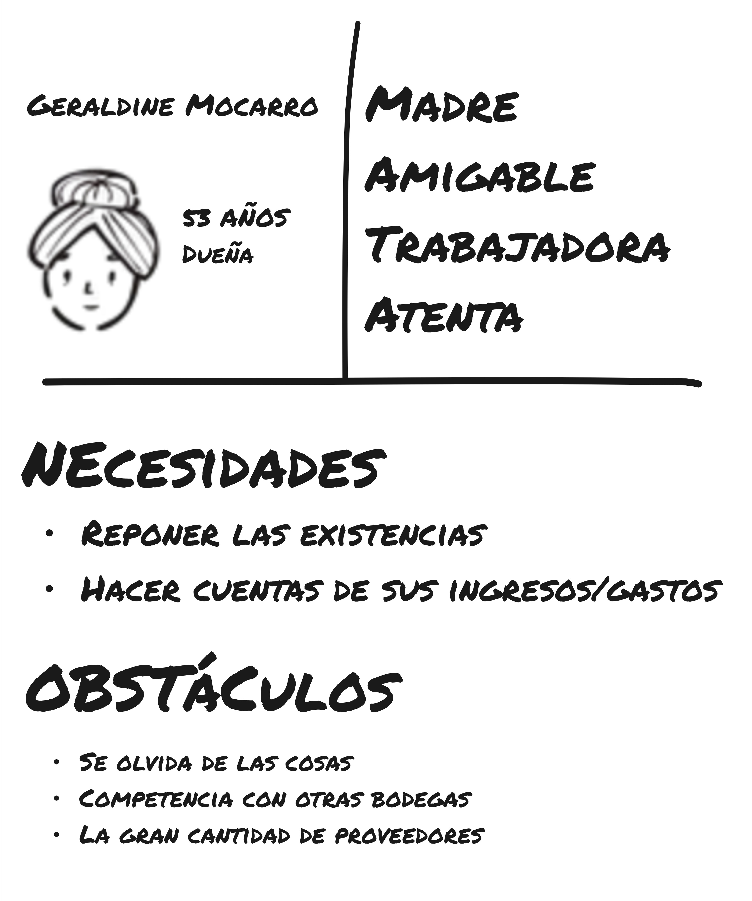

- **Tenderos**
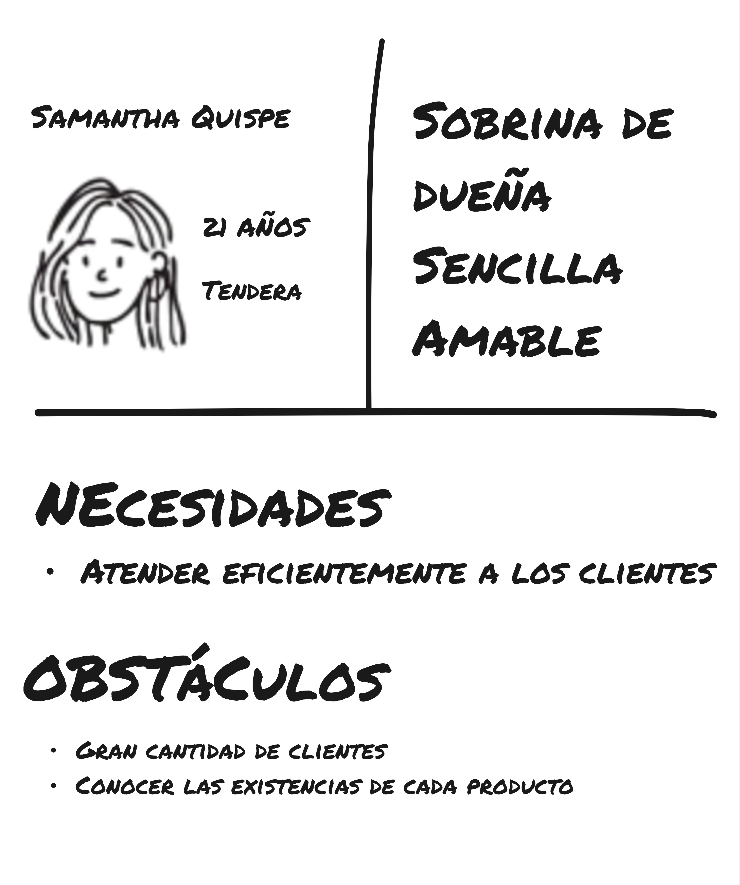

- **Clientes**

**USER OUTCOMES**
En línea con los business outcomes que planteamos, delineamos una serie de de beneficios que se alinean con las expectativas y objetivos característicos y esperables de cada uno de estos segmentos.

- **Dueños**
  - Aumentar ganancias
  - Fidelizar clientes
  - Gestionar mejor su negocio
- **Tenderos**
  - Trabajar menos y más rápido
  - Evitar llamados de atención por errores
- **Cliente**
  - Evitar la fatiga
  - Ahorrar en sus compras
  - Tener beneficios por su preferencia
  - Encontrar fácilmente los productos que busca

**FEATURES**
Para lograr esos beneficios, planteamos los siguientes posibles features en la solución

- Gestión de inventario (productos / stock)
- Pedido remoto
- Manejo de ofertas
- Gestión de ingresos y gastos
- Billetera de puntos para clientes
- Wishlist / productos favoritos
- Gestión de fiados
- Consulta de productos

#### Lean UX Hypothesis Statements

Elaboramos una serie de hipótesis en base a los features que consideramos más importantes

- Creemos que lograremos un *incremento de utilidad por ventas en un 5% en un periodo de 3 meses* si *los dueños* logran *fidelizar a sus clientes* mediante *gestión de fiados*
- Creemos que lograremos *incremento de utilidad por ventas en un 5% en un periodo de 3 meses* si los *tenderos* logran *atiender a más clientes* mediante *pedido remoto*
- Creemos que lograremos *incremento de utilidad por ventas en un 5% en un periodo de 3 meses* si los *clientes* logran *ahorrar en sus compras* mediante *el manejo de ofertas*
- Creemos que lograremos *reducción de errores de gestión anuales en un 80%* si *los dueños* logran *gestionar mejor su negocio* mediante *gestión de inventario*
- Creemos que lograremos *incremento de utilidad por ventas en un 5% en un periodo de 3 meses* si los *clientes* logran *encontrar fácilmente los productos que buscan* mediante *consulta de productos*

#### Lean UX Canvas

**PRIMERA ITERACIÓN**

En base al proceso Lean UX elaborado previamente, se presenta a modo de síntesis el Lean UX Canvas a continuación. En él, se evidencia además, que nuestra principal duda es saber si realmente tantos negocios como creemos manejan el fiado a sus clientes, además, bajo qué reglas. Por tanto, es esta nuestra Assumption más riesgosa, de la cual debemos aprender. Determinamos que el mejor momento para ello sería la elaboración de entrevistas.

## Segmentos objetivo

Se recopilan datos objetivos sobre los segmentos objetivo partícipes del espacio del problema.

**DUEÑOS**

Segmento objetivo principal, foco de la solución. Son aquellas personas con mayor responsabilidad administrativa y/o operativa en una bodega. 

Según Acuña (2021), el 60% de las bodegas son administradas por mujeres. Asimismo, señala que aproximadamente las dos terceras partes de los bodegueros cuentan con un nivel de educación básico (primaria y secundaria). 

Por tanto establecemos como datos estadísticos de partida previo al proceso de investigación:
- **Género:** femenino.
- **Grado de estudios:** en su mayoria educación básica (primaria y secundaria).

**TENDEROS**

Segmento objetivo complementario a los dueños. Son aquellas personas asociadas o próximas, de la confianza de los dueños, que participan total o parcialmente de las actividades operativas y administrativas en una bodega.

No se encontraron datos estadísticos específicos de este segmento a la fase actual de la investigación.

**CLIENTES**

Segmento objetivo complementario. Son aquellas personas que acuden a las bodegas en busca de diversos productos.

No se encontraron datos estadísticos específicos de este segmento a la fase actual de la investigación.

# Capítulo II: Requirements Development and Software Solution Design

## Competidores

### Análisis competitivo

<table border="1" cellpadding="6" cellspacing="0" style="border-collapse:collapse; width:100%; font-family:Arial, sans-serif;">
  <thead>
    <tr>
      <th colspan="6" scope="col" style="background:#f2f2f2;"><strong>Competitive Analysis Landscape</strong></th>
    </tr>
    <tr>
      <th colspan="2" rowspan="2" scope="row">¿Por qué realizar este análisis?</th>
      <td colspan="4" style="">
        <strong>Escriba en el recuadro la pregunta que busca responder o el objetivo de este análisis.</strong>
      </td>
    </tr>
    <tr>
      <td colspan="4" style="">
        El objetivo del análisis es obtener una perspectiva clara sobre qué brechas estratégicas existen en el mercado que otras soluciones no estén abarcando, obteniendo así un factor diferenciador de nicho que permita posicionar nuestro producto como idóneo para aquellas MYPES que no hayan realizado un proceso de transformación digital.
      </td>
    </tr>
    <tr>
      <th colspan="2" scope="row">(En la cabecera colocar por cada competidor nombre y logo)</th>
      <th scope="column" style="width:20%; text-align:center;">
        Soulware 
        
      </th>
      <th scope="column" style="width:20%; text-align:center;">
        BSale 
        
      </th>
      <th scope="column" style="width:20%; text-align:center;">
        Relex 
        
      </th>
      <th scope="column" style="width:20%; text-align:center;">
        Five Galaxies Commerce (Loyverse) 
        
      </th>
    </tr>
  </thead>
  <tbody>
    <tr>
      <th scope="row" rowspan="2">Perfil</th>
      <th scope="row">Overview</th>
      <td>Startup peruana que ofrece soluciones SaaS para digitalizar a las PYMES en Lima-Perú. Se enfoca en simplificar procesos operativos como ventas, inventario, facturación electrónica y gestión de clientes, con un enfoque accesible y escalable.</td>
      <td>Software en la nube para PYMES con POS, facturación electrónica, control de inventario y ecommerce en Perú, Chile y México. (Fuente: sitio oficial y notas comerciales).</td>
      <td>Plataforma basada en IA para planificación del retail y la cadena de suministro: forecasting, replenishment, optimización de promociones y pricing; posicionada como líder en soluciones de supply chain para retail.</td>
      <td>Aplicación POS e inventario con modelo freemium para comercios pequeños: POS móvil, dashboard, gestión básica de inventario y complementos pagos para funcionalidades avanzadas.</td>
    </tr>
    <tr>
      <th scope="row">Ventaja competitiva</th>
      <td>Plataforma local adaptada a regulaciones fiscales (ej. SUNAT), precios accesibles y acompañamiento especializado en PYMES.</td>
      <td>Diseño pensado para PYMES, localización legal y tributaria (SUNAT), facilidad de integración con otros sistemas y oferta de formación/soporte para comercios.</td>
      <td>Alta precisión en forecasting y visibilidad de cadena, IA nativa y automatización avanzada; reputación fuerte entre grandes retailers y reconocimiento en análisis de la industria.</td>
      <td>Modelo freemium que facilita la adopción masiva: funcionalidad básica sin costo, complementos modulares y facilidad de uso para negocios que empiezan.</td>
    </tr>
    <tr>
      <th scope="row" rowspan="2">Perfil de Marketing</th>
      <th scope="row">Mercado Objetivo</th>
      <td>PYMES en Lima-Perú que aún no han realizado su transformación digital.</td>
      <td>PYMES y emprendedores en retail, tiendas físicas y ecommerce en Latinoamérica (Perú, Chile, México).</td>
      <td>Retailers, distribuidores y fabricantes que requieren optimización de la cadena de suministro a escala (clientes enterprise y regionales).</td>
      <td>Pequeños comercios: cafeterías, panaderías, kioscos, tiendas minoristas y servicios con necesidad de POS móvil y control básico de inventario.</td>
    </tr>
    <tr>
      <th scope="row">Estrategias de Marketing</th>
      <td>Educación digital (webinars, guías prácticas, talleres), precios accesibles y enfoque de accesibilidad y familiaridad basado en la cultura local de Lima.</td>
      <td>Educación a emprendedores (talleres y webinars), alianzas con pasarelas de pago y marketplaces, demo gratis y ventas directas a PYMES.</td>
      <td>Marketing B2B dirigido a decisores de retail y supply chain; presencia en informes e investigaciones del sector; promoción de capacidades AI y casos de éxito.</td>
      <td>Distribución viral: versión gratuita para captar usuarios, soporte en línea, comunidad y promoción orgánica entre pequeños comercios.</td>
    </tr>
    <tr>
      <th scope="row" rowspan="3">Perfil de Productos</th>
      <th scope="row">Productos y servicios</th>
      <td>POS, facturación electrónica, control de inventario, gestión de clientes (CRM básico), e integraciones con marketplaces/pasarelas de pago.</td>
      <td>POS, control de inventario, facturación electrónica, ecommerce, reportes automatizados e integraciones con marketplaces y pasarelas de pago.</td>
      <td>Suite completa: planificación de la demanda, forecasting, optimización de inventario, pricing & promotions, logística y reporting avanzado.</td>
      <td>POS móvil, dashboard para gestión de ventas e inventario, complementos (historial ilimitado, gestión de empleados, inventario avanzado).</td>
    </tr>
    <tr>
      <th scope="row">Precios y costos</th>
      <td>Modelo low-cost o zero-cost para las MYPES para facilitar la adopción del producto. Ganancias generadas mediante servicios adicionales, planes avanzados y/o comisiones de ventas.</td>
      <td>Planes mensuales para PYMES con distintos niveles (ej. paquetes básicos a planes más completos con mayores integraciones y soporte).</td>
      <td>Precio orientativo alto (ej. contratos corporativos con tarifas anuales significativas; referencias en mercado muestran un punto de entrada considerablemente más alto que soluciones PYME).</td>
      <td>Modelo freemium: funcionalidades básicas sin costo; add-ons pagos (por ejemplo historial ilimitado, módulos avanzados y gestión de empleados con tarifas mensuales por tienda).</td>
    </tr>
    <tr>
      <th scope="row">Canales de distribución</th>
      <td>Venta online y venta directa.</td>
      <td>Venta online, demos, partners e integradores, alianzas con pasarelas y marketplaces; atención a PYMES vía equipos comerciales y soporte.</td>
      <td>Venta B2B directa a empresas, canales de partners e integradores, implementación con consultoras y equipos técnicos especializados.</td>
      <td>Descarga directa desde web/app stores, adopción por recomendación, comunidades y soporte remoto; pocos canales de venta tradicional.</td>
    </tr>
    <tr>
      <th scope="row" rowspan="5">Análisis SWOT</th>
      <th scope="col" colspan="5" style=" text-align:left;">
        Realice esto para su startup y sus competidores. Sus fortalezas deberían apoyar sus oportunidades y contribuir a lo que ustedes definen como su posible ventaja competitiva.
      </th>
    </tr>
    <tr>
      <th scope="row">Fortalezas</th>
      <td>Localización y cumplimiento normativo (ej. SUNAT), precios accesibles y escalabilidad modular de la solución.</td>
      <td>Localización tributaria y legal para LatAm, enfoque en PYMES, facilidad de uso e integración, red de soporte local y formación.</td>
      <td>Capacidades avanzadas de IA y automatización, reputación en clientes enterprise, alcance y robustez técnica para supply chain.</td>
      <td>Fácil adopción por su modelo gratuito, escalabilidad modular y buen soporte para hardware móvil; bajo costo inicial para usuarios.</td>
    </tr>
    <tr>
      <th scope="row">Debilidades</th>
      <td>arca nueva con menor reconocimiento frente a competidores globales, recursos limitados para marketing y dependencia inicial de captar confianza en un segmento poco digitalizado.</td>
      <td>Enfoque en PYMES puede limitar alcance hacia grandes cuentas; la monetización depende de upgrades y servicios adicionales.</td>
      <td>Alto costo de entrada y complejidad en implementación: barrera para PYMES y necesidad de soporte profesional.</td>
      <td>Funcionalidades avanzadas pagas; escalamiento completo puede requerir pagos recurrentes por tienda y migración a soluciones de mayor alcance.</td>
    </tr>
    <tr>
      <th scope="row">Oportunidades</th>
      <td>Creciente demanda de digitalización en PYMES post-pandemia y apoyo de programas para transformación digital.</td>
      <td>Expandir en regiones emergentes, fortalecer integraciones ecommerce y ofrecer más formación/servicios para la adopción digital de PYMES.</td>
      <td>Creciente demanda de soluciones AI en cadena de suministro y retail; posibilidad de expandir a nuevas verticales y servicios de sostenibilidad.</td>
      <td>Captar pequeñas empresas en mercados emergentes, upsell de complementos pagos y crecer vía comunidad y partners locales.</td>
    </tr>
    <tr>
      <th scope="row">Amenazas</th>
      <td>Competencia de soluciones globales (Shopify, Square, Odoo), Cambios regulatorios que afecten integraciones.</td>
      <td>Competencia de plataformas globales (Shopify, Square) y presión sobre márgenes de PYMES; cambios regulatorios tributarios que afecten integraciones.</td>
      <td>Competencia de otros proveedores de SCM (Blue Yonder, Kinaxis) y riesgos ligados a costos y adopción de IA por parte de clientes reticentes.</td>
      <td>Competencia de POS gratuitos o de bajo costo; limitaciones para crecer con grandes cuentas sin migrar a soluciones pagas más complejas.</td>
    </tr>
  </tbody>
</table>

### Estrategias y tácticas frente a competidores

**1. Estrategia de Cercanía y Confianza**
Generar confianza inicial mostrando acompañamiento directo y humano, reduciendo la ansiedad tecnológica.

**Tácticas:**
- Ofrecer sesiones 1:1 gratuitas de inducción para cada nuevo cliente.  
- Crear un servicio de soporte vía WhatsApp/Telegram con tiempos de respuesta cortos y lenguaje claro.  

**2. Estrategia de Transparencia y Justicia en Costos**
Posicionar a Soulware como una marca honesta, justa y alineada a la realidad económica de las PYMES.  

**Tácticas:**
- Diseñar un esquema de precios simple y comunicativo (ej. “lo que ves es lo que pagas”).  
- Publicar comparativas abiertas con competidores, destacando dónde Soulware ofrece más valor.  
- Elaborar campañas de comunicación que destaquen el compromiso con la transparencia y el desarrollo local.  

**3. Estrategia de Comunidad y Educación Tecnológica**
Transformar a clientes temerosos en promotores de la digitalización mediante una comunidad activa y educativa.  

**Tácticas:**
- Crear la **Comunidad Soulware PYME Digital** con foros, webinars y espacios de networking.  
- Publicar guías prácticas y casos de éxito de clientes peruanos que usen la plataforma.  
- Organizar eventos híbridos (presenciales + online) para compartir aprendizajes y fomentar la innovación colaborativa.

**4. Estrategia de Adaptación a la Cultura Peruana**
Diferenciar a Soulware al construir una experiencia profundamente conectada con la cultura, idioma y prácticas de negocio locales.  

**Tácticas:**
- Desarrollar contenidos de capacitación con ejemplos y casos de uso de sectores típicos peruanos (bodegas, restaurantes, ferias, mercados de barrio).  
- Usar un lenguaje cercano en la interfaz y la comunicación (ej. mensajes amigables, expresiones familiares al emprendedor peruano).  
- Incluir celebraciones culturales en la plataforma (ej. campañas de apoyo en Fiestas Patrias, Navidad, Día de la Madre) con promociones o mensajes personalizados.  
- Generar alianzas con instituciones peruanas (SUNAT, PRODUCE, municipalidades) para reforzar el cumplimiento normativo y la identidad local.  

## Entrevistas

### Diseño de entrevistas

**Dueños de tienda**

1. **Introducción**

Tratar de dar una introducción en que se le agradezca especialmente por su tiempo. Los dueños de negocios, independientemente de su escala suelen ser personas ocupadas. Tratar de usar un lenguaje coloquial, tranquilo, no muy formal para invitar al entrevistado a soltarse un poco, invitarlo a saludar a cámara dando su nombre.

Un ejemplo de introducción bajo estas pautas:

> "Hola, muchas gracias por su tiempo. En nuestro equipo queremos conocer mejor cómo los dueños de bodegas manejan sus negocios y qué cosas te facilitan o complican su trabajo para poder diseñar una herramienta tecnológica que facilite su trabajo. No se preocupe, pues no hay respuestas correctas o incorrectas. Para nosotros usted responde en base a su experiencia y forma de trabajo propios. Para empezar, puede presentarse brevemente."

2. **Preguntas Principales**

La idea es tratar de hacer al entrevistado hablar, pero sin aburrirlo ni hacerlo sentir invadido. A criterio de cada entrevistador, utilizar algunas de las preguntas en los grupos de preguntas a continuación hasta que se construya un sentido más o menos claro de cada uno: *si el entrevistado habla poco*, buscar hacerle todas las preguntas y conversarle en medio de lo que contesta. *Si el entrevistado habla mucho*, mejor dejarlo hablar.

**MANEJO DE STOCK**
- ¿Cómo haces para saber cuánto de cada producto tiene y cuándo hay que reponerlo?
- ¿Qué problemas suele tener con el stock o productos que se acaban o se pierden?
- ¿Alguna vez se le ha dañado inventario o ha tenido errores con el conteo? ¿Cómo lo soluciona?

**GESTIÓN DE CLIENTES**
- ¿Acepta pedidos fiados a sus clientes? ¿Qué tan frecuentemente y en general a quienes?
  - (Si responde que sí y no lo menciona, preguntar cómo lleva la cuenta de quienes le deben).
- ¿Tiene alguna estrategia para que los clientes vuelvan a comprar, como promociones?

**PEDIDOS**
- ¿Maneja de alguna manera que se le hagan pedidos de forma remota? ¿Tal vez mediante WhatsApp u opciones parecidas?
  - Si responde que sí y no lo menciona, preguntarle si tiene problemas para saber qué productos tiene y cómo hace su cliente para recoger y pagar su pedido.

**FINANZAS**
- ¿Cómo lleva la cuenta del dinero que entra y sale de su negocio?

3. **Preguntas Complementarias**

Estas preguntas pueden ser molestas, porque se deben leer y anotar directamente, casi que un interrogatorio. Sugiero aclarar que por fines de estadística en la investigación queremos registrar algunos datos. Formulen las preguntas de cada una al vuelo, una por una y anoten rápido la respuesta.

**DEMOGRÁFICO**

- Edad
- Distrito donde vives
- Estado civil
- Familia con la que vive
- Tiempo manejando la bodega
- Otros trabajos o experiencias laborales

**TECNOLÓGICO**

- Usa dispositivos tecnológicos en su trabajo y cual(es)
- Marca del teléfono (Si usa celular)
- Redes sociales en su negocio (WhatsApp, Facebook, Telegram, TikTok, etc.)

**PERSONALIDAD E INFLUENCIAS**

- Tiempo que dedica a su negocio
- Marcas y proveedores de confianza

**Tenderos / Ayudantes de Bodega**

1. **Introducción**

Tratar de dar una introducción cordial, usando lenguaje coloquial y tranquilo. Invitar al entrevistado a presentarse y dar su nombre, agradeciendo su tiempo.

Ejemplo de introducción:

> "Hola, muchas gracias por tu tiempo. Queremos conocer mejor cómo trabajan los tenderos y ayudantes en las bodegas, qué cosas les facilitan o complican su trabajo y cómo realizan las tareas que el dueño les indica. No hay respuestas correctas o incorrectas, todo lo que nos cuentes nos sirve. Para empezar, ¿puedes presentarte brevemente?"

2. **Preguntas Principales**

La idea es hacer que el entrevistado hable sobre su trabajo diario y responsabilidades, sin hacerlo sentir presionado. Adaptar según si habla mucho o poco, usando todas o algunas preguntas de cada grupo.  

**MANEJO DE STOCK**
- ¿Eres responsable de manejar el stock de los productos? ¿Cómo lo haces?  
- ¿Qué problemas sueles tener con productos que se acaban, se dañan o se pierden?  
- ¿Cómo te indica el dueño qué hacer si hay errores en el inventario?  

**ATENCIÓN A CLIENTES**
- Cuando un cliente pide fiado, ¿qué te ha indicado el dueño que hagas?  
- ¿Cómo registras o recuerdas los pedidos fiados que manejas?  
- ¿Qué haces para que los clientes vuelvan o compren más?  
- ¿Alguna vez haces promociones o recomendaciones por iniciativa propia o siguiendo instrucciones del dueño?  

**PEDIDOS**
- ¿Ayudas a recibir pedidos que los clientes hacen de forma remota, por ejemplo por WhatsApp?  
- Si los atiendes, ¿cómo haces para entregar correctamente los productos y cobrar lo correspondiente?  

**FINANZAS (si aplica)**
- ¿Alguna vez llevas el dinero de las ventas o ayudas a contar la caja?  
- ¿Cómo te indica el dueño que se registre o controle el dinero que entra y sale?  

3. **Preguntas Complementarias**

Estas se leen directamente y se anotan, explicando que son por fines estadísticos.  

**DEMOGRÁFICO**

- Edad  
- Distrito donde vives  
- Estado civil  
- Familia con la que vive  
- Tiempo trabajando en la bodega
- Parentezco o relación con el dueño
- Otros trabajos o experiencias laborales  

**TECNOLOGÍA**

- Usa dispositivos tecnológicos en su trabajo y cual(es)
- Marca del teléfono (Si usa celular)
- Redes sociales en su negocio (WhatsApp, Facebook, Telegram, TikTok, etc.)

**PERSONALIDAD E INFLUENCIAS**

- Tiempo que dedicas al trabajo en la bodega  
- Aspiraciones futuras como otros trabajos o estudiar
- Marcas o productos que prefieres o en los que confías para tu trabajo  

**Clientes de Bodega**

1. **Introducción**

Tratar de dar una introducción muy cercana, amigable y relajada. La idea es generar confianza y que el cliente se sienta cómodo para compartir sus hábitos y opiniones.  

Ejemplo de introducción:

> "¡Hola! Muchas gracias por tu tiempo. Queremos conocer un poco cómo compras en tu bodega de siempre, qué cosas te gustan, qué te complican y cómo te gustaría que fuera más fácil o divertido. No hay respuestas correctas o incorrectas, nos interesa tu experiencia de verdad. Para empezar, ¿puedes contarnos tu nombre y desde hace cuánto compras en esta bodega?"

2. **Preguntas Principales**

El objetivo es entender hábitos de compra, interacción con la bodega y percepción de servicios digitales. Dejar hablar al cliente y profundizar según lo que cuente.  

**HÁBITOS DE COMPRA**
- ¿Con qué frecuencia vienes a la bodega?  
- ¿Qué productos compras más seguido?  
- ¿Sueles planear tus compras con lista o compras lo que se te ocurre al momento?  

**FEATURES**
Nosotros queremos armar una aplicación para celular que permita que todas las bodegas del Perú puedan tener su catálogo de productos en una aplicación de celular. En ese sentido queremos saber:
- ¿Alguna vez has hecho pedidos de forma remota, por WhatsApp o teléfono?  
  - Si sí, ¿cómo fue la experiencia?  
  - Si no, ¿qué te animaría a hacerlo?   
- ¿Qué te parecería poder explorar los productos y comparar precios disponibles en diferentes tiendas?
- ¿Que te parecería poder agregar ciertos productos como favoritos para encontrarlos más rápido?
- ¿Qué te parecería poder diseñar listas de compras recurrentes para no olvidar nada?  

**PERCEPCIÓN DE LA BODEGA**
- ¿Tiene una bodega favorita? ¿Qué razón tienes para ello?  
- ¿Qué cosas te gustan o no te gustan del servicio o la atención?  
- Si la bodega tuviera una app o plataforma, ¿qué te haría usarla seguido?  

3. **Preguntas Complementarias**

Estas se leen directamente y se anotan, explicando que son por fines estadísticos.  

**DEMOGRÁFICO**

- Edad  
- Distrito donde vives  
- Estado civil  
- Composición familiar  

**TECNOLOGÍA**

- ¿Usas celular y qué tipo de marca tienes?  
- ¿Qué aplicaciones o redes sociales sueles usar más?  
- ¿Sueles comprar por apps o usar pagos virtuales?  

**PERSONALIDAD E INFLUENCIAS**

- ¿Qué valoras más al comprar en tu bodega de confianza: precio, cercanía, calidad, trato, rapidez?  
- ¿Qué cosas te motivan a probar algo nuevo en la bodega o comprar algo distinto?

### Registro de entrevistas

**DUEÑOS**

<table>
    <thead>
        <tr>
            <th scope="row">Segmento</th>
            <td style="width:30%;">Dueños</td>
        </tr>
    </thead>
    <tbody>
        <tr>
            <td>
                <strong>Nombre:</strong> Jose Roque Heredia 
                <strong>Edad:</strong> 75 años 
                <strong>Distrito:</strong> Surco 
                <strong>Enlace:</strong> <a href="">Entrevista en Stream</a> 
                <strong>Inicio:</strong> 00:00 - 00:00 
            </td>
            <td></td>
        </tr>
        <tr>
            <td colspan="2">
                <strong>Resumen:</strong> 
                Javier es un comerciante desde el año 1996. Para él lo más importante en su negocio es mantener el dinero constantemente reinvertido, de modo que si ve que un producto va a acabarse, solicita de forma rápida nuevos lotes a algún proveedor. Es decir, realiza el stock de productos ed forma visual e intuitiva. 
                Entre otros aspectos, comunica que en base a los proveedores, según el volumen de productos que compre, obtiene descuentos que aprovecha inteligentemente para rebajar el precio de dicho producto, asegurando que los clientes prefieran comprarlo en su negocio frente a otros, generando mejores ingresos y fidelizando más clientes. 
                Por último, respecto a fiados comenta que maneja los fiados con clientes de confianza con casa propia en la zona y que realiza el seguimiento de sus deudas en un cuaderno.
            </td>
        </tr><tr>
            <td>
                <strong>Nombre:</strong> Janet Pozo 
                <strong>Edad:</strong> 51 años 
                <strong>Distrito:</strong> San Juan de Lurigancho 
                <strong>Enlace:</strong> <a href="https://upcedupe-my.sharepoint.com/:v:/g/personal/u20221e247_upc_edu_pe/EfUXJmDtGOlHl4XDJ68tJDUBeD-FimIprGeW3eOX5GCmcA?nav=eyJyZWZlcnJhbEluZm8iOnsicmVmZXJyYWxBcHAiOiJTdHJlYW1XZWJBcHAiLCJyZWZlcnJhbFZpZXciOiJTaGFyZURpYWxvZy1MaW5rIiwicmVmZXJyYWxBcHBQbGF0Zm9ybSI6IldlYiIsInJlZmVycmFsTW9kZSI6InZpZXcifX0%3D&e=neoPlW">Entrevista en Stream</a> 
                <strong>Inicio:</strong> 04:50 - 09:38 
            </td>
            <td></td>
        </tr>
        <tr>
            <td colspan="2">
                <strong>Resumen:</strong> 
                Janet es una comerciante con 22 años de experiencia. Comparte detalles acerca de la forma en que gestiona su bodega. Para ella, lo más importante es la confianza y garantía que genera su negocio respecto a los productos, dado que de alguna manera, "trabaja con las familias". 
                Expresa además que algunos aspectos de administración del negocio se realizan "al ojo" o según proyecciones que realiza de forma intuitiva (como al comprar stock de fruta). 
                Por último, respecto a los fiados señala que una de sus principales reglas es que ningún cliente sin casa propia en la localidad puede fiarse, y que hacerlo es una manera de reducir pérdidas y fidelizar clientes.
            </td>
        </tr>
    </tbody>
</table>

**TENDEROS**

<table>
    <thead>
        <tr>
            <th scope="row">Segmento</th>
            <td style="width:30%;">Tenderos</td>
        </tr>
    </thead>
    <tbody>
        <tr>
            <td>
                <strong>Nombre:</strong> Giannina Tarazona 
                <strong>Edad:</strong> 40 años 
                <strong>Distrito:</strong> San Juan de Lurigancho 
                <strong>Enlace:</strong> <a href="">Entrevista en Stream</a> 
                <strong>Inicio:</strong> 09:38 - 14:32 
            </td>
            <td></td>
        </tr>
        <tr>
            <td colspan="2">
                <strong>Resumen:</strong> 
                Giannina comenta que ha trabajado en una bodega, relativamente grande, similar a un minimarket. Hace mucho énfasis en las reglas que establecía el dueño sobre como manejar el negocio, como el cuaderno de fiados, turnos de los tenderos y las responsabilidades a realizar al cierre de caja. 
                Comenta además que no es muy usual que se realicen pedidos por WhatsApp.
            </td>
        </tr>
        <tr>
            <td>
                <strong>Nombre:</strong> Adilcia Ramírez 
                <strong>Edad:</strong> 41 años 
                <strong>Distrito:</strong> San Juan de Miraflores 
                <strong>Enlace:</strong> <a href="">Entrevista en Stream</a> 
                <strong>Inicio:</strong> 14:32 - 18:07 
            </td>
            <td></td>
        </tr>
        <tr>
            <td colspan="2">
                <strong>Resumen:</strong> 
                Adilcia ha trabajado como tendera hace aproximadamente 10 años, en el negocio de su cuñada. En su relato, comenta que seguía muy fielmente las indicaciones de la dueña del negocio en la atención: los precios de los productos, la política del fiado, etc. 
                Entre sus funciones como tendera destaca la venta, el cierre de caja y la gestión del inventario, que normalmente realizaba los fines de semana o a mediados de semana. 
            </td>
        </tr>
    </tbody>
</table>

**CLIENTES**

<table>
    <thead>
        <tr>
            <th scope="row">Segmento</th>
            <td style="width:30%;">Clientes</td>
        </tr>
    </thead>
    <tbody>
        <tr>
            <td>
                <strong>Nombre:</strong> Luis Maguiña 
                <strong>Edad:</strong> 20 años 
                <strong>Distrito:</strong> Surco 
                <strong>Enlace:</strong> <a href="">Entrevista en Stream</a> 
                <strong>Inicio:</strong> 18:07 - 21:53 
            </td>
            <td></td>
        </tr>
        <tr>
            <td colspan="2">
                <strong>Resumen:</strong> 
                Luis es cliente habitual de una bodega cerca a la avenida El Derby. Comenta que tiene una serie de razones para acudir a la bodega, como la calidad de la atención o que ciertos productos los encuentra en mejor estado y calidad (por ejemplo, la fruta). 
                Comenta que sus compras suelen ser planificadas, pero ocasionalmente compra por gusto propio. Además que disfruta ir a la tienda pero no le gusta cuando se forma una larga cola debido al volumen de clientes. 
                Respecto a las funcionalidades propuestas, señala que les serían de mucha ayuda, incluso llegando a señalar que todas esas comodidades lo llevarían a comprar más seguido en la tienda por encima de los supermercados con aplicaciones como Agora.
            </td>
        </tr>
        <tr>
            <td>
                <strong>Nombre:</strong> Manuel Gutiérrez 
                <strong>Edad:</strong> 22 años 
                <strong>Distrito:</strong> La Molina 
                <strong>Enlace:</strong> <a href="">Entrevista en Stream</a> 
                <strong>Inicio:</strong> 21:53 - 24:54 
            </td>
            <td></td>
        </tr>
        <tr>
            <td colspan="2">
                <strong>Resumen:</strong> 
                Manuel es cliente habitual de una tienda. Describe que sus patrones de compra suelen ser más espontáneos, pero tiene cierta planificación de compras para los fines de semana. 
                Manuel cuenta que su bodega es su favorita principalmente por la proximidad de esta a su casa y la confianza con el dueño. 
                Sobre las funcionalidades cuenta que le serían principalmente útiles para no olvidar algunos productos en sus compras del fin de semana, que usualmente le suele ocurrir que olvida una o dos cosas.
            </td>
        </tr>
    </tbody>
</table>

### Análisis de entrevistas

Se presenta a continuación en formato de tabla datos cualitativos y cuantitativos extraídos a partir de las entrevistas. Se señala para cada uno el valor representativo escogido para la elaboración de User Personas y su respectiva justificación.

<table>
    <thead>
        <tr>
            <th scope="col">Segmento</th>
            <th scope="col">Aspecto</th>
            <th scope="col">Valor presentativo</th>
            <th scope="col">Justificación</th>
        </tr>
    </thead>
    <tbody>
        <tr>
            <th scope="row" rowspan="6">Dueños</th>
            <th scope="row">Edad</th>
            <td>63</td>
            <td>Promedio simple de la edad de los entrevistados</td>
        </tr>
        <tr>
            <th scope="row">Género</th>
            <td>Masculino</td>
            <td>Dado el empate entre Masculino y Femenino (50% cada uno), se escogió aleatoriamente entre ambas opciones</td>
        </tr>
        <tr>
            <th scope="row">Habilidad tecnológica</th>
            <td>Muy baja</td>
            <td>La totalidad de los entrevistados utiliza cuadernos de registro como principal herramienta de trabajo</td>
        </tr>
        <tr>
            <th scope="row">Experiencia</th>
            <td>Muy alta</td>
            <td>Todos los entrevistados poseen más de 20 años de experiencia como comerciantes</td>
        </tr>
        <tr>
            <th scope="row">Tecnología</th>
            <td>Celular Android</td>
            <td>La totalidad de nuestros entrevistados usan exclusivamente teléfonos celulares con sistemas operativos derivados de android</td>
        </tr>
        <tr>
            <th scope="row">Canales</th>
            <td>Online Ad, Smartphone y WhatsApp</td>
            <td>El limitado uso de nuestros entrevistados de dispositivos tecnológicos cierra gravemente la cantidad de canales mediante los cuales obtienen y comparten información</td>
        </tr>
        <tr>
            <th scope="row" rowspan="5">Tenderos</th>
            <th scope="row">Edad</th>
            <td>41</td>
            <td>Promedio simple de la edad de los entrevistados</td>
        </tr>
        <tr>
            <th scope="row">Género</th>
            <td>Femenino</td>
            <td>Moda entre los entrevistados (100%)</td>
        </tr>
        <tr>
            <th scope="row">Motivación para trabajar como tendero</th>
            <td>Tener negocio propio algún día</td>
            <td>Análisis cualitativo de las respuestas proporcionadas por los entrevistados</td>
        </tr>
        <tr>
            <th scope="row">Parentezco con el dueño</th>
            <td>Familia de 2do grado de consanguidad</td>
            <td>Dado el empate entre los valores obtenidos (sin parentezco y cuñada) se tomó como representativo el tipo de parentezco correspondiente al valor más relacionado con los datos de investigación preliminar al proceso Lean UX.</td>
        </tr>
        <tr>
            <th scope="row">Tecnología</th>
            <td>Celular Android</td>
            <td>La totalidad de nuestros entrevistados usan exclusivamente teléfonos celulares con sistemas operativos derivados de android</td>
        </tr>
        <tr>
            <th scope="row">Canales</th>
            <td>WhatsApp y Facebook</td>
            <td>Se eligió como representativo la unión de los datos proporcionados por los entrevistados</td>
        </tr>
        <tr>
            <th scope="row" rowspan="7">Clientes</th>
            <th scope="row">Edad</th>
            <td>21</td>
            <td>Promedio simple de la edad de los entrevistados</td>
        </tr>
        <tr>
            <th scope="row">Género</th>
            <td>Masculino</td>
            <td>Moda entre los entrevistados (100%)</td>
        </tr>
        <tr>
            <th scope="row">Habilidad tecnológica</th>
            <td>Media</td>
            <td>La totalidad de los entrevistados son adultos jóvenes acostumbrados al uso de tecnología, especialmente móvil</td>
        </tr>
        <tr>
            <th scope="row">Motivación para comprar</th>
            <td>Confianza y proximidad al hogar</td>
            <td>Todos los entrevistados mencionaron que su bodega de confianza se encuentra muy cerca (no más de una cuadra de su vivienda) y que conocen de hace muchos años al dueño del negocio</td>
        </tr>
        <tr>
            <th scope="row">Pain Points</th>
            <td>Hacer cola</td>
            <td>Todos los entrevistados mencionaron que les gusta ir a la bodega excepto cuando se encuentran con una larga fila. Estos negocios usualmente los atiende una persona a la vez y poseen gran volumen de clientes.</td>
        </tr>
        <tr>
            <th scope="row">Tecnología</th>
            <td>Celular iPhone</td>
            <td>La totalidad de nuestros entrevistados usan exclusivamente teléfonos celulares de la marca Apple (iPhones)</td>
        </tr>
        <tr>
            <th scope="row">Canales</th>
            <td>TikTok, Instagram y Twitter</td>
            <td>Dada la amplia variedad de respuestas se tomó como representativa la unión de los valores ingresados</td>
        </tr>
    </tbody>
</table>

## Needfinding

### User Personas
Los user persona que se muestran a continuación, fueron realizados a partir de la información recopilada de la sección de entrevistas. Estos nos ayudarán a describir de forma general nuestro segmento objetivo.

- Cliente

- Tendero

- Dueño de Tienda

### User Task Matrix
En esta sección se presenta el user task matrix de los segmentos objetivos, con el fin de indentificar la frecuencia de las actividades realizadas por los usuarios, y de esta manera se refleja la importancia de determinadas tareas.

<table>
    <thead>
        <tr>
            <th>Task</th>
            <th colspan="2">Clientes</th>
            <th colspan="2">Tenderos</th>
            <th colspan="2">Dueños</th>
        </tr>
        <tr>
            <th></th>
            <th>Frecuencia</th>
            <th>Importancia</th>
            <th>Frecuencia</th>
            <th>Importancia</th>
            <th>Frecuencia</th>
            <th>Importancia</th>
        </tr>
    </thead>
    <tbody>
        <tr>
            <td>Comprar víveres, frutas o verduras</td>
            <td>Media</td>
            <td>Alta</td>
            <td>-</td>
            <td>-</td>
            <td>-</td>
            <td>-</td>
        </tr>
        <tr>
            <td>Comprar productos por antojo o gusto personal</td>
            <td>Baja</td>
            <td>Media</td>
            <td>-</td>
            <td>-</td>
            <td>-</td>
            <td>-</td>
        </tr>
        <tr>
            <td>Comprar en bodegas cercanas</td>
            <td>Alta</td>
            <td>Alta</td>
            <td>-</td>
            <td>-</td>
            <td>-</td>
            <td>-</td>
        </tr>
        <tr>
            <td>Evitar colas y esperas presenciales </td>
            <td>Alta</td>
            <td>Alta</td>
            <td>-</td>
            <td>-</td>
            <td>-</td>
            <td>-</td>
        </tr>
        <tr>
            <td>Comprar de manera remota</td>
            <td>Media</td>
            <td>Alta</td>
            <td>-</td>
            <td>-</td>
            <td>-</td>
            <td>-</td>
        </tr>
        <tr>
            <td>Comparar precios entre bodegas</td>
            <td>Baja</td>
            <td>Media</td>
            <td>-</td>
            <td>-</td>
            <td>-</td>
            <td>-</td>
        </tr>
        <tr>
            <td>Tener lista de compras repetidas </td>
            <td>Baja</td>
            <td>Media</td>
            <td>-</td>
            <td>-</td>
            <td>-</td>
            <td>-</td>
        </tr>
        <tr>
            <td>Acceder a una atención mas eficiente </td>
            <td>Media</td>
            <td>Alta</td>
            <td>-</td>
            <td>-</td>
            <td>-</td>
            <td>-</td>
        </tr>
        <tr>
            <td> Atender a los clientes</td>
            <td>-</td>
            <td>-</td>
            <td>Alta</td>
            <td>Alta</td>
            <td>-</td>
            <td>-</td>
        </tr>
        <tr>
            <td>Reposición de productos</td>
            <td>-</td>
            <td>-</td>
            <td>Alta</td>
            <td>Alta</td>
            <td>-</td>
            <td>-</td>
        </tr>
        <tr>
            <td>Limpieza del local</td>
            <td>-</td>
            <td>-</td>
            <td>Alta</td>
            <td>Media</td>
            <td>-</td>
            <td>-</td>
        </tr>
        <tr>
            <td>Control de inventario</td>
            <td>-</td>
            <td>-</td>
            <td>Media</td>
            <td>Alta</td>
            <td>-</td>
            <td>-</td>
        </tr>
        <tr>
            <td>Recibir y verificar pedidos</td>
            <td>-</td>
            <td>-</td>
            <td>Bajo</td>
            <td>Media</td>
            <td>-</td>
            <td>-</td>
        </tr>
        <tr>
            <td>Gestionar devoluciones</td>
            <td>-</td>
            <td>-</td>
            <td>Bajo</td>
            <td>Medio</td>
            <td>-</td>
            <td>-</td>
        </tr>
        <tr>
            <td>Realizar ventas (contabilización)</td>
            <td>-</td>
            <td>-</td>
            <td>Alta</td>
            <td>Alta</td>
            <td>-</td>
            <td>-</td>
        </tr>
        <tr>
            <td>Registrar ventas diarias</td>
            <td>-</td>
            <td>-</td>
            <td>-</td>
            <td>-</td>
            <td>Alta</td>
            <td>Alta</td>
        </tr>
        <tr>
            <td>Buscar mejores precios entre proveedores</td>
            <td>-</td>
            <td>-</td>
            <td>-</td>
            <td>-</td>
            <td>Baja</td>
            <td>Media</td>
        </tr>
        <tr>
            <td>Anotar y controlar fiados</td>
            <td>-</td>
            <td>-</td>
            <td>-</td>
            <td>-</td>
            <td>Alta</td>
            <td>Alta</td>
        </tr>
        <tr>
            <td>Revisar y reponer inventario</td>
            <td>-</td>
            <td>-</td>
            <td>-</td>
            <td>-</td>
            <td>Media</td>
            <td>Alta</td>
        </tr>
        <tr>
            <td>Contactar proveedores para surtir productos</td>
            <td>-</td>
            <td>-</td>
            <td>-</td>
            <td>-</td>
            <td>Media</td>
            <td>Media</td>
        </tr>
        <tr>
            <td>Calcular ingresos y egresos del día</td>
            <td>-</td>
            <td>-</td>
            <td>-</td>
            <td>-</td>
            <td>Alta</td>
            <td>Alta</td>
        </tr>
         <tr>
            <td>Hacer seguimiento a clientes deudores</td>
            <td>-</td>
            <td>-</td>
            <td>-</td>
            <td>-</td>
            <td>Media</td>
            <td>Alta</td>
        </tr>
         <tr>
            <td>Capacitarse o aprender nuevas herramientas</td>
            <td>-</td>
            <td>-</td>
            <td>-</td>
            <td>-</td>
            <td>Baja</td>
            <td>Media</td>
        </tr>
    </tbody>
</table>

En base al User Task Matrix presentado, podemos destacar las siguientes tareas con mayor frecuencia e importancia para cada segmento de usuarios:

### Clientes:
- Comprar en bodegas cercanas	
    - Explicación: Los clientes siempre prefieren ir a la bodega mas cercana de su casa para ahorrar tiempo.
- Evitar colas y esperas presenciales	
    - Explicación: Los clientes siempre prefieren evitar las colas largas cuando van a comprar a una bodega, ya que les quita tiempo valioso de su día.
### Tenderos:
- Atender a clientes	
    - Explicación: Los tenderos siempre tienen que estar a disposición de los clientes para consulta o pago de cualquier producto.
- Realizar ventas (contabilización)	
    - Explicación: Los tenderos siempre que realizan una venta deben registrarlo en un cuaderno de ventas para tener un registro.

 ### Dueños:
- Registrar ventas diarias	
    - Explicación: Los dueños de tiendas y bodegas necesitan un registro fiable y conciso de las ventas diarias para calcular la economía del negocio.
- Anotar y controlar fiados	
    - Explicación: Los dueños necesitan estar pendientes de gente que debe crédito para no tener perdidas.

### User Journey Mapping
En esta sección se presentan los User Journey Mapping de los segmentos objetivos, que realizamos con el fin de dar a entender cómo se siente nuestro usuario en este momento, detallando cada paso que realiza y las emociones que experimenta.

- Cliente

- Tendero

- Dueño de Tienda

### Empathy Mapping
En esta sección mostramos los empathy mapping de los segmentos objetivos realizados con la información recopilada de componentes anteriores.

- Cliente

- Tendero
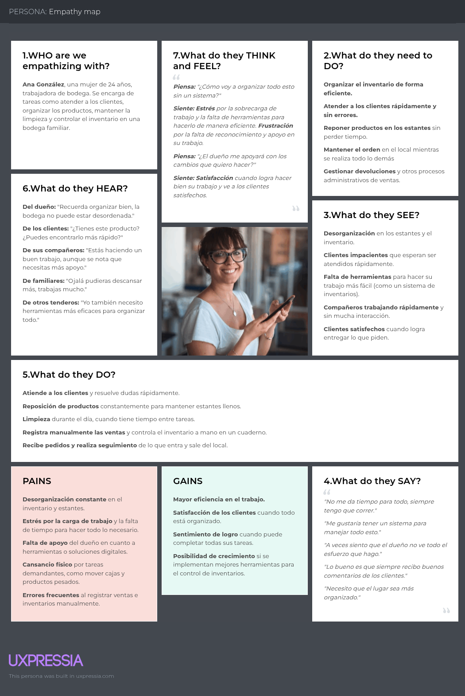

- Dueño de Tienda

### Ubiquitous Language

- **Bodega (Shop):** Tienda de abarrotes que vende productos de primera necesidad. 

- **Dueño (Owner):** Persona responsable de la bodega que toma decisiones administrativas en relación a la reposición de stock (cuándo y cuáles proveedores), reglas de fiado (crédito y lista de clientes confiables), métodos de pago y modalidad de entrega admitidos.

- **Tendero (Shopkeeper):** Persona que suple al dueño en la labor de atención de pedidos.

- **Catálogo (Catalog):** Lista de productos disponibles en la tienda.

- **Pedido (Order):** Lista de productos, con sus respectivas cantidades, que solicita un cliente.

- **Método de pago (Payment method):** Canal o medio por el cual un cliente realiza el pago correspondiente a un pedido.

- **Fiado (On credit):** Método de pago que implica postergar el pago correspondiente a un pedido. El pago genera una deuda que recibirá un proceso de seguimiento en el cuaderno de deudas. Este método de pago suele estar reservado exclusivamente a los clientes confiables.

- **Modalidad de entrega (Delivery method):** Forma pactada para la entrega de los productos de un pedido hacia el cliente.

- **Clientes confiables (Trusted clients):** Clientes que, cumpliendo una serie de requisitos establecidos por los dueños de la bodega (como por ejemplo vivir en casa propia, no alquilada), son considerados de confianza. Por tal motivo, se considera que fiar el pago de sus compras es de bajo riesgo y son elegibles a acceder al fiado.

- **Crédito (Credit):** Monto que una tienda considera el límite máximo de deuda pendiente simultánea para un cliente.

- **Cuaderno de deudas (Debt notebook):** Herramienta de registro que contiene la lista de todas las deudas, pagadas o pendientes de pago, correspondientes a todos los clientes. Comúnmente se organizan en base a la fecha.

- **Corte / Cierre de caja (Cash closing):** Momento en que se cierra la atención de pedidos en la bodega y se contabiliza el dinero ingresado al negocio a lo largo del día.

## Requirements Specification

### User Stories

Dado que en el statement no fue especificado qué técnica emplear para la priorización de las historias, se optó por usar MoSCoW.

<table>
    <tbody>
        <tr>
            <th>Story ID</th>
            <th>User</th>
            <th>Priority</th>
            <th>Epic</th>
        </tr>
        <tr>
            <td>US01</td>
            <td>Cliente</td>
            <td>Must have</td>
            <td>EP01</td>
        </tr>
        <tr>
            <th scope="row">Title</th>
            <td colspan="3">Ver productos</td>
        </tr>
        <tr>
            <th colspan="4">Description</th>
        </tr>
        <tr>
            <td colspan="4">
                Como cliente quiero visualizar los productos que puedo comprar para organizar mi pedido lo más completo posible
            </td>
        </tr>
        <tr>
            <th colspan="4">Acceptance Criteria</th>
        </tr>
        <tr>
            <td colspan="4">
                <strong>Escenario: Visualizar productos de catálogo</strong> 
                Dado que el cliente se encuentra en la sección principal 
                Cuando hace scroll 
                Entonces se muestra una lista de productos a comprar 
            </td>
        </tr>
        <tr>
            <th>Story ID</th>
            <th>User</th>
            <th>Priority</th>
            <th>Epic</th>
        </tr>
        <tr>
            <td>US02</td>
            <td>Cliente</td>
            <td>Should have</td>
            <td>EP01</td>
        </tr>
        <tr>
            <th scope="row">Title</th>
            <td colspan="3">Añadir producto a favoritos</td>
        </tr>
        <tr>
            <th colspan="4">Description</th>
        </tr>
        <tr>
            <td colspan="4">
                Como cliente quiero añadir productos a favoritos para acceder a ellos rápidamente en mis próximos pedidos.
            </td>
        </tr>
        <tr>
            <th colspan="4">Acceptance Criteria</th>
        </tr>
        <tr>
            <td colspan="4">
                <strong>Escenario: Añadir producto a favoritos desde pantalla principal</strong> 
                Dado que el cliente se encuentra en la pantalla principal 
                Cuando hace tap dos veces en el producto 
                Entonces se añade el producto a la lista de sus favoritos 
                 
                <strong>Escenario: Añadir producto a favoritos desde carrito de compras</strong> 
                Dado que el cliente se encuentra en el carrito de compras 
                Cuando selecciona favorito 
                Entonces se añade el producto a la lista de sus favoritos 
            </td>
        </tr>
        <tr>
            <th>Story ID</th>
            <th>User</th>
            <th>Priority</th>
            <th>Epic</th>
        </tr>
        <tr>
            <td>US03</td>
            <td>Cliente</td>
            <td>Should have</td>
            <td>EP01</td>
        </tr>
        <tr>
            <th scope="row">Title</th>
            <td colspan="3">Quitar producto de favoritos</td>
        </tr>
        <tr>
            <th colspan="4">Description</th>
        </tr>
        <tr>
            <td colspan="4">
                Como cliente quiero quitar productos de favoritos para evitar comprar productos que ya no consumo
            </td>
        </tr>
        <tr>
            <th colspan="4">Acceptance Criteria</th>
        </tr>
        <tr>
            <td colspan="4">
                <strong>Escenario: Quitar producto de favoritos desde pantalla principal</strong> 
                Dado que el cliente se encuentra en la pantalla principal 
                Cuando hace tap dos veces en el producto 
                Entonces se quita el producto de su lista de sus favoritos 
                 
                <strong>Escenario: Quitar producto de favoritos desde carrito de compras</strong> 
                Dado que el cliente se encuentra en el carrito de compras 
                Cuando selecciona favorito 
                Entonces se quita el producto de la lista de sus favoritos 
            </td>
        </tr>
        <tr>
            <th>Story ID</th>
            <th>User</th>
            <th>Priority</th>
            <th>Epic</th>
        </tr>
        <tr>
            <td>US04</td>
            <td>Cliente</td>
            <td>Should have</td>
            <td>EP01</td>
        </tr>
        <tr>
            <th scope="row">Title</th>
            <td colspan="3">Visualizar productos favoritos</td>
        </tr>
        <tr>
            <th colspan="4">Description</th>
        </tr>
        <tr>
            <td colspan="4">
                Como cliente quiero visualizar mis productos favoritos para añadirlos rápidamente a mi orden
            </td>
        </tr>
        <tr>
            <th colspan="4">Acceptance Criteria</th>
        </tr>
        <tr>
            <td colspan="4">
                <strong>Escenario: Visualizar productos favoritos</strong> 
                Dado que el cliente se encuentra en la sección principal 
                Cuando hace scroll 
                Entonces se muestra la lista de sus productos favoritos 
            </td>
        </tr>
        <tr>
            <th>Story ID</th>
            <th>User</th>
            <th>Priority</th>
            <th>Epic</th>
        </tr>
        <tr>
            <td>US05</td>
            <td>Cliente</td>
            <td>Should have</td>
            <td>EP01</td>
        </tr>
        <tr>
            <th scope="row">Title</th>
            <td colspan="3">Compras recurrentes</td>
        </tr>
        <tr>
            <th colspan="4">Description</th>
        </tr>
        <tr>
            <td colspan="4">
                Como cliente quiero una lista de mis compras recurrentes para añadirlas rápidamente a mi orden
            </td>
        </tr>
        <tr>
            <th colspan="4">Acceptance Criteria</th>
        </tr>
        <tr>
            <td colspan="4">
                <strong>Escenario: Visualizar compras recurrentes</strong> 
                Dado que el cliente se encuentra en la sección principal 
                Cuando hace scroll 
                Entonces se muestra la lista de sus compras recurrentes 
                 
                <strong>Escenario: Añadir compra recurrente al carrito de compras</strong> 
                Dado que el cliente se encuentra en la sección principal 
                Cuando selecciona la compra 
                Entonces se añade los productos relacionados a la compra al carrito de compras 
            </td>
        </tr>
        <tr>
            <th>Story ID</th>
            <th>User</th>
            <th>Priority</th>
            <th>Epic</th>
        </tr>
        <tr>
            <td>US06</td>
            <td>Cliente</td>
            <td>Must have</td>
            <td>EP01</td>
        </tr>
        <tr>
            <th scope="row">Title</th>
            <td colspan="3">Añadir producto</td>
        </tr>
        <tr>
            <th colspan="4">Description</th>
        </tr>
        <tr>
            <td colspan="4">
                Como cliente quiero añadir productos a mi carrito de compras para solventar mis necesidades del hogar
            </td>
        </tr>
        <tr>
            <th colspan="4">Acceptance Criteria</th>
        </tr>
        <tr>
            <td colspan="4">
                <strong>Escenario: Añadir producto a carrito de compras</strong> 
                Dado que el cliente se encuentra en la pantalla principal 
                Cuando selecciona añadir en un producto 
                Entonces se añade el producto al carrito de compras 
            </td>
        </tr>
        <tr>
            <th>Story ID</th>
            <th>User</th>
            <th>Priority</th>
            <th>Epic</th>
        </tr>
        <tr>
            <td>US07</td>
            <td>Cliente</td>
            <td>Must have</td>
            <td>EP01</td>
        </tr>
        <tr>
            <th scope="row">Title</th>
            <td colspan="3">Quitar producto</td>
        </tr>
        <tr>
            <th colspan="4">Description</th>
        </tr>
        <tr>
            <td colspan="4">
                Como cliente quiero quitar productos de mi carrito de compras para eliminar un producto que sin querer escogí
            </td>
        </tr>
        <tr>
            <th colspan="4">Acceptance Criteria</th>
        </tr>
        <tr>
            <td colspan="4">
                <strong>Escenario: Quitar producto del carrito de compras</strong> 
                Dado que el cliente se encuentra en el carrito de compras 
                Cuando selecciona quitar en un producto 
                Entonces el producto se elimina del carrito de compras 
            </td>
        </tr>
        <tr>
            <th>Story ID</th>
            <th>User</th>
            <th>Priority</th>
            <th>Epic</th>
        </tr>
        <tr>
            <td>US08</td>
            <td>Cliente</td>
            <td>Must have</td>
            <td>EP01</td>
        </tr>
        <tr>
            <th scope="row">Title</th>
            <td colspan="3">Realizar pedido</td>
        </tr>
        <tr>
            <th colspan="4">Description</th>
        </tr>
        <tr>
            <td colspan="4">
                Como cliente quiero realizar el pedido de mi carrito de compras para que la bodega empiece a armarla
            </td>
        </tr>
        <tr>
            <th colspan="4">Acceptance Criteria</th>
        </tr>
        <tr>
            <td colspan="4">
                <strong>Escenario: Visualizar bodegas</strong> 
                Dado que el cliente se encuentra en el carrito de compras 
                Cuando selecciona realizar pedido 
                Entonces se muestra las bodegas cercanas disponibles para realizar el pedido 
                 
                <strong>Escenario: Realizar pedido a bodega</strong> 
                Dado que el cliente se encuentra en la confirmación del pedido con una bodega 
                Cuando selecciona pedir 
                Entonces el pedido se realiza 
                Y la bodega recibe un pedido a atender 
            </td>
        </tr>
        <tr>
            <th>Story ID</th>
            <th>User</th>
            <th>Priority</th>
            <th>Epic</th>
        </tr>
        <tr>
            <td>US09</td>
            <td>Cliente</td>
            <td>Must have</td>
            <td>EP01</td>
        </tr>
        <tr>
            <th scope="row">Title</th>
            <td colspan="3">Seleccionar método de pago</td>
        </tr>
        <tr>
            <th colspan="4">Description</th>
        </tr>
        <tr>
            <td colspan="4">
                Como cliente quiero seleccionar un método de pago para manejar correctamente el control de mis finanzas
            </td>
        </tr>
        <tr>
            <th colspan="4">Acceptance Criteria</th>
        </tr>
        <tr>
            <td colspan="4">
                <strong>Escenario: Visualizar métodos de pago</strong> 
                Dado que el cliente se encuentra en la confirmación del pedido con una bodega 
                Cuando hace scroll 
                Entonces se muestra los métodos de pago disponibles 
                 
                <strong>Escenario: Visualizar métodos de pago</strong> 
                Dado que el cliente se encuentra en la confirmación del pedido con una bodega 
                Y es cliente confiable de la bodega 
                Cuando hace scroll 
                Entonces se muestra los métodos de pago disponibles 
                Y la opción de fiado 
            </td>
        </tr>
        <tr>
            <th>Story ID</th>
            <th>User</th>
            <th>Priority</th>
            <th>Epic</th>
        </tr>
        <tr>
            <td>US10</td>
            <td>Cliente</td>
            <td>Must have</td>
            <td>EP01</td>
        </tr>
        <tr>
            <th scope="row">Title</th>
            <td colspan="3">Seleccionar delivery / recojo en bodega</td>
        </tr>
        <tr>
            <th colspan="4">Description</th>
        </tr>
        <tr>
            <td colspan="4">
                Como cliente quiero seleccionar una modalidad de recojo para tener mi pedido lo más antes posible
            </td>
        </tr>
        <tr>
            <th colspan="4">Acceptance Criteria</th>
        </tr>
        <tr>
            <td colspan="4">
                <strong>Escenario: Visualizar modalidad de recojo</strong> 
                Dado que el cliente se encuentra en la confirmación del pedido con una bodega 
                Cuando hace scroll 
                Entonces se muestra las modalidades de recojo 
            </td>
        </tr>
        <tr>
            <th>Story ID</th>
            <th>User</th>
            <th>Priority</th>
            <th>Epic</th>
        </tr>
        <tr>
            <td>US11</td>
            <td>Cliente</td>
            <td>Must have</td>
            <td>EP01</td>
        </tr>
        <tr>
            <th scope="row">Title</th>
            <td colspan="3">Cancelar pedido como cliente</td>
        </tr>
        <tr>
            <th colspan="4">Description</th>
        </tr>
        <tr>
            <td colspan="4">
                Como cliente quiero cancelar mi pedido en la bodega para pedir en otra porque se demoraron mucho en atenderme
            </td>
        </tr>
        <tr>
            <th colspan="4">Acceptance Criteria</th>
        </tr>
        <tr>
            <td colspan="4">
                <strong>Escenario: Cancelar pedido</strong> 
                Dado que el cliente se encuentra en la pantalla de pedido 
                Cuando selecciona cancelar 
                Entonces el pedido se cancela 
            </td>
        </tr>
        <tr>
            <th>Story ID</th>
            <th>User</th>
            <th>Priority</th>
            <th>Epic</th>
        </tr>
        <tr>
            <td>US12</td>
            <td>Tendero</td>
            <td>Must have</td>
            <td>EP02</td>
        </tr>
        <tr>
            <th scope="row">Title</th>
            <td colspan="3">Visualizar pedido</td>
        </tr>
        <tr>
            <th colspan="4">Description</th>
        </tr>
        <tr>
            <td colspan="4">
                Como tendero quiero visualizar los pedidos que llegan a la bodega para organizar correctamente mi tiempo
            </td>
        </tr>
        <tr>
            <th colspan="4">Acceptance Criteria</th>
        </tr>
        <tr>
            <td colspan="4">
                <strong>Escenario: Visualizar pedido</strong> 
                Dado que el tendero se encuentra en la pantalla principal 
                Cuando selecciona un pedido 
                Entonces se muestra los detalles del pedido 
            </td>
        </tr>
        <tr>
            <th>Story ID</th>
            <th>User</th>
            <th>Priority</th>
            <th>Epic</th>
        </tr>
        <tr>
            <td>US13</td>
            <td>Tendero</td>
            <td>Must have</td>
            <td>EP02</td>
        </tr>
        <tr>
            <th scope="row">Title</th>
            <td colspan="3">Aceptar pedido</td>
        </tr>
        <tr>
            <th colspan="4">Description</th>
        </tr>
        <tr>
            <td colspan="4">
                Como tendero quiero aceptar un pedido de la bodega para realizar la venta
            </td>
        </tr>
        <tr>
            <th colspan="4">Acceptance Criteria</th>
        </tr>
        <tr>
            <td colspan="4">
                <strong>Escenario: Aceptar pedido</strong> 
                Dado que el tendero se encuentra en los detalles de un pedido 
                Cuando selecciona aceptar 
                Entonces el pedido se acepta 
                Y cambia a estado EN PREPARACIÓN 
            </td>
        </tr>
        <tr>
            <th>Story ID</th>
            <th>User</th>
            <th>Priority</th>
            <th>Epic</th>
        </tr>
        <tr>
            <td>US14</td>
            <td>Tendero</td>
            <td>Must have</td>
            <td>EP02</td>
        </tr>
        <tr>
            <th scope="row">Title</th>
            <td colspan="3">Rechazar pedido</td>
        </tr>
        <tr>
            <th colspan="4">Description</th>
        </tr>
        <tr>
            <td colspan="4">
                Como tendero quiero rechazar un pedido de la bodega para indicar que no puedo atenderlo
            </td>
        </tr>
        <tr>
            <th colspan="4">Acceptance Criteria</th>
        </tr>
        <tr>
            <td colspan="4">
                <strong>Escenario: Rechazar pedido</strong> 
                Dado que el tendero se encuentra en los detalles de un pedido 
                Cuando selecciona rechazar 
                Entonces el pedido se rechaza 
                 
                <strong>Escenario: Justificar rechazo de pedido</strong> 
                Dado que el tendero rechazó un pedido 
                Y escribió un mensaje para el cliente 
                Cuando selecciona enviar 
                Entonces se envía la justificación de rechazo de pedido al cliente 
            </td>
        </tr>
        <tr>
            <th>Story ID</th>
            <th>User</th>
            <th>Priority</th>
            <th>Epic</th>
        </tr>
        <tr>
            <td>US15</td>
            <td>Tendero</td>
            <td>Must have</td>
            <td>EP02</td>
        </tr>
        <tr>
            <th scope="row">Title</th>
            <td colspan="3">Marcar pedido como listo</td>
        </tr>
        <tr>
            <th colspan="4">Description</th>
        </tr>
        <tr>
            <td colspan="4">
                Como tendero quiero marcar un pedido como listo para que mi cliente sepa que puede pasar por él o que está en camino
            </td>
        </tr>
        <tr>
            <th colspan="4">Acceptance Criteria</th>
        </tr>
        <tr>
            <td colspan="4">
                <strong>Escenario: Marcar pedido como listo</strong> 
                Dado que el tendero se encuentra en los detalles de un pedido con estado EN PREPARACIÓN 
                Cuando selecciona pedido listo 
                Entonces el pedido cambia de estado a LISTO PARA RECOGER 
            </td>
        </tr>
        <tr>
            <th>Story ID</th>
            <th>User</th>
            <th>Priority</th>
            <th>Epic</th>
        </tr>
        <tr>
            <td>US16</td>
            <td>Tendero</td>
            <td>Must have</td>
            <td>EP02</td>
        </tr>
        <tr>
            <th scope="row">Title</th>
            <td colspan="3">Marcar pedido como entregado</td>
        </tr>
        <tr>
            <th colspan="4">Description</th>
        </tr>
        <tr>
            <td colspan="4">
                Como tendero quiero marcar un pedido como entregado para confirmar que entregué el producto y su cobro mediante el medio respectivo se ha efectuado
            </td>
        </tr>
        <tr>
            <th colspan="4">Acceptance Criteria</th>
        </tr>
        <tr>
            <td colspan="4">
                <strong>Escenario: Marcar pedido como entregado</strong> 
                Dado que el tendero se encuentra en los detalles de un pedido con estado LISTO PARA RECOGER 
                Cuando selecciona entregado 
                Entonces el pedido cambia a estado ENTREGADO 
                Y suma el monto del pedido a las finanzas de la bodega 
                 
                <strong>Escenario: Marcar pedido como entregado en pedidos con método de pago fiado</strong> 
                Dado que el tendero se encuentra en los detalles de un pedido con estado LISTO PARA RECOGER o EN CAMINO 
                Cuando selecciona confirmar la entrega 
                Entonces el pedido cambia a estado ENTREGADO 
                Y suma añade la venta a la lista de cobros pendientes 
            </td>
        </tr>
        <tr>
            <th>Story ID</th>
            <th>User</th>
            <th>Priority</th>
            <th>Epic</th>
        </tr>
        <tr>
            <td>US17</td>
            <td>Tendero</td>
            <td>Must have</td>
            <td>EP02</td>
        </tr>
        <tr>
            <th scope="row">Title</th>
            <td colspan="3">Cancelar pedido como tendero</td>
        </tr>
        <tr>
            <th colspan="4">Description</th>
        </tr>
        <tr>
            <td colspan="4">
                Como tendero quiero cancelar la atención de un pedido para dar a conocer que no me será posible atenderlo si ocurrió un problema en el proceso de atención
            </td>
        </tr>
        <tr>
            <th colspan="4">Acceptance Criteria</th>
        </tr>
        <tr>
            <td colspan="4">
                <strong>Escenario: Cancelar pedido</strong> 
                Dado que el tendero se encuentra en la pantalla de pedido 
                Cuando selecciona cancelar 
                Entonces el pedido se cancela 
            </td>
        </tr>
        <tr>
            <th>Story ID</th>
            <th>User</th>
            <th>Priority</th>
            <th>Epic</th>
        </tr>
        <tr>
            <td>US18</td>
            <td>Dueño</td>
            <td>Must have</td>
            <td>EP03</td>
        </tr>
        <tr>
            <th scope="row">Title</th>
            <td colspan="3">Añadir cliente a lista de clientes conFIABLES</td>
        </tr>
        <tr>
            <th colspan="4">Description</th>
        </tr>
        <tr>
            <td colspan="4">
                Como dueño quiero añadir a un cliente a la lista de conFIABLES para permitirle fiarse mediante compras en la aplicación que me facilita su seguimiento
            </td>
        </tr>
        <tr>
            <th colspan="4">Acceptance Criteria</th>
        </tr>
        <tr>
            <td colspan="4">
                <strong>Escenario: Añadir con éxito un cliente a la lista de confiables mediante código único de cliente</strong> 
                Dado que el dueño ha seleccionado añadir un cliente a la lista de conFIABLES mediante código único de cliente 
                Y ha ingresado un código válido 
                Cuando confirme su adición 
                Entonces se debe añadir dicho cliente a la lista de conFIABLES de la bodega 
                Y mostrar un mensaje de confirmación 
                 
                <strong>Escenario: Añadir fallidamente un cliente a la lista de confiables mediante código único de cliente</strong> 
                Dado que el dueño ha seleccionado añadir un cliente a la lista de conFIABLES mediante código único de cliente 
                Y ha ingresado un código inválido 
                Cuando confirme su adición 
                Entonces se debe mostrar un mensaje de error 
                 
                <strong>Escenario: Añadir a cliente a la lista de confiables mediante QR</strong> 
                Dado que el dueño se encuentra en la lista de conFIABLES mediante código QR 
                Y haya escaneado exitosamente el código QR 
                Cuando confirme su adición 
                Entonces se debe añadir dicho cliente a la lista de conFIABLES de la bodega 
                Y mostrar un mensaje de confirmación 
            </td>
        </tr>
        <tr>
            <th>Story ID</th>
            <th>User</th>
            <th>Priority</th>
            <th>Epic</th>
        </tr>
        <tr>
            <td>US19</td>
            <td>Dueño</td>
            <td>Must have</td>
            <td>EP03</td>
        </tr>
        <tr>
            <th scope="row">Title</th>
            <td colspan="3">Quitar cliente a lista de clientes conFIABLES</td>
        </tr>
        <tr>
            <th colspan="4">Description</th>
        </tr>
        <tr>
            <td colspan="4">
                Como dueño quiero quitar a un cliente de la lista de conFIABLES para evitar que los que no son responsables se sigan fiando
            </td>
        </tr>
        <tr>
            <th colspan="4">Acceptance Criteria</th>
        </tr>
        <tr>
            <td colspan="4">
                <strong>Escenario: Quitar cliente de la lista de confiables</strong> 
                Dado que el dueño se encuentra en la lista de conFIABLES 
                Y ha seleccionado a un cliente de la lista 
                Cuando elija retirarlo de la lista 
                Entonces dicho cliente debe ser retirado de la lista de conFIABLES 
                Y mostrar un mensaje de confirmación 
            </td>
        </tr>
        <tr>
            <th>Story ID</th>
            <th>User</th>
            <th>Priority</th>
            <th>Epic</th>
        </tr>
        <tr>
            <td>US20</td>
            <td>Dueño</td>
            <td>Must have</td>
            <td>EP03</td>
        </tr>
        <tr>
            <th scope="row">Title</th>
            <td colspan="3">Ajustar crédito máximo</td>
        </tr>
        <tr>
            <th colspan="4">Description</th>
        </tr>
        <tr>
            <td colspan="4">
                Como dueño quiero determinar un monto máximo que mis clientes me pueden estar debiendo para evitar que se fíen demasiado dinero
            </td>
        </tr>
        <tr>
            <th colspan="4">Acceptance Criteria</th>
        </tr>
        <tr>
            <td colspan="4">
                <strong>Escenario: Límite de crédito por defecto</strong> 
                Dado que el dueño se encuentra en la sección de reglas de fiado 
                Y ha ajustado el crédito máximo de fiado 
                Cuando confirme los cambios 
                Entonces se debe actualizar el monto máximo de crédito para todos los fiados 
                Y mostrar un mensaje de confirmación 
            </td>
        </tr>
        <tr>
            <th>Story ID</th>
            <th>User</th>
            <th>Priority</th>
            <th>Epic</th>
        </tr>
        <tr>
            <td>US21</td>
            <td>Cliente</td>
            <td>Must have</td>
            <td>EP03</td>
        </tr>
        <tr>
            <th scope="row">Title</th>
            <td colspan="3">Mostrar código de cliente</td>
        </tr>
        <tr>
            <th colspan="4">Description</th>
        </tr>
        <tr>
            <td colspan="4">
                Como cliente quiero conocer cuál es mi código único de cliente para que los bodegueros puedan añadirme a su lista de conFIABLES
            </td>
        </tr>
        <tr>
            <th colspan="4">Acceptance Criteria</th>
        </tr>
        <tr>
            <td colspan="4">
                <strong>Escenario: Mostrar código único de cliente CuC</strong> 
                Dado que el cliente ingresa a opciones de cuenta 
                Cuando seleccione código de cliente 
                Entonces se debe mostrar su código único de cliente 
                 
                <strong>Escenario: Mostrar código QR</strong> 
                Dado que el cliente se encuentra en código de cliente 
                Cuando seleccione mostrar en formato QR 
                Entonces se debe mostrar el equivalente de su código único de cliente en formato QR para ser fácilmente escaneado 
            </td>
        </tr>
        <tr>
            <th>Story ID</th>
            <th>User</th>
            <th>Priority</th>
            <th>Epic</th>
        </tr>
        <tr>
            <td>US22</td>
            <td>Tendero</td>
            <td>Should have</td>
            <td>EP03</td>
        </tr>
        <tr>
            <th scope="row">Title</th>
            <td colspan="3">Visualizar lista de clientes conFIABLES de bodega como tendero</td>
        </tr>
        <tr>
            <th colspan="4">Description</th>
        </tr>
        <tr>
            <td colspan="4">
                Como tendero quiero consultar la lista de confiables de la bodega para saber a quienes se les puede fiar y cuánto crédito llevan consumiendo
            </td>
        </tr>
        <tr>
            <th colspan="4">Acceptance Criteria</th>
        </tr>
        <tr>
            <td colspan="4">
                <strong>Escenario: Consultar lista de conFIABLES</strong> 
                Dado que el tendero es parte de una bodega que cuenta con conFIABLES 
                Cuando ingrese a la sección de conFIABLES 
                Entonces se debe mostrar la lista de todos los clientes que pertenezcan a la lista 
                 
                <strong>Escenario: Consultar saldo restante</strong> 
                Dado que el tendero se encuentra en la lista de conFIABLES 
                Cuando seleccione a un cliente de la lista 
                Entonces se debe mostrar el saldo máximo que se puede seguir fiando 
            </td>
        </tr>
        <tr>
            <th>Story ID</th>
            <th>User</th>
            <th>Priority</th>
            <th>Epic</th>
        </tr>
        <tr>
            <td>US23</td>
            <td>Dueño</td>
            <td>Should have</td>
            <td>EP04</td>
        </tr>
        <tr>
            <th scope="row">Title</th>
            <td colspan="3">Dashboard de ingresos según periodo de tiempo</td>
        </tr>
        <tr>
            <th colspan="4">Description</th>
        </tr>
        <tr>
            <td colspan="4">
                Como dueño quiero visualizar información clara de los ingresos mediante la aplicación según periodo de tiempo (día, semana, mes) para poder sacar mis cuentas fácilmente
            </td>
        </tr>
        <tr>
            <th colspan="4">Acceptance Criteria</th>
        </tr>
        <tr>
            <td colspan="4">
                <strong>Escenario: Ganancias diarias</strong> 
                Dado que el dueño se encuentra en el dashboard 
                Cuando seleccione ver ganancias del día 
                Entonces se deben mostrar todos los ingresos que se hayan producido a lo largo del día 
                 
                <strong>Escenario: Ganancias de la semana</strong> 
                Dado que el dueño se encuentra en el dashboard 
                Cuando seleccione ver ganancias de la semana 
                Entonces se deben mostrar todos los ingresos que se hayan producido desde el inicio de la semana hasta la fecha actual 
                 
                <strong>Escenario: Ganancias del mes</strong> 
                Dado que el dueño se encuentra en el dashboard 
                Cuando seleccione ver ganancias del mes 
                Entonces se deben mostrar todos los ingresos que se hayan producido desde el inicio del mes hasta la fecha actual 
            </td>
        </tr>
        <tr>
            <th>Story ID</th>
            <th>User</th>
            <th>Priority</th>
            <th>Epic</th>
        </tr>
        <tr>
            <td>US24</td>
            <td>Dueño</td>
            <td>Should have</td>
            <td>EP04</td>
        </tr>
        <tr>
            <th scope="row">Title</th>
            <td colspan="3">Dashboard de ingresos según método de pago</td>
        </tr>
        <tr>
            <th colspan="4">Description</th>
        </tr>
        <tr>
            <td colspan="4">
                Como dueño quiero filtrar los ingresos del dashboard por método de pago (efectivo, virtual o fiado) para analizar cómo se están distribuyendo mis ventas según la forma de pago
            </td>
        </tr>
        <tr>
            <th colspan="4">Acceptance Criteria</th>
        </tr>
        <tr>
            <td colspan="4">
                <strong>Escenario: Ingresos en efectivo</strong> 
                Dado que el dueño se encuentra en el dashboard 
                Cuando seleccione el filtro por método de pago “efectivo” 
                Entonces se deben mostrar únicamente los ingresos provenientes de ventas pagadas en efectivo 
                 
                <strong>Escenario: Ingresos virtuales</strong> 
                Dado que el dueño se encuentra en el dashboard 
                Cuando seleccione el filtro por método de pago “virtual” 
                Entonces se deben mostrar únicamente los ingresos provenientes de ventas pagadas con medios digitales 
                 
                <strong>Escenario: Ingresos fiados</strong> 
                Dado que el dueño se encuentra en el dashboard 
                Cuando seleccione el filtro por método de pago “fiado” 
                Entonces se deben mostrar únicamente los pedidos registrados como fiados, diferenciando que aún no generan ingreso efectivo 
            </td>
        </tr>
        <tr>
            <th>Story ID</th>
            <th>User</th>
            <th>Priority</th>
            <th>Epic</th>
        </tr>
        <tr>
            <td>US25</td>
            <td>Dueño</td>
            <td>Should have</td>
            <td>EP04</td>
        </tr>
        <tr>
            <th scope="row">Title</th>
            <td colspan="3">Dashboard de ingresos según método de despacho</td>
        </tr>
        <tr>
            <th colspan="4">Description</th>
        </tr>
        <tr>
            <td colspan="4">
                Como dueño quiero filtrar los ingresos del dashboard por método de despacho (recojo en bodega o delivery) para entender mejor cómo se distribuyen las ventas según el canal de atención
            </td>
        </tr>
        <tr>
            <th colspan="4">Acceptance Criteria</th>
        </tr>
        <tr>
            <td colspan="4">
                <strong>Escenario: Ingresos por recojo en bodega</strong> 
                Dado que el dueño se encuentra en el dashboard 
                Cuando seleccione el filtro por método de despacho “recojo en bodega” 
                Entonces se deben mostrar únicamente los ingresos provenientes de pedidos con modalidad de recojo en bodega 
                 
                <strong>Escenario: Ingresos por delivery</strong> 
                Dado que el dueño se encuentra en el dashboard 
                Cuando seleccione el filtro por método de despacho “delivery” 
                Entonces se deben mostrar únicamente los ingresos provenientes de pedidos entregados por delivery 
            </td>
        </tr>
        <tr>
            <th>Story ID</th>
            <th>User</th>
            <th>Priority</th>
            <th>Epic</th>
        </tr>
        <tr>
            <td>US26</td>
            <td>Dueño</td>
            <td>Must have</td>
            <td>EP04</td>
        </tr>
        <tr>
            <th scope="row">Title</th>
            <td colspan="3">Ver la lista de cobros pendientes</td>
        </tr>
        <tr>
            <th colspan="4">Description</th>
        </tr>
        <tr>
            <td colspan="4">
                Como dueño quiero visualizar todos los fiados pendientes de cobrar para saber a quién y cuánto le debo cobrar
            </td>
        </tr>
        <tr>
            <th colspan="4">Acceptance Criteria</th>
        </tr>
        <tr>
            <td colspan="4">
                <strong>Escenario: Lista de cobros pendientes</strong> 
                Dado que el dueño se encuentra en la sección de mis finanzas 
                Cuando acceda a la lista de cobros pendientes 
                Entonces se deben mostrar a modo de resumen la lista de todos los cobros pendientes incluyendo datos relevantes como el cliente, monto, fecha y hora 
            </td>
        </tr>
        <tr>
            <th>Story ID</th>
            <th>User</th>
            <th>Priority</th>
            <th>Epic</th>
        </tr>
        <tr>
            <td>US27</td>
            <td>Dueño</td>
            <td>Must have</td>
            <td>EP04</td>
        </tr>
        <tr>
            <th scope="row">Title</th>
            <td colspan="3">Marcar fiado como cobrado</td>
        </tr>
        <tr>
            <th colspan="4">Description</th>
        </tr>
        <tr>
            <td colspan="4">
                Como dueño quiero marcar un fiado como cobrado para actualizar el crédito de mi clientes que pagan sus deudas
            </td>
        </tr>
        <tr>
            <th colspan="4">Acceptance Criteria</th>
        </tr>
        <tr>
            <td colspan="4">
                <strong>Escenario: Marcar el fiado como cobrado</strong> 
                Dado que el dueño ha seleccionado un fiado de la lista de pendientes 
                Cuando elija marcarlo como cobrado 
                Entonces se debe retirar dicho cobro de la lista de pendientes 
                Y se debe añadir a los ingresos de la bodega con los datos correspondientes 
                Y mostrar un mensaje de confirmación 
            </td>
        </tr>
        <tr>
            <th>Story ID</th>
            <th>User</th>
            <th>Priority</th>
            <th>Epic</th>
        </tr>
        <tr>
            <td>US28</td>
            <td>Dueño</td>
            <td>Must have</td>
            <td>EP05</td>
        </tr>
        <tr>
            <th scope="row">Title</th>
            <td colspan="3">Añadir producto a la bodega desde catálogo</td>
        </tr>
        <tr>
            <th colspan="4">Description</th>
        </tr>
        <tr>
            <td colspan="4">
                Como dueño quiero añadir productos a mi inventario desde un catálogo maestro para que mis clientes sepan que lo pueden encontrar en mi bodega sin mucho esfuerzo
            </td>
        </tr>
        <tr>
            <th colspan="4">Acceptance Criteria</th>
        </tr>
        <tr>
            <td colspan="4">
                <strong>Escenario: Añadir producto a inventario</strong> 
                Dado que el dueño ha seleccionado un producto del catálogo 
                Cuando lo añada al inventario de su bodega 
                Entonces se debe mostrar dicho producto como disponible para pedidos en su bodega 
                Y mostrar un mensaje de confirmación 
            </td>
        </tr>
        <tr>
            <th>Story ID</th>
            <th>User</th>
            <th>Priority</th>
            <th>Epic</th>
        </tr>
        <tr>
            <td>US29</td>
            <td>Dueño</td>
            <td>Must have</td>
            <td>EP05</td>
        </tr>
        <tr>
            <th scope="row">Title</th>
            <td colspan="3">Quitar producto a la bodega desde catálogo</td>
        </tr>
        <tr>
            <th colspan="4">Description</th>
        </tr>
        <tr>
            <td colspan="4">
                Como dueño quiero eliminar productos de mi inventario para evitar que mis clientes hagan pedidos de productos que no tengo disponibles
            </td>
        </tr>
        <tr>
            <th colspan="4">Acceptance Criteria</th>
        </tr>
        <tr>
            <td colspan="4">
                <strong>Escenario: Quitar producto a inventario</strong> 
                Dado que el dueño ha seleccionado un producto de su inventario 
                Cuando seleccione retirarlo del inventario 
                Entonces se debe dejar de mostrar dicho producto como disponible para pedidos en su bodega 
                Y mostrar un mensaje de confirmación 
            </td>
        </tr>
        <tr>
            <th>Story ID</th>
            <th>User</th>
            <th>Priority</th>
            <th>Epic</th>
        </tr>
        <tr>
            <td>US30</td>
            <td>Dueño</td>
            <td>Should have</td>
            <td>EP05</td>
        </tr>
        <tr>
            <th scope="row">Title</th>
            <td colspan="3">Agregar precio personalizado</td>
        </tr>
        <tr>
            <th colspan="4">Description</th>
        </tr>
        <tr>
            <td colspan="4">
                Como dueño quiero agregar precios personalizados a los productos que ofrezco en mi bodega para que los clientes me compren más
            </td>
        </tr>
        <tr>
            <th colspan="4">Acceptance Criteria</th>
        </tr>
        <tr>
            <td colspan="4">
                <strong>Escenario: Añadir precio personalizado</strong> 
                Dado que el dueño ha seleccionado un producto de su inventario 
                Y ha ingresado un precio personalizado para este 
                Cuando confirme los cambios 
                Entonces se debe actualizar el precio personalizado para el producto seleccionado de la bodega 
                Y mostrar un mensaje de confirmación 
            </td>
        </tr>
        <tr>
            <th>Story ID</th>
            <th>User</th>
            <th>Priority</th>
            <th>Epic</th>
        </tr>
        <tr>
            <td>US31</td>
            <td>Dueño</td>
            <td>Should have</td>
            <td>EP05</td>
        </tr>
        <tr>
            <th scope="row">Title</th>
            <td colspan="3">Quitar precio personalizado</td>
        </tr>
        <tr>
            <th colspan="4">Description</th>
        </tr>
        <tr>
            <td colspan="4">
                Como dueño quiero regresar los precios de los productos a lo habitual para ajustar su precio si es necesario
            </td>
        </tr>
        <tr>
            <th colspan="4">Acceptance Criteria</th>
        </tr>
        <tr>
            <td colspan="4">
                <strong>Escenario: Quitar precio personalizado</strong> 
                Dado que el dueño ha seleccionado un producto de su inventario 
                Y ha borrado el precio personalizado para este 
                Cuando confirme los cambios 
                Entonces se debe actualizar el precio personalizado al precio de referencia 
                Y mostrar un mensaje de confirmación 
            </td>
        </tr>
        <tr>
            <th>Story ID</th>
            <th>User</th>
            <th>Priority</th>
            <th>Epic</th>
        </tr>
        <tr>
            <td>US32</td>
            <td>Cliente</td>
            <td>Must have</td>
            <td>EP06</td>
        </tr>
        <tr>
            <th scope="row">Title</th>
            <td colspan="3">Login mediante providers como cliente</td>
        </tr>
        <tr>
            <th colspan="4">Description</th>
        </tr>
        <tr>
            <td colspan="4">
                Como cliente quiero autenticarme de forma segura mediante mi cuenta de Google para acceder fácil y rápidamente a las funciones de compra
            </td>
        </tr>
        <tr>
            <th colspan="4">Acceptance Criteria</th>
        </tr>
        <tr>
            <td colspan="4">
                <strong>Escenario: Inicio de sesión exitoso</strong> 
                Dado que el cliente ha elegido iniciar sesión con Google 
                Y los datos ingresados en el provider son válidos 
                Cuando inicie sesión 
                Entonces se carga la vista de cliente. 
                 
                <strong>Escenario: Fallo en login</strong> 
                Dado que el cliente intenta iniciar sesión con Google 
                Y los datos ingresados son inválidos 
                Cuando inicie sesión 
                Entonces se muestra un mensaje de error 
            </td>
        </tr>
        <tr>
            <th>Story ID</th>
            <th>User</th>
            <th>Priority</th>
            <th>Epic</th>
        </tr>
        <tr>
            <td>US33</td>
            <td>Tendero</td>
            <td>Must have</td>
            <td>EP06</td>
        </tr>
        <tr>
            <th scope="row">Title</th>
            <td colspan="3">Login mediante providers como tendero</td>
        </tr>
        <tr>
            <th colspan="4">Description</th>
        </tr>
        <tr>
            <td colspan="4">
                Como tendero quiero autenticarme de forma segura mediante mi cuenta de Google para acceder fácil y rápidamente a las funcionalidades para trabajar en la bodega
            </td>
        </tr>
        <tr>
            <th colspan="4">Acceptance Criteria</th>
        </tr>
        <tr>
            <td colspan="4">
                <strong>Escenario: Inicio de sesión exitoso</strong> 
                Dado que el tendero ha elegido iniciar sesión con Google 
                Y los datos ingresados en el provider son válidos 
                Cuando inicie sesión 
                Entonces se carga la vista de tendero. 
                 
                <strong>Escenario: Fallo en login</strong> 
                Dado que el tendero intenta iniciar sesión con Google 
                Y los datos ingresados son inválidos 
                Cuando inicie sesión 
                Entonces se muestra un mensaje de error 
            </td>
        </tr>
        <tr>
            <th>Story ID</th>
            <th>User</th>
            <th>Priority</th>
            <th>Epic</th>
        </tr>
        <tr>
            <td>US34</td>
            <td>Dueño</td>
            <td>Must have</td>
            <td>EP06</td>
        </tr>
        <tr>
            <th scope="row">Title</th>
            <td colspan="3">Login mediante providers como dueño</td>
        </tr>
        <tr>
            <th colspan="4">Description</th>
        </tr>
        <tr>
            <td colspan="4">
                Como dueño quiero autenticarme de forma segura mediante mi cuenta de Google para acceder fácil y rápidamente a las funcionalidades para digitalizar mi bodega
            </td>
        </tr>
        <tr>
            <th colspan="4">Acceptance Criteria</th>
        </tr>
        <tr>
            <td colspan="4">
                <strong>Escenario: Inicio de sesión exitoso</strong> 
                Dado que el dueño ha elegido iniciar sesión con Google 
                Y los datos ingresados en el provider son válidos 
                Cuando inicie sesión 
                Entonces se carga la vista de dueño. 
                 
                <strong>Escenario: Fallo en login</strong> 
                Dado que el dueño intenta iniciar sesión con Google 
                Y los datos ingresados son inválidos 
                Cuando inicie sesión 
                Entonces se muestra un mensaje de error 
            </td>
        </tr>
        <tr>
            <th>Story ID</th>
            <th>User</th>
            <th>Priority</th>
            <th>Epic</th>
        </tr>
        <tr>
            <td>US35</td>
            <td>Dueño</td>
            <td>Should have</td>
            <td>EP07</td>
        </tr>
        <tr>
            <th scope="row">Title</th>
            <td colspan="3">Administrar perfil de bodega</td>
        </tr>
        <tr>
            <th colspan="4">Description</th>
        </tr>
        <tr>
            <td colspan="4">
                Como dueño quiero administrar la información de mi bodega para que sea fácil de identificar
            </td>
        </tr>
        <tr>
            <th colspan="4">Acceptance Criteria</th>
        </tr>
        <tr>
            <td colspan="4">
                <strong>Escenario: Actualizar datos de la bodega</strong> 
                Dado que el dueño está autenticado y en el perfil de su tienda 
                Cuando modifique información (nombre, dirección, horario) 
                Entonces los cambios se guardan y son visibles para clientes 
            </td>
        </tr>
        <tr>
            <th>Story ID</th>
            <th>User</th>
            <th>Priority</th>
            <th>Epic</th>
        </tr>
        <tr>
            <td>US36</td>
            <td>Dueño</td>
            <td>Must have</td>
            <td>EP07</td>
        </tr>
        <tr>
            <th scope="row">Title</th>
            <td colspan="3">Añadir tendero</td>
        </tr>
        <tr>
            <th colspan="4">Description</th>
        </tr>
        <tr>
            <td colspan="4">
                Como dueño de bodega quiero añadir tenderos para gestionar correctamente a mis trabajadores
            </td>
        </tr>
        <tr>
            <th colspan="4">Acceptance Criteria</th>
        </tr>
        <tr>
            <td colspan="4">
                <strong>Escenario: Añadir con éxito un tendero a la lista de trabajadores de bodega mediante código único de usuario</strong> 
                Dado que el dueño ha seleccionado añadir un tendero a la lista de trabajadores mediante código único de cliente 
                Y ha ingresado un código válido 
                Cuando confirme su adición 
                Entonces se debe añadir dicho tendero a la lista de trabajadores de la bodega 
                Y mostrar un mensaje de confirmación 
                 
                <strong>Escenario: Añadir fallidamente un tendero a la lista de trabajadores de bodega mediante código único de cliente</strong> 
                Dado que el dueño ha seleccionado añadir un tendero a la lista de trabajadores mediante código único de cliente 
                Y ha ingresado un código inválido 
                Cuando confirme su adición 
                Entonces se debe mostrar un mensaje de error 
            </td>
        </tr>
        <tr>
            <th>Story ID</th>
            <th>User</th>
            <th>Priority</th>
            <th>Epic</th>
        </tr>
        <tr>
            <td>US37</td>
            <td>Dueño</td>
            <td>Must have</td>
            <td>EP07</td>
        </tr>
        <tr>
            <th scope="row">Title</th>
            <td colspan="3">Quitar tendero</td>
        </tr>
        <tr>
            <th colspan="4">Description</th>
        </tr>
        <tr>
            <td colspan="4">
                Como dueño de bodega quiero quitar tenderos para eliminar trabajadores que ya no son parte de mi bodega
            </td>
        </tr>
        <tr>
            <th colspan="4">Acceptance Criteria</th>
        </tr>
        <tr>
            <td colspan="4">
                <strong>Escenario: Quitar tendero de lista de trabajadores de bodega</strong> 
                Dado que el dueño se encuentra en la lista de trabajadores de su bodega 
                Cuando seleccione eliminar en un trabajador 
                Entonces se debe eliminar al tendero de la lista de trabajadores 
                Y se muestra un mensaje de confirmación 
            </td>
        </tr>
        <tr>
            <th>Story ID</th>
            <th>User</th>
            <th>Priority</th>
            <th>Epic</th>
        </tr>
        <tr>
            <td>US38</td>
            <td>Tendero</td>
            <td>Should</td>
            <td>EP07</td>
        </tr>
        <tr>
            <th scope="row">Title</th>
            <td colspan="3">Renunciar</td>
        </tr>
        <tr>
            <th colspan="4">Description</th>
        </tr>
        <tr>
            <td colspan="4">
                Como tendero quiero renunciar a la bodega a la que estaba asociado para evitar problemas con el dueño
            </td>
        </tr>
        <tr>
            <th colspan="4">Acceptance Criteria</th>
        </tr>
        <tr>
            <td colspan="4">
                <strong>Escenario: Renunciar a bodega</strong> 
                Dado que el tendero se encuentra en los detalles de la bodega para la que trabaja 
                Cuando presiona renunciar 
                Entonces se debe eliminar al tendero de la lista de trabajadores de la bodega 
                Y se muestra un mensaje de confirmación 
            </td>
        </tr>
        <tr>
            <th>Story ID</th>
            <th>User</th>
            <th>Priority</th>
            <th>Epic</th>
        </tr>
        <tr>
            <td>US39</td>
            <td>Tendero</td>
            <td>Could have</td>
            <td>EP07</td>
        </tr>
        <tr>
            <th scope="row">Title</th>
            <td colspan="3">Visualizar información de bodega para tendero</td>
        </tr>
        <tr>
            <th colspan="4">Description</th>
        </tr>
        <tr>
            <td colspan="4">
                Como tendero quiero visualizar información de la bodega para conocer datos relevantes sobre ella
            </td>
        </tr>
        <tr>
            <th colspan="4">Acceptance Criteria</th>
        </tr>
        <tr>
            <td colspan="4">
                <strong>Escenario: Visualizar información de bodega</strong> 
                Dado que el tendero se encuentra en la pantalla principal 
                Cuando presiona bodega 
                Entonces se debe mostrar la información de la bodega para la que trabaja 
            </td>
        </tr>
        <tr>
            <th>Story ID</th>
            <th>User</th>
            <th>Priority</th>
            <th>Epic</th>
        </tr>
        <tr>
            <td>US40</td>
            <td>Cliente</td>
            <td>Could have</td>
            <td>EP01</td>
        </tr>
        <tr>
            <th scope="row">Title</th>
            <td colspan="3">Feed personalizada de productos</td>
        </tr>
        <tr>
            <th colspan="4">Description</th>
        </tr>
        <tr>
            <td colspan="4">
                Como cliente quiero obtener recomendaciones personalizadas según mi ubicación para descubrir en qué tiendas hay los mejores precios para ciertos productos
            </td>
        </tr>
        <tr>
            <th colspan="4">Acceptance Criteria</th>
        </tr>
        <tr>
            <td colspan="4">
                <strong>Escenario: Visualizar información de bodega</strong> 
                Dado que se tiene acceso a la ubicación del cliente
                Y existen bodegas registradas con precios personalizados más bajos que el catálogo maestro
                Cuando ingrese a la sección principal de la aplicación
                Entonces deben mostrarse qué las ofertas especiales indicando a qué tienda pertenecen
            </td>
        </tr>
        <tr>
            <th>Story ID</th>
            <th>User</th>
            <th>Priority</th>
            <th>Epic</th>
        </tr>
        <tr>
            <td>TS01</td>
            <td>Developer</td>
            <td>Must Have</td>
            <td>EP01</td>
        </tr>
        <tr>
            <th scope="row">Title</th>
            <td colspan="3">Obtener ordenes</td>
        </tr>
        <tr>
            <th colspan="4">Description</th>
        </tr>
        <tr>
            <td colspan="4">
                Como Developer, quiero implementar un endpoint que permita obtener todos las ordenes asociadas a un shop, customer y/o status para que los usuarios autorizados puedan visualizar y gestionar la información.
            </td>
        </tr>
        <tr>
            <th colspan="4">Acceptance Criteria</th>
        </tr>
        <tr>
            <td colspan="4">
            <strong>Scenario: Listar ordenes exitosamente</strong>  
            Given un usuario envía una solicitud GET al endpoint /orders/v1  
            And los query params son correctamente completados  
            When el servidor recibe la solicitud   
            Then debe responder con un código 200 Ok  
            And el cuerpo de la respuesta debe incluir las ordenes encontradas    
            </td>
        </tr>
        <tr>
            <th>Story ID</th>
            <th>User</th>
            <th>Priority</th>
            <th>Epic</th>
        </tr>
        <tr>
            <td>TS02</td>
            <td>Developer</td>
            <td>Must Have</td>
            <td>EP01</td>
        </tr>
        <tr>
            <th scope="row">Title</th>
            <td colspan="3">Crear orden</td>
        </tr>
        <tr>
            <th colspan="4">Description</th>
        </tr>
        <tr>
            <td colspan="4">
                Como Developer, quiero implementar un endpoint que permita crear una orden para que los clientes puedan realizar pedidos a una bodega.
            </td>
        </tr>
        <tr>
            <th colspan="4">Acceptance Criteria</th>
        </tr>
        <tr>
            <td colspan="4">
            <strong>Scenario: Crear orden exitosamente</strong>  
            Given un usuario envía una solicitud POST al endpoint /orders/v1  
            And el cuerpo de la solicitud contiene una lista válida de productos, usuario, bodega, metodo de pago y metodo de recojo validos 
            When el servidor recibe la solicitud   
            Then debe responder con un código 201 Created  
            And el cuerpo de la respuesta debe devolver la Orden con todos los datos y su id    
            </td>
        </tr>
        <tr>
            <th>Story ID</th>
            <th>User</th>
            <th>Priority</th>
            <th>Epic</th>
        </tr>
        <tr>
            <td>TS03</td>
            <td>Developer</td>
            <td>Must Have</td>
            <td>EP01</td>
        </tr>
        <tr>
            <th scope="row">Title</th>
            <td colspan="3">Rechazar orden</td>
        </tr>
        <tr>
            <th colspan="4">Description</th>
        </tr>
        <tr>
            <td colspan="4">
                Como Developer, quiero implementar un endpoint que permita rechazar orden para que las bodegas decidan si coger un pedido o no.
            </td>
        </tr>
        <tr>
            <th colspan="4">Acceptance Criteria</th>
        </tr>
        <tr>
            <td colspan="4">
            <strong>Scenario: Rechazar orden exitosamente</strong>  
            Given un usuario envía una solicitud POST al endpoint /orders/v1/{id}/reject  
            And el path de la solicitud contiene una un id de orden válido 
            When el servidor recibe la solicitud   
            Then debe responder con un código 200 Ok  
            And el cuerpo de la respuesta debe devolver la Orden con todos los datos y su id    
            </td>
        </tr>
        <tr>
            <th>Story ID</th>
            <th>User</th>
            <th>Priority</th>
            <th>Epic</th>
        </tr>
        <tr>
            <td>TS04</td>
            <td>Developer</td>
            <td>Must Have</td>
            <td>EP01</td>
        </tr>
        <tr>
            <th scope="row">Title</th>
            <td colspan="3">Aceptar orden</td>
        </tr>
        <tr>
            <th colspan="4">Description</th>
        </tr>
        <tr>
            <td colspan="4">
                Como Developer, quiero implementar un endpoint que permita aceptar orden para que las bodegas decidan si coger un pedido o no.
            </td>
        </tr>
        <tr>
            <th colspan="4">Acceptance Criteria</th>
        </tr>
        <tr>
            <td colspan="4">
            <strong>Scenario: Aceptar orden exitosamente</strong>  
            Given un usuario envía una solicitud POST al endpoint /orders/v1/{id}/accept  
            And el path de la solicitud contiene una un id de orden válido 
            When el servidor recibe la solicitud   
            Then debe responder con un código 200 Ok  
            And el cuerpo de la respuesta debe devolver la Orden con todos los datos y su id    
            </td>
        </tr>
        <tr>
            <th>Story ID</th>
            <th>User</th>
            <th>Priority</th>
            <th>Epic</th>
        </tr>
        <tr>
            <td>TS05</td>
            <td>Developer</td>
            <td>Must Have</td>
            <td>EP01</td>
        </tr>
        <tr>
            <th scope="row">Title</th>
            <td colspan="3">Avanzar orden</td>
        </tr>
        <tr>
            <th colspan="4">Description</th>
        </tr>
        <tr>
            <td colspan="4">
                Como Developer, quiero implementar un endpoint que permita avanzar los estados de una orden para mantener la trazabilidad de estados para la tienda y para el cliente con respecto a un pedido relacionado a ellos.
            </td>
        </tr>
        <tr>
            <th colspan="4">Acceptance Criteria</th>
        </tr>
        <tr>
            <td colspan="4">
            <strong>Scenario: Avanzar orden exitosamente</strong>  
            Given un usuario envía una solicitud POST al endpoint /orders/v1/{id}/advance  
            And el path de la solicitud contiene una un id de orden válido 
            When el servidor recibe la solicitud   
            Then debe responder con un código 200 Ok  
            And el cuerpo de la respuesta debe devolver la Orden con todos los datos y su id    
            </td>
        </tr>
        <tr>
            <th>Story ID</th>
            <th>User</th>
            <th>Priority</th>
            <th>Epic</th>
        </tr>
        <tr>
            <td>TS06</td>
            <td>Developer</td>
            <td>Must Have</td>
            <td>EP01</td>
        </tr>
        <tr>
            <th scope="row">Title</th>
            <td colspan="3">Cancelar orden</td>
        </tr>
        <tr>
            <th colspan="4">Description</th>
        </tr>
        <tr>
            <td colspan="4">
                Como Developer, quiero implementar un endpoint que permita cancelar una orden para que las bodegas o clientes decidan si continuar con su pedido o no.
            </td>
        </tr>
        <tr>
            <th colspan="4">Acceptance Criteria</th>
        </tr>
        <tr>
            <td colspan="4">
            <strong>Scenario: Cancelar orden exitosamente</strong>  
            Given un usuario envía una solicitud POST al endpoint /orders/v1/{id}/cancel  
            And el path de la solicitud contiene una un id de orden válido 
            When el servidor recibe la solicitud   
            Then debe responder con un código 200 Ok  
            And el cuerpo de la respuesta debe devolver la Orden con todos los datos y su id    
            </td>
        </tr>
        <tr>
            <th>Story ID</th>
            <th>User</th>
            <th>Priority</th>
            <th>Epic</th>
        </tr>
        <tr>
            <td>TS07</td>
            <td>Developer</td>
            <td>Should Have</td>
            <td>EP01</td>
        </tr>
        <tr>
            <th scope="row">Title</th>
            <td colspan="3">Añadir producto favorito</td>
        </tr>
        <tr>
            <th colspan="4">Description</th>
        </tr>
        <tr>
            <td colspan="4">
                Como Developer, quiero implementar un endpoint que permita añadir un producto favorito a un cliente para que tenga acceso más rápido a productos que más aprecia.
            </td>
        </tr>
        <tr>
            <th colspan="4">Acceptance Criteria</th>
        </tr>
        <tr>
            <td colspan="4">
            <strong>Scenario: Añadir producto favorito exitosamente</strong>  
            Given un usuario envía una solicitud POST al endpoint /favorite-products/v1  
            And el body de la solicitud contiene un cliente y producto de catalogo válidos 
            When el servidor recibe la solicitud   
            Then debe responder con un código 200 Ok  
            And el cuerpo de la respuesta debe devolver el producto favorito con todos los datos y su id    
            </td>
        </tr>
        <tr>
            <th>Story ID</th>
            <th>User</th>
            <th>Priority</th>
            <th>Epic</th>
        </tr>
        <tr>
            <td>TS08</td>
            <td>Developer</td>
            <td>Should Have</td>
            <td>EP01</td>
        </tr>
        <tr>
            <th scope="row">Title</th>
            <td colspan="3">Obtener productos favoritos</td>
        </tr>
        <tr>
            <th colspan="4">Description</th>
        </tr>
        <tr>
            <td colspan="4">
                Como Developer, quiero implementar un endpoint que permita devolver los productos favoritos de los clientes para que tengan acceso rápido a ellos.
            </td>
        </tr>
        <tr>
            <th colspan="4">Acceptance Criteria</th>
        </tr>
        <tr>
            <td colspan="4">
            <strong>Scenario: Listar productos favoritos exitosamente</strong>  
            Given un usuario envía una solicitud GET al endpoint /favorite-products/v1/by-customer/{id}  
            And el path de la solicitud contiene una un id de cliente válido 
            When el servidor recibe la solicitud   
            Then debe responder con un código 200 Ok  
            And el cuerpo de la respuesta debe devolver una lista de productos favoritos   
            </td>
        </tr>
        <tr>
            <th>Story ID</th>
            <th>User</th>
            <th>Priority</th>
            <th>Epic</th>
        </tr>
        <tr>
            <td>TS09</td>
            <td>Developer</td>
            <td>Should Have</td>
            <td>EP01</td>
        </tr>
        <tr>
            <th scope="row">Title</th>
            <td colspan="3">Eliminar producto favorito</td>
        </tr>
        <tr>
            <th colspan="4">Description</th>
        </tr>
        <tr>
            <td colspan="4">
                Como Developer, quiero implementar un endpoint que permita eliminar los productos favoritos  para reflejar los cambios en las necesidades del cliente.
            </td>
        </tr>
        <tr>
            <th colspan="4">Acceptance Criteria</th>
        </tr>
        <tr>
            <td colspan="4">
            <strong>Scenario: Solicitud de eliminación exitosa</strong>  
            Given un usuario envía una solicitud DELETE al endpoint /favorite-products/v1/{id}  
            And el path de la solicitud contiene un id de producto favorito válido 
            When el servidor recibe la solicitud   
            Then debe responder con un código 200 Ok  
            And el cuerpo de la respuesta debe retornar el id del producto eliminado   
            </td>
        </tr>
        <tr>
            <th>Story ID</th>
            <th>User</th>
            <th>Priority</th>
            <th>Epic</th>
        </tr>
        <tr>
            <td>TS10</td>
            <td>Developer</td>
            <td>Must Have</td>
            <td>EP07</td>
        </tr>
        <tr>
            <th scope="row">Title</th>
            <td colspan="3">Agregar cliente confiable</td>
        </tr>
        <tr>
            <th colspan="4">Description</th>
        </tr>
        <tr>
            <td colspan="4">
                Como Developer, quiero implementar un endpoint que permita vincular a un cliente con una bodega para reflejar la confianza entre ambos.
            </td>
        </tr>
        <tr>
            <th colspan="4">Acceptance Criteria</th>
        </tr>
        <tr>
            <td colspan="4">
            <strong>Scenario: Vincular cliente a bodega exitosamente</strong>  
            Given un usuario envía una solicitud POST al endpoint /trusted-customer/v1  
            And el body de la solicitud contiene un cliente y bodega validos 
            When el servidor recibe la solicitud   
            Then debe responder con un código 201 Created  
            And el cuerpo de la respuesta debe devolver al cliente confiable con sus datos e id   
            </td>
        </tr>
        <tr>
            <th>Story ID</th>
            <th>User</th>
            <th>Priority</th>
            <th>Epic</th>
        </tr>
        <tr>
            <td>TS11</td>
            <td>Developer</td>
            <td>Must Have</td>
            <td>EP07</td>
        </tr>
        <tr>
            <th scope="row">Title</th>
            <td colspan="3">Obtener clientes confiables por bodega</td>
        </tr>
        <tr>
            <th colspan="4">Description</th>
        </tr>
        <tr>
            <td colspan="4">
                Como Developer, quiero implementar un endpoint que permita a las bodegas conocer sus clientes confiables para mantener actualizada su lista de confianza.
            </td>
        </tr>
        <tr>
            <th colspan="4">Acceptance Criteria</th>
        </tr>
        <tr>
            <td colspan="4">
            <strong>Scenario: Listar clientes confiables exitosamente</strong>  
            Given un usuario envía una solicitud GET al endpoint /trusted-customers/v1/by-shop/{id}  
            And el path de la solicitud contiene una un id de bodega válido 
            When el servidor recibe la solicitud   
            Then debe responder con un código 200 Ok  
            And el cuerpo de la respuesta debe devolver una lista de clientes confiables   
            </td>
        </tr>
        <tr>
            <th>Story ID</th>
            <th>User</th>
            <th>Priority</th>
            <th>Epic</th>
        </tr>
        <tr>
            <td>TS12</td>
            <td>Developer</td>
            <td>Must Have</td>
            <td>EP07</td>
        </tr>
        <tr>
            <th scope="row">Title</th>
            <td colspan="3">Obtener clientes confiables por cliente</td>
        </tr>
        <tr>
            <th colspan="4">Description</th>
        </tr>
        <tr>
            <td colspan="4">
                Como Developer, quiero implementar un endpoint que permita a los clientes conocer los perfiles de cliente confiable que tienen en cada tienda.
            </td>
        </tr>
        <tr>
            <th colspan="4">Acceptance Criteria</th>
        </tr>
        <tr>
            <td colspan="4">
            <strong>Scenario: Listar clientes confiables exitosamente</strong>  
            Given un usuario envía una solicitud GET al endpoint /trusted-customers/v1/by-customer/{id}  
            And el path de la solicitud contiene una un id de cliente válido 
            When el servidor recibe la solicitud   
            Then debe responder con un código 200 Ok  
            And el cuerpo de la respuesta debe devolver una lista de clientes confiables   
            </td>
        </tr>
        <tr>
            <th>Story ID</th>
            <th>User</th>
            <th>Priority</th>
            <th>Epic</th>
        </tr>
        <tr>
            <td>TS13</td>
            <td>Developer</td>
            <td>Should Have</td>
            <td>EP01</td>
        </tr>
        <tr>
            <th scope="row">Title</th>
            <td colspan="3">Crear lista de productos</td>
        </tr>
        <tr>
            <th colspan="4">Description</th>
        </tr>
        <tr>
            <td colspan="4">
                Como Developer, quiero implementar un endpoint que permita a clientes crear una lista de productos de compra para facilitar agregar productos a su bolsita de compras.
            </td>
        </tr>
        <tr>
            <th colspan="4">Acceptance Criteria</th>
        </tr>
        <tr>
            <td colspan="4">
            <strong>Scenario: Crear lista de productos</strong>  
            Given un usuario envía una solicitud POST al endpoint /shopping-list/v1  
            And el body de la solicitud contiene productos de catalogo y cliente validos 
            When el servidor recibe la solicitud   
            Then debe responder con un código 201 Created  
            And el cuerpo de la respuesta debe devolver la lista de productos   
            </td>
        </tr>
        <tr>
            <th>Story ID</th>
            <th>User</th>
            <th>Priority</th>
            <th>Epic</th>
        </tr>
        <tr>
            <td>TS14</td>
            <td>Developer</td>
            <td>Should Have</td>
            <td>EP01</td>
        </tr>
        <tr>
            <th scope="row">Title</th>
            <td colspan="3">Eliminar lista de productos</td>
        </tr>
        <tr>
            <th colspan="4">Description</th>
        </tr>
        <tr>
            <td colspan="4">
                Como Developer, quiero implementar un endpoint que permita a clientes eliminar una lista de productos de compra para reflejar sus necesidades del momento.
            </td>
        </tr>
        <tr>
            <th colspan="4">Acceptance Criteria</th>
        </tr>
        <tr>
            <td colspan="4">
            <strong>Scenario: Eliminar lista de productos</strong>  
            Given un usuario envía una solicitud DELETE al endpoint /shopping-lists/v1/{id} 
            And el path de la solicitud tiene un shopping list valido 
            When el servidor recibe la solicitud   
            Then debe responder con un código 200 Ok  
            And el cuerpo de la respuesta debe devolver el id del shopping list eliminado   
            </td>
        </tr>
        <tr>
            <th>Story ID</th>
            <th>User</th>
            <th>Priority</th>
            <th>Epic</th>
        </tr>
        <tr>
            <td>TS15</td>
            <td>Developer</td>
            <td>Should Have</td>
            <td>EP01</td>
        </tr>
        <tr>
            <th scope="row">Title</th>
            <td colspan="3">Actualizar lista de compras</td>
        </tr>
        <tr>
            <th colspan="4">Description</th>
        </tr>
        <tr>
            <td colspan="4">
                Como Developer, quiero implementar un endpoint que permita a clientes actualizar una lista de compras para reflejar sus necesidades.
            </td>
        </tr>
        <tr>
            <th colspan="4">Acceptance Criteria</th>
        </tr>
        <tr>
            <td colspan="4">
            <strong>Scenario: Actualizar lista de productos exitosamente</strong>  
            Given un usuario envía una solicitud PATCH al endpoint /shopping-list/v1/{id}  
            And el path contiene un id valido de shopping list y el body contiene un name no nulo o productos validos 
            When el servidor recibe la solicitud   
            Then debe responder con un código 200 Ok  
            And el cuerpo de la respuesta debe devolver la lista de productos   
            </td>
        </tr>
        <tr>
            <th>Story ID</th>
            <th>User</th>
            <th>Priority</th>
            <th>Epic</th>
        </tr>
        <tr>
            <td>TS16</td>
            <td>Developer</td>
            <td>Should Have</td>
            <td>EP01</td>
        </tr>
        <tr>
            <th scope="row">Title</th>
            <td colspan="3">Obtener listas de compras</td>
        </tr>
        <tr>
            <th colspan="4">Description</th>
        </tr>
        <tr>
            <td colspan="4">
                Como Developer, quiero implementar un endpoint que permita a clientes obtener sus listas de compras para acceder a ellas de forma más rápida.
            </td>
        </tr>
        <tr>
            <th colspan="4">Acceptance Criteria</th>
        </tr>
        <tr>
            <td colspan="4">
            <strong>Scenario: Obtener listas de productos exitosamente</strong>  
            Given un usuario envía una solicitud PATCH al endpoint /shopping-list/v1/by-customer/{id}  
            And el path contiene un id valido de cliente 
            When el servidor recibe la solicitud   
            Then debe responder con un código 200 Ok  
            And el cuerpo de la respuesta debe devolver las listas de productos   
            </td>
        </tr>
        <tr>
            <th>Story ID</th>
            <th>User</th>
            <th>Priority</th>
            <th>Epic</th>
        </tr>
        <tr>
            <td>TS17</td>
            <td>Developer</td>
            <td>Could Have</td>
            <td>EP07</td>
        </tr>
        <tr>
            <th scope="row">Title</th>
            <td colspan="3">Recontratar a un tendero</td>
        </tr>
        <tr>
            <th colspan="4">Description</th>
        </tr>
        <tr>
            <td colspan="4">
                Como Developer, quiero implementar un endpoint que permita a los dueños de bodegas recontratar a tenderos que ya trabajaron en su bodega para facilitar el proceso de manejo de la bodega.
            </td>
        </tr>
        <tr>
            <th colspan="4">Acceptance Criteria</th>
        </tr>
        <tr>
            <td colspan="4">
            <strong>Scenario: Recontratar a tendero exitosamente</strong>  
            Given un usuario envía una solicitud PATCH al endpoint /shopkeepers/v1/rehire/{id}  
            And el path contiene un id valido de tendero 
            When el servidor recibe la solicitud   
            Then debe responder con un código 200 Ok  
            And el cuerpo de la respuesta debe devolver los datos del tenedero y su id   
            </td>
        </tr>
        <tr>
            <th>Story ID</th>
            <th>User</th>
            <th>Priority</th>
            <th>Epic</th>
        </tr>
        <tr>
            <td>TS18</td>
            <td>Developer</td>
            <td>Could Have</td>
            <td>EP07</td>
        </tr>
        <tr>
            <th scope="row">Title</th>
            <td colspan="3">Despedir a un tendero</td>
        </tr>
        <tr>
            <th colspan="4">Description</th>
        </tr>
        <tr>
            <td colspan="4">
                Como Developer, quiero implementar un endpoint que permita a los dueños de bodegas despedir a tenderos para reflejar los empleados reales de la bodega en la aplicación.
            </td>
        </tr>
        <tr>
            <th colspan="4">Acceptance Criteria</th>
        </tr>
        <tr>
            <td colspan="4">
            <strong>Scenario: Despedir a tendero exitosamente</strong>  
            Given un usuario envía una solicitud PATCH al endpoint /shopkeepers/v1/fire/{id}  
            And el path contiene un id valido de tendero 
            When el servidor recibe la solicitud   
            Then debe responder con un código 200 Ok  
            And el cuerpo de la respuesta debe devolver los datos del tenedero y su id   
            </td>
        </tr>
        <tr>
            <th>Story ID</th>
            <th>User</th>
            <th>Priority</th>
            <th>Epic</th>
        </tr>
        <tr>
            <td>TS19</td>
            <td>Developer</td>
            <td>Must Have</td>
            <td>EP07</td>
        </tr>
        <tr>
            <th scope="row">Title</th>
            <td colspan="3">Obtener tenderos por bodega</td>
        </tr>
        <tr>
            <th colspan="4">Description</th>
        </tr>
        <tr>
            <td colspan="4">
                Como Developer, quiero implementar un endpoint que permita a los dueños de bodegas conocer a los tenderos de su tienda para reflejar el personal real de la bodega.
            </td>
        </tr>
        <tr>
            <th colspan="4">Acceptance Criteria</th>
        </tr>
        <tr>
            <td colspan="4">
            <strong>Scenario: Obtener tenderos de bodega exitosamente</strong>  
            Given un usuario envía una solicitud GET al endpoint /shopkeepers/v1/by-shop/{id}  
            And el path contiene un id valido de bodega 
            When el servidor recibe la solicitud   
            Then debe responder con un código 200 Ok  
            And el cuerpo de la respuesta debe devolver una lista de tenderos con su información   
            </td>
        </tr>
        <tr>
            <th>Story ID</th>
            <th>User</th>
            <th>Priority</th>
            <th>Epic</th>
        </tr>
        <tr>
            <td>TS20</td>
            <td>Developer</td>
            <td>Must Have</td>
            <td>EP07</td>
        </tr>
        <tr>
            <th scope="row">Title</th>
            <td colspan="3">Obtener tendero por correo electronico</td>
        </tr>
        <tr>
            <th colspan="4">Description</th>
        </tr>
        <tr>
            <td colspan="4">
                Como Developer, quiero implementar un endpoint que permita acceder a la información de un tendero para conocer sus datos personales y de contacto.
            </td>
        </tr>
        <tr>
            <th colspan="4">Acceptance Criteria</th>
        </tr>
        <tr>
            <td colspan="4">
            <strong>Scenario: Obtener tendero exitosamente</strong>  
            Given un usuario envía una solicitud GET al endpoint /shopkeepers/v1/  
            And se manda un correo valido por query param 
            When el servidor recibe la solicitud   
            Then debe responder con un código 200 Ok  
            And el cuerpo de la respuesta debe devolver un tendero con su información e id   
            </td>
        </tr>
        <tr>
            <th>Story ID</th>
            <th>User</th>
            <th>Priority</th>
            <th>Epic</th>
        </tr>
        <tr>
            <td>TS21</td>
            <td>Developer</td>
            <td>Must Have</td>
            <td>EP07</td>
        </tr>
        <tr>
            <th scope="row">Title</th>
            <td colspan="3">Obtener dueño por correo electronico</td>
        </tr>
        <tr>
            <th colspan="4">Description</th>
        </tr>
        <tr>
            <td colspan="4">
                Como Developer, quiero implementar un endpoint que permita acceder a la información de un dueño para conocer sus datos personales y de contacto.
            </td>
        </tr>
        <tr>
            <th colspan="4">Acceptance Criteria</th>
        </tr>
        <tr>
            <td colspan="4">
            <strong>Scenario: Obtener dueño exitosamente</strong>  
            Given un usuario envía una solicitud GET al endpoint /owners/v1/  
            And se manda un correo valido por query param 
            When el servidor recibe la solicitud   
            Then debe responder con un código 200 Ok  
            And el cuerpo de la respuesta debe devolver un dueño con su información e id   
            </td>
        </tr>
        <tr>
            <th>Story ID</th>
            <th>User</th>
            <th>Priority</th>
            <th>Epic</th>
        </tr>
        <tr>
            <td>TS22</td>
            <td>Developer</td>
            <td>Must Have</td>
            <td>EP04</td>
        </tr>
        <tr>
            <th scope="row">Title</th>
            <td colspan="3">Obtener pagos por tienda</td>
        </tr>
        <tr>
            <th colspan="4">Description</th>
        </tr>
        <tr>
            <td colspan="4">
                Como Developer, quiero implementar un endpoint que permita a los dueños de bodega conocer los pagos que se han realizado a su tienda para que mantengan un control correcto sobre sus finanzas.
            </td>
        </tr>
        <tr>
            <th colspan="4">Acceptance Criteria</th>
        </tr>
        <tr>
            <td colspan="4">
            <strong>Scenario: Obtener pagos exitosamente</strong>  
            Given un usuario envía una solicitud GET al endpoint /payments/v1  
            And se manda un shop correcto por el path y un cliente por query params 
            When el servidor recibe la solicitud   
            Then debe responder con un código 200 Ok  
            And el cuerpo de la respuesta debe devolver una lista de pagos realizados a la tienda   
            </td>
        </tr>
        <tr>
            <th>Story ID</th>
            <th>User</th>
            <th>Priority</th>
            <th>Epic</th>
        </tr>
        <tr>
            <td>TS23</td>
            <td>Developer</td>
            <td>Must Have</td>
            <td>EP07</td>
        </tr>
        <tr>
            <th scope="row">Title</th>
            <td colspan="3">Agregar producto a inventario de bodega</td>
        </tr>
        <tr>
            <th colspan="4">Description</th>
        </tr>
        <tr>
            <td colspan="4">
                Como Developer, quiero implementar un endpoint que permita a los dueños de bodega agregar productos de un catalogo maestro a su inventario para mantener su bodega con los productos más actualizados.
            </td>
        </tr>
        <tr>
            <th colspan="4">Acceptance Criteria</th>
        </tr>
        <tr>
            <td colspan="4">
            <strong>Scenario: Agregar producto exitosamente</strong>  
            Given un usuario envía una solicitud POST al endpoint /products/v1  
            And se envía al body de la solicitud un shop y producto de catalogo válidos 
            When el servidor recibe la solicitud   
            Then debe responder con un código 200 Ok  
            And el cuerpo de la respuesta debe devolver el producto con su información e id   
            </td>
        </tr>
        <tr>
            <th>Story ID</th>
            <th>User</th>
            <th>Priority</th>
            <th>Epic</th>
        </tr>
        <tr>
            <td>TS24</td>
            <td>Developer</td>
            <td>Must Have</td>
            <td>EP07</td>
        </tr>
        <tr>
            <th scope="row">Title</th>
            <td colspan="3">Actualizar producto de bodega</td>
        </tr>
        <tr>
            <th colspan="4">Description</th>
        </tr>
        <tr>
            <td colspan="4">
                Como Developer, quiero implementar un endpoint que permita a los dueños de bodega actualizar productos de su inventario para mantener su bodega con los productos más actualizados.
            </td>
        </tr>
        <tr>
            <th colspan="4">Acceptance Criteria</th>
        </tr>
        <tr>
            <td colspan="4">
            <strong>Scenario: Actualizar producto exitosamente</strong>  
            Given un usuario envía una solicitud PATCH al endpoint /products/v1  
            And se envía al body de la solicitud un producto, precio y disponibilidad válidas 
            When el servidor recibe la solicitud   
            Then debe responder con un código 200 Ok  
            And el cuerpo de la respuesta debe devolver el producto actualizado con su información e id.   
            </td>
        </tr>
                <tr>
            <th>Story ID</th>
            <th>User</th>
            <th>Priority</th>
            <th>Epic</th>
        </tr>
        <tr>
            <td>TS25</td>
            <td>Developer</td>
            <td>Must Have</td>
            <td>EP07</td>
        </tr>
        <tr>
            <th scope="row">Title</th>
            <td colspan="3">Obtener productos de inventario de bodega</td>
        </tr>
        <tr>
            <th colspan="4">Description</th>
        </tr>
        <tr>
            <td colspan="4">
                Como Developer, quiero implementar un endpoint que permita obtener productos en base a una bodega, disponibilidad y/o categoria.
            </td>
        </tr>
        <tr>
            <th colspan="4">Acceptance Criteria</th>
        </tr>
        <tr>
            <td colspan="4">
            <strong>Scenario: Obtener productos exitosamente</strong>  
            Given un usuario envía una solicitud GET al endpoint /products/v1/by-shop/{id}  
            And se envía en el path un id de shop válido y disponibilidad y categoría válidas en los query params 
            When el servidor recibe la solicitud   
            Then debe responder con un código 200 Ok  
            And el cuerpo de la respuesta debe devolver una lista de productos   
            </td>
        </tr>
        </tr>
                <tr>
            <th>Story ID</th>
            <th>User</th>
            <th>Priority</th>
            <th>Epic</th>
        </tr>
        <tr>
            <td>TS26</td>
            <td>Developer</td>
            <td>Must Have</td>
            <td>EP07</td>
        </tr>
        <tr>
            <th scope="row">Title</th>
            <td colspan="3">Obtener bodegas por disponibilidad de productos</td>
        </tr>
        <tr>
            <th colspan="4">Description</th>
        </tr>
        <tr>
            <td colspan="4">
                Como Developer, quiero implementar un endpoint que permita obtener bodegas en base a una lista de productos para facilitar la elección de bodegas para un cliente.
            </td>
        </tr>
        <tr>
            <th colspan="4">Acceptance Criteria</th>
        </tr>
        <tr>
            <td colspan="4">
            <strong>Scenario: Obtener bodegas exitosamente</strong>  
            Given un usuario envía una solicitud POST al endpoint /shops/v1/by-products  
            And se envía en el body de la solicitud una lista de ids de productos de catalogo 
            When el servidor recibe la solicitud   
            Then debe responder con un código 200 Ok  
            And el cuerpo de la respuesta debe devolver una lista de bodegas   
            </td>
        </tr>
        </tr>
                <tr>
            <th>Story ID</th>
            <th>User</th>
            <th>Priority</th>
            <th>Epic</th>
        </tr>
        <tr>
            <td>TS27</td>
            <td>Developer</td>
            <td>Must Have</td>
            <td>EP07</td>
        </tr>
        <tr>
            <th scope="row">Title</th>
            <td colspan="3">Crear bodega</td>
        </tr>
        <tr>
            <th colspan="4">Description</th>
        </tr>
        <tr>
            <td colspan="4">
                Como Developer, quiero implementar un endpoint que permita crear bodegas para que el dueño lo maneje.
            </td>
        </tr>
        <tr>
            <th colspan="4">Acceptance Criteria</th>
        </tr>
        <tr>
            <td colspan="4">
            <strong>Scenario: Crear bodega exitosamente</strong>  
            Given un usuario envía una solicitud POST al endpoint /shops/v1  
            And se envía en el body de la solicitud un dueño, metodos de pago, metodos de recojo válido 
            When el servidor recibe la solicitud   
            Then debe responder con un código 201 Created  
            And el cuerpo de la respuesta debe devolver una bodega con su información e id   
            </td>
        </tr>
        </tr>
                <tr>
            <th>Story ID</th>
            <th>User</th>
            <th>Priority</th>
            <th>Epic</th>
        </tr>
        <tr>
            <td>TS28</td>
            <td>Developer</td>
            <td>Must Have</td>
            <td>EP07</td>
        </tr>
        <tr>
            <th scope="row">Title</th>
            <td colspan="3">Obtener bodega por id</td>
        </tr>
        <tr>
            <th colspan="4">Description</th>
        </tr>
        <tr>
            <td colspan="4">
                Como Developer, quiero implementar un endpoint que permita obtener una bodega para consultar su información.
            </td>
        </tr>
        <tr>
            <th colspan="4">Acceptance Criteria</th>
        </tr>
        <tr>
            <td colspan="4">
            <strong>Scenario: Obtener bodega por id exitosamente</strong>  
            Given un usuario envía una solicitud GET al endpoint /shops/v1/{id}  
            And se envía en el path una bodega válida 
            When el servidor recibe la solicitud   
            Then debe responder con un código 200 Ok  
            And el cuerpo de la respuesta debe devolver una bodega con su información e id   
            </td>
        </tr>
        </tr>
                <tr>
            <th>Story ID</th>
            <th>User</th>
            <th>Priority</th>
            <th>Epic</th>
        </tr>
        <tr>
            <td>TS29</td>
            <td>Developer</td>
            <td>Must Have</td>
            <td>EP07</td>
        </tr>
        <tr>
            <th scope="row">Title</th>
            <td colspan="3">Obtener bodega por dueño</td>
        </tr>
        <tr>
            <th colspan="4">Description</th>
        </tr>
        <tr>
            <td colspan="4">
                Como Developer, quiero implementar un endpoint que permita obtener una bodega para consultar su información.
            </td>
        </tr>
        <tr>
            <th colspan="4">Acceptance Criteria</th>
        </tr>
        <tr>
            <td colspan="4">
            <strong>Scenario: Obtener bodega por dueño exitosamente</strong>  
            Given un usuario envía una solicitud GET al endpoint /shops/v1/by-owner/{id}  
            And se envía en el path un dueño válido 
            When el servidor recibe la solicitud   
            Then debe responder con un código 200 Ok  
            And el cuerpo de la respuesta debe devolver una bodega con su información e id   
            </td>
        </tr>
        </tr>
                <tr>
            <th>Story ID</th>
            <th>User</th>
            <th>Priority</th>
            <th>Epic</th>
        </tr>
        <tr>
            <td>TS30</td>
            <td>Developer</td>
            <td>Must Have</td>
            <td>EP06</td>
        </tr>
        <tr>
            <th scope="row">Title</th>
            <td colspan="3">Crear perfil de usuario</td>
        </tr>
        <tr>
            <th colspan="4">Description</th>
        </tr>
        <tr>
            <td colspan="4">
                Como Developer, quiero implementar un endpoint que permita crear un perfil de usuario para que clientes, tenderos y dueños tengan acceso a las funcionalidades de la aplicación.
            </td>
        </tr>
        <tr>
            <th colspan="4">Acceptance Criteria</th>
        </tr>
        <tr>
            <td colspan="4">
            <strong>Scenario: Crear perfil exitosamente</strong>  
            Given un usuario envía una solicitud POST al endpoint /profile/v1  
            And se envía en el body de la solicitud la información necesaria 
            When el servidor recibe la solicitud   
            Then debe responder con un código 201 Created  
            And el cuerpo de la respuesta debe devolver el perfil con su información e id   
            </td>
        </tr>
        </tr>
                <tr>
            <th>Story ID</th>
            <th>User</th>
            <th>Priority</th>
            <th>Epic</th>
        </tr>
        <tr>
            <td>TS31</td>
            <td>Developer</td>
            <td>Must Have</td>
            <td>EP05</td>
        </tr>
        <tr>
            <th scope="row">Title</th>
            <td colspan="3">Obtener producto de catalogo por id</td>
        </tr>
        <tr>
            <th colspan="4">Description</th>
        </tr>
        <tr>
            <td colspan="4">
                Como Developer, quiero implementar un endpoint que permita obtener un producto de catalogo por su identificar para conocer la información relevante del producto.
            </td>
        </tr>
        <tr>
            <th colspan="4">Acceptance Criteria</th>
        </tr>
        <tr>
            <td colspan="4">
            <strong>Scenario: Obtener producto de catalogo exitosamente</strong>  
            Given un usuario envía una solicitud GET al endpoint /catalog-products/v1/{id}  
            And se envía en el path un producto válido 
            When el servidor recibe la solicitud   
            Then debe responder con un código 200 Ok  
            And el cuerpo de la respuesta debe devolver un producto con su información e id   
            </td>
        </tr>
        </tr>
                <tr>
            <th>Story ID</th>
            <th>User</th>
            <th>Priority</th>
            <th>Epic</th>
        </tr>
        <tr>
            <td>TS32</td>
            <td>Developer</td>
            <td>Must Have</td>
            <td>EP05</td>
        </tr>
        <tr>
            <th scope="row">Title</th>
            <td colspan="3">Obtener producto de catalogo por categoria</td>
        </tr>
        <tr>
            <th colspan="4">Description</th>
        </tr>
        <tr>
            <td colspan="4">
                Como Developer, quiero implementar un endpoint que permita obtener un producto de catalogo por su categoria para conocer la información relevante del producto.
            </td>
        </tr>
        <tr>
            <th colspan="4">Acceptance Criteria</th>
        </tr>
        <tr>
            <td colspan="4">
            <strong>Scenario: Obtener producto de catalogo exitosamente</strong>  
            Given un usuario envía una solicitud GET al endpoint /catalog-products/v1/by-category  
            And se envía una categoria valida por path 
            When el servidor recibe la solicitud   
            Then debe responder con un código 200 Ok  
            And el cuerpo de la respuesta debe devolver una lista de productos con su información e id   
            </td>
        </tr>
        </tr>
        <tr>
            <th>Story ID</th>
            <th>User</th>
            <th>Priority</th>
            <th>Epic</th>
        </tr>
        <tr>
            <td>TS33</td>
            <td>Developer</td>
            <td>Must Have</td>
            <td>EP05</td>
        </tr>
        <tr>
            <th scope="row">Title</th>
            <td colspan="3">Obtener todos los productos de catalogo</td>
        </tr>
        <tr>
            <th colspan="4">Description</th>
        </tr>
        <tr>
            <td colspan="4">
                Como Developer, quiero implementar un endpoint que permita obtener todos los productos del catalogo para conocer la información relevante del producto.
            </td>
        </tr>
        <tr>
            <th colspan="4">Acceptance Criteria</th>
        </tr>
        <tr>
            <td colspan="4">
            <strong>Scenario: Obtener producto de catalogo exitosamente</strong>  
            Given un usuario envía una solicitud GET al endpoint /catalog-products/v1  
            When el servidor recibe la solicitud   
            Then debe responder con un código 200 Ok  
            And el cuerpo de la respuesta debe devolver una lista de productos con su información e id   
            </td>
        </tr>
        <tr>
            <th>Story ID</th>
            <th>User</th>
            <th>Priority</th>
            <th>Epic</th>
        </tr>
        <tr>
            <td>TS34</td>
            <td>Developer</td>
            <td>Must Have</td>
            <td>EP03</td>
        </tr>
        <tr>
            <th scope="row">Title</th>
            <td colspan="3">Pagar deuda</td>
        </tr>
        <tr>
            <th colspan="4">Description</th>
        </tr>
        <tr>
            <td colspan="4">
                Como Developer, quiero implementar un endpoint que permita pagar una deuda en una bodega con respecto a un pedido para que el dueño de la bodega mantenga sus finanzas estandarizadas.
            </td>
        </tr>
        <tr>
            <th colspan="4">Acceptance Criteria</th>
        </tr>
        <tr>
            <td colspan="4">
            <strong>Scenario: Pagar deuda exitosamente</strong>  
            Given un usuario envía una solicitud POST al endpoint /debts/v1/{id/paid}  
            And se envía una deuda válida en el path 
            When el servidor recibe la solicitud   
            Then debe responder con un código 200 Ok  
            And el cuerpo de la respuesta debe devolver la deuda con su información e id   
            </td>
        </tr>
        <tr>
            <th>Story ID</th>
            <th>User</th>
            <th>Priority</th>
            <th>Epic</th>
        </tr>
        <tr>
            <td>TS35</td>
            <td>Developer</td>
            <td>Must Have</td>
            <td>EP03</td>
        </tr>
        <tr>
            <th scope="row">Title</th>
            <td colspan="3">Obtener deudas</td>
        </tr>
        <tr>
            <th colspan="4">Description</th>
        </tr>
        <tr>
            <td colspan="4">
                Como Developer, quiero implementar un endpoint que permita obtener deudas en una bodega para que el dueño pueda ordernar sus finanzas.
            </td>
        </tr>
        <tr>
            <th colspan="4">Acceptance Criteria</th>
        </tr>
        <tr>
            <td colspan="4">
            <strong>Scenario: Obtener deudas exitosamente</strong>  
            Given un usuario envía una solicitud GET al endpoint /debts/v1  
            And se envía un cliente, bodega y/o estado válidos 
            When el servidor recibe la solicitud   
            Then debe responder con un código 200 Ok  
            And el cuerpo de la respuesta debe devolver una lista de deudas con su información   
            </td>
        </tr>
        <tr>
            <th>Story ID</th>
            <th>User</th>
            <th>Priority</th>
            <th>Epic</th>
        </tr>
        <tr>
            <td>SWR01</td>
            <td>Visitante</td>
            <td>Could have</td>
            <td>EP08</td>
        </tr>
        <tr>
            <th scope="row">Title</th>
            <td colspan="3">About us</td>
        </tr>
        <tr>
            <th colspan="4">Description</th>
        </tr>
        <tr>
            <td colspan="4">
                Como visitante quiero conocer más acerca del equipo detrás del producto para evaluar qué tan confiable es su origen
            </td>
        </tr>
        <tr>
            <th colspan="4">Acceptance Criteria</th>
        </tr>
        <tr>
            <td colspan="4">
                <strong>Acceptance Criteria</strong> 
                * Debe visualizarse el logo de la startup 
                * Debe explicarse la misión de la startup 
                * Debe explicarse la visión de la startup 
                * Deben mencionarse los valores de la startup 
            </td>
        </tr>
        <tr>
            <th>Story ID</th>
            <th>User</th>
            <th>Priority</th>
            <th>Epic</th>
        </tr>
        <tr>
            <td>SWR02</td>
            <td>Visitante</td>
            <td>Could have</td>
            <td>EP08</td>
        </tr>
        <tr>
            <th scope="row">Title</th>
            <td colspan="3">Beneficios de dueño de bodega</td>
        </tr>
        <tr>
            <th colspan="4">Description</th>
        </tr>
        <tr>
            <td colspan="4">
                Como visitante del segmento objetivo dueño de bodega quiero conocer los beneficios de T'Compro para mejorar la automatización de mi bodega
            </td>
        </tr>
        <tr>
            <th colspan="4">Acceptance Criteria</th>
        </tr>
        <tr>
            <td colspan="4">
                <strong>Acceptance Criteria</strong> 
                * Debe visualizarse los beneficios más resaltantes del segmento objetivo dueño de bodega 
            </td>
        </tr>
        <tr>
            <th>Story ID</th>
            <th>User</th>
            <th>Priority</th>
            <th>Epic</th>
        </tr>
        <tr>
            <td>SS01</td>
            <td>Equipo de desarrollo</td>
            <td>Must have</td>
            <td>EP03</td>
        </tr>
        <tr>
            <th scope="row">Title</th>
            <td colspan="3">Lectura de QR</td>
        </tr>
        <tr>
            <th colspan="4">Description</th>
        </tr>
        <tr>
            <td colspan="4">
                Como equipo de desarrollo quiero investigar acerca del funcionamiento de códigos QR para poder integrar funcionalidades en base a estos en la aplicación móvil
            </td>
        <tr>
            <th colspan="4">Acceptance Criteria</th>
        </tr>
        <tr>
            <td colspan="4">
            <strong>Escenario: Revisar documentación de códigos QR</strong> 
            Dado que el equipo necesita entender cómo funcionan los códigos QR y qué bibliotecas existen 
            Cuando el desarrollador revisa documentación oficial y repositorios 
            Entonces documenta las bibliotecas más adecuadas, sus características, compatibilidad con Android/iOS y limitaciones en un informe 
             
            <strong>Escenario: Evaluar generación de códigos QR</strong> 
            Dado que se necesita generar códigos QR dentro de la aplicación móvil 
            Cuando el desarrollador prueba la generación de códigos QR en Kotlin Multiplatform Mobile (KMM) 
            Entonces documenta los requisitos, posibles formatos, niveles de corrección de errores y ejemplos de integración en el informe 
             
            <strong>Escenario: Evaluar lectura de códigos QR</strong> 
            Dado que la aplicación debe poder escanear códigos QR de manera confiable 
            Cuando el desarrollador prueba la lectura de códigos QR en KMM, incluyendo Android e iOS 
            Entonces documenta bibliotecas efectivas, requerimientos de cámara, desempeño en distintas condiciones y posibles errores de decodificación en el informe 
             
            <strong>Escenario: Evaluar compatibilidad con UI/UX móvil</strong> 
            Dado que la funcionalidad QR requiere interacción del usuario 
            Cuando el desarrollador analiza la integración de UI (scanner en pantalla completa, animaciones, feedback) 
            Entonces documenta mejores prácticas de UI/UX y posibles limitaciones de diseño por plataforma en el informe 
             
            <strong>Escenario: Prototipar funcionalidad QR</strong> 
            Dado la necesidad de validar la viabilidad de integración de QR 
            Cuando el desarrollador construye un PoC mínimo (generar y escanear un QR dentro de la app KMM con comunicación interna de datos) 
            Entonces el PoC funciona en Android e iOS, está registrado en una rama del repositorio y referenciado en el informe 
             
            <strong>Escenario: Estimar esfuerzo de implementación</strong> 
            Dado que el equipo necesita planificar la integración de QR 
            Cuando el desarrollador desglosa la integración en tareas para UI, generación de QR, lectura de QR y seguridad 
            Entonces proporciona una estimación aproximada de puntos de historia y esfuerzo por plataforma en el informe 
             
            <strong>Escenario: Documentar y compartir hallazgos</strong> 
            Dado que el Spike está completo 
            Cuando el desarrollador compila todos los hallazgos en un informe compartido 
            Entonces el informe incluye pros/contras de bibliotecas, enfoque recomendado, limitaciones, riesgos y estimaciones, y es revisado en reunión de equipo 
            </td>
        </tr>
        <tr>
            <th>Story ID</th>
            <th>User</th>
            <th>Priority</th>
            <th>Epic</th>
        </tr>
        <tr>
            <td>SS02</td>
            <td>Equipo de desarrollo</td>
            <td>Must have</td>
            <td>EP03</td>
        </tr>
        <tr>
            <th scope="row">Title</th>
            <td colspan="3">Lectura de QR</td>
        </tr>
        <tr>
            <th colspan="4">Description</th>
        </tr>
        <tr>
            <td colspan="4">
                Como equipo de desarrollo quiero investigar acerca de bibliotecas para generación de gráficos en Kotlin para implementar funciones que utilicen gráficos para mostrar datos estadísticos
            </td>
        <tr>
            <th colspan="4">Acceptance Criteria</th>
        </tr>
        <tr>
            <td colspan="4">
            <strong>Escenario: Revisar documentación de bibliotecas de gráficos</strong> 
            Dado que el equipo necesita conocer las opciones disponibles para generar gráficos en Kotlin 
            Cuando el desarrollador revisa documentación oficial, repositorios y ejemplos de bibliotecas 
            Entonces documenta las bibliotecas más adecuadas, sus características, compatibilidad con Android/iOS y limitaciones en un informe 
             
            <strong>Escenario: Evaluar tipos de gráficos disponibles</strong> 
            Dado que se necesitan mostrar datos estadísticos de distintas formas 
            Cuando el desarrollador analiza los tipos de gráficos soportados por cada biblioteca (e.g., lineales, barras, pastel, radar) 
            Entonces documenta qué tipos son compatibles con las necesidades de la aplicación y posibles limitaciones en el informe 
             
            <strong>Escenario: Evaluar integración con Kotlin Multiplatform</strong> 
            Dado que la aplicación usa Kotlin Multiplatform Mobile (KMM) 
            Cuando el desarrollador prueba la compatibilidad de cada biblioteca con KMM y con Android/iOS 
            Entonces documenta requisitos, limitaciones y adaptación necesaria para integración multiplataforma en el informe 
             
            <strong>Escenario: Evaluar rendimiento y consumo de recursos</strong> 
            Dado que los gráficos deben ser rápidos y no afectar la experiencia del usuario 
            Cuando el desarrollador analiza impacto en rendimiento, consumo de memoria y FPS en distintos dispositivos 
            Entonces documenta hallazgos y posibles optimizaciones en el informe 
             
            <strong>Escenario: Prototipar generación de gráficos</strong> 
            Dado la necesidad de validar la viabilidad de las bibliotecas seleccionadas 
            Cuando el desarrollador construye un PoC mínimo generando gráficos representativos de datos estadísticos en KMM 
            Entonces el PoC funciona en Android e iOS, está registrado en una rama del repositorio y referenciado en el informe 
             
            <strong>Escenario: Estimar esfuerzo de implementación</strong> 
            Dado que el equipo necesita planificar la integración de gráficos 
            Cuando el desarrollador desglosa la integración en tareas (generación, actualización dinámica, personalización, animaciones) 
            Entonces proporciona una estimación aproximada de puntos de historia y esfuerzo por plataforma en el informe 
             
            <strong>Escenario: Documentar y compartir hallazgos</strong> 
            Dado que el Spike está completo 
            Cuando el desarrollador compila todos los hallazgos en un informe compartido 
            Entonces el informe incluye pros/contras de cada biblioteca, enfoque recomendado, limitaciones, riesgos, estimaciones y es revisado en reunión de equipo 
            </td>
        </tr>
        <tr>
            <th>Story ID</th>
            <th>User</th>
            <th>Priority</th>
            <th>Epic</th>
        </tr>
        <tr>
            <td>SS03</td>
            <td>Equipo de desarrollo</td>
            <td>Must have</td>
            <td>EP03</td>
        </tr>
        <tr>
            <th scope="row">Title</th>
            <td colspan="3">Integración con Supabase</td>
        </tr>
        <tr>
            <th colspan="4">Description</th>
        </tr>
        <tr>
            <td colspan="4">
                Como equipo de desarrollo quiero investigar acerca de la integración con el servicio de autenticación mediante providers de supabase para permitir a los usuarios registrarse e iniciar sesión de esa manera
            </td>
        <tr>
            <th colspan="4">Acceptance Criteria</th>
        </tr>
        <tr>
            <td colspan="4">
            <strong>Escenario: Revisar documentación de autenticación Supabase</strong> 
            Dado que el equipo necesita entender cómo funciona la autenticación mediante providers en Supabase 
            Cuando el desarrollador revisa la documentación oficial de Supabase Auth, ejemplos y SDKs disponibles para Kotlin y Flutter 
            Entonces documenta las capacidades, limitaciones y requisitos de integración en un informe 
             
            <strong>Escenario: Evaluar autenticación con distintos providers</strong> 
            Dado que la plataforma debe permitir registro e inicio de sesión mediante distintos providers (Google, Apple) 
            Cuando el desarrollador prueba la configuración y flujo de autenticación de cada provider 
            Entonces documenta compatibilidad, pasos de integración y posibles limitaciones de cada provider en el informe 
             
            <strong>Escenario: Evaluar integración con Kotlin Multiplatform Mobile (KMM)</strong> 
            Dado que la aplicación móvil usa KMM 
            Cuando el desarrollador prueba la integración de Supabase Auth en Android e iOS usando KMM 
            Entonces documenta los requisitos de integración, librerías necesarias y diferencias por plataforma en el informe 
             
            <strong>Escenario: Evaluar integración con backend</strong> 
            Dado que el backend Spring Boot debe validar tokens y manejar sesiones 
            Cuando el desarrollador prueba la verificación de JWT y el manejo de usuarios autenticados con Supabase 
            Entonces documenta los endpoints necesarios, flujos de validación y posibles problemas en el informe 
             
            <strong>Escenario: Identificar implicaciones de seguridad</strong> 
            Dado que la autenticación maneja datos sensibles de usuarios 
            Cuando el desarrollador analiza riesgos de seguridad (e.g., token expirable, revocación de sesiones, OAuth flows) 
            Entonces documenta medidas de mitigación, buenas prácticas y recomendaciones de cumplimiento en el informe 
             
            <strong>Escenario: Prototipar autenticación con providers</strong> 
            Dado que se necesita validar la viabilidad de la integración 
            Cuando el desarrollador construye un PoC mínimo que permita registro e inicio de sesión mediante al menos un provider en Android, iOS y web 
            Entonces el PoC funciona en todas las plataformas, está registrado en una rama del repositorio y referenciado en el informe 
             
            <strong>Escenario: Estimar esfuerzo de implementación</strong> 
            Dado que el equipo necesita planificar la integración completa 
            Cuando el desarrollador desglosa tareas por plataforma (KMM, Angular, backend Spring Boot) 
            Entonces proporciona estimaciones aproximadas de puntos de historia y esfuerzo en el informe 
             
            <strong>Escenario: Documentar y compartir hallazgos</strong> 
            Dado que el Spike está completo 
            Cuando el desarrollador compila todos los hallazgos en un informe compartido 
            Entonces el informe incluye pros/contras, enfoque recomendado, limitaciones, riesgos, estimaciones y es revisado en reunión de equipo 
            </td>
        </tr>
        <tr>
            <th>Story ID</th>
            <th>User</th>
            <th>Priority</th>
            <th>Epic</th>
        </tr>
        <tr>
            <td>SS04</td>
            <td>Equipo de desarrollo</td>
            <td>Must have</td>
            <td>EP01</td>
        </tr>
        <tr>
            <th scope="row">Title</th>
            <td colspan="3">Geolocalización</td>
        </tr>
        <tr>
            <th colspan="4">Description</th>
        </tr>
        <tr>
            <td colspan="4">
                Como equipo de desarrollo quiero investigar acerca del funcionamiento de geolocalización para utilizarlo en las funciones que la requieren
            </td>
        <tr>
            <th colspan="4">Acceptance Criteria</th>
        </tr>
        <th colspan="4">Acceptance Criteria</th>
        </tr>
        <tr>
            <td colspan="4">
            <strong>Escenario: Revisar documentación y APIs de geolocalización</strong> 
            Dado que el equipo necesita entender las APIs disponibles en Flutter y Kotlin 
            Cuando el desarrollador revisa la documentación oficial, SDKs, límites de uso y ejemplos para cada plataforma 
            Entonces documenta en un informe las capacidades, limitaciones, costes y requisitos de integración 
             
            <strong>Escenario: Evaluar permisos y privacidad</strong> 
            Dado que la geolocalización implica datos sensibles 
            Cuando el desarrollador revisa flujos de solicitud de permisos y comportamiento de cada plataforma 
            Entonces documenta los requisitos de consentimiento, impactos en UX y buenas prácticas en el informe 
             
            <strong>Escenario: Medir precisión, frecuencia y consumo energético</strong> 
            Dado que la precisión y la frecuencia afectan la utilidad y la batería 
            Cuando el desarrollador realiza pruebas en Android (Kotlin) e iOS (Flutter) con distintos modos de precisión 
            Entonces registra métricas de precisión, latencia y consumo energético y recomienda configuraciones óptimas en el informe 
             
            <strong>Escenario: Evaluar integración en Flutter y Kotlin</strong> 
            Dado que se deben soportar ambas tecnologías 
            Cuando el desarrollador prueba librerías de geolocalización en Flutter y en Kotlin nativo 
            Entonces documenta diferencias de implementación, limitaciones y ejemplos mínimos de código en el informe 
             
            <strong>Escenario: Geocodificación y mapas</strong> 
            Dado que la aplicación necesitará convertir coordenadas en direcciones y mostrar mapas 
            Cuando el desarrollador evalúa paquetes y librerías compatibles con Flutter y Kotlin 
            Entonces documenta compatibilidad, límites y ejemplos de integración en el informe 
             
            <strong>Escenario: Integración con backend</strong> 
            Dado que el backend debe recibir y validar datos de ubicación 
            Cuando el desarrollador define endpoints y formato de datos en pruebas básicas 
            Entonces documenta endpoints necesarios, esquema de datos y recomendaciones de seguridad en el informe 
             
            <strong>Escenario: Prototipar geolocalización</strong> 
            Dado que se necesita validar la viabilidad técnica 
            Cuando el desarrollador construye un PoC mínimo que obtenga ubicación y muestre en un mapa tanto en Flutter como en Kotlin 
            Entonces el PoC funciona en ambas plataformas, está en una rama del repositorio y referenciado en el informe 
             
            <strong>Escenario: Estimar esfuerzo de implementación</strong> 
            Dado que el equipo necesita planificar 
            Cuando el desarrollador desglosa tareas de geolocalización en Flutter y Kotlin 
            Entonces proporciona estimaciones aproximadas de esfuerzo y riesgos en el informe 
             
            <strong>Escenario: Documentar y compartir hallazgos</strong> 
            Dado que el Spike está completo 
            Cuando el desarrollador compila hallazgos y presenta al equipo 
            Entonces el informe incluye pros/contras, enfoque recomendado, limitaciones, riesgos, estimaciones y se revisa en reunión de equipo 
            </td>
        </tr>
        <tr>
            <th>Story ID</th>
            <th>User</th>
            <th>Priority</th>
            <th>Epic</th>
        </tr>
        <tr>
            <td>EP01</td>
            <td>Clientes</td>
            <td>Must have</td>
            <td>EP01</td>
        </tr>
        <tr>
            <th scope="row">Title</th>
            <td colspan="3">Pedidos</td>
        </tr>
        <tr>
            <th colspan="4">Description</th>
        </tr>
        <tr>
            <td colspan="4">
                El sistema debe permitir a los clientes armar una lista de productos para realizar un pedido a cualquiera de las bodegas cercanas que puedan satisfacerlo
            </td>
        </tr>
        <tr>
            <th>Story ID</th>
            <th>User</th>
            <th>Priority</th>
            <th>Epic</th>
        </tr>
        <tr>
            <td>EP02</td>
            <td>Tenderos</td>
            <td>Must have</td>
            <td>EP02</td>
        </tr>
        <tr>
            <th scope="row">Title</th>
            <td colspan="3">Despacho</td>
        </tr>
        <tr>
            <th colspan="4">Description</th>
        </tr>
        <tr>
            <td colspan="4">
                El sistema debe permitir a los tenderos revisar los pedidos realizados a su tienda, permitiéndoles conocer los detalles más relevantes para atenderlos y gestionar un estado que comunique eficazmente el proceso de atención
            </td>
        </tr>
        <tr>
            <th>Story ID</th>
            <th>User</th>
            <th>Priority</th>
            <th>Epic</th>
        </tr>
        <tr>
            <td>EP03</td>
            <td>Dueños</td>
            <td>Must have</td>
            <td>EP03</td>
        </tr>
        <tr>
            <th scope="row">Title</th>
            <td colspan="3">Fiados</td>
        </tr>
        <tr>
            <th colspan="4">Description</th>
        </tr>
        <tr>
            <td colspan="4">
                El sistema debe permitir a los dueños gestionar reglas bajo las cuales clientes de su confianza pueden realizar pedidos fiados
            </td>
        </tr>
        <tr>
            <th>Story ID</th>
            <th>User</th>
            <th>Priority</th>
            <th>Epic</th>
        </tr>
        <tr>
            <td>EP04</td>
            <td>Dueños</td>
            <td>Should have</td>
            <td>EP04</td>
        </tr>
        <tr>
            <th scope="row">Title</th>
            <td colspan="3">Finanzas</td>
        </tr>
        <tr>
            <th colspan="4">Description</th>
        </tr>
        <tr>
            <td colspan="4">
                El sistema debe permitir a los dueños conocer detalles sobre las ventas realizadas mediante la aplicación, según diversos criterios útiles para la toma de decisiones
            </td>
        </tr>
        </tr>
        <tr>
            <th>Story ID</th>
            <th>User</th>
            <th>Priority</th>
            <th>Epic</th>
        </tr>
        <tr>
            <td>EP05</td>
            <td>Dueños</td>
            <td>Must have</td>
            <td>EP05</td>
        </tr>
        <tr>
            <th scope="row">Title</th>
            <td colspan="3">Inventario</td>
        </tr>
        <tr>
            <th colspan="4">Description</th>
        </tr>
        <tr>
            <td colspan="4">
                El sistema debe permitir a los dueños agregar fácilmente la lista de productos disponibles en su bodega
            </td>
        </tr>
        <tr>
            <th>Story ID</th>
            <th>User</th>
            <th>Priority</th>
            <th>Epic</th>
        </tr>
        <tr>
            <td>EP06</td>
            <td>Usuarios</td>
            <td>Must have</td>
            <td>EP06</td>
        </tr>
        <tr>
            <th scope="row">Title</th>
            <td colspan="3">Autenticación</td>
        </tr>
        <tr>
            <th colspan="4">Description</th>
        </tr>
        <tr>
            <td colspan="4">
                El sistema debe permitir a todos los usuarios autenticarse fácilmente
            </td>
        </tr>
        <tr>
            <th>Story ID</th>
            <th>User</th>
            <th>Priority</th>
            <th>Epic</th>
        </tr>
        <tr>
            <td>EP07</td>
            <td>Dueños</td>
            <td>Must have</td>
            <td>EP07</td>
        </tr>
        <tr>
            <th scope="row">Title</th>
            <td colspan="3">Gestión de bodega</td>
        </tr>
        <tr>
            <th colspan="4">Description</th>
        </tr>
        <tr>
            <td colspan="4">
                El sistema debe permitir a los dueños establecer configuraciones sobre su bodega, incluyendo la lista de personal tendero como detalles de información de la bodega
            </td>
        </tr>
        <tr>
            <th>Story ID</th>
            <th>User</th>
            <th>Priority</th>
            <th>Epic</th>
        </tr>
        <tr>
            <td>EP08</td>
            <td>Visitante</td>
            <td>Must have</td>
            <td>EP08</td>
        </tr>
        <tr>
            <th scope="row">Title</th>
            <td colspan="3">Landing page</td>
        </tr>
        <tr>
            <th colspan="4">Description</th>
        </tr>
        <tr>
            <td colspan="4">
                T'Compro debe contar con una landing page que logre enganchar a posibles usuarios de la aplicación móvil.
            </td>
        </tr>
    </tbody>
</table>

### Impact Mapping
En esta sección se muestra un gráfico que incluye los business goals del negocio así como tiene un impacto en nuestras user personas.

### Product Backlog

Board de Trello para la gestión del desarrollo del proyecto: [Enlace (Trello)](https://trello.com/b/m7gJMODs/tcompro)

<table>
    <thead>
        <tr>
            <th scope="col"># Orden</th>
            <th scope="col">User Story Id</th>
            <th scope="col">Título</th>
            <th scope="col">Descripción</th>
            <th scope="col">Story Points (1 / 2 / 3 / 5 / 8)</th>
        </tr>
    </thead>
    <tbody>
    <tr>
    <tr>
    <th scope="row">1</th>
    <td>TS01</td>
    <td>
       Obtener ordenes
    </td>
    <td>
       Como Developer, quiero implementar un endpoint que permita obtener todos las ordenes asociadas a un shop, customer y/o status para que los usuarios autorizados puedan visualizar y gestionar la información. 
    </td>
    <td>1</td>
    </tr>
<tr>
<tr>
    <tr>
    <th scope="row">2</th>
    <td>TS02</td>
    <td>
       Crear orden
    </td>
    <td>
        Como Developer, quiero implementar un endpoint que permita crear una orden para que los clientes puedan realizar pedidos a una bodega.
 
    </td>
    <td>2</td>
    </tr>
<tr>
<tr>
    <tr>
    <th scope="row">3</th>
    <td>TS03</td>
    <td>
      Rechazar orden
    </td>
    <td>
        Como Developer, quiero implementar un endpoint que permita rechazar orden para que las bodegas decidan si coger un pedido o no. 
    </td>
    <td>1</td>
    </tr>
<tr> 
<tr>
    <tr>
    <th scope="row">4</th>
    <td>TS04</td>
    <td>
       Aceptar orden
    </td>
    <td>
        Como Developer, quiero implementar un endpoint que permita aceptar orden para que las bodegas decidan si coger un pedido o no. 
    </td>
    <td>1</td>
    </tr>
<tr> 
<tr>
    <tr>
    <th scope="row">5</th>
    <td>TS05</td>
    <td>
       Avanzar orden
    </td>
    <td>
        Como Developer, quiero implementar un endpoint que permita avanzar los estados de una orden para mantener la trazabilidad de estados para la tienda y para el cliente con respecto a un pedido relacionado a ellos. 
    </td>
    <td>2</td>
    </tr>
<tr> 
<tr>
    <tr>
    <th scope="row">6</th>
    <td>TS06</td>
    <td>
       Cancelar orden
    </td>
    <td>
        Como Developer, quiero implementar un endpoint que permita cancelar una orden para que las bodegas o clientes decidan si continuar con su pedido o no. 
    </td>
    <td>1</td>
    </tr>
<tr> 
<tr>
    <tr>
    <th scope="row">7</th>
    <td>TS07</td>
    <td>
       Añadir producto favorito
    </td>
    <td>
        Como Developer, quiero implementar un endpoint que permita añadir un producto favorito a un cliente para que tenga acceso más rápido a productos que más aprecia. 
    </td>
    <td>1</td>
    </tr>
<tr> 
<tr>
    <tr>
    <th scope="row">8</th>
    <td>TS08</td>
    <td>
       Obtener productos favoritos
    </td>
    <td>
        Como Developer, quiero implementar un endpoint que permita devolver los productos favoritos de los clientes para que tengan acceso rápido a ellos. 
    </td>
    <td>1</td>
    </tr>
<tr> 
<tr>
    <tr>
    <th scope="row">9</th>
    <td>TS09</td>
    <td>
       Eliminar producto favorito
    </td>
    <td>
        Como Developer, quiero implementar un endpoint que permita eliminar los productos favoritos para reflejar los cambios en las necesidades del cliente. 
    </td>
    <td>1</td>
    </tr>
<tr> 
<tr>
    <tr>
    <th scope="row">10</th>
    <td>TS10</td>
    <td>
       Agregar cliente confiable
    </td>
    <td>
        Como Developer, quiero implementar un endpoint que permita vincular a un cliente con una bodega para reflejar la confianza entre ambos. 
    </td>
    <td>1</td>
    </tr>
<tr> 
<tr>
    <tr>
    <th scope="row">11</th>
    <td>TS11</td>
    <td>
      Obtener clientes confiables por bodega
    </td>
    <td>
        Como Developer, quiero implementar un endpoint que permita a las bodegas conocer sus clientes confiables para mantener actualizada su lista de confianza. 
    </td>
    <td>1</td>
    </tr>
<tr> 
<tr>
    <tr>
    <th scope="row">12</th>
    <td>TS12</td>
    <td>
      Obtener clientes confiables por cliente
    </td>
    <td>
        Como Developer, quiero implementar un endpoint que permita a los clientes conocer los perfiles de cliente confiable que tienen en cada tienda. 
    </td>
    <td>1</td>
    </tr>
<tr> 
<tr>
    <tr>
    <th scope="row">13</th>
    <td>TS13</td>
    <td>
       Crear lista de productos
    </td>
    <td>
        Como Developer, quiero implementar un endpoint que permita a clientes crear una lista de productos de compra para facilitar agregar productos a su bolsita de compras. 
    </td>
    <td>2</td>
    </tr>
<tr> 
<tr>
    <tr>
    <th scope="row">14</th>
    <td>TS14</td>
    <td>
       Eliminar lista de productos
    </td>
    <td>
        Como Developer, quiero implementar un endpoint que permita a clientes eliminar una lista de productos de compra para reflejar sus necesidades del momento. 
    </td>
    <td>1</td>
    </tr>
<tr> 
<tr>
    <tr>
    <th scope="row">15</th>
    <td>TS15</td>
    <td>
       Actualizar lista de compras
    </td>
    <td>
        Como Developer, quiero implementar un endpoint que permita a clientes actualizar una lista de compras para reflejar sus necesidades. 
    </td>
    <td>1</td>
    </tr>
<tr> 
<tr>
    <tr>
    <th scope="row">16</th>
    <td>TS16</td>
    <td>
       Obtener listas de compras
    </td>
    <td>
        Como Developer, quiero implementar un endpoint que permita a clientes obtener sus listas de compras para acceder a ellas de forma más rápida. 
    </td>
    <td>1</td>
    </tr>
<tr> 
<tr>
    <tr>
    <th scope="row">17</th>
    <td>TS17</td>
    <td>
       Recontratar a un tendero
    </td>
    <td>
        Como Developer, quiero implementar un endpoint que permita a los dueños de bodegas recontratar a tenderos que ya trabajaron en su bodega para facilitar el proceso de manejo de la bodega. 
    </td>
    <td>1</td>
    </tr>
<tr> 
<tr>
    <tr>
    <th scope="row">18</th>
    <td>TS18</td>
    <td>
       Despedir a un tendero
    </td>
    <td>
        Como Developer, quiero implementar un endpoint que permita a los dueños de bodegas despedir a tenderos para reflejar los empleados reales de la bodega en la aplicación. 
    </td>
    <td>1</td>
    </tr>
<tr> 
<tr>
    <tr>
    <th scope="row">19</th>
    <td>TS19</td>
    <td>
       Obtener tenderos por bodega
    </td>
    <td>
        Como Developer, quiero implementar un endpoint que permita a los dueños de bodegas conocer a los tenderos de su tienda para reflejar el personal real de la bodega. 
    </td>
    <td>1</td>
    </tr>
<tr> 
<tr>
    <tr>
    <th scope="row">20</th>
    <td>TS20</td>
    <td>
       Obtener tendero por correo electronico
    </td>
    <td>
        Como Developer, quiero implementar un endpoint que permita acceder a la información de un tendero para conocer sus datos personales y de contacto. 
    </td>
    <td>1</td>
    </tr>
<tr> 
<tr>
    <tr>
    <th scope="row">21</th>
    <td>TS21</td>
    <td>
       Obtener dueño por correo electronico
    </td>
    <td>
        Como Developer, quiero implementar un endpoint que permita acceder a la información de un dueño para conocer sus datos personales y de contacto. 
    </td>
    <td>1</td>
    </tr>
<tr> 
<tr>
    <tr>
    <th scope="row">22</th>
    <td>TS22</td>
    <td>
       Obtener pagos de tienda
    </td>
    <td>
        Como Developer, quiero implementar un endpoint que permita a los dueños de bodega conocer los pagos que se han realizado a su tienda para que mantengan un control correcto sobre sus finanzas. 
    </td>
    <td>1</td>
    </tr>
<tr> 
<tr>
    <tr>
    <th scope="row">23</th>
    <td>TS23</td>
    <td>
       Agregar producto a inventario de bodega
    </td>
    <td>
        Como Developer, quiero implementar un endpoint que permita a los dueños de bodega agregar productos de un catalogo maestro a su inventario para mantener su bodega con los productos más actualizados. 
    </td>
    <td>1</td>
    </tr>
<tr> 
<tr>
    <tr>
    <th scope="row">24</th>
    <td>TS24</td>
    <td>
       Actualizar producto de bodega
    </td>
    <td>
        Como Developer, quiero implementar un endpoint que permita a los dueños de bodega actualizar productos de su inventario para mantener su bodega con los productos más actualizados. 
    </td>
    <td>1</td>
    </tr>
<tr> 
<tr>
    <tr>
    <th scope="row">25</th>
    <td>TS25</td>
    <td>
       Obtener productos de inventario de bodega
    </td>
    <td>
        Como Developer, quiero implementar un endpoint que permita obtener productos en base a una bodega, disponibilidad y/o categoria. 
    </td>
    <td>1</td>
    </tr>
<tr> 
<tr>
    <tr>
    <th scope="row">26</th>
    <td>TS26</td>
    <td>
       Obtener bodegas por disponibilidad de productos
    </td>
    <td>
        Como Developer, quiero implementar un endpoint que permita obtener bodegas en base a una lista de productos para facilitar la elección de bodegas para un cliente. 
    </td>
    <td>1</td>
    </tr>
<tr> 
<tr>
    <tr>
    <th scope="row">27</th>
    <td>TS27</td>
    <td>
       Crear bodega
    </td>
    <td>
        Como Developer, quiero implementar un endpoint que permita crear bodegas para que el dueño lo maneje. 
    </td>
    <td>1</td>
    </tr>
<tr> 
<tr>
    <tr>
    <th scope="row">28</th>
    <td>TS28</td>
    <td>
       Obtener bodega por id
    </td>
    <td>
        Como Developer, quiero implementar un endpoint que permita obtener una bodega para consultar su información. 
    </td>
    <td>1</td>
    </tr>
<tr> 
<tr>
    <tr>
    <th scope="row">29</th>
    <td>TS29</td>
    <td>
       Obtener bodega por dueño
    </td>
    <td>
        Como Developer, quiero implementar un endpoint que permita obtener una bodega para consultar su información. 
    </td>
    <td>1</td>
    </tr>
<tr> 
<tr>
    <tr>
    <th scope="row">30</th>
    <td>TS30</td>
    <td>
       Crear perfil de usuario
    </td>
    <td>
        Como Developer, quiero implementar un endpoint que permita crear un perfil de usuario para que clientes, tenderos y dueños tengan acceso a las funcionalidades de la aplicación. 
    </td>
    <td>1</td>
    </tr>
<tr> 
<tr>
    <tr>
    <th scope="row">31</th>
    <td>TS31</td>
    <td>
       Obtener producto por catalor por id
    </td>
    <td>
        Como Developer, quiero implementar un endpoint que permita obtener un producto de catalogo por su identificar para conocer la información relevante del producto. 
    </td>
    <td>1</td>
    </tr>
<tr> 
<tr>
    <tr>
    <th scope="row">32</th>
    <td>TS32</td>
    <td>
       Obtener producto de catalogo por categoria
    </td>
    <td>
        Como Developer, quiero implementar un endpoint que permita obtener un producto de catalogo por su categoria para conocer la información relevante del producto. 
    </td>
    <td>1</td>
    </tr>
<tr> 
<tr>
    <tr>
    <th scope="row">33</th>
    <td>TS33</td>
    <td>
       Obtener todos los productos de catalogo
    </td>
    <td>
        Como Developer, quiero implementar un endpoint que permita obtener todos los productos del catalogo para conocer la información relevante del producto. 
    </td>
    <td>1</td>
    </tr>
<tr> 
<tr>
    <tr>
    <th scope="row">34</th>
    <td>TS34</td>
    <td>
       Pagar deuda
    </td>
    <td>
        Como Developer, quiero implementar un endpoint que permita pagar una deuda en una bodega con respecto a un pedido para que el dueño de la bodega mantenga sus finanzas estandarizadas. 
    </td>
    <td>1</td>
    </tr>
<tr> 
<tr>
    <tr>
    <th scope="row">35</th>
    <td>TS35</td>
    <td>
       Obtener deudas
    </td>
    <td>
        Como Developer, quiero implementar un endpoint que permita obtener deudas en una bodega para que el dueño pueda ordernar sus finanzas. 
    </td>
    <td>1</td>
    </tr>
<tr> 
    <th scope="row">36</th>
    <td>US18</td>
    <td>
       Añadir cliente a lista de clientes conFIABLES
    </td>
    <td>
        Como dueño quiero añadir a un cliente a la lista de conFIABLES para permitirle fiarse mediante compras en la aplicación que me facilita su seguimiento 
    </td>
    <td>5</td>
    </tr>
    <tr>
    <th scope="row">37</th>
    <td>SWR01</td>
    <td>
       About us
    </td>
    <td>
        Como visitante quiero conocer más acerca del equipo detrás del producto para evaluar qué tan confiable es su origen 
    </td>
    <td>1</td>
    </tr>
<tr>
    <tr>
    <th scope="row">38</th>
    <td>SWR02</td>
    <td>
       Beneficios dueño de bodega
    </td>
    <td>
        Como visitante del segmento objetivo dueño de bodega quiero conocer los beneficios de T'Compro para mejorar la automatización de mi bodega 
    </td>
    <td>1</td>
    </tr>
<tr>
<tr>
    <th scope="row">39</th>
    <td>US19</td>
    <td>
       Quitar cliente a lista de clientes conFIABLES
    </td>
    <td>
        Como dueño quiero quitar a un cliente de la lista de conFIABLES para evitar que los que no son responsables se sigan fiando 
    </td>
    <td>1</td>
</tr>
<tr>
    <th scope="row">40</th>
    <td>US20</td>
    <td>
       Ajustar crédito máximo
    </td>
    <td>
        Como dueño quiero determinar un monto máximo que mis clientes me pueden estar debiendo para evitar que se fíen demasiado dinero 
    </td>
    <td>2</td>
</tr>
<tr>
    <th scope="row">41</th>
    <td>US21</td>
    <td>
       Mostrar código de cliente
    </td>
    <td>
        Como cliente quiero conocer cuál es mi código único de cliente para que los bodegueros puedan añadirme a su lista de conFIABLES 
    </td>
    <td>1</td>
</tr>
<tr>
    <th scope="row">42</th>
    <td>US22</td>
    <td>
       Visualizar lista de clientes conFIABLES de bodega como tendero
    </td>
    <td>
        Como tendero quiero consultar la lista de confiables de la bodega para saber a quienes se les puede fiar y cuánto crédito llevan consumiendo 
    </td>
    <td>1</td>
</tr>
<tr>
    <th scope="row">43</th>
    <td>US26</td>
    <td>
       Ver la lista de cobros pendientes
    </td>
    <td>
        Como dueño quiero visualizar todos los fiados pendientes de cobrar para saber a quién y cuánto le debo cobrar 
    </td>
    <td>3</td>
</tr>
<tr>
    <th scope="row">44</th>
    <td>US27</td>
    <td>
       Marcar fiado como cobrado
    </td>
    <td>
        Como dueño quiero marcar un fiado como cobrado para actualizar el crédito de mi clientes que pagan sus deudas 
    </td>
    <td>1</td>
</tr>
<tr>
    <th scope="row">45</th>
    <td>US01</td>
    <td>
       Ver productos
    </td>
    <td>
        Como cliente quiero visualizar los productos que puedo comprar para organizar mi pedido lo más completo posible 
    </td>
    <td>3</td>
</tr>
<tr>
    <th scope="row">46</th>
    <td>US06</td>
    <td>
       Añadir producto
    </td>
    <td>
        Como cliente quiero añadir productos a mi carrito de compras para solventar mis necesidades del hogar 
    </td>
    <td>1</td>
</tr>
<tr>
    <th scope="row">47</th>
    <td>US07</td>
    <td>
       Quitar producto
    </td>
    <td>
        Como cliente quiero quitar productos de mi carrito de compras para eliminar un producto que sin querer escogí 
    </td>
    <td>1</td>
</tr>
<tr>
    <th scope="row">48</th>
    <td>US08</td>
    <td>
       Realizar pedido
    </td>
    <td>
        Como cliente quiero realizar el pedido de mi carrito de compras para que la bodega empiece a armarla 
    </td>
    <td>1</td>
</tr>
<tr>
    <th scope="row">49</th>
    <td>US11</td>
    <td>
       Cancelar pedido como cliente
    </td>
    <td>
        Como cliente quiero cancelar mi pedido en la bodega para pedir en otra porque se demoraron mucho en atenderme 
    </td>
    <td>1</td>
</tr>
<tr>
    <th scope="row">50</th>
    <td>US09</td>
    <td>
       Seleccionar método de pago
    </td>
    <td>
        Como cliente quiero seleccionar un método de pago para manejar correctamente el control de mis finanzas 
    </td>
    <td>2</td>
</tr>
<tr>
    <th scope="row">51</th>
    <td>US10</td>
    <td>
       Seleccionar delivery / recojo en bodega
    </td>
    <td>
        Como cliente quiero seleccionar una modalidad de recojo para tener mi pedido lo más antes posible 
    </td>
    <td>2</td>
</tr>
<tr>
    <th scope="row">52</th>
    <td>US12</td>
    <td>
       Visualizar pedido
    </td>
    <td>
        Como tendero quiero visualizar los pedidos que llegan a la bodega para organizar correctamente mi tiempo 
    </td>
    <td>2</td>
</tr>
<tr>
    <th scope="row">53</th>
    <td>US13</td>
    <td>
       Aceptar pedido
    </td>
    <td>
        Como tendero quiero aceptar un pedido de la bodega para realizar la venta 
    </td>
    <td>1</td>
</tr>
<tr>
    <th scope="row">54</th>
    <td>US14</td>
    <td>
       Rechazar pedido
    </td>
    <td>
        Como tendero quiero rechazar un pedido de la bodega para indicar que no puedo atenderlo 
    </td>
    <td>1</td>
</tr>
<tr>
    <th scope="row">55</th>
    <td>US15</td>
    <td>
       Marcar pedido como listo
    </td>
    <td>
        Como tendero quiero marcar un pedido como listo para que mi cliente sepa que puede pasar por él o que está en camino 
    </td>
    <td>1</td>
</tr>
<tr>
    <th scope="row">56</th>
    <td>US16</td>
    <td>
       Marcar pedido como entregado
    </td>
    <td>
        Como tendero quiero marcar un pedido como entregado para confirmar que entregué el producto y su cobro mediante el medio respectivo se ha efectuado 
    </td>
    <td>1</td>
</tr>
<tr>
    <th scope="row">57</th>
    <td>US17</td>
    <td>
       Cancelar pedido como tendero
    </td>
    <td>
        Como tendero quiero cancelar la atención de un pedido para dar a conocer que no me será posible atenderlo si ocurrió un problema en el proceso de atención 
    </td>
    <td>1</td>
</tr>
<tr>
    <th scope="row">58</th>
    <td>US28</td>
    <td>
       Añadir producto a la bodega desde catálogo
    </td>
    <td>
        Como dueño quiero añadir productos a mi inventario desde un catálogo maestro para que mis clientes sepan que lo pueden encontrar en mi bodega sin mucho esfuerzo 
    </td>
    <td>3</td>
</tr>
<tr>
    <th scope="row">59</th>
    <td>US29</td>
    <td>
       Quitar producto a la bodega desde catálogo
    </td>
    <td>
        Como dueño quiero eliminar productos de mi inventario para evitar que mis clientes hagan pedidos de productos que no tengo disponibles 
    </td>
    <td>1</td>
</tr>
<tr>
    <th scope="row">60</th>
    <td>US30</td>
    <td>
       Agregar precio personalizado
    </td>
    <td>
        Como dueño quiero agregar precios personalizados a los productos que ofrezco en mi bodega para que los clientes me compren más 
    </td>
    <td>1</td>
</tr>
<tr>
    <th scope="row">61</th>
    <td>US31</td>
    <td>
       Quitar precio personalizado
    </td>
    <td>
        Como dueño quiero regresar los precios de los productos a lo habitual para ajustar su precio si es necesario 
    </td>
    <td>1</td>
</tr>
<tr>
    <th scope="row">62</th>
    <td>US36</td>
    <td>
       Añadir tendero
    </td>
    <td>
        Como dueño de bodega quiero añadir tenderos para gestionar correctamente a mis trabajadores 
    </td>
    <td>5</td>
</tr>
<tr>
    <th scope="row">63</th>
    <td>US37</td>
    <td>
       Quitar tendero
    </td>
    <td>
        Como dueño de bodega quiero quitar tenderos para eliminar trabajadores que ya no son parte de mi bodega 
    </td>
    <td>1</td>
</tr>
<tr>
    <th scope="row">64</th>
    <td>US38</td>
    <td>
       Renunciar
    </td>
    <td>
        Como tendero quiero renunciar a la bodega a la que estaba asociado para evitar problemas con el dueño 
    </td>
    <td>1</td>
</tr>
<tr>
    <th scope="row">65</th>
    <td>US35</td>
    <td>
       Administrar perfil de bodega
    </td>
    <td>
        Como dueño quiero administrar la información de mi bodega para que sea fácil de identificar 
    </td>
    <td>1</td>
</tr>
<tr>
    <th scope="row">66</th>
    <td>US39</td>
    <td>
       Visualizar información de bodega para tendero
    </td>
    <td>
        Como tendero quiero visualizar información de la bodega para conocer datos relevantes sobre ella 
    </td>
    <td>1</td>
</tr>
<tr>
    <th scope="row">67</th>
    <td>US05</td>
    <td>
       Compras recurrentes
    </td>
    <td>
        Como cliente quiero una lista de mis compras recurrentes para añadirlas rápidamente a mi orden 
    </td>
    <td>2</td>
</tr>
<tr>
    <th scope="row">68</th>
    <td>US02</td>
    <td>
       Añadir producto a favoritos
    </td>
    <td>
        Como cliente quiero añadir productos a favoritos para acceder a ellos rápidamente en mis próximos pedidos. 
    </td>
    <td>1</td>
</tr>
<tr>
    <th scope="row">69</th>
    <td>US03</td>
    <td>
       Quitar producto de favoritos
    </td>
    <td>
        Como cliente quiero quitar productos de favoritos para evitar comprar productos que ya no consumo 
    </td>
    <td>1</td>
</tr>
<tr>
    <th scope="row">70</th>
    <td>US04</td>
    <td>
       Visualizar productos favoritos
    </td>
    <td>
        Como cliente quiero visualizar mis productos favoritos para añadirlos rápidamente a mi orden 
    </td>
    <td>3</td>
</tr>
<tr>
    <th scope="row">71</th>
    <td>US23</td>
    <td>
       Dashboard de ingresos según periodo de tiempo
    </td>
    <td>
        Como dueño quiero visualizar información clara de los ingresos mediante la aplicación según periodo de tiempo (día, semana, mes) para poder sacar mis cuentas fácilmente 
    </td>
    <td>5</td>
</tr>
<tr>
    <th scope="row">72</th>
    <td>US24</td>
    <td>
       Dashboard de ingresos según método de pago
    </td>
    <td>
        Como dueño quiero filtrar los ingresos del dashboard por método de pago (efectivo, virtual o fiado) para analizar cómo se están distribuyendo mis ventas según la forma de pago 
    </td>
    <td>5</td>
</tr>
<tr>
    <th scope="row">73</th>
    <td>US40</td>
    <td>
       Dashboard de ingresos según método de pago
    </td>
    <td>
        Como cliente quiero obtener recomendaciones personalizadas según mi ubicación para descubrir en qué tiendas hay los mejores precios para ciertos productos 
    </td>
    <td>5</td>
</tr>
<tr>
    <th scope="row">74</th>
    <td>US25</td>
    <td>
       Dashboard de ingresos según método de despacho
    </td>
    <td>
        Como dueño quiero filtrar los ingresos del dashboard por método de despacho (recojo en bodega o delivery) para entender mejor cómo se distribuyen las ventas según el canal de atención 
    </td>
    <td>5</td>
</tr>
<tr>
    <th scope="row">75</th>
    <td>US32</td>
    <td>
       Login mediante providers como cliente
    </td>
    <td>
        Como cliente quiero autenticarme de forma segura mediante mi cuenta de Google para acceder fácil y rápidamente a las funciones de compra 
    </td>
    <td>5</td>
</tr>
<tr>
    <th scope="row">76</th>
    <td>US33</td>
    <td>
       Login mediante providers como tendero
    </td>
    <td>
        Como tendero quiero autenticarme de forma segura mediante mi cuenta de Google para acceder fácil y rápidamente a las funcionalidades para trabajar en la bodega 
    </td>
    <td>5</td>
</tr>
    </tbody>
</table>

## Strategic-Level Domain-Driven Design

### EventStorming

#### Candidate Context Discovery

En base al conocimiento actual del equipo sobre el dominio se ha realizado la técnica **Eventstorming**. A través de la cual se ha podido identificar los contextos del dominio. 

En pro de la documentación del proyecto se hara un resumen de lo la técnica utilizada y el proceso que ejecuto el equipo de desarrollo.

Para la identificación de los bounded context se ha utilizado la técnica start-with-simple, identificando los procesos secuencialmente de manera sencilla y pausada.

**PASO 1: IDENTIFICAR EVENTOS**
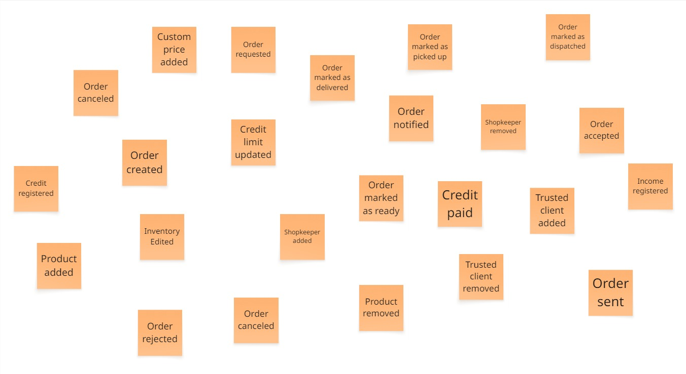

Como primer paso de la técnica de Eventstorming se identifico todos los eventos posibles en equipo. Tomando en cuenta los conocimientos del dominio en el cual estamos trabajando. Los eventos son idenfiticados con post-its naranjas y con el formato **SUSTANTIVO + VERBO EN PASADO**

**PASO 2: ORDENAR EVENTOS**

Posterior a la identificación de eventos se procede a ordenarlos en base a secuencias lógicas que se identificaron en el equipo. En este caso se puede observar en la parte superior de la imagen como se ordena los eventos necesarios para completar todo el ciclo de vida de una orden.

**PASO 3: DETERMINAR PIVOTAL POINTS**
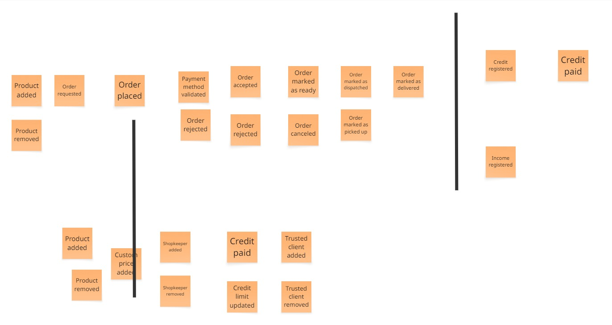

Para darle un orden aún más claro y preciso a los eventos identificados, se determina los pivotal points del dominio. Estas segmentaciones dentro del dominio son cambios importantes y que representan un antes y después. En este caso cuando un conjunto de productos se convierten en su conjunto en una orden. Así como marcar una orden como entregada para disparar un evento de registro de ingreso monetario para la bodega. Los pivotal points son identificados con una barra negra vertical.

**PASO 4: IDENTIFICAR COMANDOS**

Habiendo identificado y ordenado eventos y puntos clave en el dominio es necesario reconocer los comandos que los desencadena. De esta manera se determina las acciones que traen por consecuente a los eventos del dominio. Los comandos son identificados con post-its azules claros y con el formato **VERBO EN PRESENTE + SUSTANTIVO**

**PASO 5: IDENTIFICAR POLITICAS**

Trabajar en un dominio implica responder a reglas especificas de negocio, en este caso se identifican 3 reglas de negocio importantes. Las tres estrechamente relacionadas con los pagos y fiados de las bodegas. Identificar las politicas del dominio nos permitira, posteriormente, dar forma a los contextos del dominio. Las politicas se identifican con post-its moradas.

**PASO 6: IDENTIFICAR VISTAS**

Eventos y comandos transcurren en distintas partes de un sistema, para evitar confusiones e ir definiendo el diseño de la aplicación se identifican a gran escala en que "pantallas" transcurren los eventos y coamndos. Las vistas son identificadas con post-its verdes.

**PASO 7: IDENTIFICAR ACTORES**
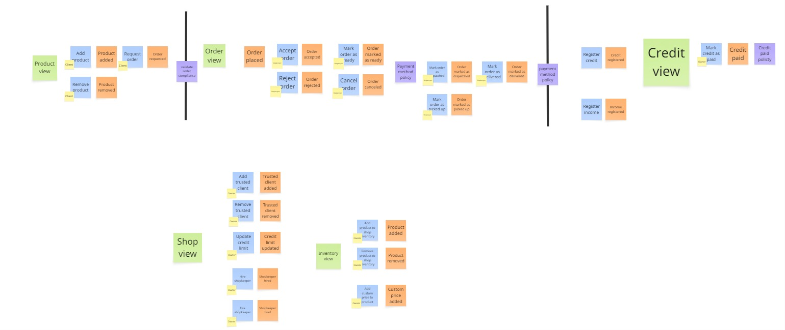

Los comandos, en su mayoría, son accionados por intervención de usuarios. En este caso se vincula gran porcentaje de los comandos a sus respectivos usuarios activadores: Dueños, tenderos y clientes. Se observa que algunos comandos no tienen actores, esto es debido a que son comandos que se activan por el sistema, más adelante se detallara a fondo. Los actores son representados por post-its amarillos justo en la esquina inferior izquierda de los comandos. 

**PASO 8: IDENTIFICAR AGREGADOS**

Posterior a la identificación de eventos, comandos, vistas, politicas y actores se tiene que definir los agregados del dominio. En este caso se identifica 7 agregados:
- Shopping bag. Encargado de almacenar los productos de un cliente, antes de ser considerado una orden.
- Product. Representa un producto ofertado dentro de una bodega.
- Shop. Representa a la bodega con sus políticas.
- Debt. Representa una deuda resultado de una compra mediante fiado.
- Payment. Representa los ingresos resultado de las ordenes.
- Trusted client. Representa un cliente que recibe la confianza del dueño para poder acceder al fiado.
- Shopkeeper. Representa a un tendero que trabaja en una bodega para el dueño de esta.
- Order. Representa la orden en si misma, desde su concepción a través del shopping bag, hasta su entrega al cliente. Tiene ciertas caracteristicas propias y complejas de una orden.

**PASO 9: DEFINIR CONTEXTOS**
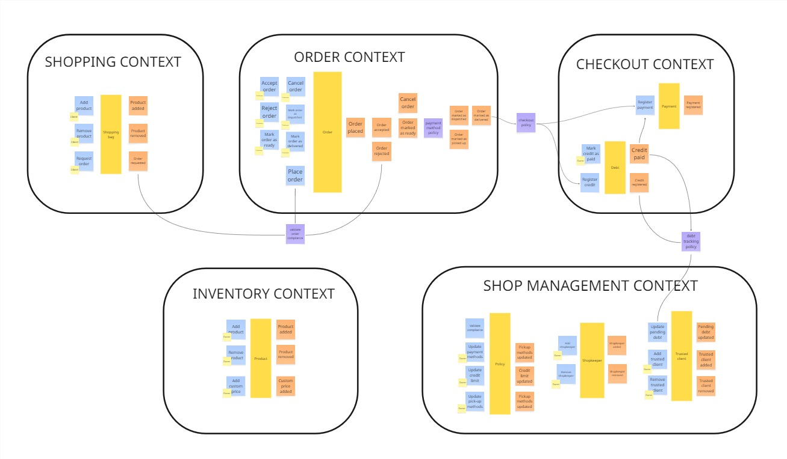

Finalmente, con los agregados estructurados y las politicas parametrizadas se puede definir los contextos del dominio. El equipo de desarrollo determino 5 contextos en base a las funcionalidades identificadas del dominio utilizando la técnica de **start-with-simple**
- **Shopping context** se encarga del proceso de planificación de una orden previo al compromiso de despacho
- **Order context** se encarga del ciclo de vida de una orden
- **Checkout context** gestiona los pagos y registra los ingresos y deudas
- **Inventory context** control de stock de productos
- **Shop context** que representa a la bodega en su totalidad.
Los contextos son representados a través de las figuras que rodean a los eventos, comandos, agregados y politicas. Se observa que los contextos se comunican a través de las politicas.

#### Domain Message Flows Modeling

Para detallar el funcionamiento y conexión de los bounded context se ha determinado 3 escenarios que permitan comprender los procesos del negocio. 

**Escenario 1: Pedir orden**
Objetivo: Un cliente quiere registrar una orden en una tienda cercana.

Se observa como el cliente interactua con la bolsita de compras de la aplicación llevandolo de productos, finalmente esa bolsita de compras nutre a la creación de la orden. Finalmente la bodega seleccionada es notificada y un tendero se encarga de la orden.

**Escenario 2: Entregar orden**
Objetivo: Un tendero quiere atender rapidamente la orden que le corresponde.

Un tendero recibe una orden a través de la aplicación móvil, la prepara con todos los productos especificados. Cuando el cliente llega a la tienda el tendero le hace entrega de su orden y posterior a ello el tendero marca el pedido como entregado en la aplicación móvil, lo cual desencadena un registro de ingreso.

**Escenario 3: Manejo de inventario**
Objetivo: Un dueño quiere actualizar el stock de su tienda a través del conteo de productos.

El dueño de la bodega contabiliza manualmente los productos que tiene en tienda y marca con un check los productos con existencias en la bodega.

#### Bounded Context Canvases

Con el fin de documentar el proposito y relación de los contextos identificados se implemento la herramienta Bounded Context Canvas a cada contexto. 

Este proceso ayudo al equipo de desarrollo a mejorar la comprensión del dominio y la razón de ser de cada contexto. 

**ORDER CONTEXT**

Es responsable del ciclo de vida de una orden. La orden se genera en base a la idoneidad para atender el pedido bajo las condiciones solicitadas por el cliente. El ofrece como parte de la gestión de ese proceso aceptar o rechazar la atención de la orden y la posibilidad de cancelar su atención, asegurando que el despacho de la bodega mantenga autonomía sobre sus funciones según consideren necesario.

Se comunica principalmente con Shopping y con el front-end a través del API expuesta, proporcionando endpoints que permiten consultar las tiendas idóneas y recibir la solicitud del armado de una orden en base a un Shopping Bag a través de un evento de OrderRequested.

**SHOPPING CONTEXT**

Tiene como responsabilidad la planificación de las ordenes de compra. En ella los clientes eligen, en base al catálogo de productos en circulación, los productos que desean adquirir. Se trata de un contexto core y de planificación.

Interactúa principalmente con orders, para solicitar la atención de un pedido en base a una bolsa de compras.

También interactúa con el contexto de catalog. Los clientes obtienen la visión general de los productos disponibles en este contexto, quien los proporciona con sus datos completos y se los convierte al modelo local a través de ACL.

**CHECKOUT CONTEXT**

Tiene como propósito registrar los ingresos y deudas pendientes de cobrar de cada orden, así resumir los datos en información para la toma de decisiones administrativas y contables. Por ejemplo, la deuda acumulada de los clientes confiables o los ingresos al cierre de caja de cada día.

Se comunica principalmente con orders al termino del ciclo de vida de una orden, que solicita el registro de los ingresos o deudas.

También se comunica con el contexto de shop para avisar de actualizar el crédito consumido por el cliente confiable.

Por último, el front end consume la información que puede producir el contexto a partir de sus registros de datos para la toma de decisiones empresariales.

**SHOP CONTEXT**

Tiene como propósito el gestionar los tenderos y clientes confiables de una bodega, así como limitar el credito que puede ofrecer la bodega a sus clientes confiables. Se trata de un contexto de soporte, pues es necesario para el funcionamiento del dominio pero no es un diferenciador en el mercado.

Representa un contexto que cumplidor, pues permite la existencia de la bodega en si misma.
Se comunica principalmente con el front-end, a través de la API expuesta, proporcionando endpoints que permiten la consulta y modificación de las reglas administrativas de la bodega. 

También se comunica con el contexto de orders, que es uno de los principales consumidores de los datos para el armado de las ordenes asegurando el cumplimiento de las políticas de la bodega.

Por último también se comunica con checkout. Este último contexto lleva las cuentas y trazabilidad de los pagos y deudas, emitiendo eventos para que los saldos de los clientes confiables se mantengan actualizados

**INVENTORY CONTEXT**

La intención de este contexto es únicamente el manejo de existencia de productos en la bodega. No controla cantidad, sino la disponibilidad de estos en la bodega a sus clientes. Se trata de un contexto de soporte que representa el almacenamiento de productos de la bodega. Cumple el rol de ejecución forma parte del proceso operativo de una bodega.

Se comunica principalmente con el front end para la actualización de información del inventario y con orders para proveer información acerca de los productos, como el precio de venta especial que puede tener la tienda sobre un producto.

### Context Mapping

Se presenta a continuación el proceso en que se evalúa propuestas de context maps para la solución de software. Se consideran los capabilities del negocio así como las características del producto de software en cuestión.

**¿Qué pasa si dejamos que shop se encargue de la identificación de clientes, tenderos y dueños?**

En este mapping generado a simple vista se nota que el contexto de Shop está cumpliendo un rol que no debería estar cumpliendo: identificar a los usuarios del sistema. El propósito del contexto Shop es únicamente manejar las reglas de administración de las bodegas, por lo que es necesario delegar esa capabilidad a otro contexto (IAM).

**¿Qué pasa si dejamos que inventory se encargue del catálogo maestro de productos además del inventario individual de cada bodega?**

En este mapping generado se puede observar que existe una dependencia transitiva, además de que el contexto de inventory se termina contaminando: Inventory ya no reflejaría la gestión de inventario propia del problem domain, sino un conjunto semántico relacionado con los datos de los productos que sirve a la aplicación y no al negocio, contradiciendo DDD. Por tanto, se crea el bounded context Catalog, responsable de suministrar los datos de productos y aplicar políticas para su mantenimiento y actualización.

**¿Qué pasa si dividimos la responsabilidad del bounded context orders para crear otro bounded context?**

Hasta el momento, se había asumido que el propio contexto de orders iba a evaluar la idoneidad del pedido para ser atendido. En este mapping se intenta separar dicha capabilidad en un nuevo bounded context. Sin embargo, en análisis nos lleva a resaltar que, a pesar de mantner una separación mucho más fuerte entre la solución de software y el domain, realmente esta capabilidad no amerita su propio bounded context, puesto que:
- No maneja un modelo propio
- No reduce el acoplamiento actualmente existente: al contrario, lo vuelve más complejo
- Su única función sería servir a orders

Por tanto, se determina delegar esta responsabilidad al propio contexto de orders dentro de un servicio de aplicación, para mantener la distinción de nuestra solución del domain.

**MODELO FINAL**

En consecuencia, se determina que el modelo final consta de los siguientes bounded context:
- IAM
- Shopping
- Orders
- Checkout
- Shop
- Inventory
- Catalog

### Software Architecture

#### Software Architecture Context Level Diagrams

T'Compro es una plataforma de gestión de inventario, finanzas y pedidos para bodegas del Perú. Como se puede observar en el diagrama de contexto es utilizado por dueños de bodegas, tenderos y clientes. T'Compro almacena su información en una base de datos PostgreSQL proporcionada por Supabase. Además, cuenta con autenticación mediante JWT por un servicio externo.

#### Software Architecture Container Level Diagrams

El diagrama de contenedores detalla la arquitectura de la plataforma T'Compro, ofreciendo una vista más precisa de sus componentes. En este sistema, los tres tipos de usuarios —compradores, vendedores y repartidores— interactúan directamente con la **landing page**, que sirve como un punto de acceso inicial. Desde allí, son redirigidos para descargar la **aplicación móvil**, la cual es utilizada por todos ellos para sus respectivas funciones. Esta aplicación se comunica con los **modulos de la API** mediante solicitudes **HTTPS**. La API procesa estas peticiones y responde con los datos necesarios en formato **JSON**. Finalmente, la API actúa como el eje central, interactuando de forma continua con la **base de datos** para leer, escribir y actualizar los registros de manera dinámica, asegurando el correcto funcionamiento de la plataforma.

#### Software Architecture Deployment Diagrams

En cuanto al diagrama de despliegue, que utiliza los contenedores descritos en el punto anterior, se observa las tecnologías en la nube que se utilizan para levantar cada contenedor. En este caso, la landing page se despliega en Netlify, la aplicación móvil en Firebase, la API se despliega a través de Azure, al igual que la base de datos MySQL.

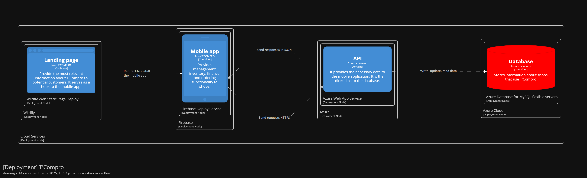

## Tactical-Level Domain-Driven Design

### Bounded Context: Orders

<h4 id="orders-domain-layer">Domain Layer</h4>

| Archivo / Carpeta                                 | Propósito                                            | Tipo de recurso |
| ------------------------------------------------- | ---------------------------------------------------- | --------------- |
| `model/aggregates/Order.java`                     | Agregado raíz de orders                              | Aggregate       |
| `model/entities/Orderline.java`                   | Entidad snapshot de un producto al momento de compra | Entity          |
| `model/valueobjects/OrderStatus.java`             | Enum que registra los estados de una orden           | Value object    |
| `model/valueobjects/PaymentMethod.java`           | Enum que registra el método de pago para la orden    | Value object    |
| `model/valueobjects/DeliveryMethod.java`          | Enum que registra la forma de recojo de la orden     | Value object    |
| `model/aggregates/Shop.java`                     | Agregado secundario en Orders                              | Aggregate       |
| `model/valueobjects/OrderId.java`                 | Identificador de la orden                            | Value object    |
| `model/valueobjects/OrderlineId.java`             | Identificador de la linea de orden                   | Value object    |
| `model/commands/GetSuitableShopsQuery.java`       | Record para consultar las tiendas idóneas            | Query           |
| `model/queries/PlaceOrderCommand.java`            | Record para colocar una orden                        | Command         |
| `model/queries/AcceptOrderCommand.java`           | Record para aceptar una orden                        | Command         |
| `model/queries/RejectOrderCommand.java`           | Record para rechazar una orden                       | Command         |
| `model/queries/CancelOrderCommand.java`           | Record para cancelar una orden                       | Command         |
| `model/queries/MarkOrderAsReadyCommand.java`      | Record para señalar una orden como lista             | Command         |
| `model/queries/MarkOrderAsDispatchedCommand.java` | Record para señalar una orden como despachada        | Command         |
| `model/queries/MarkOrderAsDeliveredCommand.java`  | Record para señalar una orden como entregada         | Command         |
| `services/OrdersQueryService.java`               | Expone operaciones de lectura sobre productos          | Query Service   |
| `services/OrdersCommandService.java`             | Expone operaciones CUD sobre ordenes                 | Command Service |
| `services/ShopQueryService.java`             | Expone operaciones CUD sobre ordenes                 | Command Service |

<h4 id="orders-interface-layer">Interface Layer</h4>

| Carpeta / Archivo    | Propósito | Tipo de recurso |
| -------------------- | --------- | --------------- |
| `acl/OrdersContextFacade.java` | Interface para exponer capacidades de Orders a otros bounded contexts | ACL Facade |
| `rest/controllers/OrdersController` | Interface para exponer capacidades de Orders mediante endpoints REST | REST Controller | 
| `rest/assemblers/GetSuitableShopsQueryFromResourceAssembler.java`  | Convierte un `GetSuitableShopsResource` en un `GetSuitableShopsQuery`  | Resource → Query Assembler |
| `rest/assemblers/GetOrderQueryFromResourceAssembler.java`  | Convierte un `GetOrderResource` en un `GetOrderQuery`  | Resource → Query Assembler |
| `rest/assemblers/ShopResourceFromEntityAssembler.java`  | Convierte un `Shop` en un `ShopResource`  | Entity → Resource Assembler |
| `rest/controllers/OrdersController` | Interface para exponer capacidades de Orders mediante endpoints REST | REST Controller |

<h4 id="orders-application-layer">Application Layer</h4>

| Archivo / Carpeta                                           | Propósito                                            | Tipo de recurso      |
| ----------------------------------------------------------- | ---------------------------------------------------- | -------------------- |
| `internal/commandservices/OrdersCommandServiceImpl.java` | Implementación concreta de `OrdersCommandService`  | Command Service Impl |
| `internal/queryservices/OrdersQueryServiceImpl.java`     | Implementación concreta de `OrdersQueryService`    | Query Service Impl   |
| `internal/acl/OrdersContextFacadeImpl.java`   | Implementación concreta de la interface expuesta a otros contextos para acceder a la lógica de este  | ACL Facade  |
| `internal/outboundservices/acl/ExternalInventoryService.java`                       | Adaptador para consultar productos de `Inventory`  | ACL Service          |
| `internal/outboundservices/acl/ExternalShopService.java`                          | Adaptador para para consultar clientes confiables y políticas de `Shop` | ACL Service |

<h4 id="orders-infrastructure-layer">Infrastructure Layer</h4>

| Archivo / Carpeta                           | Propósito                                              | Tipo de recurso |
| ------------------------------------------- | ------------------------------------------------------ | --------------- |
| `persistence/jpa/repositories/OrderRepository.java` | Implementación JPA de `OrderRepository` (agregado) | Repository Impl |

<h4 id="orders-component-diagrams">Bounded Context Software Architecture Component Level Diagrams</h4>

El componente Orders expone un endpoint para obtener las tiendas idóneas previa la a solicitud de atención de pedido, por lo que IAM protege su acceso. Para dicho fin, es necesario que se comunique con Shop e Inventory. Además, Shopping debe proveer datos para el armado del pedido y Checkout debe ser llamado para el registro de los pagos y deudas generados a consecuencia de la atención del pedido.

#### Bounded Context Software Architecture Code Level Diagrams

<h5 id="orders-class-diagrams">Bounded Context Domain Layer Class Diagrams</h5>

Se presenta el diagrama de clases del contexto de pedidos, teniendo como clases principales a Order y Orderlines, además de tener un enum que ayuda a gestionar su ciclo de vida.

<h5 id="orders-database-diagram">Bounded Context Database Design Diagram</h5>

La base de datos persiste los pedidos ligados a las ordenes, registrando snapshopts de el producto comprado (para mayor consistencia por si los precios cambian). Además, se persisten los datos de los clientes necesarios para registrar en el pedido.

### Bounded Context: Shopping

<h4 id="shopping-domain-layer">Domain Layer</h4>

| Archivo / Carpeta                                    | Propósito                                                      | Tipo de recurso   |
| ---------------------------------------------------- | -------------------------------------------------------------- | ----------------- |
| `model/aggregates/ShoppingBag.java`                  | Agregado raíz que representa la bolsa de compras actual        | Aggregate         |
| `model/entities/ShoppingBagItem.java`                | Entidad snapshot de un producto de catálogo dentro de la bolsa | Entity            |
| `model/aggregates/ShoppingList.java`                 | Agregado raíz que representa una lista de compras recurrente   | Aggregate         |
| `model/entities/ShoppingListItem.java`               | Entidad snapshot de un producto de catálogo en la lista        | Entity            |
| `model/entities/FavoriteProduct.java`                | Entidad que registra un producto marcado como favorito         | Entity            |
| `model/valueobjects/ShoppingListId.java`             | Identificador de la lista de compras                           | Value object      |
| `model/valueobjects/ShoppingListItemId.java`         | Identificador del ítem dentro de la lista de compras           | Value object      |
| `model/valueobjects/CatalogItemId.java`              | Identificador del producto de catálogo                         | Value object      |
| `model/valueobjects/ClientId.java`                   | Identificador del cliente                                      | Value object      |
| `model/interfaces/CatalogProductReference.java`      | Interfaz común para snapshots de productos de catálogo         | Domain interface  |
| `model/commands/CreateShoppingListCommand.java`   | Record para crear una nueva lista de compras         | Command         |
| `model/commands/AddItemToShoppingListCommand.java`| Record para agregar un producto a una lista de compras | Command       |
| `model/commands/RemoveItemFromShoppingListCommand.java` | Record para eliminar un producto de una lista de compras | Command |
| `model/commands/MarkProductAsFavoriteCommand.java`| Record para marcar un producto como favorito         | Command         |
| `model/queries/GetShoppingListsQuery.java`        | Record para consultar todas las listas de compras de un cliente | Query |
| `model/queries/GetFavoritesQuery.java`            | Record para consultar los productos favoritos        | Query           |
| `services/ShoppingCommandService.java`            | Expone operaciones CUD sobre shopping (bolsa, listas, favoritos) | Command Service |
| `services/ShoppingQueryService.java`              | Expone operaciones de lectura sobre shopping (bolsa, listas, favoritos) | Query Service   |

<h4 id="shopping-interface-layer">Interface Layer</h4>

| Carpeta / Archivo                                                       | Propósito                                                                       | Tipo de recurso              |
| ----------------------------------------------------------------------- | ------------------------------------------------------------------------------- | ---------------------------- |
| `rest/controllers/ShoppingController.java`                              | Controlador REST para exponer endpoints de bolsa, listas de compra y favoritos   | REST Controller              |
| `rest/resources/AddToBagResource.java`                                  | Resource de entrada para agregar un producto a la bolsa (equivalente a un command) | Resource (Input)         |
| `rest/resources/ShoppingBagResource.java`                               | Resource de salida que representa la bolsa de compras de un cliente             | Resource (Output)        |
| `rest/resources/CreateShoppingListResource.java`                        | Resource de entrada para crear una lista de compras                             | Resource (Input)         |
| `rest/resources/ShoppingListResource.java`                              | Resource de salida que representa una lista de compras                          | Resource (Output)        |
| `rest/resources/FavoriteProductResource.java`                           | Resource de salida que representa un producto favorito                          | Resource (Output)        |
| `rest/assemblers/AddToBagCommandFromResourceAssembler.java`             | Convierte un `AddToBagResource` en un `AddToBagCommand`                         | Resource → Command Assembler |
| `rest/assemblers/ShoppingBagResourceFromEntityAssembler.java`           | Convierte un `ShoppingBag` (aggregate) en `ShoppingBagResource`                 | Entity → Resource Assembler  |
| `rest/assemblers/CreateShoppingListCommandFromResourceAssembler.java`   | Convierte un `CreateShoppingListResource` en un `CreateShoppingListCommand`     | Resource → Command Assembler |
| `rest/assemblers/ShoppingListResourceFromEntityAssembler.java`          | Convierte un `ShoppingList` (aggregate) en `ShoppingListResource`               | Entity → Resource Assembler  |
| `rest/assemblers/FavoriteProductResourceFromEntityAssembler.java`       | Convierte un `FavoriteProduct` en `FavoriteProductResource`                     | Entity → Resource Assembler  |

<h4 id="shopping-application-layer">Application Layer</h4>

| Archivo / Carpeta                                             | Propósito                                                        | Tipo de recurso      |
| ------------------------------------------------------------- | ---------------------------------------------------------------- | -------------------- |
| `internal/commandservices/ShoppingCommandServiceImpl.java`    | Implementación concreta de `ShoppingCommandService`              | Command Service Impl |
| `internal/queryservices/ShoppingQueryServiceImpl.java`        | Implementación concreta de `ShoppingQueryService`                | Query Service Impl   |
| `internal/outboundservices/acl/CatalogExternalService.java` | Adaptador para consultar productos del `Catalog`                 | ACL Service          |

<h4 id="shopping-infrastructure-layer">Infrastructure Layer</h4>

| Archivo / Carpeta                           | Propósito                                              | Tipo de recurso |
| ------------------------------------------- | ------------------------------------------------------ | --------------- |
| `persistence/jpa/repositories/ShoppingListRepository.java`    | Implementación JPA de `ShoppingListRepository` (agregado)  | Repository Impl |
| `persistence/jpa/repositories/FavoriteProductRepository.java` | Implementación JPA de `FavoriteProductRepository` (entidad) | Repository Impl |

<h4 id="shopping-component-diagrams">Bounded Context Software Architecture Component Level Diagrams</h4>

El componente Shopping gestiona la experiencia del cliente en la aplicación de metamercado, permitiendo organizar y planificar sus compras. A diferencia de Orders, no representa aún una transacción confirmada, sino interacciones previas al pedido.

Además, se encarga de gestionar las preferencias de compras de usuario como las listas de compra y los productos favoritos.

#### Bounded Context Software Architecture Code Level Diagrams

<h5 id="shopping-class-diagrams">Bounded Context Domain Layer Class Diagrams</h5>

El componente Orders gestiona los pedidos de los clientes. Contiene como clases principales a Order y Orderline, además de un enum que permite controlar su ciclo de vida.

<h5 id="shopping-database-diagram">Bounded Context Database Design Diagram</h5>

La base de datos persiste las bolsas de compras, listas de compras y productos favoritos de los clientes, registrando snapshots de los productos de catálogo (nombre, precio de referencia, imagen) para asegurar consistencia aun si el catálogo cambia.

### Bounded Context: Checkout

<h4 id="checkout-domain-layer">Domain Layer</h4>

| Archivo / Carpeta                                         | Propósito                                                                | Tipo de recurso |
| --------------------------------------------------------- | ------------------------------------------------------------------------ | --------------- |
| `model/aggregate/Payment.java`                             | Agregado raíz que representa un pago registrado                                 | Aggregate          |
| `model/valuebjects/PaymentSource.java`                                | Value object de enumeración que indica el tipo de pago                   | Value Object          |
| `model/aggregate/Debt.java`                                | Agregado raíz que representa una deuda generada por una orden                   | Aggregate          |
| `model/valuebjects/DebtStatus.java`                                | Value object de enumeración que indica el estado de la deuda                   | Value Object          |
| `model/commands/RegisterPaymentCommand.java`              | Record con datos para registrar un pago                                   | Command         |
| `model/commands/RegisterCreditCommand.java`               | Record con datos para registrar un deuda de fiado                                | Command         |
| `model/commands/MarkCreditAsPaidCommand.java`             | Record con datos para marcar un deuda de fiado como pagado                       | Command         |
| `model/queries/GetPendingDebtsQuery.java`                 | Record con datos para consultar deudas pendientes                         | Query           |
| `model/queries/GetIncomesQuery.java`                      | Record con datos para consultar ingresos (pagos registrados)              | Query           |
| `model/events/DebtPaidEvent.java`                      | Evento que registra los datos de una deuda pagada              | Event  |
| `services/DebtCommandService.java`                    | Expone operaciones de escritura del agregado | Command Service |
| `services/DebtQueryService.java`                      | Expone operaciones de lectura del agregado | Query Service   |
| `services/PaymentCommandService.java`                    | Expone operaciones de escritura del agregado | Command Service |
| `services/PaymentQueryService.java`                      | Expone operaciones de lectura del agregado | Query Service   |

<h4 id="checkout-interface-layer">Interface Layer</h4>

| Carpeta / Archivo | Propósito | Tipo de recurso |
| - | - | - |
| `rest/controllers/CheckoutController.java` | Controlador REST para exponer endpoints relacionados al agregado `Checkout`| REST Controller |
| `rest/resources/MarkCreditAsPaidResource.java`                       | Resource de entrada para marcar crédito como pagado  | Resource (Input)             |
| `rest/resources/PaymentResource.java`                                | Resource de salida que representa un `Payment`       | Resource (Output)            |
| `rest/resources/DebtResource.java`                                   | Resource de salida que representa un `Debt`                           | Resource (Output)            |
| `rest/assemblers/MarkCreditAsPaidCommandFromResourceAssembler.java`  | Convierte un `MarkCreditAsPaidResource` en un `MarkCreditAsPaidCommand`  | Resource → Command Assembler |
| `rest/assemblers/PaymentResourceFromEntityAssembler.java`            | Convierte un `Payment` (entity) en `PaymentResource`                     | Entity → Resource Assembler  |
| `rest/assemblers/DebtResourceFromEntityAssembler.java`               | Convierte un `Debt` (entity) en `DebtResource`                           | Entity → Resource Assembler  |
| `acl/CheckoutContextFacade.java`                                          | Interface para exponer capacidades de Checkout hacia el contexto Orders  | ACL Facade                   |

<h4 id="checkout-application-layer">Application Layer</h4>

| Archivo / Carpeta                                              | Propósito                                                      | Tipo de recurso        |
| -------------------------------------------------------------- | ---------------------------------------------------------------| ---------------------- |
| `internal/commandservices/PaymentCommandServiceImpl.java`     | Implementación concreta de `PaymentCommandService`            | Command Service Impl   |
| `internal/queryservices/PaymentQueryServiceImpl.java`         | Implementación concreta de `PaymentQueryService`              | Query Service Impl     |
| `internal/commandservices/DebtCommandServiceImpl.java`     | Implementación concreta de `DebtCommandService`            | Command Service Impl   |
| `internal/queryservices/DebtQueryServiceImpl.java`         | Implementación concreta de `DebtQueryService`              | Query Service Impl     |
| `internal/eventhandlers/DebtPaidEventHandler.java`   | Clase que escucha el evento DebtPaidEvent para desencadenar el registro de un pago / ingreso a la tienda  | Event Handler |
| `internal/acl/CheckoutContextFacadeImpl.java`   | Implementación concreta de la interface expuesta a otros contextos para acceder a la lógica de este  | ACL Facade  |
| `internal/outboundservices/acl/ExternalOrdersService.java`         | Adaptador para interactuar con el contexto de **Orders** |  External Service     |
| `internal/outboundservices/acl/ExternalShopService.java`         | Adaptador para interactuar con el contexto de **Shop** | External Service      | |

<h4 id="checkout-infrastructure-layer">Infrastructure Layer</h4>

| Archivo / Carpeta                                               | Propósito                                                              | Tipo de recurso |
| --------------------------------------------------------------- | -----------------------------------------------------------------------| --------------- |
| `persistence/jpa/repositories/PaymentRepository.java`           | Implementación JPA para persistencia de pagos                          | Repository Impl |
| `persistence/jpa/repositories/DebtRepository.java`              | Implementación JPA para persistencia de deudas                         | Repository Impl |

<h4 id="checkout-component-diagrams">Bounded Context Software Architecture Component Level Diagrams</h4>

El componente Checkout es un gestor de transacciones dentro del sistema. Su principal propósito es manejar los pagos y las deudas generadas por las compras, registrando créditos y verificando su liquidación. De esta forma, proporciona la información financiera necesaria para otros contextos que dependen del estado de los pagos.

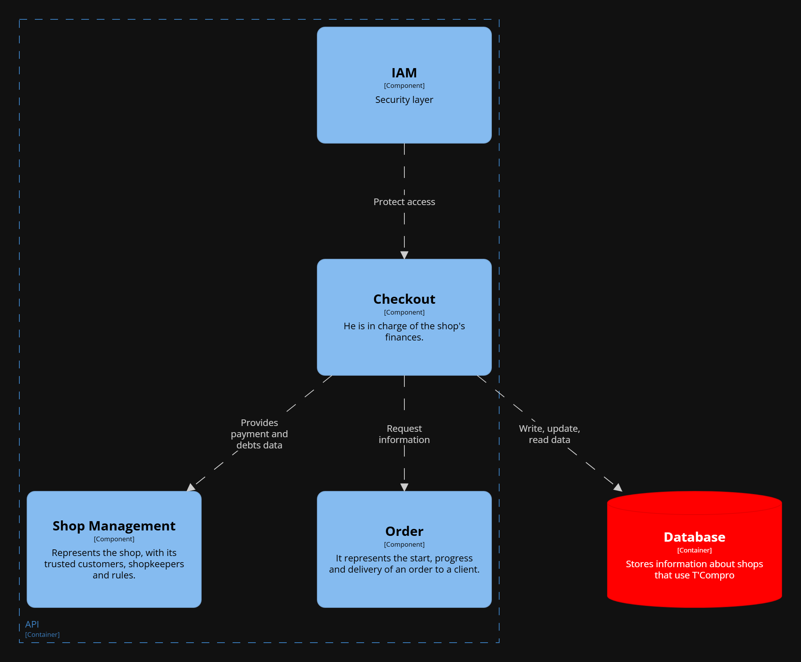

#### Bounded Context Software Architecture Code Level Diagrams

<h5 id="checkout-class-diagrams">Bounded Context Class Diagram</h5>

El diagrama de clases de este contexto se centra principalmente en Checkout, el único aggregate de este contexto. Representa el proceso de pago de una compra, permitiendo registrar pagos, créditos y deudas asociadas.

El contexto dispone de consultas que permiten verificar las deudas pendientes y los ingresos registrados, gestionadas por el CheckoutQueryService.

<h5 id="checkout-database-diagram">Bounded Context Database Design Diagram</h5>

Checkout actúa como entidad principal, mientras que Payment y Debt almacenan los registros de pagos y deudas respectivamente. Ambas entidades cuentan con una llave foránea hacia Checkout, lo que permite relacionar cada pago y deuda con su proceso de pago correspondiente.

### Bounded Context: Shop Management

<h4 id="shop-domain-layer">Domain Layer</h4>

| Archivo / Carpeta                                  | Propósito                                                      | Tipo de recurso |
| -------------------------------------------------- | -------------------------------------------------------------- | --------------- |
| `model/aggregates/Shop.java`                       | Agregado raíz, representa una bodega                           | Aggregate       |
| `model/aggregates/TrustedClient.java`            | Agregado raíz de cliente confiable                             | Aggregate       |
| `model/aggregates/Shopkeeper.java`                 | Agregado raíz de tendero                                       | Aggregate       |
| `model/aggregates/Policy.java`                     | Agregado raíz de política de la tienda (1:1 con Shop)          | Aggregate       |
| `model/valueobjects/ShopId.java`                   | Identificador de Shop                                          | Value Object    |
| `model/valueobjects/TrustedClientId.java`        | Identificador de TrustedClient                               | Value Object    |
| `model/valueobjects/ShopkeeperId.java`             | Identificador de Shopkeeper                                    | Value Object    |
| `model/valueobjects/PolicyId.java`                 | Identificador de Policy                                        | Value Object    |
| `model/commands/AddTrustedClientCommand.java`    | Datos para agregar cliente confiable a una tienda              | Command         |
| `model/commands/RemoveTrustedClientCommand.java` | Datos para remover cliente confiable                           | Command         |
| `model/commands/HireShopkeeperCommand.java`        | Datos para contratar tendero                                   | Command         |
| `model/commands/FireShopkeeperCommand.java`        | Datos para despedir tendero                                    | Command         |
| `model/commands/UpdatePolicyCommand.java`          | Datos para actualizar políticas (pago, recojo, crédito máximo) | Command         |
| `model/queries/GetShopByIdQuery.java`              | Consulta de Shop por id                                        | Query           |
| `model/queries/GetAllTrustedClientsQuery.java`   | Consulta lista de clientes confiables de una tienda            | Query           |
| `model/queries/GetAllShopkeepersQuery.java`        | Consulta lista de tenderos de una tienda                       | Query           |
| `model/queries/GetPolicyByShopIdQuery.java`        | Consulta políticas de una tienda                               | Query           |
| `services/ShopCommandService.java`                 | Interfaz de operaciones de escritura de Shop                   | Command Service |
| `services/ShopQueryService.java`                   | Interfaz de operaciones de lectura de Shop                     | Query Service   |
| `services/TrustedClientCommandService.java`      | Interfaz de operaciones de escritura de TrustedClient        | Command Service |
| `services/TrustedClientQueryService.java`        | Interfaz de operaciones de lectura de TrustedClient          | Query Service   |
| `services/ShopkeeperCommandService.java`           | Interfaz de operaciones de escritura de Shopkeeper             | Command Service |
| `services/ShopkeeperQueryService.java`             | Interfaz de operaciones de lectura de Shopkeeper               | Query Service   |
| `services/PolicyCommandService.java`               | Interfaz de operaciones de escritura de Policy                 | Command Service |
| `services/PolicyQueryService.java`                 | Interfaz de operaciones de lectura de Policy                   | Query Service   |

<h4 id="shop-interface-layer">Interface Layer</h4>

| Carpeta / Archivo                                                     | Propósito                                                | Tipo de recurso              |
| --------------------------------------------------------------------- | -------------------------------------------------------- | ---------------------------- |
| `rest/controllers/ShopController.java`                                | Endpoints REST de Shop                                   | REST Controller              |
| `rest/controllers/TrustedClientController.java`                     | Endpoints REST de TrustedClient                        | REST Controller              |
| `rest/controllers/ShopkeeperController.java`                          | Endpoints REST de Shopkeeper                             | REST Controller              |
| `rest/controllers/PolicyController.java`                              | Endpoints REST de Policy                                 | REST Controller              |
| `rest/resources/AddTrustedClientResource.java`                      | Entrada para agregar cliente confiable                   | Resource (Input)             |
| `rest/resources/TrustedClientResource.java`                         | Salida para representar cliente confiable                | Resource (Output)            |
| `rest/resources/HireShopkeeperResource.java`                          | Entrada para contratar tendero                           | Resource (Input)             |
| `rest/resources/ShopkeeperResource.java`                              | Salida para representar tendero                          | Resource (Output)            |
| `rest/resources/UpdatePolicyResource.java`                            | Entrada para actualizar políticas de bodega              | Resource (Input)             |
| `rest/resources/PolicyResource.java`                                  | Salida para representar política de bodega               | Resource (Output)            |
| `rest/assemblers/AddTrustedClientCommandFromResourceAssembler.java` | Convierte resource a comando `AddTrustedClientCommand` | Resource → Command Assembler |
| `rest/assemblers/TrustedClientResourceFromEntityAssembler.java`     | Convierte entidad a resource `TrustedClientResource`   | Entity → Resource Assembler  |
| `rest/assemblers/HireShopkeeperCommandFromResourceAssembler.java`     | Convierte resource a comando `HireShopkeeperCommand`     | Resource → Command Assembler |
| `rest/assemblers/ShopkeeperResourceFromEntityAssembler.java`          | Convierte entidad a resource `ShopkeeperResource`        | Entity → Resource Assembler  |
| `rest/assemblers/UpdatePolicyCommandFromResourceAssembler.java`       | Convierte resource a comando `UpdatePolicyCommand`       | Resource → Command Assembler |
| `rest/assemblers/PolicyResourceFromEntityAssembler.java`              | Convierte entidad a resource `PolicyResource`            | Entity → Resource Assembler  |

<h4 id="shop-application-layer">Application Layer</h4>

| Archivo / Carpeta                                                 | Propósito                                         | Tipo de recurso      |
| ----------------------------------------------------------------- | ------------------------------------------------- | -------------------- |
| `internal/commandservices/ShopCommandServiceImpl.java`            | Implementación de `ShopCommandService`            | Command Service Impl |
| `internal/queryservices/ShopQueryServiceImpl.java`                | Implementación de `ShopQueryService`              | Query Service Impl   |
| `internal/commandservices/TrustedClientCommandServiceImpl.java` | Implementación de `TrustedClientCommandService` | Command Service Impl |
| `internal/queryservices/TrustedClientQueryServiceImpl.java`     | Implementación de `TrustedClientQueryService`   | Query Service Impl   |
| `internal/commandservices/ShopkeeperCommandServiceImpl.java`      | Implementación de `ShopkeeperCommandService`      | Command Service Impl |
| `internal/queryservices/ShopkeeperQueryServiceImpl.java`          | Implementación de `ShopkeeperQueryService`        | Query Service Impl   |
| `internal/commandservices/PolicyCommandServiceImpl.java`          | Implementación de `PolicyCommandService`          | Command Service Impl |
| `internal/queryservices/PolicyQueryServiceImpl.java`              | Implementación de `PolicyQueryService`            | Query Service Impl   |

<h4 id="shop-infrastructure-layer">Infrastructure Layer</h4>

| Archivo / Carpeta                             | Propósito                                          | Tipo de recurso |
| --------------------------------------------- | -------------------------------------------------- | --------------- |
| `persistence/jpa/repositories/ShopRepository.java`            | Repositorio JPA de Shop (extiende `JpaRepository`) | Repository Impl |
| `persistence/jpa/repositories/TrustedClientRepository.java` | Repositorio JPA de TrustedClient    (extiende `JpaRepository`)             | Repository Impl |
| `persistence/jpa/repositories/ShopkeeperRepository.java`      | Repositorio JPA de Shopkeeper         (extiende `JpaRepository`)             | Repository Impl |
| `persistence/jpa/repositories/PolicyRepository.java`          | Repositorio JPA de Policy            (extiende `JpaRepository`)              | Repository Impl |

<h4 id="shop-component-diagrams">Bounded Context Software Architecture Component Level Diagrams</h4>

El componente Shop proporciona información relevante para las ordenes y elección de tiendas en base al carrito de productos. Es constantemente consultado por información de la bodega por otros contextos. Además, IAM protege sus endpoints.

#### Bounded Context Software Architecture Code Level Diagrams

<h5 id="shop-class-diagrams">Bounded Context Domain Layer Class Diagrams</h5>

Como principales clases dentro de este contexto se encuentran Shop, que es la representación lógica de la bodega, Shopkeeper, TrustedClient y Policy. Básicamente, a través de estos tres agregados, se compone la bodega en si misma. Shop puede manejar su lista de tenderos y clientes confiables a través de comandos, al igual que sus politicas. 

<h5 id="shop-database-diagram">Bounded Context Database Design Diagram</h5>

La estructura de tablas en este contexto es sencilla, se tiene una tabla que básicamente reune IDs de otras tablas. En este caso, Shop tiene una relación uno a uno con un registro de Policy, este registro representa las policitas internas de la bodega. Shop cuenta con una lista de clientes confiables y una lista de tenderos, ambos completamente manipulables desde Shop. 

### Bounded Context: Inventory

<h4 id="inventory-domain-layer">Domain Layer</h4>

| Archivo / Carpeta                               | Propósito                                             | Tipo de recurso |
| ----------------------------------------------- | ----------------------------------------------------- | --------------- |
| `model/aggregate/Product.java`                   | Agregado raíz del contexto                      | Aggregate          |
| `model/commands/AddProductCommand.java`         | Record con datos para añadir producto                 | Command         |
| `model/commands/RemoveProductCommand.java`      | Record con datos para remover producto                | Command         |
| `model/commands/ChangeProductPriceCommand.java` | Record con datos para cambiar precio                  | Command         |
| `model/queries/GetProductsByShopIdQuery.java`    | Record con datos para consultar inventario por tienda | Query           |
| `services/ProductCommandService.java`         | Expone operaciones de escritura del agregado          | Command Service |
| `services/ProductQueryService.java`           | Expone operaciones de lectura del agregado            | Query Service   |

<h4 id="inventory-interface-layer">Interface Layer</h4>

| Carpeta / Archivo                                       | Propósito                                                                | Tipo de recurso              |
| ------------------------------------------------------- | ------------------------------------------------------------------------ | ---------------------------- |
| `rest/controllers/ProductController.java`             | Controlador REST para exponer endpoints del agregado `Product`         | REST Controller              |
| `rest/resources/AddProductResource.java`             | Resource de entrada para crear un producto (equivalente a un command)         | Resource (Input)         |
| `rest/resources/ProductResource.java`                   | Resource de salida que representa un `Product`                                | Resource (Output)        |
| `rest/assemblers/AddProductCommandFromResourceAssembler.java` | Convierte un `AddProductResource` en un `AddProductCommand`        | Resource → Command Assembler |
| `rest/assemblers/ProductResourceFromEntityAssembler.java`        | Convierte un `Product` (entity/agregado) en `ProductResource`            | Entity → Resource Assembler  |
| `acl/InventoryContextFacade.java`                | Interface para exponer capacidades de Inventory a otros bounded contexts | ACL Facade                   |

<h4 id="inventory-application-layer">Application Layer</h4>

| Archivo / Carpeta                                           | Propósito                                            | Tipo de recurso      |
| ----------------------------------------------------------- | ---------------------------------------------------- | -------------------- |
| `internal/commandservices/ProductCommandServiceImpl.java` | Implementación concreta de `ProductCommandService` | Command Service Impl |
| `internal/queryservices/ProductQueryServiceImpl.java`     | Implementación concreta de `ProductQueryService`   | Query Service Impl   |
| `internal/outboundservices/acl/ExternalCatalogServiceImpl.java`           | Adaptador para consultar productos del `Catalog`     | ACL Service          |
| `acl/InventoryContextFacadeImpl.java`           | Implementación concreta de `InventoryContextFacade`   | ACL Facade          |

<h4 id="inventory-infrastructure-layer">Infrastructure Layer</h4>

| Archivo / Carpeta                           | Propósito                                              | Tipo de recurso |
| ------------------------------------------- | ------------------------------------------------------ | --------------- |
| `persistence/jpa/repositories/ProductRepository.java`   | Implementación JPA de `ProductRepository` (agregado)    | Repository Impl |

<h4 id="inventory-component-diagrams">Bounded Context Software Architecture Component Level Diagrams</h4>

El componente Inventory redunda la información de Catalog, a su vez, este componente es consultado por Store assignment y Order.

#### Bounded Context Software Architecture Code Level Diagrams

<h5 id="inventory-class-diagrams">Bounded Context Domain Layer Class Diagrams</h5>

Se presenta el diagrama de clases del contexto de inventario, teniendo como clases principales a Inventory y Product.

<h5 id="inventory-database-diagram">Bounded Context Database Design Diagram</h5>

La persistencia de los dos únicos agregados en este contexto es crucial para el buen funcionamiento de la aplicación. Tanto Inventory como Product persisten en la base de datos.

### Bounded Context: Catalog

<h4 id="catalog-domain-layer">Domain Layer</h4>

| Archivo / Carpeta                        | Propósito                                     | Tipo de recurso |
| ---------------------------------------- | --------------------------------------------- | --------------- |
| `model/aggregates/Product.java`          | Agregado raíz del catálogo (solo lectura)     | Aggregate       |
| `model/queries/GetAllProductsQuery.java` | Record para listar todos los productos        | Query           |
| `model/queries/GetProductByIdQuery.java` | Record para consultar un producto por id      | Query           |
| `services/ProductQueryService.java`      | Expone operaciones de lectura sobre productos | Query Service   |

<h4 id="catalog-interface-layer">Interface Layer</h4>

| Carpeta / Archivo                   | Propósito                                              | Tipo de recurso |
| ----------------------------------- | ------------------------------------------------------ | --------------- |
| `acl/ProductCatalogFacade.java`     | Interfaz que define métodos de consulta para otros BCs | ACL Facade      |

<h4 id="catalog-application-layer">Application Layer</h4>

| Archivo / Carpeta                                     | Propósito                               | Tipo de recurso    |
| ----------------------------------------------------- | --------------------------------------- | ------------------ |
| `internal/queryservices/ProductQueryServiceImpl.java` | Implementación de `ProductQueryService` | Query Service Impl |
| `acl/ProductCatalogFacadeImpl.java` | Implementación interna de la facade                    | ACL Facade Impl |

<h4 id="catalog-infrastructure-layer">Infrastructure Layer</h4>

| Archivo / Carpeta                     | Propósito                                            | Tipo de recurso |
| ------------------------------------- | ---------------------------------------------------- | --------------- |
| `persistence/jpa/repositories/ProductRepository.java` | Implementación JPA de `ProductRepository` (agregado) | Repository Impl |

<h4 id="catalog-component-diagrams">Bounded Context Software Architecture Component Level Diagrams</h4>

El componente Catalog es un supplier de información para más contextos. Su único fin es proporcionar información de productos para gestionar el inventario de las bodegas.

#### Bounded Context Software Architecture Code Level Diagrams

<h5 id="catalog-class-diagrams">Bounded Context Domain Layer Class Diagrams</h5>

El diagrama de clases de este contexto se centra principalmente en Product, el único aggregate de este contexto. Proporciona el nombre, descripción y precio base de cada producto que pueda ser redundado por otro contexto.
El contexto tiene dos queries que permiten la consulta de los productos, gestionados por el ProductQueryService. 

<h5 id="catalog-database-diagram">Bounded Context Database Design Diagram</h5>

Este contexto solo tiene una tabla, es la tabla maestra de productos de toda la aplicación. A través de esta los demás contextos podran acceder a nombre, descripción y precio base de los productos vendidos en T'Compro.

### Bounded Context: IAM

<h4 id="iam-domain-layer">Domain Layer</h4>

| Archivo / Carpeta                             | Propósito                                   | Tipo            |
| --------------------------------------------- | ------------------------------------------- | --------------- |
| `model/aggregates/User.java`           | Credenciales y rol del usuario              | Aggregate       |
| `model/aggregates/Profile.java`               | Datos personales                            | Aggregate       |
| `model/valueobjects/Role.java`                | Rol del usuario (enum)                      | Value Object    |
| `model/commands/SignUpCommand.java`     | Crear nuevo usuario (email, password, role) | Command         |
| `model/commands/SignInCommand.java` | Login con email/password                    | Command         |
| `model/commands/ChangePasswordCommand.java`   | Cambiar contraseña                          | Command         |
| `model/queries/GetUserByIdQuery.java`         | Consultar usuario por id                    | Query           |
| `model/queries/GetProfileByIdQuery.java`      | Consultar perfil por id                     | Query           |
| `services/UserCommandService.java`     | Operaciones de escritura sobre usuarios     | Command Service |
| `services/UserQueryService.java`       | Operaciones de lectura sobre usuarios       | Query Service   |
| `services/ProfileCommandService.java`         | Operaciones de escritura sobre perfiles     | Command Service |
| `services/ProfileQueryService.java`           | Operaciones de lectura sobre perfiles       | Query Service   |

<h4 id="iam-interface-layer">Interface Layer</h4>

| Archivo / Carpeta                             | Propósito                                   | Tipo            |
| --------------------------------------------- | ------------------------------------------- | --------------- |
| `rest/controllers/AuthenticationController.java`           |        Endpoints REST de Auth      |   REST Controller    |
| `rest/resources/SignInResource.java`           |      Entrada para logearse        |   Resource (Input)    |
| `rest/resources/SignUpResource.java`           |      Entrada para añadir usuario        |    Resource (Input)   |
| `rest/resources/UserResource.java`           |      Salida para representar usuario        |    Resource (Output)   |
| `rest/resources/AuthenticatedUserResource.java`           |       Salida para representar usuario autenticado       |   Resource (Output)    |
| `rest/assemblers/AuthenticatedUserResourceFromEntityAssembler.java`           |       Convierte entidad a resource `AuthenticatedUserResource`       |    Entity → Resource Assembler   |
| `rest/assemblers/SignInCommandFromResourceAssembler.java`           |       Convierte resource a comando `SignInCommand`       |   Resource → Command Assembler    |
| `rest/assemblers/SignUpCommandFromResourceAssembler.java`           |      Convierte resource a comando `SignUpCommand`          |    Resource → Command Assembler   |
| `rest/assemblers/UserResourceFromEntityAssembler.java`           |        Convierte entidad a resource `UserResource`      |   Entity → Resource Assembler    |
| `acl/IAMContextFacade.java`           |       Interfaz de `IAMContextFacadeImpl`       |   Facade    |

<h4 id="iam-application-layer">Application Layer</h4>

| Archivo / Carpeta                             | Propósito                                   | Tipo            |
| --------------------------------------------- | ------------------------------------------- | --------------- |
| `internal/commandservices/UserCommandServiceImpl.java`           |        Implementación de `UserCommandService`      |    Command Service Impl   |
| `internal/commandservices/ProfileCommandServiceImpl.java`           |      Implementación de `ProfileCommandService`        |    Command Service Impl   |
| `internal/queryservices/UserQueryServiceImpl.java`           |       Implementación de `UserQueryService`       |   Query Service Impl    |
| `internal/queryservices/ProfileQueryServiceImpl.java`           |       Implementación de `ProfileQueryService`       |   Query Service Impl    |
| `internal/outboundservices/hashing/HashingService.java`           |       Interface de Hashing Service       |   Security    |
| `internal/outboundservices/tokens/TokenService.java`           |       Interface de Token Service       |   Security    |
| `acl/IAMContextFacadeImpl.java`           |       Implementación de `IAMContextFacade`       |   Facade    |

<h4 id="iam-infrastructure-layer">Infrastructure Layer</h4>

| Archivo / Carpeta                             | Propósito                                   | Tipo            |
| --------------------------------------------- | ------------------------------------------- | --------------- |
| `authorization/sfs/configuration/WebSecurityConfiguration.java`           |       Configura filtros de seguridad y autenticación        |    Security    |
| `authorization/sfs/model/UserDetailsImpl.java`           |      Adapta a User para aplicar seguridad con Spring Security         |    Security    |
| `authorization/sfs/model/EmailPasswordAuthenticationTokenBuilder.java`           |      Constructor estatico para la creación de EmailPasswordAuthenticationToken         |   Security     |
| `authorization/sfs/pipeline/BearerAuthorizationRequestFilter.java`           |        Intercepta y procesa los requests HTTPS y valida si los deja pasar       |    Security    |
| `authorization/sfs/pipeline/UnauthorizedRequestHandlerEntryPoint.java `           |      Valida el comportamiento de los accesos no autorizados a endpoints        |    Security    |
| `authorization/sfs/services/UserDetailsServiceImpl.java`           |       Carga información del usuario para Spring Security        |    Security    |
| `authorization/bcrypt/services/HashingServiceImpl.java`           |       Se encarga del hasheo de las contraseñas y la verificación de una contraseña ingresada        |    Security    |
| `authorization/bcrypt/HashingService.java`           |       Interface de Hashin Service        |    Security    |
| `persistence/jpa/repositories/UserRepository.java`           |       Implementación JPA de `UserRepository` (agregado)        |    Repository Impl    |
| `persistence/jpa/repositories/ProfileRepository.java`           |       Implementación JPA de `ProfileRepository` (agregado)        |    Repository Impl    |
| `tokens/jwt/services/TokenServiceImpl.java`           |      Es el responsable de todas las operaciones relacionadas con JWT para los endpoints         |    Security    |
| `tokens/jwt/BearerTokenService.java`           |       Interface de TokenService        |    Security    |

<h4 id="iam-component-diagrams">Bounded Context Software Architecture Component Level Diagrams</h4>

El componente IAM protege los endpoints de otros contextos en base al usuario autentificado y el rol. Es escencial el propósito de este componente para proteger la información de la aplicación.

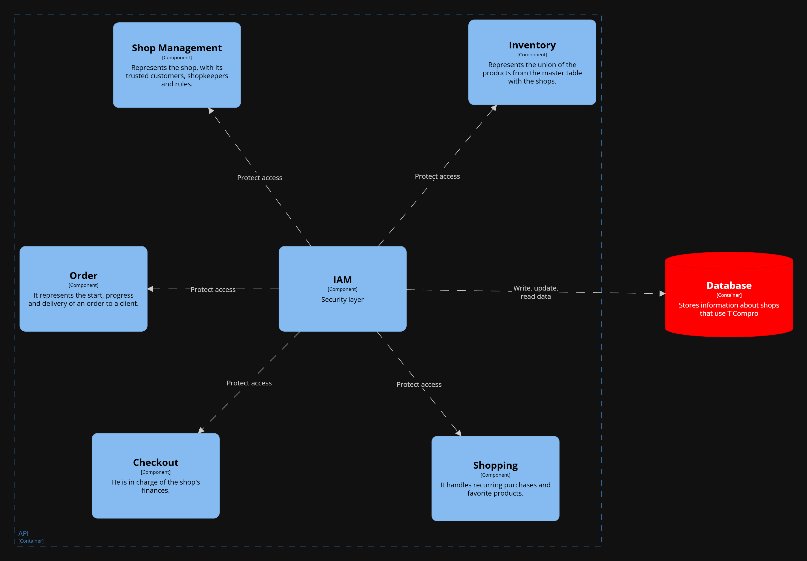

#### Bounded Context Software Architecture Code Level Diagrams

<h5 id="iam-class-diagrams">Bounded Context Domain Layer Class Diagrams</h5>

Las principales clases dentro de este contexto son User y Profile. User se encarga del manejo de las credenciales del usuario y su rol dentro de la aplicación. Profile se encarga de los datos personales, su relación con User es uno a uno. Es a través del SignUp que se crea tanto el User como el Profile.

<h5 id="iam-database-diagram">Bounded Context Database Design Diagram</h5>

IAM cuenta con un diagrama de base de datos sencillo, unicamente conformado por User y Profile. User cuenta con las credenciales de acceso, rol y la llave foranea hacia Profile. Profile cuenta con datos básicos de la persona.

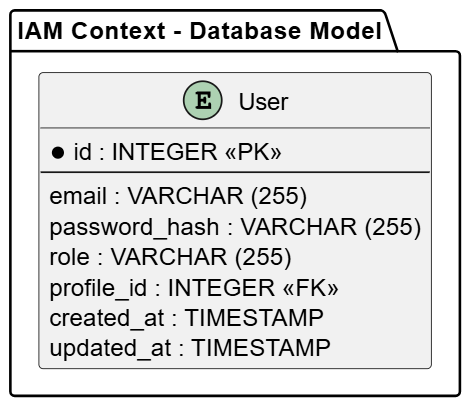

# Capítulo III: Solution UI/UX Design

## Product design

### Style Guidelines

#### General Style Guidelines

Se presenta a continuación las distintas decisiones de diseño a nivel general, con su debida justificación, para la identidad de marca alineada propiamente con la visión estratégica planteada en capítulos anteriores.

**BRANDING IDENTITY**

Uno de los puntos claves identificados en el benchmarking es la localización e idoneidad. Muchas soluciones que buscan resolver el mismo desafío de negocio apuntan exclusivamente a grandes organizaciones. Además, todas ellas son provenientes del extranjero.

Esta brecha es justo lo que nuestra start up pretende aprovechar: tomar los negocios pequeños del país como público objetivo, generando una marca y producto idóneos como valor diferenciado.

Se incluyen además, estrategias de comunicación que atacan directamente dificultades que hemos podido identificar en otras soluciones, como la barrera tecnológica, cultural, económica y, sobre todo, coorporativa, reemplazando la frialdad coorporativa por la familiaridad de lo cotidiano.

**FONTS**

En línea con lo anterior, mediante las fuentes elegidas se busca capturar tanto el lado peruano. Esto se logra mediante una fuente cursiva que imita el estilo de carteles presentes en la cultura popular: restaurantes, anuncios de bandas locales de música y otros productos ya familiares al público en general como Yape.

**COLORS**

A modo de complemento, se escoge un sistema de colores sencillo. La paleta, compuesta principalmente por colores neutros como blanco y negro, inspira calidad y profesionalismo, además de permitir a otros colores como aquellos provenientes de ilustraciones convivir con el sistema y resaltar por encima del resto de contenido.

Se emplea además, el color naranja como color para resaltado, favoreciendo los colores neutros e imponiéndose naturalmente sobre estos.

### Information Architecture

#### Organization Systems

Se explican brevemente las decisiones de sistemas de organización para el contenido, según el producto o artefacto.

- **Organización Secuencial (Landing Page)**: Se utiliza para presentar la información de forma **paso a paso (step-by-step to accomplish)**, describiendo el flujo de tareas o *features* más comunes que los usuarios realizan con la aplicación.
- **Jerarquía Visual (Landing Page & Aplicación)**: Se aplica mediante una jerarquía visual vertical, usando diferencias en el **tamaño de fuente** y el **peso de la fuente** para indicar la importancia relativa del contenido y guiar la vista del usuario.
- **Organización Matricial (Aplicación Móvil)**: Se utiliza en el diseño de las *cards* dentro de la aplicación, distribuyendo los detalles de elementos clave (productos, pedidos, clientes) de forma vertical para crear una jerarquía clara dentro del espacio limitado de cada *card*.

- **Esquema por Tópicos / Categorías (Aplicación Móvil)**: Es el esquema principal de categorización del contenido. La información se agrupa lógicamente según su función o relación en la aplicación:
    - **Políticas de Tienda**: Agrupa a **Staff / Personal** y **Trusted Customers / Confiables**.
    - **Productos**: Agrupa el **Inventory / Inventario** y el **Catalog / Catálogo**.
    - **Pedidos**: Agrupa los pedidos **Incoming / Entrantes** y **Accepted / Aceptados**.

- **Esquema según Audiencia (Aplicación Móvil)**: Se aplica al diferenciar y organizar el contenido de forma distinta para los **grupos de usuarios** específicos de la aplicación: **Clientes** y **Bodegas**.

#### Labelling Systems

Se presentan a continuación, parte de los labels utilizados para facilitar el entendimiento de conceptos o ideas de forma no ambigua, rápida e intuitiva para el usuario. Se destaca la fuerte relación entre los labels y el lenguaje ubicuo en los negocios retail minoristas.

- **Orders / Pedidos (Clientes)**: Es la sección donde los clientes pueden revisar el estado de sus pedidos actuales y el historial de compras que han realizado.
- **Orders / Pedidos (Tiendas)**: Sección para que los dueños de las bodegas y su personal puedan gestionar todos los pedidos entrantes, en preparación y completados.
- Incoming / entrantes: Pedidos que buscan ser atendidos en la tienda, pendiente de aprobación
- **Incoming / Entrantes**: Pedidos que buscan ser atendidos en la tienda, pendiente de aprobación por el dueño o personal de la bodega.
- **Accepted / Aceptado**: Pedido que ha sido revisado y aprobado por la tienda, y que está pasando a la etapa de preparación.
- **Rejected / Rechazado**: Pedido que la tienda decidió no atender, generalmente por falta de stock o problemas de logística.
- **Canceled / Cancelado**: Pedido que fue anulado, ya sea por el cliente o por la tienda, antes de ser entregado o despachado.
- **Ready / Listo**: Estado final para los pedidos que son para recojo en tienda, indicando que están completos y listos para ser retirados.
- **Dispatched / Despachado**: Estado para los pedidos con entrega a domicilio **Delivery**, indicando que el pedido ha salido de la tienda y está en ruta.
- **Picked up / Recogido**: Estado final para los pedidos de recojo en tienda, indicando que el cliente ya retiró su compra.
- **Delivered / Entregado**: Estado final para los pedidos con entrega a domicilio **Delivery**, confirmando que el cliente ha recibido su compra.
- **Delivery / Entrega a domicilio**: Método de entrega donde el pedido es llevado directamente a la dirección del cliente.
- **In-store Pick-up / Recojo en tienda**: Método de entrega donde el cliente se encarga de retirar el pedido directamente en la ubicación de la bodega.
- **Cash / Efectivo**: Método de pago que implica una transacción física de dinero al momento de la entrega o recojo.
- **Virtual / Virtual**: Método de pago que incluye transacciones electrónicas como tarjetas, billeteras digitales o transferencias.
- **On Credit / Fiado**: Método de pago que permite al cliente diferir el monto de la compra, accesible solo a clientes previamente registrados como **Confiables**.
- **Products**: Presenta los productos frecuentes de encontrar en circulación a nivel nacional.
- **Settings**: Permite al cliente gestionar sus preferencias de cuenta.
- **Inventory**: Listado de los productos específicos disponibles en la tienda o bodega. Aquí el dueño o personal gestiona las cantidades, precios y disponibilidad de los artículos que tienen físicamente para la venta.
- **Catalog**: Base de datos con los productos en general, en circulación a nivel nacional, que los dueños de las bodegas pueden buscar y añadir a su **Inventory** para ofrecerlos a sus clientes.
- **My Shop / Mi bodega**: Panel de administración principal donde el dueño puede ver estadísticas clave, resumen de ventas y la información general de su negocio.
- **Staff / Personal**: Herramienta para gestionar a los tenderos que trabajan en la bodega del dueño, incluyendo la asignación de roles y permisos.
- **Trusted Customers / Confiables**: Lista de los clientes que pueden acceder al método de pago fiado, pues son de confianza del dueño del negocio.
- **Finances**: Módulo para llevar el registro de ingresos, gastos, deudas (fiados) y la información financiera general de la bodega.

#### SEO Tags and Meta Tags Documentation

Se documentan las decisiones específicas para aumentar la efectividad del alcance del producto. Se detallan los valores usados según el idioma, dado el alcance con internacionalización para español e inglés.

**Landing Page Clientes (T'Compro Customer Version)**

| Elemento SEO | Valor Asignado (Inglés) | Valor Asignado (Español) |
| :--- | :--- | :--- |
| **Title** | T'Compro: Your Shop of Always, One Click Away in Peru | T'Compro: Tu Bodega de Siempre, a un Clic de Distancia en Perú |
| **Meta Description** | Buy groceries, food, and essentials from your trusted local shop. Fast delivery or in-store pick-up. Access On Credit / Fiado for Trusted Customers. | Compra víveres, abarrotes y esenciales de tu bodega local de confianza. Delivery rápido o recojo en tienda. Accede al Fiado para Clientes Confiables. |
| **Meta Keywords** | local shop, bodega delivery, grocery app, Peru, fiado, in-store pick-up, Trusted Customers, orders | bodega local, delivery, app de víveres, Perú, fiado, recojo en tienda, clientes confiables, pedidos |
| **Meta Author** | T'Compro Team | T'Compro Team |

**Landing Page Dueños (T'Compro Shop Owner Version)**

| Elemento SEO | Valor Asignado (Inglés) | Valor Asignado (Español) |
| :--- | :--- | :--- |
| **Title** | T'Compro Business: Your Business, Your Rules - Custom System for Peruvian Shops | T'Compro Dueños: Tu Negocio, Tus Reglas - Sistema Personalizado para Bodegas Peruanas |
| **Meta Description** | Digitalize your bodega. Manage Inventory, Staff, Finances, and Orders. Increase sales and control On Credit / Fiado for Trusted Customers. | Digitaliza tu bodega. Gestiona Inventario, Personal, Finanzas y Pedidos. Aumenta ventas y controla el Fiado para Clientes Confiables. |
| **Meta Keywords** | shop management, inventory app, staff management, business finances, Peru, fiado control, incoming orders | gestión de bodega, app de inventario, gestión de personal, finanzas de negocio, Perú, control de fiado, pedidos entrantes |
| **Meta Author** | T'Compro Team | T'Compro Team |

**ASO Elements Documentation (App Store Optimization)**

**T'Compro Clientes (iOS and Android)**

| Elemento ASO | Valor Asignado (Inglés) | Valor Asignado (Español) |
| :--- | :--- | :--- |
| **App Title** | T'Compro Clientes: Local Shop Delivery & Credit | T'Compro Clientes: Delivery y Crédito de Bodegas Locales |
| **App Subtitle (iOS/Android)** | Order groceries with delivery or pick-up. Pay cash, virtual, or on credit. | Pide víveres con delivery o recojo. Paga efectivo, virtual o a fiado. |
| **App Keywords** | bodega, delivery, metamercado, groceries, fiado, in-store pick-up, trusted customers, orders | bodega, delivery, metamercado, víveres, fiado, recojo en tienda, clientes confiables, pedidos |
| **App Description** | T'Compro Clientes makes your shop just one click away. Manage your Orders, select Delivery or In-store Pick-up, and use On Credit / Fiado if you are a Trusted Customer. Check product Catalog and make easy Cash or Virtual payments. | T'Compro Clientes pone tu bodega a un solo clic. Gestiona tus Pedidos, selecciona Delivery o Recojo en Tienda y usa On Credit / Fiado si eres un Cliente Confiable. Revisa el Catálogo y haz pagos Efectivo o Virtual. |

**T'Compro Bodegas (Android Only)**

| Elemento ASO | Valor Asignado (Inglés) | Valor Asignado (Español) |
| :--- | :--- | :--- |
| **App Title** | T'Compro Bodegas: Store Management & Sales | T'Compro Bodegas: Gestión y Ventas para Tiendas |
| **App Subtitle (Android)** | Manage Inventory, Staff, Finances, and Orders with a custom system. | Gestiona Inventario, Personal, Finanzas y Pedidos con un sistema personalizado. |
| **App Keywords** | store management, inventory, staff, finances, POS, fiado control, orders, catalog | gestión de tienda, inventario, personal, finanzas, punto de venta, control fiado, pedidos, catálogo |
| **App Description** | T'Compro Bodegas is the comprehensive tool for your store. Manage your Inventory and Catalog, track Finances, and supervise Staff / Personal. Easily receive Incoming / Entrantes orders, mark them Accepted, and manage your Trusted Customers and On Credit / Fiado balances. | T'Compro Bodegas es la herramienta integral para tu tienda. Administra Inventario y Catálogo, rastrea Finanzas, y supervisa Staff / Personal. Recibe Pedidos Entrantes fácilmente, márcalos como Aceptados y gestiona tus Clientes Confiables y saldos de Fiado. |

#### Searching Systems

Se explican los sistemas de busqueda y filtrado, según aplicación. 

**Aplicación T'Compro Clientes**
- **Medios de Ayuda para la Búsqueda:** La aplicación proporciona una barra de búsqueda principal para consultar la disponibilidad de productos en el **Inventory** de la bodega seleccionada o en el **Catalog** general.
- **Filtros Disponibles (Productos):**
    - Búsqueda por **Categoría**: Permite al cliente filtrar los productos según tipos lógicos (ej: lácteos, limpieza, bebidas).
    - Búsqueda por **Nombre**: Permite la coincidencia parcial o exacta con el nombre del producto.
- **Visualización de Resultados:** Los resultados se presentan en una cuadrícula vertical de *cards* de productos, mostrando nombre, precio, stock y una imagen.

**Aplicación T'Compro Bodegas**
- **Medios de Ayuda para la Búsqueda:** La aplicación integra sistemas de búsqueda para la gestión de productos y personal, así como para clientes.
- **Filtros Disponibles (Productos en Inventory/Catalog):**
    - Búsqueda por **Categoría**: Filtra los productos que el dueño busca añadir o gestionar en su **Inventory**.
    - Búsqueda por **Nombre**: Permite una búsqueda rápida para gestión de stock o registro.
- **Filtros Disponibles (Staff/Confiables):**
    - Búsqueda por **Nombre** o **Apellido**: Permite a los dueños encontrar rápidamente a sus empleados (**Staff / Personal**) o clientes de **Fiado** (**Trusted Customers / Confiables**).
- **Visualización de Resultados:**
    - **Productos:** Se muestran en listas o cuadrículas.
    - **Staff y Clientes Confiables:** Se presentan en listas con sus detalles clave (nombre, rol, saldo de **Fiado** pendiente, etc.) organizados en *cards* con jerarquía vertical.

    

#### Navigation Systems

**Landing Page Clientes y Dueños**

- **Navegación Secuencial (Vertical)**: El contenido está diseñado para ser recorrido de forma vertical. Los usuarios se guían mediante *scroll* a través de las secciones que describen los beneficios y características de la aplicación.
- **Navegación Global (Encabezado)**: Ambas páginas tienen un menú de encabezado que permite a los usuarios saltar directamente a secciones clave (funcionalidades, testimonios, contacto), asegurando un acceso rápido a la información principal.
- **Llamadas a la Acción (CTAs)**: Los botones grandes y prominentes dirigen a los usuarios hacia el objetivo final: la descarga de la aplicación móvil (a través de los iconos de App Store/Google Play) o el cambio de versión (ej. "Go to the customer version").

**Aplicación T'Compro Clientes**

- **Navegación Basada en Tareas (Pestañas/Menú Inferior)**: La navegación principal está organizada en torno a las metas del usuario (comprar, revisar pedidos, acceder a su perfil). Esto se implementa a través de un menú inferior o pestañas persistentes que incluyen las secciones principales como **Products**, **Orders / Pedidos**, y **Settings**.
- **Navegación Contextual (Exploración)**: Los usuarios recorren el contenido de productos principalmente a través de la exploración guiada por **Categorías** y la función de **Searching Systems** (por nombre o categoría).
- **Flujo de Checkout (Secuencial)**: El proceso de compra es una navegación guiada y **secuencial** que obliga al usuario a pasar por una serie de pasos definidos (selección de productos, elección de **Delivery** / **In-store Pick-up**, selección de método de pago: **Cash**, **Virtual** o **On Credit / Fiado**) para completar la tarea de crear un pedido.

**Aplicación T'Compro Bodegas**

- **Navegación por Grupos Funcionales (Menú Lateral o Dashboard)**: La navegación está organizada para la gestión administrativa. El punto de partida es el **My Shop / Mi bodega** Dashboard, desde donde el dueño puede acceder a grupos funcionales principales:
    - **Pedidos** (**Incoming / Entrantes**, **Accepted / Aceptado**).
    - **Productos** (**Inventory**, **Catalog**).
    - **Administración** (**Staff / Personal**, **Trusted Customers / Confiables**, **Finances**).
- **Navegación Transaccional (Cards y Listas)**: Dentro de cada grupo funcional, los usuarios interactúan con listas de elementos (pedidos, productos, empleados) que están contenidos en *cards*. La acción de *tapping* en una *card* navega al usuario a la vista de detalle del elemento específico, donde puede realizar acciones o transiciones de estado (ej. cambiar un pedido de **Incoming** a **Accepted**).
- **Flujo de Gestión (Jerárquico)**: La gestión de datos es jerárquica: el dueño navega de la lista general (**Staff**) al detalle individual del empleado, y luego a sub-acciones dentro de esa vista (ej. cambiar permisos).

### Landing Page UI Design

#### Landing Page Wireframe

Se presenta el diseño a bajo nivel de fidelidad de la landing page del producto, tanto en su versión mobile como desktop. Se muestra una jerarquía de contenido, denotada principalmente por el tamaño y peso de fuentes.

El diseño consiste de varias secciones que se consideran ayudan al fin estratégico de inspirar confianza en los consumidores.

**NOTA:** Para evitar redundancias, se muestran las secciones de forma única a pesar de existir dos versiones distintas de landing page para cada segmento objetivo.

**DESKTOP VERSION**

***MAIN***

Sección con un hero section y un call to action hacia la descarga de forma inmediata. La sección tendrá una imagen de fondo que dé énfasis al texto y acompañe en función del segmento objetivo.

***FEATURES***

Sección features que muestra en 3 simples pasos el funcionamiento de la app, resaltando con imágenes los pasos del flujo principal de cada segmento.

***TESTIMONIOS***

Sección que muestra experiencias y comentarios de otros usuarios previos de la solución, mostrando la recepción del producto para generar confianza.

***PLANES***

Sección exclusiva para la versión del segmento dueños y tenderos: muestra planes de suscripción que incluirán la afiliación básica y la premium, con un breve resumen listado de features proporcionados por cada una.

***CONTACTO***

Sección que permite a los usuarios de todos los segmentos comunicarse con nosotros, soicitando información adicional o realizando consultas.

***FOOTER***

Sección al pie de página que proporciona acceso rápido a links de interés general.

**MOBILE VERSION**

***MAIN***

Sección principal (hero section) con un call to action hacia la descarga inmediata. En la versión móvil, el texto debe ser Conciso y las proporciones de los elementos ajustadas para la pantalla vertical. La imagen de fondo estará optimizada para mantener el énfasis visual sin sobrecargar el diseño.

***FEATURES***

Sección de características que muestra el funcionamiento de la app en 3 simples pasos. En móvil, las imágenes y el texto de cada paso se orientarán verticalmente (uno debajo del otro) para un mejor desplazamiento y legibilidad.

***TESTIMONIOS***

Sección que muestra experiencias y comentarios de otros usuarios. El cambio clave en móvil es la orientación de los elementos, pasando de un diseño horizontal a un apilamiento vertical de los testimonios para facilitar la lectura y el scroll.

***PLANES***

Sección de planes de suscripción para dueños y tenderos. Las tarjetas de plan (Básico y Premium) se reajustarán para ocupar todo el ancho disponible y se mostrarán una debajo de la otra en lugar de lado a lado. Los textos serán ajustados para una visualización óptima.

***CONTACTO***

Sección para que los usuarios soliciten información adicional. El formulario de contacto se adaptará al ancho completo de la pantalla, con los campos apilados verticalmente y los botones ajustados al tamaño del dedo para una mejor usabilidad táctil. Se elimina la imagen de acompañamiento del formulario para evitar opacar el formulario de alguna manera.

***FOOTER***

Sección al pie de página. Los enlaces de interés general se reorganizarán en un formato vertical compacto para minimizar el espacio vertical ocupado (como meta personal, se limita a 100vh del dispositivo).

#### Landing Page Mock-up

Se presenta el diseño a alto nivel de detalle de la landing page, considerando dos versiones para segmentos objetivo agrupados según sus user goals y flujos comunes. Los grupos propuestos consisten de clientes y tiendas (tenderos y tiendas).

**DESKTOP VERSION**

***CLIENTES***

***MAIN***

***FEATURES***

***TESTIMONIOS***

***CONTACTO***

***FOOTER***

***TIENDAS***

***MAIN***

***FEATURES***

***TESTIMONIOS***

***PLANES***

***CONTACTO***

***FOOTER***

**MOBILE VERSION**

***CLIENTES***

***MAIN***

***FEATURES***

***TESTIMONIOS***

***CONTACTO***

***FOOTER***

***TIENDAS***

***MAIN***

***FEATURES***

***TESTIMONIOS***

***PLANES***

***CONTACTO***

***FOOTER***

### Mobile Applications UX/UI Design

#### Mobile Applications Wireframes

Se presenta el diseño a bajo nivel de fidelidad de la mobile app del producto. Se muestra una jerarquía de contenido, denotada principalmente por el tamaño y peso de fuentes.

El diseño consiste de varias secciones que se consideran ayudan al fin estratégico de inspirar confianza en los usuarios.

***INVENTORY***

Sección de inventario a la que acccederán los usuarios trabajadores de tienda.

***ORDERS***

Sección para ver y atender ordenes puestas por clientes.

***MYSHOP***

Sección para ver empleados y demás cosas relacionadas con el establecimiento.

#### Mobile Applications Wireflow Diagrams

| User Persona: Tendero. |
|----------------------------------|
| User Goal: Como tendero quiero visualizar los pedidos que llegan a la bodega para organizar correctamente mi tiempo. |
|  |

| User Persona: Tendero. |
|----------------------------------|
| User Goal: Como tendero quiero aceptar un pedido de la bodega para realizar la venta. |
|  |

| User Persona: Tendero. |
|----------------------------------|
| User Goal: Como tendero quiero rechazar un pedido de la bodega para indicar que no puedo atenderlo. |
|  |

| User Persona: Tendero. |
|----------------------------------|
| User Goal: Como tendero quiero marcar un pedido como listo para que mi cliente sepa que puede pasar por él o que está en camino. |
|  |

| User Persona: Dueño. |
|----------------------------------|
| User Goal: Como dueño quiero eliminar productos de mi inventario para evitar que mis clientes hagan pedidos de productos que no tengo disponibles. |
|  |

| User Persona: Dueño. |
|----------------------------------|
| User Goal: Como dueño quiero agregar precios personalizados a los productos que ofrezco en mi bodega para que los clientes me compren más. |
|  |

| User Persona: Dueño. |
|----------------------------------|
| User Goal: Como dueño de bodega quiero añadir tenderos para gestionar correctamente a mis trabajadores. |
|  |

#### Mobile Applications Mock-ups

Se presenta el diseño a alto nivel de detalle de la mobile aplication, considerando una versión para el segmento objetivo de tiendas (tenderos y tiendas).

***INVENTORY***

Sección de inventario a la que acccederán los usuarios trabajadores de tienda.

***ORDERS***

Sección para ver y atender ordenes puestas por clientes.

***MYSHOP***

Sección para ver empleados y demás cosas relacionadas con el establecimiento.

#### Mobile Applications User Flow Diagrams

| User Persona: Tendero. |
|----------------------------------|
| User Goal: Como tendero quiero poder aceptar o rechazar un pedido en la aplicación. | 
| Descripción: El tendero recibe una notificación de nuevo pedido y puede decidir aceptarlo para iniciar la venta o rechazarlo si no puede atenderlo. El flujo muestra ambas rutas: la confirmación del pedido aceptado y la cancelación del pedido.|
|  |

| User Persona: Dueño. |
|----------------------------------|
| User Goal: Como dueño quiero agregar productos a mi inventario. |
| Descripción: El dueño accede a la sección de inventario para añadir un nuevo producto, completando información como nombre, precio e imagen. Si los datos son válidos, el producto se agrega exitosamente; si falta información tiene que repetir el proceso.|
|  |

| User Persona: Dueño. |
|----------------------------------|
| User Goal: Como dueño quiero agregar precios personalizados a los productos que ofrezco en mi bodega para que los clientes me compren más. |
| Descripción: El dueño ingresa al inventario y selecciona un producto existente para editar su precio. Si establece un nuevo valor y lo guarda correctamente, el cambio se aplica y el producto se actualiza en la lista.|
|  |

| User Persona: Dueño. |
|----------------------------------|
| User Goal: Como dueño quiero agregar productos a mi catalogo. |
| Descripción: El dueño accede a la sección de catálogo y selecciona la opción para añadir un nuevo producto. Completa los campos requeridos, como nombre, precio e imagen. Si los datos son correctos, el producto se agrega exitosamente al catálogo.|
|  |

| User Persona: Dueño. |
|----------------------------------|
| User Goal: Como dueño de bodega quiero gestionar correctamente a mis trabajadores.|
| Descripción: El dueño de bodega accede al módulo de gestión de trabajadores y selecciona la opción para añadir un nuevo empleado. Puede hacerlo escaneando un código QR o ingresando manualmente el ID del trabajador. El sistema valida que el código o ID sea correcto y, si la verificación es exitosa, el trabajador se añade a la lista del personal. Si el código no es válido, tiene que volver a ingresar el código.|
|  |

| User Persona: Dueño. |
|----------------------------------|
| User Goal: Como dueño de bodega quiero gestionar correctamente a mis clientes conocidos. |
| Descripción: El dueño de bodega ingresa al módulo de gestión de clientes conocidos y selecciona la opción para añadir un nuevo cliente. Puede hacerlo escaneando un código QR o ingresando manualmente su ID. El sistema valida la información y, si el código es correcto, el cliente se agrega a la lista. Si el código no es válido, tiene que volver a ingresar el código.|
|  |

#### Mobile Applications Prototyping

**SPRINT 1**

En este primer sprint, se desarrollaron principalmente las funcionalidades core de la aplicación front end para los segmentos de Dueño y Tendero, abarcando flujos de atención de pedidos, gestión de inventario, ofertas y reglas de negocio.

Video de exploración de prototipo (T'Compro - Bodegas): [Link](https://upcedupe-my.sharepoint.com/personal/u20221e247_upc_edu_pe/_layouts/15/stream.aspx?id=%2Fpersonal%2Fu20221e247%5Fupc%5Fedu%5Fpe%2FDocuments%2Fupc%2Dpre%2D202502%2D1acc238%2D1807%2Dsoulware%2Dprototype%2Dnavigation%2Dsprint%2D1%2Emp4&nav=eyJyZWZlcnJhbEluZm8iOnsicmVmZXJyYWxBcHAiOiJTdHJlYW1XZWJBcHAiLCJyZWZlcnJhbFZpZXciOiJTaGFyZURpYWxvZy1MaW5rIiwicmVmZXJyYWxBcHBQbGF0Zm9ybSI6IldlYiIsInJlZmVycmFsTW9kZSI6InZpZXcifX0&ga=1&referrer=StreamWebApp%2EWeb&referrerScenario=AddressBarCopied%2Eview%2Eef89ba4d%2D164c%2D42a3%2Da658%2D8806a8cad528)

# Capítulo IV: Product Implementation & Validation

## Software Configuration Management

### Software Development Environment Configuration

Soulware ha adoptado una serie de herramientas para el diseño, desarrollo y despliegue de T'Compro. A continuación, la tabla con las herramientas utilizadas por el equipo de desarrollo:

<table>
    <thead>
        <tr>
            <th>Nombre</th>
            <th>Propósito de uso en el proyecto</th>
            <th>Enlace de referencia / descarga</th>
        </tr>
    </thead>
    <tbody>
        <tr>
            <td>UXPressia</td>
            <td><strong>UX/UI Design:</strong> Artefactos de UX</td>
            <td><a href="https://uxpressia.com/" target="_blank">UXPressia Web Application</a></td>
        </tr>
        <tr>
            <td>Miro</td>
            <td><strong>UX/UI Design:</strong> As-Is & To-Be Scenario Mapping</td>
            <td><a href="https://miro.com/es/app/" target="_blank">Descargar Miro</a></td>
        </tr>
        <tr>
            <td>Figma</td>
            <td><strong>UX/UI Design:</strong> Wireframes, Mockups & Prototyping</td>
            <td><a href="https://www.figma.com/es-la/downloads/" target="_blank">Descargar Figma</a></td>
        </tr>
        <tr>
            <td>PlantUML</td>
            <td><strong>Software Architecture Design:</strong> UML y C4 Model</td>
            <td><a href="https://plantuml.com/es/" target="_blank">PlantUML Web</a></td>
        </tr>
        <tr>
            <td>VSCode</td>
            <td><strong>IDE:</strong> Editor de código ligero y versátil para múltiples lenguajes</td>
            <td><a href="https://code.visualstudio.com/" target="_blank">Descargar VSCode</a></td>
        </tr>
        <tr>
            <td>IntelliJ IDEA</td>
            <td><strong>IDE:</strong> Desarrollo en Java y tecnologías enterprise</td>
            <td><a href="https://www.jetbrains.com/idea/" target="_blank">IntelliJ IDEA Web</a></td>
        </tr>
        <tr>
            <td>Java</td>
            <td><strong>Lenguaje de Programación:</strong> Backend robusto y multiplataforma</td>
            <td><a href="https://www.oracle.com/java/technologies/javase-downloads.html" target="_blank">Descargar Java</a></td>
        </tr>
        <tr>
            <td>Spring Boot</td>
            <td><strong>Proyecto del Framework Spring:</strong> Desarrollo de APIs RESTful y aplicaciones backend en Java con configuración mínima</td>
            <td><a href="https://spring.io/projects/spring-boot" target="_blank">Spring Boot Web</a></td>
        </tr>
        <tr>
            <td>Angular</td>
            <td><strong>Framework:</strong> Desarrollo de aplicaciones web SPA con TypeScript</td>
            <td><a href="https://angular.io/" target="_blank">Angular Web</a></td>
        </tr>
        <tr>
            <td>Android Studio</td>
            <td><strong>Proyecto de aplicación movil:</strong> Desarrollo movil con Kotlin</td>
            <td><a href="https://developer.android.com/studio?hl=es-419" target="_blank">Android Studio</a></td>
        </tr>
    </tbody>
</table>

### Source Code Management

En Soulware, la gestión del código fuente de las soluciones se realiza a través de Git como sistema de control de versiones y Github, como repositorio de alojamiento descentralizado. 

Se ajunta a continuación los enlaces de los repositorios de GitHub:

- Landing Page: [https://github.com/Soulware-Apps-Moviles/Landing.git](https://github.com/Soulware-Apps-Moviles/Landing.git)
- Mobile app Kotlin: [https://github.com/Soulware-Apps-Moviles/kotlin-app.git](https://github.com/Soulware-Apps-Moviles/kotlin-app.git)
- RESTful API: [https://github.com/Soulware-Apps-Moviles/tcompro.git](https://github.com/Soulware-Apps-Moviles/tcompro.git)

Para su gestión interna, se aplicará GitFlow. Se explican a continuación las ramas a crear, así como las convenciones a utilizar para nombrarlas:

**RAMAS PRINCIPALES**

- **main**: Rama principal de producción. Aquí se encuentran las versiones estables del proyecto, listas para ser desplegadas. Toda publicación oficial se hace desde esta rama.

- **develop**: Rama de desarrollo. Aquí se integran las nuevas funcionalidades antes de ser lanzadas a producción. Es la base para las ramas de tipo *feature*, *release* y *bugfix*.

**RAMAS SECUNDARIAS**

- **feature/**: Ramas para el desarrollo de nuevas funcionalidades. Se crean a partir de `develop` y, una vez completadas, se integran de nuevo en `develop`.
  - **Convención de nombres**:  
    `feature/epic-id`  
    Ejemplo: `feature/ep10`

- **bugfix/**: Ramas para la correción de errores detectados en fase de desarrollo. Se crean a partir de `develop` y, una vez completadas, se integran de nuevo en `develop`.
  - **Convención de nombres**:  
    `bugfix/story-id`  
    Ejemplo: `feature/us77`

- **release/**: Ramas para preparar una nueva versión de producción. Se crean desde `develop` cuando ya se ha alcanzado un conjunto estable de funcionalidades. Sirven para realizar pruebas, ajustes menores y documentación. Al finalizar, se integran en `main` y `develop`.
  - **Convención de nombres**:  
    `release/x.y.z`  
    Ejemplo: `release/1.0.0`

- **hotfix/**: Ramas para corregir errores críticos detectados tardíamente en producción. Se crean desde `main` y se integran tanto en `main` como en `develop` (o en `release`, si hubiere alguna rama de ese tipo activa).
  - **Convención de nombres**:  
    `hotfix/story-id`  
    Ejemplo: `hotfix/swr35`

### Source Code Style Guide & Conventions

Para el desarrollo de la solución, se utlizarán los siguientes lenguajes de programación:
- TypeScript  
- Java
- Kotlin

**CONVENCIONES GENERALES**
Para todos los lenguajes de programación y marcado mencionados:
- Se aplicará el uso de nomenclaturas en inglés.
- Se nombraran variables, constantes, elementos y clases de forma explícita.
- Se usará saltos de linea vacíos para separar unidades lógicas diferentes del código.
- Se promoverá la reutilización de código.

**CONVECIONES ESPECÍFICAS**

A continuación, se describen las convenciones principales a aplicar por lenguaje:

**TypeScript:** Se adoptarán las recomendaciones del Google JavaScript Style Guide y el Google TypeScript Style Guide.
- Usar `camelCase` para variables y funciones.
- Usar `PascalCase` para clases y componentes.
- Definir constantes en `UPPER_SNAKE_CASE`.
- Evitar el uso de `var`, preferir `let` y `const`.
- Usar funciones flecha (`=>`) siempre que sea posible.
- Documentar funciones y clases con comentarios JSDoc.
- Diseñar y codificar orientados al desacoplamiento.
- Aplicar tipado estricto (para typescript).

**Java:** Seguir el Google Java Style Guide.
- Usar `camelCase` para métodos y variables.
- Usar `PascalCase` para clases e interfaces.
- Agrupar paquetes de forma coherente y ordenada (`com.empresa.proyecto.modulo`).
- Usar anotaciones correctamente (`@Override`, `@Autowired`, etc.).
- Seguir prácticas de desarrollo recomendadas por **Spring Boot** como la inyección de dependencias, uso de DTOs, controladores REST, etc.

**Kotlin:**
- Se seguirán las recomendaciones del Kotlin Coding Conventions de JetBrains y las guías - oficiales de Jetpack Compose de Google.
- Usar `camelCase` para variables y funciones, y `PascalCase` para clases y composables.
- Definir constantes en `UPPER_SNAKE_CASE` dentro de objetos o companion object.
- Preferir val sobre var para fomentar la inmutabilidad.
- Mantener las funciones `@Composable puras`, sin lógica de negocio ni efectos secundarios.
- La lógica de estado debe vivir en el `ViewModel`, no dentro de los composables.
- Usar State Hoisting: el estado se eleva al nivel más alto que lo necesite.
- Colocar modifier: Modifier = Modifier siempre al final de los parámetros de un composable.
- Evitar anidaciones profundas; extraer subcomponentes reutilizables.
- Documentar composables y clases con comentarios KDoc (/** ... */).

### Software Deployment Configuration

**LANDING PAGE DEPLOYMENT**

**KOTLIN MOBILE APP**

**API**
Para el despliegue del backend de T'Compro se utilizo una maquina virtual Azure, configurando 

1. Entrar a Azure e ir a Maquinas virtuales

2. Seleccionamos la opción de crear una nueva maquina virtual

3. Configurar la maquina virtual dentro del grupo de recursos de Soulware. El sistema operativo es Ubuntu 24.04, abriento los puertos 80, 443, 22 para las conexiones externas. Posterior a las configuraciones, creamos la maquina virtual.

4. Cuando el despliegue de la maquina virtual termine, nos dirigimos a sus configuraciones de red. Dentro cambiamos a una network interface que soporte IPv6.

5. Posterior a ello, con la clave privada SSH que se genero al crear la maquina virtual, ingresamos a ella a través del CMD.

6. Dentro de la maquina virtual, ejecutamos comandos para instalar y actualizar paquetes del sistema operativo. Instalamos Java 17, Maven, Git y habilitamos el firewall para que permita la entrada en el puerto 8080.

7. Clonamos el repositorio dentro de la maquina virtual y definimos las variables de entorno para la ejecución del backend.

8. Corremos la aplicación en segundo plano y verificamos mediante logs que se encuentre operativo.

9. Verificamos la disponibilidad del servicio a través de una computadora local.

## Landing Page & Mobile Application Implementation

### Sprint 1

#### Sprint Planning 1

<table cellpadding="6" cellspacing="0" style="border-collapse: collapse; width: 100%;">
  <tr>
    <th colspan="2"><strong>Sprint #</strong></th>
    <td colspan="2">Sprint 1</td>
  </tr>
  <tr>
    <th colspan="4" style="background-color: #d9d9d9;"><strong>Sprint Planning Background</strong></th>
  </tr>
  <tr>
    <th style="width: 20%;">Date</th>
    <td colspan="3">2025-09-25</td>
  </tr>
  <tr>
    <th>Time</th>
    <td colspan="3">08:00 PM</td>
  </tr>
  <tr>
    <th>Location</th>
    <td colspan="3">Mediante una videollamada en Discord.</td>
  </tr>
  <tr>
    <th>Prepared By</th>
    <td colspan="3">Orozco Torres, Álvaro Joaquín</td>
  </tr>
  <tr>
    <th>Attendees (to planning meeting)</th>
    <td colspan="3">Reaño Delgadillo, Henry Paolo</td>
  </tr>
  <tr>
    <th>Sprint 0 Review Summary</th>
    <td colspan="3">No hubo Sprint anterior (este es el primer sprint)</td>
  </tr>
  <tr>
    <th>Sprint 0 Retrospective Summary</th>
    <td colspan="3">No hubo Sprint anterior (este es el primer sprint)</td>
  </tr>
  <tr>
    <th colspan="4" style="background-color: #d9d9d9;"><strong>Sprint Goal & User Stories</strong></th>
  </tr>
  <tr>
    <th>Sprint 1 Goal</th>
    <td colspan="3">Nuestro foco está en dar visibilidad al producto, sus principales caracterísiticas y beneficios a nuestros usuarios. Creemos que expande nuestro alcance comercial y genera confianza e interés por parte de nuestros usuarios. Esto será confirmado cuando los usuarios comiencen a contactarnos mediante el envío del formulario en la landing page.</td>
  </tr>
  <tr>
    <th>Sprint 1 Velocity</th>
    <td colspan="3"> 15 User stories con un estimado de 23 Story Points</td>
  </tr>
  <tr>
    <th>Sum of Story Points</th>
    <td colspan="3">23 Story Points</td>
  </tr>
</table>

#### Sprint Backlog 1

<a href="https://trello.com/b/m7gJMODs/tcompro" target="_blank">Ver tablero en Trello</a>

<table cellpadding="6" cellspacing="0">
  <tr>
    <th colspan="8">Sprint #</th>
    <td colspan="8">Sprint 1</td>
  </tr>
  <tr>
    <th colspan="2">User Story</th>
    <th colspan="6">Work-Item / Task</th>
  </tr>
  <tr>
    <th>Id</th>
    <th>Title</th>
    <th>Id</th>
    <th>Title</th>
    <th>Description</th>
    <th>Estimation (Hours)</th>
    <th>Assigned To</th>
    <th>Status (To-Do / In-Process / To-Review / Done)</th>
  </tr>
        <tr>
            <td>TS01</td>
            <td>Obtener ordenes</td>
            <td>TS01-01</td>
            <td>Codear el endpoint</td>
            <td>Crear los agregados, entities, value objects, repositories, assemblers, resources y controllers para la implementación del endpoint</td>
            <td>1</td>
            <td>Reaño Delgadillo, Henry Paolo</td>
            <td>Done</td>
        </tr>
        <tr>
            <td>TS02</td>
            <td>Crear orden</td>
            <td>TS02-1</td>
            <td>Codear el endpoint</td>
            <td>Crear los agregados, entities, value objects, repositories, assemblers, resources y controllers para la implementación del endpoint</td>
            <td>1</td>
            <td>Reaño Delgadillo, Henry Paolo</td>
            <td>Done</td>
        </tr>
                <tr>
            <td>TS03</td>
            <td>Rechazar orden</td>
            <td>TS03-1</td>
            <td>Codear el endpoint</td>
            <td>Crear los agregados, entities, value objects, repositories, assemblers, resources y controllers para la implementación del endpoint</td>
            <td>1</td>
            <td>Reaño Delgadillo, Henry Paolo</td>
            <td>Done</td>
        </tr>
                <tr>
            <td>TS04</td>
            <td>Aceptar orden</td>
            <td>TS04-1</td>
            <td>Codear el endpoint</td>
            <td>Crear los agregados, entities, value objects, repositories, assemblers, resources y controllers para la implementación del endpoint</td>
            <td>1</td>
            <td>Reaño Delgadillo, Henry Paolo</td>
            <td>Done</td>
        </tr>
                <tr>
            <td>TS05</td>
            <td>Avanzar orden</td>
            <td>TS05-1</td>
            <td>Codear el endpoint</td>
            <td>Crear los agregados, entities, value objects, repositories, assemblers, resources y controllers para la implementación del endpoint</td>
            <td>1</td>
            <td>Reaño Delgadillo, Henry Paolo</td>
            <td>Done</td>
        </tr>
                <tr>
            <td>TS06</td>
            <td>Cancelar orden</td>
            <td>TS06-1</td>
            <td>Codear el endpoint</td>
            <td>Crear los agregados, entities, value objects, repositories, assemblers, resources y controllers para la implementación del endpoint</td>
            <td>1</td>
            <td>Reaño Delgadillo, Henry Paolo</td>
            <td>Done</td>
        </tr>
                <tr>
            <td>TS07</td>
            <td>Añadir producto favorito</td>
            <td>TS07-1</td>
            <td>Codear el endpoint</td>
            <td>Crear los agregados, entities, value objects, repositories, assemblers, resources y controllers para la implementación del endpoint</td>
            <td>1</td>
            <td>Reaño Delgadillo, Henry Paolo</td>
            <td>Done</td>
        </tr>
                <tr>
            <td>TS08</td>
            <td>Obtener productos favoritos</td>
            <td>TS08-1</td>
            <td>Codear el endpoint</td>
            <td>Crear los agregados, entities, value objects, repositories, assemblers, resources y controllers para la implementación del endpoint</td>
            <td>1</td>
            <td>Reaño Delgadillo, Henry Paolo</td>
            <td>Done</td>
        </tr>
                <tr>
            <td>TS09</td>
            <td>Eliminar producto favorito</td>
            <td>TS09-1</td>
            <td>Codear el endpoint</td>
            <td>Crear los agregados, entities, value objects, repositories, assemblers, resources y controllers para la implementación del endpoint</td>
            <td>1</td>
            <td>Reaño Delgadillo, Henry Paolo</td>
            <td>Done</td>
        </tr>
                <tr>
            <td>TS10</td>
            <td>Agregar cliente confiable</td>
            <td>TS10-1</td>
            <td>Codear el endpoint</td>
            <td>Crear los agregados, entities, value objects, repositories, assemblers, resources y controllers para la implementación del endpoint</td>
            <td>1</td>
            <td>Reaño Delgadillo, Henry Paolo</td>
            <td>Done</td>
        </tr>
                <tr>
            <td>TS11</td>
            <td>Obtener clientes confiables por bodega</td>
            <td>TS11-1</td>
            <td>Codear el endpoint</td>
            <td>Crear los agregados, entities, value objects, repositories, assemblers, resources y controllers para la implementación del endpoint</td>
            <td>1</td>
            <td>Reaño Delgadillo, Henry Paolo</td>
            <td>Done</td>
        </tr>
                <tr>
            <td>TS12</td>
            <td>Obtener clientes confiables por cliente</td>
            <td>TS12-1</td>
            <td>Codear el endpoint</td>
            <td>Crear los agregados, entities, value objects, repositories, assemblers, resources y controllers para la implementación del endpoint</td>
            <td>1</td>
            <td>Reaño Delgadillo, Henry Paolo</td>
            <td>Done</td>
        </tr>
                <tr>
            <td>TS13</td>
            <td>Crear lista de productos</td>
            <td>TS13-1</td>
            <td>Codear el endpoint</td>
            <td>Crear los agregados, entities, value objects, repositories, assemblers, resources y controllers para la implementación del endpoint</td>
            <td>1</td>
            <td>Reaño Delgadillo, Henry Paolo</td>
            <td>Done</td>
        </tr>
                <tr>
            <td>TS14</td>
            <td>Eliminar lista de productos</td>
            <td>TS14-1</td>
            <td>Codear el endpoint</td>
            <td>Crear los agregados, entities, value objects, repositories, assemblers, resources y controllers para la implementación del endpoint</td>
            <td>1</td>
            <td>Reaño Delgadillo, Henry Paolo</td>
            <td>Done</td>
        </tr>
                <tr>
            <td>TS15</td>
            <td>Actualizar lista de compras</td>
            <td>TS15-1</td>
            <td>Codear el endpoint</td>
            <td>Crear los agregados, entities, value objects, repositories, assemblers, resources y controllers para la implementación del endpoint</td>
            <td>1</td>
            <td>Reaño Delgadillo, Henry Paolo</td>
            <td>Done</td>
        </tr>
                <tr>
            <td>TS16</td>
            <td>Obtener listas de compras</td>
            <td>TS16-1</td>
            <td>Codear el endpoint</td>
            <td>Crear los agregados, entities, value objects, repositories, assemblers, resources y controllers para la implementación del endpoint</td>
            <td>1</td>
            <td>Reaño Delgadillo, Henry Paolo</td>
            <td>Done</td>
        </tr>
                <tr>
            <td>TS17</td>
            <td>Recontratar a un tendero</td>
            <td>TS17-1</td>
            <td>Codear el endpoint</td>
            <td>Crear los agregados, entities, value objects, repositories, assemblers, resources y controllers para la implementación del endpoint</td>
            <td>1</td>
            <td>Reaño Delgadillo, Henry Paolo</td>
            <td>Done</td>
        </tr>
                <tr>
            <td>TS18</td>
            <td>Despedir a un tendero</td>
            <td>TS18-1</td>
            <td>Codear el endpoint</td>
            <td>Crear los agregados, entities, value objects, repositories, assemblers, resources y controllers para la implementación del endpoint</td>
            <td>1</td>
            <td>Reaño Delgadillo, Henry Paolo</td>
            <td>Done</td>
        </tr>
                <tr>
            <td>TS19</td>
            <td>Obtener tenderos por bodega</td>
            <td>TS19-1</td>
            <td>Codear el endpoint</td>
            <td>Crear los agregados, entities, value objects, repositories, assemblers, resources y controllers para la implementación del endpoint</td>
            <td>1</td>
            <td>Reaño Delgadillo, Henry Paolo</td>
            <td>Done</td>
        </tr>
                <tr>
            <td>TS20</td>
            <td>Obtener tendero por correo electronico</td>
            <td>TS20-1</td>
            <td>Codear el endpoint</td>
            <td>Crear los agregados, entities, value objects, repositories, assemblers, resources y controllers para la implementación del endpoint</td>
            <td>1</td>
            <td>Reaño Delgadillo, Henry Paolo</td>
            <td>Done</td>
        </tr>
                <tr>
            <td>TS21</td>
            <td>Obtener dueño por correo electronico</td>
            <td>TS21-1</td>
            <td>Codear el endpoint</td>
            <td>Crear los agregados, entities, value objects, repositories, assemblers, resources y controllers para la implementación del endpoint</td>
            <td>1</td>
            <td>Reaño Delgadillo, Henry Paolo</td>
            <td>Done</td>
        </tr>
                <tr>
            <td>TS22</td>
            <td>Obtener pagos de tienda</td>
            <td>TS22-1</td>
            <td>Codear el endpoint</td>
            <td>Crear los agregados, entities, value objects, repositories, assemblers, resources y controllers para la implementación del endpoint</td>
            <td>1</td>
            <td>Reaño Delgadillo, Henry Paolo</td>
            <td>Done</td>
        </tr>
                <tr>
            <td>TS23</td>
            <td>Agregar producto a inventario de bodega</td>
            <td>TS23-1</td>
            <td>Codear el endpoint</td>
            <td>Crear los agregados, entities, value objects, repositories, assemblers, resources y controllers para la implementación del endpoint</td>
            <td>1</td>
            <td>Reaño Delgadillo, Henry Paolo</td>
            <td>Done</td>
        </tr>
                <tr>
            <td>TS24</td>
            <td>Actualizar producto de bodega</td>
            <td>TS24-1</td>
            <td>Codear el endpoint</td>
            <td>Crear los agregados, entities, value objects, repositories, assemblers, resources y controllers para la implementación del endpoint</td>
            <td>1</td>
            <td>Reaño Delgadillo, Henry Paolo</td>
            <td>Done</td>
        </tr>
                <tr>
            <td>TS25</td>
            <td>Obtener productos de inventario de bodega</td>
            <td>TS25-1</td>
            <td>Codear el endpoint</td>
            <td>Crear los agregados, entities, value objects, repositories, assemblers, resources y controllers para la implementación del endpoint</td>
            <td>1</td>
            <td>Reaño Delgadillo, Henry Paolo</td>
            <td>Done</td>
        </tr>
                <tr>
            <td>TS26</td>
            <td>Obtener bodegas por disponibilidad de productos</td>
            <td>TS26-1</td>
            <td>Codear el endpoint</td>
            <td>Crear los agregados, entities, value objects, repositories, assemblers, resources y controllers para la implementación del endpoint</td>
            <td>1</td>
            <td>Reaño Delgadillo, Henry Paolo</td>
            <td>Done</td>
        </tr>
                <tr>
            <td>TS27</td>
            <td>Crear bodega</td>
            <td>TS27-1</td>
            <td>Codear el endpoint</td>
            <td>Crear los agregados, entities, value objects, repositories, assemblers, resources y controllers para la implementación del endpoint</td>
            <td>1</td>
            <td>Reaño Delgadillo, Henry Paolo</td>
            <td>Done</td>
        </tr>
                <tr>
            <td>TS28</td>
            <td>Obtener bodega por id</td>
            <td>TS28-1</td>
            <td>Codear el endpoint</td>
            <td>Crear los agregados, entities, value objects, repositories, assemblers, resources y controllers para la implementación del endpoint</td>
            <td>1</td>
            <td>Reaño Delgadillo, Henry Paolo</td>
            <td>Done</td>
        </tr>
                <tr>
            <td>TS29</td>
            <td>Obtener bodega por dueño</td>
            <td>TS29-1</td>
            <td>Codear el endpoint</td>
            <td>Crear los agregados, entities, value objects, repositories, assemblers, resources y controllers para la implementación del endpoint</td>
            <td>1</td>
            <td>Reaño Delgadillo, Henry Paolo</td>
            <td>Done</td>
        </tr>
                <tr>
            <td>TS30</td>
            <td>Crear perfil de usuario</td>
            <td>TS30-1</td>
            <td>Codear el endpoint</td>
            <td>Crear los agregados, entities, value objects, repositories, assemblers, resources y controllers para la implementación del endpoint</td>
            <td>1</td>
            <td>Reaño Delgadillo, Henry Paolo</td>
            <td>Done</td>
        </tr>
                <tr>
            <td>TS31</td>
            <td>Obtener producto por id</td>
            <td>TS31-1</td>
            <td>Codear el endpoint</td>
            <td>Crear los agregados, entities, value objects, repositories, assemblers, resources y controllers para la implementación del endpoint</td>
            <td>1</td>
            <td>Reaño Delgadillo, Henry Paolo</td>
            <td>Done</td>
        </tr>
                <tr>
            <td>TS32</td>
            <td>Obtener producto por catalogo por categoria</td>
            <td>TS32-1</td>
            <td>Codear el endpoint</td>
            <td>Crear los agregados, entities, value objects, repositories, assemblers, resources y controllers para la implementación del endpoint</td>
            <td>1</td>
            <td>Reaño Delgadillo, Henry Paolo</td>
            <td>Done</td>
        </tr>
                <tr>
            <td>TS33</td>
            <td>Obtener todos los productos de catalogo</td>
            <td>TS33-1</td>
            <td>Codear el endpoint</td>
            <td>Crear los agregados, entities, value objects, repositories, assemblers, resources y controllers para la implementación del endpoint</td>
            <td>1</td>
            <td>Reaño Delgadillo, Henry Paolo</td>
            <td>Done</td>
        </tr>
                <tr>
            <td>TS34</td>
            <td>Pagar deuda</td>
            <td>TS34-1</td>
            <td>Codear el endpoint</td>
            <td>Crear los agregados, entities, value objects, repositories, assemblers, resources y controllers para la implementación del endpoint</td>
            <td>1</td>
            <td>Reaño Delgadillo, Henry Paolo</td>
            <td>Done</td>
        </tr>
        </tr>
                <tr>
            <td>TS35</td>
            <td>Obtener deudas</td>
            <td>TS35-1</td>
            <td>Codear el endpoint</td>
            <td>Crear los agregados, entities, value objects, repositories, assemblers, resources y controllers para la implementación del endpoint</td>
            <td>1</td>
            <td>Reaño Delgadillo, Henry Paolo</td>
            <td>Done</td>
        </tr>
</table>

#### Development Evidence for Sprint Review

En este primer sprint se ha realizado el backend en su totalidad, la primera versión de la aplicación móvil en Kotlin y el desarrollo de la landing page.

| Repository | Branch | Commit Id | Commit Message | Commit Message Body | Commit on |
| - | - | - | - | - | - |
| tcompro | main | 56736e4152f0fb0c57b4c0146d97879a76199327 | chore: setup project dependencies |  | 19/09/2025 |
| tcompro | feature/domain | 4cd710c920bfc55457ebe8babb3a5329f7f1abb9 | feat: add ids, money and customer shared kernel |  | 25/09/2025 |
| tcompro | feature/domain | 0e12a5f847f96b8b758ef30712b43043530473fd | feat: add catalog context domain package |  | 25/09/2025 |
| tcompro | feature/domain | 49025c960c29b43537f8c7cfe92d82b7402323f2 | feat: add iam context domain model |  | 25/09/2025 |
| tcompro | feature/domain | 33d7380d863aebc60f0144f2263435e8b0e87f60 | chore: change category enum to entity to persist his values |  | 25/09/2025 |
| tcompro | feature/domain | 54805e1236eb02e11a5f9288af5598e6bb6c7ccd | feat: add inventory context domain model |  | 25/09/2025 |
| tcompro | feature/domain | d300ae1194147ef08505d423511571e8c5f9155f | feat: add shop context domain model and services |  | 26/09/2025 |
| tcompro | feature/domain | 915bcb4a31913def1068c835a0ca7d622fb94521 | feat: add shopping context domain |  | 26/09/2025 |
| tcompro | feature/domain | 18aabed9ba3795906ff61e5e9376efcf3d678b4d | feat: add order context domain |  | 26/09/2025 |
| tcompro | feature/domain | a48dbedd84ee78cb9176401b601201536505c58e | feat: add checkout context domain |  | 26/09/2025 |
| tcompro | feature/iam | ce20d9651f54a4acecfbca4df14264c10c228a87 | feat: add sign in feature |  | 28/09/2025 |
| tcompro | feature/shop | 2e4efaa220662d0c6c2846c0d7989b8e216ee566 | feat: add shop aggregate endpoints |  | 28/09/2025 |
| tcompro | feature/shop | f81d10842d0862a16d5559f47e35172484873e7c | feat: add shopkeeper aggregate endpoints |  | 28/09/2025 |
| tcompro | feature/shop | ae202d2cc53afd3cbb183a457535d39245130ce2 | feat: add trusted customers aggregate endpoints |  | 28/09/2025 |
| tcompro | feature/shop | 9502ba2033aa3b255b0d2b38d8b6d308c6cdbad7 | feat: add owner aggregate endpoints |  | 28/09/2025 |
| tcompro | feature/inventory | 44e0566eb6130322deb5794311ba1bd6fd328e2e | feat: add product and catalog product aggregate endpoints |  | 28/09/2025 |
| tcompro | feature/shopping | bb56964a1a39440fe0651e58ecc74d2b72bc165d | feat: add favorite product aggregate endpoints |  | 29/09/2025 |
| tcompro | feature/shopping | 1a7f54c84362ebefca4603ae8fab683960939957 | feat: add shopping list aggregate endpoints |  | 29/09/2025 |
| tcompro | feature/order | 9bdccac6925d94aa6f35f0fe6433b37c19f819ac | feat: add order aggregate endpoints |  | 30/09/2025 |
| tcompro | feature/checkout | 88f2d26040e56761668da49a4b21868f8f34726d | feat: add payment aggregate endpoints |  | 30/09/2025 |
| tcompro | feature/checkout | 13c44048596954ca0211074ac4e4bf4d0bcb0c82 | feat: add debt aggregate endpoints |  | 30/09/2025 |
| tcompro | feature/iam | 5d17d2fbcf472a10ec80ff6ae3dd506b4667364a | feat: add integration with supabase auth |  | 30/09/2025 |
| tcompro | feature/docs | a4bf539e20f6182529000f26fcfb06a56cb20b0d | docs: add endpoint documentation |  | 30/09/2025 |
| tcompro | release/tp | b2d63854620f7844a42215c2f325ce19db9c639b | chore: add dockerfile |  | 05/10/2025 |

#### Testing Suite Evidence for Sprint Review

No se ha realizado testing para este entregable

#### Execution Evidence for Sprint Review

Para el presente entregable se hace evidencia de:

- Landing page

- Prototipo en Figma
[https://upcedupe-my.sharepoint.com/:v:/g/personal/u20221e247_upc_edu_pe/EQGPIIh03sxEpV-HEyHHY8wBKTwcAseg_pNgFThKlMXeJQ?nav=eyJyZWZlcnJhbEluZm8iOnsicmVmZXJyYWxBcHAiOiJTdHJlYW1XZWJBcHAiLCJyZWZlcnJhbFZpZXciOiJTaGFyZURpYWxvZy1MaW5rIiwicmVmZXJyYWxBcHBQbGF0Zm9ybSI6IldlYiIsInJlZmVycmFsTW9kZSI6InZpZXcifX0%3D&e=VUHJAO](https://upcedupe-my.sharepoint.com/:v:/g/personal/u20221e247_upc_edu_pe/EQGPIIh03sxEpV-HEyHHY8wBKTwcAseg_pNgFThKlMXeJQ?nav=eyJyZWZlcnJhbEluZm8iOnsicmVmZXJyYWxBcHAiOiJTdHJlYW1XZWJBcHAiLCJyZWZlcnJhbFZpZXciOiJTaGFyZURpYWxvZy1MaW5rIiwicmVmZXJyYWxBcHBQbGF0Zm9ybSI6IldlYiIsInJlZmVycmFsTW9kZSI6InZpZXcifX0%3D&e=VUHJAO)

- Aplicación móvil Kotlin

- API
[https://upcedupe-my.sharepoint.com/:v:/g/personal/u20221e247_upc_edu_pe/ETjuoNoEH2JAn4gOJeN8DYIBnq18IA3na5KT72urjiOvWg?nav=eyJyZWZlcnJhbEluZm8iOnsicmVmZXJyYWxBcHAiOiJTdHJlYW1XZWJBcHAiLCJyZWZlcnJhbFZpZXciOiJTaGFyZURpYWxvZy1MaW5rIiwicmVmZXJyYWxBcHBQbGF0Zm9ybSI6IldlYiIsInJlZmVycmFsTW9kZSI6InZpZXcifX0%3D&e=1OlWNw](https://upcedupe-my.sharepoint.com/:v:/g/personal/u20221e247_upc_edu_pe/ETjuoNoEH2JAn4gOJeN8DYIBnq18IA3na5KT72urjiOvWg?nav=eyJyZWZlcnJhbEluZm8iOnsicmVmZXJyYWxBcHAiOiJTdHJlYW1XZWJBcHAiLCJyZWZlcnJhbFZpZXciOiJTaGFyZURpYWxvZy1MaW5rIiwicmVmZXJyYWxBcHBQbGF0Zm9ybSI6IldlYiIsInJlZmVycmFsTW9kZSI6InZpZXcifX0%3D&e=1OlWNw)

#### Services Documentation Evidence for Sprint Review

Al finalizar el sprint, se ha completado con todas las funcionalidades propuestas del Backend. Se presenta a continuación una tabla informativa:

<table style="font-size: 90%; width: 100%; border-collapse: collapse;">
  <thead>
    <tr>
      <th>Endpoint</th>
      <th>Acción</th>
      <th>HTTP</th>
      <th>Ejemplo de solicitud</th>
      <th>Ejemplo de respuesta</th>
      <th>URL</th>
    </tr>
  </thead>
  <tbody>
    <tr>
      <td><code>/orders/v1</code></td>
      <td>Obtener ordenes con query params</td>
      <td><code>GET</code></td>
      <td>
        <pre>
        shopId: 10001
        customerId: 10002
        status: PLACED
        </pre>
      </td>
      <td>
        <strong>200 Ok</strong>
        <pre>[
  {
    "id": 10008,
    "orderlines": [
      {
        "id": 10018,
        "name": "Alimento para perro Dog Chow 1kg",
        "description": "Nutrición completa para perros adultos",
        "price": 4.5,
        "quantity": 5,
        "catalogProductId": 15
      }
    ],
    "customerId": 10001,
    "shopId": 10002,
    "paymentMethod": "CASH",
    "pickupMethod": "DELIVERY",
    "status": "DELIVERED"
  },
  {
    "id": 10009,
    "orderlines": [
      {
        "id": 10019,
        "name": "Arena para gato",
        "description": "Arena absorbente para mascotas",
        "price": 3.8,
        "quantity": 4,
        "catalogProductId": 16
      },
      {
        "id": 10020,
        "name": "Papel higiénico Elite x4",
        "description": "Suave y resistente",
        "price": 6.5,
        "quantity": 2,
        "catalogProductId": 10
      }
    ],
    "customerId": 10001,
    "shopId": 10002,
    "paymentMethod": "CASH",
    "pickupMethod": "DELIVERY",
    "status": "DELIVERED"
  }
]</pre>
      </td>
      <td><strong>http://4.156.241.223:8080/swagger-ui/index.html#/Orders/getAllOrders</strong></td>
    </tr>
    ---------
    <tr>
      <td><code>/orders/v1</code></td>
      <td>Crear orden</td>
      <td><code>POST</code></td>
      <td>
        <pre>{
  "orderlines": [
    {
      "productCatalogId": 42,
      "quantity": 2
    }
  ],
  "customerId": 10002,
  "shopId": 10001,
  "paymentMethod": "CASH",
  "pickupMethod": "DELIVERY"
}</pre>
      </td>
      <td>
        <strong>201 Created</strong>
        <pre>{
  "id": 10010,
  "orderlines": [
    {
      "id": 10021,
      "name": "Costilla de res",
      "description": "Ideal para guisos",
      "price": 10,
      "quantity": 2,
      "catalogProductId": 42
    }
  ],
  "customerId": 10002,
  "shopId": 10001,
  "paymentMethod": "CASH",
  "pickupMethod": "DELIVERY",
  "status": "PLACED"
}</pre>
      </td>
      <td><strong>http://4.156.241.223:8080/swagger-ui/index.html#/Orders/createOrder</strong></td>
    </tr>
    -------
        <tr>
      <td><code>/orders/v1/{id}/accept</code></td>
      <td>Aceptar orden</td>
      <td><code>POST</code></td>
      <td>
        <pre>
        id = 10010
        </pre>
      </td>
      <td>
        <strong>200 Ok</strong>
        <pre>{
  "id": 10010,
  "orderlines": [
    {
      "id": 10021,
      "name": "Costilla de res",
      "description": "Ideal para guisos",
      "price": 10,
      "quantity": 2,
      "catalogProductId": 42
    }
  ],
  "customerId": 10002,
  "shopId": 10001,
  "paymentMethod": "CASH",
  "pickupMethod": "DELIVERY",
  "status": "ACCEPTED"
}</pre>
      </td>
      <td><strong>http://4.156.241.223:8080/swagger-ui/index.html#/Orders/acceptOrder</strong></td>
    </tr>
    ------
    <tr>
      <td><code>/orders/v1/{id}/reject</code></td>
      <td>Rechazar orden</td>
      <td><code>POST</code></td>
      <td>
        <pre>
        id = 10010
        </pre>
      </td>
      <td>
        <strong>200 Ok</strong>
        <pre>{
  "id": 10010,
  "orderlines": [
    {
      "id": 10021,
      "name": "Costilla de res",
      "description": "Ideal para guisos",
      "price": 10,
      "quantity": 2,
      "catalogProductId": 42
    }
  ],
  "customerId": 10002,
  "shopId": 10001,
  "paymentMethod": "CASH",
  "pickupMethod": "DELIVERY",
  "status": "REJECTED"
}</pre>
      </td>
      <td><strong>http://4.156.241.223:8080/swagger-ui/index.html#/Orders/rejectOrder</strong></td>
    </tr>
    ------
    <tr>
      <td><code>/orders/v1/{id}/cancel</code></td>
      <td>Cancelar orden</td>
      <td><code>POST</code></td>
      <td>
        <pre>
        id = 10010
        </pre>
      </td>
      <td>
        <strong>200 Ok</strong>
        <pre>{
  "id": 10010,
  "orderlines": [
    {
      "id": 10021,
      "name": "Costilla de res",
      "description": "Ideal para guisos",
      "price": 10,
      "quantity": 2,
      "catalogProductId": 42
    }
  ],
  "customerId": 10002,
  "shopId": 10001,
  "paymentMethod": "CASH",
  "pickupMethod": "DELIVERY",
  "status": "CANCELED"
}</pre>
      </td>
      <td><strong>http://4.156.241.223:8080/swagger-ui/index.html#/Orders/cancelOrder</strong></td>
    </tr>
    --------
    <tr>
      <td><code>/orders/v1/{id}/advance</code></td>
      <td>Avanzar orden</td>
      <td><code>POST</code></td>
      <td>
        <pre>
        id = 10010
        </pre>
      </td>
      <td>
        <strong>200 Ok</strong>
        <pre>{
  "id": 10010,
  "orderlines": [
    {
      "id": 10021,
      "name": "Costilla de res",
      "description": "Ideal para guisos",
      "price": 10,
      "quantity": 2,
      "catalogProductId": 42
    }
  ],
  "customerId": 10002,
  "shopId": 10001,
  "paymentMethod": "CASH",
  "pickupMethod": "DELIVERY",
  "status": "DELIVERED"
}</pre>
      </td>
      <td><strong>http://4.156.241.223:8080/swagger-ui/index.html#/Orders/advanceOrder</strong></td>
    </tr>
    ---------
    <tbody>
    <tr>
      <td><code>/favorite-products/v1</code></td>
      <td>Crear producto favorito</td>
      <td><code>POST</code></td>
      <td>
        <pre>{
  "catalogProductId": 41,
  "customerId": 10001
}</pre>
      </td>
      <td>
        <strong>201 Created</strong>
        <pre>{
  "id": 10005,
  "catalogProductId": 41,
  "name": "Pechuga de pollo",
  "description": "Corte magro y versátil",
  "price": 13,
  "customerId": 10001
}</pre>
      </td>
      <td><strong>http://4.156.241.223:8080/swagger-ui/index.html#/Favorite%20Products/createFavoriteProduct</strong></td>
    </tr>
    --------
    <tr>
      <td><code>/favorite-products/v1/by-customer/{id}</code></td>
      <td>Obtener productos favoritos de cliente</td>
      <td><code>GET</code></td>
      <td>
        <pre>
        id = 10001
        </pre>
      </td>
      <td>
        <strong>201 Created</strong>
        <pre>[
  {
    "id": 10000,
    "catalogProductId": 20,
    "name": "Cebolla roja",
    "description": "Base de la cocina peruana",
    "price": 2.2,
    "customerId": 10001
  },
  {
    "id": 10002,
    "catalogProductId": 21,
    "name": "Yogurt Laive fresa",
    "description": "Yogurt bebible sabor fresa",
    "price": 5.5,
    "customerId": 10001
  },
  {
    "id": 10003,
    "catalogProductId": 30,
    "name": "Aceite Primor 1L",
    "description": "Aceite vegetal para cocinar",
    "price": 4.2,
    "customerId": 10001
  },
  {
    "id": 10005,
    "catalogProductId": 41,
    "name": "Pechuga de pollo",
    "description": "Corte magro y versátil",
    "price": 13,
    "customerId": 10001
  }
]</pre>
      </td>
      <td><strong>http://4.156.241.223:8080/swagger-ui/index.html#/Favorite%20Products/getAllFavoriteProductsByCustomer</strong></td>
    </tr>
    -----------
        <tr>
      <td><code>/favorite-products/v1/{id}</code></td>
      <td>Eliminar producto favorito</td>
      <td><code>DELETE</code></td>
      <td>
        <pre>
        id = 10005
        </pre>
      </td>
      <td>
        <strong>200 Ok</strong>
        <pre>
        10005
        </pre>
      </td>
      <td><strong>http://4.156.241.223:8080/swagger-ui/index.html#/Favorite%20Products/deleteFavoriteProduct</strong></td>
    </tr>
    --------
        <tr>
      <td><code>/trusted-customers/v1</code></td>
      <td>Crear cliente confiable</td>
      <td><code>POST</code></td>
      <td>
        <pre>{
  "customerId": 10000,
  "shopId": 10002,
  "creditLimit": 250
}</pre>
      </td>
      <td>
        <strong>201 Created</strong>
        <pre>{
  "id": 10005,
  "creditLimit": 250,
  "customerId": 10000
}</pre>
      </td>
      <td><strong>http://4.156.241.223:8080/swagger-ui/index.html#/Trusted%20Customers/createTrustedCustomer</strong></td>
    </tr>
    ----
    <tr>
      <td><code>/trusted-customers/v1/by-shop/{id}</code></td>
      <td>Obtener clientes confiables por bodega</td>
      <td><code>GET</code></td>
      <td>
        <pre>
        id = 10002
        </pre>
      </td>
      <td>
        <strong>200 Ok</strong>
        <pre>  {
    "id": 10005,
    "creditLimit": 250,
    "customerId": 10000
  }</pre>
      </td>
      <td><strong>http://4.156.241.223:8080/swagger-ui/index.html#/Trusted%20Customers/getTrustedCustomersByShopId</strong></td>
    </tr>
    --------
<tr>
      <td><code>/trusted-customers/v1/by-customer/{id}</code></td>
      <td>Obtener clientes confiables por cliente</td>
      <td><code>GET</code></td>
      <td>
        <pre>
        id = 10000
        </pre>
      </td>
      <td>
        <strong>200 Ok</strong>
        <pre>[
  {
    "id": 10000,
    "creditLimit": 500,
    "customerId": 10000
  },
  {
    "id": 10004,
    "creditLimit": 1000,
    "customerId": 10000
  },
  {
    "id": 10005,
    "creditLimit": 250,
    "customerId": 10000
  }
]</pre>
      </td>
      <td><strong>http://4.156.241.223:8080/swagger-ui/index.html#/Trusted%20Customers/getTrustedCustomersByCustomerId</strong></td>
    </tr>
    ---------
     <tr>
      <td><code>/shopping-list/v1</code></td>
      <td>Crear lista de productos</td>
      <td><code>POST</code></td>
      <td>
        <pre>{
  "customerId": 10002,
  "name": "COMPRAS DE LA CASA SEMANAL",
  "items": [
    {
      "productCatalogId": 15,
      "quantity": 2
    },
    {
      "productCatalogId": 19,
      "quantity": 1
    }
  ]
}</pre>
      </td>
      <td>
        <strong>201 Created</strong>
        <pre>{
  "id": 10003,
  "customerId": 10002,
  "name": "COMPRAS DE LA CASA SEMANAL",
  "items": [
    {
      "id": 10008,
      "catalogProductId": 15,
      "name": "Alimento para perro Dog Chow 1kg",
      "description": "Nutrición completa para perros adultos",
      "price": 4.5,
      "quantity": 2
    },
    {
      "id": 10009,
      "catalogProductId": 19,
      "name": "Tomate",
      "description": "Fresco y jugoso",
      "price": 3,
      "quantity": 1
    }
  ]
}</pre>
      </td>
      <td><strong>http://4.156.241.223:8080/swagger-ui/index.html#/Shopping%20List/createShoppingList</strong></td>
    </tr>
    ---------
         <tr>
      <td><code>/shopping-list/v1/by-customer/{id}</code></td>
      <td>Obtener lista de productos por cliente</td>
      <td><code>GET</code></td>
      <td>
        <pre>
        id = 10002
        </pre>
      </td>
      <td>
        <strong>200 Ok</strong>
        <pre>[
  {
    "id": 10003,
    "customerId": 10002,
    "name": "COMPRAS DE LA CASA SEMANAL",
    "items": [
      {
        "id": 10008,
        "catalogProductId": 15,
        "name": "Alimento para perro Dog Chow 1kg",
        "description": "Nutrición completa para perros adultos",
        "price": 4.5,
        "quantity": 2
      },
      {
        "id": 10009,
        "catalogProductId": 19,
        "name": "Tomate",
        "description": "Fresco y jugoso",
        "price": 3,
        "quantity": 1
      }
    ]
  }
]</pre>
      </td>
      <td><strong>http://4.156.241.223:8080/swagger-ui/index.html#/Shopping%20List/getAllShoppingListsByCustomer</strong></td>
    </tr>
    ---------
    <tr>
      <td><code>/shopping-list/v1/{id}</code></td>
      <td>Actualizar lista de compras</td>
      <td><code>PATCH</code></td>
      <td>
        <pre>{
  "name": "LISTA DE COMPRAS SEMANALES DE LA CASA"
}
id = 10003
</pre>
      </td>
      <td>
        <strong>200 Ok</strong>
        <pre>{
  "id": 10003,
  "customerId": 10002,
  "name": "LISTA DE COMPRAS SEMANALES DE LA CASA",
  "items": [
    {
      "id": 10008,
      "catalogProductId": 15,
      "name": "Alimento para perro Dog Chow 1kg",
      "description": "Nutrición completa para perros adultos",
      "price": 4.5,
      "quantity": 2
    },
    {
      "id": 10009,
      "catalogProductId": 19,
      "name": "Tomate",
      "description": "Fresco y jugoso",
      "price": 3,
      "quantity": 1
    }
  ]
}</pre>
      </td>
      <td><strong>http://4.156.241.223:8080/swagger-ui/index.html#/Shopping%20List/updateShoppingList</strong></td>
    </tr>
    ---------
        <tr>
      <td><code>/shopping-list/v1/{id}</code></td>
      <td>Eliminar lista de compras</td>
      <td><code>DELETE</code></td>
      <td>
        <pre>
        id = 10003
        </pre>
      </td>
      <td>
        <strong>200 Ok</strong>
        <pre>
        10003
        </pre>
      </td>
      <td><strong>http://4.156.241.223:8080/swagger-ui/index.html#/Shopping%20List/deleteShoppingList</strong></td>
    </tr>
    -----
    <tr>
      <td><code>/shopkeepers/v1/fire/{id}</code></td>
      <td>Despedir a tendero</td>
      <td><code>PATCH</code></td>
      <td>
        <pre>
        id = 10000
        </pre>
      </td>
      <td>
        <strong>200 Ok</strong>
        <pre>{
  "id": 10000,
  "shopId": 10005,
  "authId": "3fa85f64-5717-4562-b3fc-2c963f66afa6",
  "firstName": "Camo",
  "lastName": "Sanchez",
  "email": "camo@gmail.com",
  "phone": "+51984412159",
  "isHired": false
}</pre>
      </td>
      <td><strong>http://4.156.241.223:8080/swagger-ui/index.html#/Shopkeepers/fireShopkeeper</strong></td>
    </tr>
    ----------
        <tr>
      <td><code>/shopkeepers/v1/rehire/{id}</code></td>
      <td>Recontratar a tendero</td>
      <td><code>PATCH</code></td>
      <td>
        <pre>
        id = 10000
        </pre>
      </td>
      <td>
        <strong>200 Ok</strong>
        <pre>{
  "id": 10000,
  "shopId": 10005,
  "authId": "3fa85f64-5717-4562-b3fc-2c963f66afa6",
  "firstName": "Camo",
  "lastName": "Sanchez",
  "email": "camo@gmail.com",
  "phone": "+51984412159",
  "isHired": true
}</pre>
      </td>
      <td><strong>http://4.156.241.223:8080/swagger-ui/index.html#/Shopkeepers/rehireShopkeeper</strong></td>
    </tr>
    --------
    <tr>
      <td><code>/shopkeepers/v1</code></td>
      <td>Obtener tendero por correo electronico</td>
      <td><code>GET</code></td>
      <td>
        <pre>
        email = camo@gmail.com
        </pre>
      </td>
      <td>
        <strong>200 Ok</strong>
        <pre>{
  "id": 10000,
  "shopId": 10005,
  "authId": "3fa85f64-5717-4562-b3fc-2c963f66afa6",
  "firstName": "Camo",
  "lastName": "Sanchez",
  "email": "camo@gmail.com",
  "phone": "+51984412159",
  "isHired": true
}</pre>
      </td>
      <td><strong>http://4.156.241.223:8080/swagger-ui/index.html#/Shopkeepers/getShopkeeperByEmailAddress</strong></td>
    </tr>
    -----------
        <tr>
      <td><code>/owners/v1</code></td>
      <td>Obtener dueño por correo electronico</td>
      <td><code>GET</code></td>
      <td>
        <pre>
        email = garcarmel19@gmail.com
        </pre>
      </td>
      <td>
        <strong>200 Ok</strong>
        <pre>{
  "id": 10008,
  "authId": "3fa85f64-5717-4562-b3fc-2c963f66afa6",
  "firstName": "CARMELA",
  "lastName": "GARCIA",
  "email": "garcarmel19@gmail.com",
  "phone": "+51958741123"
}</pre>
      </td>
      <td><strong>http://4.156.241.223:8080/swagger-ui/index.html#/Owners/getOwnerByEmailAddress</strong></td>
    </tr>
    -----------
            <tr>
      <td><code>/payments/v1</code></td>
      <td>Obtener pagos</td>
      <td><code>GET</code></td>
      <td>
        <pre>
        customerId = 10001
        shopId = 10002
        </pre>
      </td>
      <td>
        <strong>200 Ok</strong>
        <pre>[
  {
    "id": 10000,
    "customerId": 10001,
    "orderId": 10008,
    "amount": 25.20,
    "paymentMethodId": 2,
    "shopId": 10002
  },
  {
    "id": 10001,
    "customerId": 10001,
    "orderId": 10020,
    "amount": 10.80,
    "paymentMethodId": 1,
    "shopId": 10002
  }
]</pre>
      </td>
      <td><strong>http://4.156.241.223:8080/swagger-ui/index.html#/Payments/getPayments</strong></td>
    </tr>
    -------
    <tr>
      <td><code>/products/v1</code></td>
      <td>Crer producto en inventario</td>
      <td><code>POST</code></td>
      <td>
        <pre>{
  "shopId": 10002,
  "price": 4.20,
  "catalogProductId": 20
}</pre>
      </td>
      <td>
        <strong>201 Created</strong>
        <pre>{
  "id": 10004,
  "shopId": 10002,
  "catalogProductId": 20,
  "price": 4.2,
  "isAvailable": true
}</pre>
      </td>
      <td><strong>http://4.156.241.223:8080/swagger-ui/index.html#/Products/createProduct</strong></td>
    </tr>
    ---------
        <tr>
      <td><code>/products/v1</code></td>
      <td>Actualizar producto en inventario</td>
      <td><code>PATCH</code></td>
      <td>
        <pre>{
  "productId": 10004,
  "price": 4.50
}</pre>
      </td>
      <td>
        <strong>200 Ok</strong>
        <pre>{
  "id": 10004,
  "shopId": 10002,
  "catalogProductId": 20,
  "price": 4.5,
  "isAvailable": true
}</pre>
      </td>
      <td><strong>http://4.156.241.223:8080/swagger-ui/index.html#/Products/updateProduct</strong></td>
    </tr>
    ------------
            <tr>
      <td><code>/products/v1/by-shop/{id}</code></td>
      <td>Obtener productos de bodega</td>
      <td><code>GET</code></td>
      <td>
        <pre>
        id = 10001
        </pre>
      </td>
      <td>
        <strong>200 Ok</strong>
        <pre>[
  {
    "id": 10001,
    "shopId": 10001,
    "catalogProductId": 16,
    "price": 3.8,
    "isAvailable": true
  },
  {
    "id": 10002,
    "shopId": 10001,
    "catalogProductId": 18,
    "price": 3,
    "isAvailable": true
  },
  {
    "id": 10003,
    "shopId": 10001,
    "catalogProductId": 19,
    "price": 3.8,
    "isAvailable": true
  },
  {
    "id": 10000,
    "shopId": 10001,
    "catalogProductId": 15,
    "price": 4,
    "isAvailable": false
  }
]</pre>
      </td>
      <td><strong>http://4.156.241.223:8080/swagger-ui/index.html#/Products/getProductsBy</strong></td>
    </tr>
    --------
    <tr>
      <td><code>/products/v1/by-shop/{id}</code></td>
      <td>Obtener productos de bodega</td>
      <td><code>GET</code></td>
      <td>
        <pre>
        id = 10001
        </pre>
      </td>
      <td>
        <strong>200 Ok</strong>
        <pre>[
  {
    "id": 10001,
    "shopId": 10001,
    "catalogProductId": 16,
    "price": 3.8,
    "isAvailable": true
  },
  {
    "id": 10002,
    "shopId": 10001,
    "catalogProductId": 18,
    "price": 3,
    "isAvailable": true
  },
  {
    "id": 10003,
    "shopId": 10001,
    "catalogProductId": 19,
    "price": 3.8,
    "isAvailable": true
  },
  {
    "id": 10000,
    "shopId": 10001,
    "catalogProductId": 15,
    "price": 4,
    "isAvailable": false
  }
]</pre>
      </td>
      <td><strong>http://4.156.241.223:8080/swagger-ui/index.html#/Products/getProductsBy</strong></td>
    </tr>
    -----------
        <tr>
      <td><code>/shops/v1/by-products</code></td>
      <td>Obtener tiendas por lista de productos disponibles</td>
      <td><code>GET</code></td>
      <td>
        <pre>{
  "ids": [
    16,19,18
  ]
}</pre>
      </td>
      <td>
        <strong>200 Ok</strong>
        <pre>[
  {
    "id": 10001,
    "ownerId": 10007,
    "paymentMethods": [
      "CASH"
    ],
    "pickupMethods": [
      "SHOP_PICK_UP"
    ],
    "maxCreditPerCustomer": 200
  }
]</pre>
      </td>
      <td><strong>http://4.156.241.223:8080/swagger-ui/index.html#/Shops/getShopsByProducts</strong></td>
    </tr>
    --------
            <tr>
      <td><code>/shops/v1</code></td>
      <td>Crear bodega</td>
      <td><code>POST</code></td>
      <td>
        <pre>{
  "OwnerId": 10009,
  "paymentMethods": [
    "CASH"
  ],
  "pickupMethods": [
    "DELIVERY"
  ],
  "maxCreditPerCustomer": 100
}</pre>
      </td>
      <td>
        <strong>201 CREATED</strong>
        <pre>{
  "id": 10003,
  "ownerId": 10009,
  "paymentMethods": [
    "CASH"
  ],
  "pickupMethods": [
    "DELIVERY"
  ],
  "maxCreditPerCustomer": 100
}</pre>
      </td>
      <td><strong>http://4.156.241.223:8080/swagger-ui/index.html#/Shops/createShop</strong></td>
    </tr>
    --------
                <tr>
      <td><code>/shops/v1/{id}</code></td>
      <td>Obtener bodega</td>
      <td><code>GET</code></td>
      <td>
        <pre>
        id = 10003
        </pre>
      </td>
      <td>
        <strong>200 Ok</strong>
        <pre>{
  "id": 10003,
  "ownerId": 10009,
  "paymentMethods": [
    "CASH"
  ],
  "pickupMethods": [
    "DELIVERY"
  ],
  "maxCreditPerCustomer": 100
}</pre>
      </td>
      <td><strong>http://4.156.241.223:8080/swagger-ui/index.html#/Shops/getShopById</strong></td>
    </tr>
    --------
                    <tr>
      <td><code>/shops/v1/by-owner/{id}</code></td>
      <td>Obtener bodega por dueño</td>
      <td><code>GET</code></td>
      <td>
        <pre>
        id = 10009
        </pre>
      </td>
      <td>
        <strong>200 Ok</strong>
        <pre>{
  "id": 10003,
  "ownerId": 10009,
  "paymentMethods": [
    "CASH"
  ],
  "pickupMethods": [
    "DELIVERY"
  ],
  "maxCreditPerCustomer": 100
}</pre>
      </td>
      <td><strong>http://4.156.241.223:8080/swagger-ui/index.html#/Shops/getShopByOwnerId</strong></td>
    </tr>
    --------
            <tr>
      <td><code>/profile/v1</code></td>
      <td>Crear perfil de usuario</td>
      <td><code>POST</code></td>
      <td>
        <pre>{
  "authId": "3fa85f64-5717-4562-b3fc-2c963f66afa6",
  "firstName": "Maria",
  "lastName": "Ramos",
  "email": "marramos@gmail.com",
  "phone": "+51951123201",
  "role": "SHOP_OWNER"
}</pre>
      </td>
      <td>
        <strong>200 Ok</strong>
        <pre>{
  "id": 10009,
  "authId": "3fa85f64-5717-4562-b3fc-2c963f66afa6",
  "firstName": "Maria",
  "lastName": "Ramos",
  "email": "marramos@gmail.com",
  "phone": "+51951123201",
  "role": "SHOP_OWNER"
}</pre>
      </td>
      <td><strong>http://4.156.241.223:8080/swagger-ui/index.html#/Profile/signUp</strong></td>
    </tr>
    ----------
                        <tr>
      <td><code>/catalog-products/v1/{id}</code></td>
      <td>Obtener producto de catalogo</td>
      <td><code>GET</code></td>
      <td>
        <pre>
        id = 40
        </pre>
      </td>
      <td>
        <strong>200 Ok</strong>
        <pre>{
  "id": 40,
  "name": "Queso Edam",
  "description": "Queso semiduro",
  "category": "DAIRY",
  "price": 4.5
}</pre>
      </td>
      <td><strong>http://4.156.241.223:8080/swagger-ui/index.html#/Catalog%20Products/getCatalogProductsById</strong></td>
    </tr>
    -----------
    <tr>
      <td><code>/catalog-products/v1/by-category</code></td>
      <td>Obtener producto de catalogo por categoria</td>
      <td><code>GET</code></td>
      <td>
        <pre>
        category = PRODUCE
        </pre>
      </td>
      <td>
        <strong>200 Ok</strong>
        <pre>[
  {
    "id": 1,
    "name": "Plátano de isla",
    "description": "Fruta tropical muy consumida en Perú",
    "category": "PRODUCE",
    "price": 3.5
  },
  {
    "id": 2,
    "name": "Papa amarilla",
    "description": "Ideal para puré y guisos",
    "category": "PRODUCE",
    "price": 2.8
  },
  {
    "id": 19,
    "name": "Tomate",
    "description": "Fresco y jugoso",
    "category": "PRODUCE",
    "price": 3
  },
  {
    "id": 20,
    "name": "Cebolla roja",
    "description": "Base de la cocina peruana",
    "category": "PRODUCE",
    "price": 2.2
  },
  {
    "id": 37,
    "name": "Zanahoria",
    "description": "Verdura rica en vitamina A",
    "category": "PRODUCE",
    "price": 2.8
  },
  {
    "id": 38,
    "name": "Espinaca",
    "description": "Verdura de hoja verde",
    "category": "PRODUCE",
    "price": 3
  }
]</pre>
      </td>
      <td><strong>http://4.156.241.223:8080/swagger-ui/index.html#/Catalog%20Products/getAllCatalogProductsByCategory</strong></td>
    </tr>
    --------
                            <tr>
      <td><code>/catalog-products/v1</code></td>
      <td>Obtener productos de catalogo</td>
      <td><code>GET</code></td>
      <td>
        <pre>
        </pre>
      </td>
      <td>
        <strong>200 Ok</strong>
        <pre>[
  {
    "id": 1,
    "name": "Plátano de isla",
    "description": "Fruta tropical muy consumida en Perú",
    "category": "PRODUCE",
    "price": 3.5
  },
  {
    "id": 2,
    "name": "Papa amarilla",
    "description": "Ideal para puré y guisos",
    "category": "PRODUCE",
    "price": 2.8
  },
  {
    "id": 3,
    "name": "Leche Gloria",
    "description": "Leche evaporada en lata",
    "category": "DAIRY",
    "price": 5
  },
  {
    "id": 4,
    "name": "Queso fresco",
    "description": "Queso artesanal de vaca",
    "category": "DAIRY",
    "price": 4.2
  },
  {
    "id": 5,
    "name": "Pollo entero",
    "description": "Pollo fresco sin vísceras",
    "category": "MEAT",
    "price": 12
  },
  {
    "id": 6,
    "name": "Carne molida de res",
    "description": "Ideal para hamburguesas y guisos",
    "category": "MEAT",
    "price": 8.5
  },
  {
    "id": 7,
    "name": "Inca Kola 500ml",
    "description": "Gaseosa peruana sabor única",
    "category": "BEVERAGES",
    "price": 2
  },
  {
    "id": 8,
    "name": "Agua San Luis 625ml",
    "description": "Agua mineral sin gas",
    "category": "BEVERAGES",
    "price": 1.8
  },
  {
    "id": 9,
    "name": "Detergente Bolívar 1kg",
    "description": "Para lavado de ropa",
    "category": "HOUSE",
    "price": 15
  },
  {
    "id": 10,
    "name": "Papel higiénico Elite x4",
    "description": "Suave y resistente",
    "category": "HOUSE",
    "price": 6.5
  },
  {
    "id": 11,
    "name": "Arroz Costeño 1kg",
    "description": "Grano largo y suave",
    "category": "GROCERY",
    "price": 3.2
  },
  {
    "id": 12,
    "name": "Fideos Don Vittorio 500g",
    "description": "Fideos tipo spaghetti",
    "category": "GROCERY",
    "price": 2.8
  },
  {
    "id": 13,
    "name": "Galletas Casino",
    "description": "Galletas rellenas de vainilla",
    "category": "SNACKS",
    "price": 1.5
  },
  {
    "id": 14,
    "name": "Chifles",
    "description": "Snacks de plátano frito",
    "category": "SNACKS",
    "price": 2
  },
  {
    "id": 15,
    "name": "Alimento para perro Dog Chow 1kg",
    "description": "Nutrición completa para perros adultos",
    "category": "PET",
    "price": 4.5
  },
  {
    "id": 16,
    "name": "Arena para gato",
    "description": "Arena absorbente para mascotas",
    "category": "PET",
    "price": 3.8
  },
  {
    "id": 17,
    "name": "Sal común 500g",
    "description": "Para cocina diaria",
    "category": "OTHER",
    "price": 1
  },
  {
    "id": 18,
    "name": "Vinagre blanco",
    "description": "Para cocina y limpieza",
    "category": "OTHER",
    "price": 2.5
  },
  {
    "id": 19,
    "name": "Tomate",
    "description": "Fresco y jugoso",
    "category": "PRODUCE",
    "price": 3
  },
  {
    "id": 20,
    "name": "Cebolla roja",
    "description": "Base de la cocina peruana",
    "category": "PRODUCE",
    "price": 2.2
  },
  {
    "id": 21,
    "name": "Yogurt Laive fresa",
    "description": "Yogurt bebible sabor fresa",
    "category": "DAIRY",
    "price": 5.5
  },
  {
    "id": 22,
    "name": "Mantequilla Gloria",
    "description": "Ideal para panes y repostería",
    "category": "DAIRY",
    "price": 6
  },
  {
    "id": 23,
    "name": "Chuleta de cerdo",
    "description": "Corte jugoso para parrilla",
    "category": "MEAT",
    "price": 14
  },
  {
    "id": 24,
    "name": "Filete de pescado",
    "description": "Pescado fresco sin espinas",
    "category": "MEAT",
    "price": 9
  },
  {
    "id": 25,
    "name": "Coca-Cola 500ml",
    "description": "Gaseosa clásica",
    "category": "BEVERAGES",
    "price": 2.5
  },
  {
    "id": 26,
    "name": "Jugo Cifrut 1L",
    "description": "Jugo de frutas tropicales",
    "category": "BEVERAGES",
    "price": 3
  },
  {
    "id": 27,
    "name": "Lavavajillas Sapolio",
    "description": "Para limpieza de platos",
    "category": "HOUSE",
    "price": 7
  },
  {
    "id": 28,
    "name": "Esponja multiuso",
    "description": "Para cocina y baño",
    "category": "HOUSE",
    "price": 5
  },
  {
    "id": 29,
    "name": "Lentejas 500g",
    "description": "Legumbre rica en hierro",
    "category": "GROCERY",
    "price": 3.8
  },
  {
    "id": 30,
    "name": "Aceite Primor 1L",
    "description": "Aceite vegetal para cocinar",
    "category": "GROCERY",
    "price": 4.2
  },
  {
    "id": 31,
    "name": "Chocolates Sublime",
    "description": "Chocolate con maní",
    "category": "SNACKS",
    "price": 1.8
  },
  {
    "id": 32,
    "name": "Galletas Oreo",
    "description": "Galletas rellenas de crema",
    "category": "SNACKS",
    "price": 2.2
  },
  {
    "id": 33,
    "name": "Alimento para gato Whiskas 500g",
    "description": "Nutrición para gatos adultos",
    "category": "PET",
    "price": 6.5
  },
  {
    "id": 34,
    "name": "Shampoo para perro",
    "description": "Limpieza y cuidado de mascotas",
    "category": "PET",
    "price": 4
  },
  {
    "id": 35,
    "name": "Bicarbonato de sodio",
    "description": "Usos múltiples en cocina y limpieza",
    "category": "OTHER",
    "price": 2
  },
  {
    "id": 36,
    "name": "Ajo molido",
    "description": "Condimento esencial",
    "category": "OTHER",
    "price": 3.5
  },
  {
    "id": 37,
    "name": "Zanahoria",
    "description": "Verdura rica en vitamina A",
    "category": "PRODUCE",
    "price": 2.8
  },
  {
    "id": 38,
    "name": "Espinaca",
    "description": "Verdura de hoja verde",
    "category": "PRODUCE",
    "price": 3
  },
  {
    "id": 39,
    "name": "Leche UHT Laive",
    "description": "Leche larga duración",
    "category": "DAIRY",
    "price": 5.8
  },
  {
    "id": 40,
    "name": "Queso Edam",
    "description": "Queso semiduro",
    "category": "DAIRY",
    "price": 4.5
  },
  {
    "id": 41,
    "name": "Pechuga de pollo",
    "description": "Corte magro y versátil",
    "category": "MEAT",
    "price": 13
  },
  {
    "id": 42,
    "name": "Costilla de res",
    "description": "Ideal para guisos",
    "category": "MEAT",
    "price": 10
  },
  {
    "id": 43,
    "name": "Agua Cielo 625ml",
    "description": "Agua mineral sin gas",
    "category": "BEVERAGES",
    "price": 2.2
  },
  {
    "id": 44,
    "name": "Gaseosa Pepsi 500ml",
    "description": "Gaseosa sabor cola",
    "category": "BEVERAGES",
    "price": 3.5
  },
  {
    "id": 45,
    "name": "Limpiador multiusos",
    "description": "Para pisos y superficies",
    "category": "HOUSE",
    "price": 8
  },
  {
    "id": 46,
    "name": "Toalla de cocina",
    "description": "Absorbente y reutilizable",
    "category": "HOUSE",
    "price": 6
  },
  {
    "id": 47,
    "name": "Harina Blanca Flor 1kg",
    "description": "Para repostería y panadería",
    "category": "GROCERY",
    "price": 3
  },
  {
    "id": 48,
    "name": "Azúcar rubia 1kg",
    "description": "Endulzante natural",
    "category": "GROCERY",
    "price": 2.5
  },
  {
    "id": 49,
    "name": "Chizitos",
    "description": "Snacks de maíz inflado",
    "category": "SNACKS",
    "price": 1.8
  },
  {
    "id": 50,
    "name": "Galletas Field",
    "description": "Galletas surtidas",
    "category": "SNACKS",
    "price": 2.2
  }
]</pre>
      </td>
      <td><strong>http://4.156.241.223:8080/swagger-ui/index.html#/Catalog%20Products/getAllCatalogProducts</strong></td>
    </tr>
    ---------
        <tr>
      <td><code>/debts/v1/{id}/paid</code></td>
      <td>Pagar deuda</td>
      <td><code>POST</code></td>
      <td>
        <pre>
        id = 10001
        </pre>
      </td>
      <td>
        <strong>200 Ok</strong>
        <pre>{
  "id": 10001,
  "customerId": 10003,
  "orderId": 10008,
  "amount": 25.20,
  "shopId": 10001,
  "status": "PAID"
}</pre>
      </td>
      <td><strong>http://4.156.241.223:8080/swagger-ui/index.html#/Debts/markDebtAsPaid</strong></td>
    </tr>
    ------------
            <tr>
      <td><code>/debts/v1</code></td>
      <td>Obtener deudas de bodega</td>
      <td><code>GET</code></td>
      <td>
        <pre>
        customerId = 10003
        shopId = 10001
        status = PAID
        </pre>
      </td>
      <td>
        <strong>200 Ok</strong>
        <pre>{
  "id": 10001,
  "customerId": 10003,
  "orderId": 10008,
  "amount": 25.20,
  "shopId": 10001,
  "status": "PAID"
}</pre>
      </td>
      <td><strong>http://4.156.241.223:8080/swagger-ui/index.html#/Debts/getDebts</strong></td>
    </tr>
    <tbody>
</table>

#### Software Deployment Evidence for Sprint Review

Para este primer sprint, se llevó a cabo el desarrollo en su totalidad del backend, cuyo despliegue incluyó:

- Configuración de una maquina virtual Azure para el despliegue

- Integración con Supabase para la autenticación de usuarios

- Manejo de variables de entorno

- Creación del primer release del proyecto

En cuanto a la aplicación móvil no se ha realizado ningún deploy.

#### Team Collaboration Insights during Sprint

Para este primer Sprint, el equipo de desarrollo ha completo en su totalidad el Backend. Se han hecho importantes avances en la primera versión de la aplicación móvil. 

Se presentan los Insights de cada repositorio de la organización:

- Backend

- Aplicación móvil

- Landing page

# Conclusiones

A la fecha del primer avance del proyecto:
- Se ha identificado una problemática a través de la observación y el debido proceso de investigación
- Se ha obtenido un feedback positivo de las personas involucradas que refuerza la viabilidad económica de la solución
- Se ha establecido una visión general estratégica y táctica de la solución, brindándole una propuesta de valor diferenciada
- Se ha realizado una primera aproximación a la arquitectura de la solución, que ha de ser mejorada en próximas entregas

# Bibliografía

- Acuña, E. (2021). Emprendimiento y resiliencia: caso de las bodegas de barrio en el Perú durante la pandemia de covid-19. Desde el Sur, 13(1), e0007. https://doi.org/10.21142/des-1301-2021-0012

- BSale (s.f.). Nuestros precios. BSale Perú. Recuperado el 31 de agosto de 2025, de sitio web oficial de BSale: “Básico S/ 189, Estándar S/ 233, Full S/ 363 (IGV incluido)” 
https://www.bsale.com.pe/sheet/precios

- BSale (s.f.). Bsale Plan Full. BSale Perú. Recuperado el 31 de agosto de 2025, de sitio web oficial de BSale: descripción y precio del plan Full (S/ 363) 
https://www.bsale.com.pe/product/bsale-plan-full

- Ghotelf, J. & Seiden, J. (2021). Lean UX, 3rd Edition [Libro digital]. O’Reilly Media, Inc. https://learning.oreilly.com/library/view/lean-ux-3rd/9781098116293/

- Grupo Lucky. (2022). El 28% de bodegas en el país utiliza algún aplicativo para potenciar sus ventas. https://www.grupolucky.com/el-28-de-bodegas-en-el-pais-utiliza-algun-aplicativo-para-potenciar-sus-ventas/

- Llontop, V & Yangalí, D. (2022). La Transformación Digital y su relación con la Satisfacción del Cliente en las bodegas de Lima Metropolitana, año 2022 [Tesis de licenciatura, Universidad Peruana de Ciencias Aplicadas]. Repositorio Académico UPC. https://repositorioacademico.upc.edu.pe/handle/10757/673566

- Loyverse (s.f.). POS System Pricing – Loyverse. Recuperado el 31 de agosto de 2025, de sitio oficial de Loyverse: detalles de add-ons (Unlimited Sales History $5/mes, Employee Management $25/mes, etc.) 
https://loyverse.com/pricing

- Loyverse (s.f.). Loyverse POS is free, sección de preguntas frecuentes. Recuperado el 31 de agosto de 2025, de sitio oficial de Loyverse: POS gratuito y add-ons pagos 
https://loyverse.com

- Morante, L. (2020). Transformación digital: conceptos claves y casos de éxito en el Perú. [Tesis de licenciatura, Pontificia Universidad Católica del Perú]. Repositorio institucional PUCP. https://tesis.pucp.edu.pe/items/705e57e8-20c3-4941-a43e-1c1260501811

- Programa de las Naciones Unidas para el Desarrollo. (2025). Perú: Datos sobre desarrollo humano. Human Development Report Data Center. https://hdr.undp.org/data-center/specific-country-data#/countries/PER

- RELEX Solutions (s.f.). Price optimization software. RELEX. Recuperado el 31 de agosto de 2025, de sitio web oficial de RELEX: descripción de funcionalidades AI para pricing 
https://www.relexsolutions.com/solutions/price-optimization-software

- Software Advice (2025). RELEX 2025: Benefits, Features & Pricing. Recuperado el 31 de agosto de 2025, de Software Advice: precio inicial de €3 000/año para RELEX 
https://www.softwareadvice.com/scm/relex-profile

- World Bank. (2025). World Development Indicators: Interactive data portal. World Bank Open Data. https://datos.bancomundial.org/

# Anexos

- Enlace de entrevistas de elicitación: [Enlace (Microsoft Stream)](https://upcedupe-my.sharepoint.com/:v:/g/personal/u20221e247_upc_edu_pe/EfUXJmDtGOlHl4XDJ68tJDUBeD-FimIprGeW3eOX5GCmcA?nav=eyJyZWZlcnJhbEluZm8iOnsicmVmZXJyYWxBcHAiOiJTdHJlYW1XZWJBcHAiLCJyZWZlcnJhbFZpZXciOiJTaGFyZURpYWxvZy1MaW5rIiwicmVmZXJyYWxBcHBQbGF0Zm9ybSI6IldlYiIsInJlZmVycmFsTW9kZSI6InZpZXcifX0%3D&e=neoPlW)

- Enlace Board en Trello [Enlace (Trello)](https://trello.com/b/m7gJMODs/tcompro)

- Enlace del repositorio del informe del proyecto: [Enlace (GitHub)](https://github.com/Soulware-Apps-Moviles/report)

