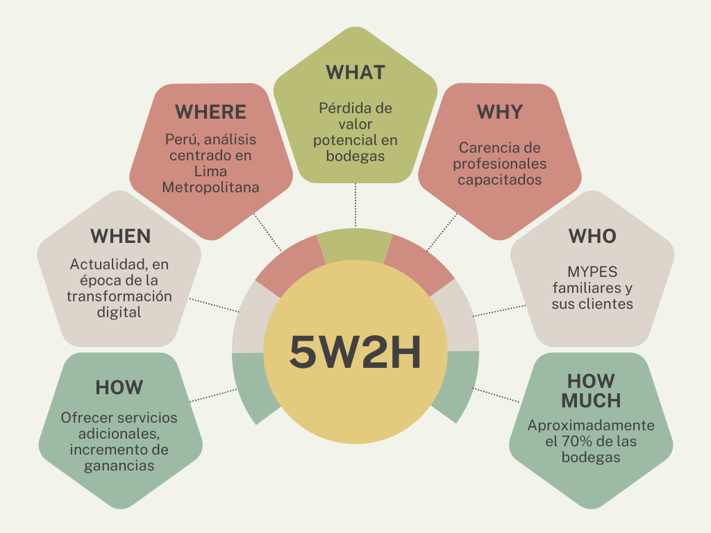

### Antecedentes y problemática

En la actualidad, Perú continúa enfrentando desafíos estructurales propios de un país en vías de desarrollo. De acuerdo con el Programa de las Naciones Unidas para el Desarrollo (2025), el país alcanzó un Índice de Desarrollo Humano de 0,794, situándose en el puesto 79 entre 193 países, por debajo del umbral de “muy alto desarrollo humano”. Por su parte, el Banco Mundial (2025) clasifica a Perú como una economía de ingreso mediano-alto, categoría en la que se agrupan naciones que, a pesar de avances sostenidos en crecimiento, mantienen brechas significativas respecto a los países desarrollados. Esta condición intermedia refuerza la necesidad de identificar estrategias que permitan acelerar la inclusión social y económica del país.

Dentro del amplio abanico de estrategias y enfoques posibles que pudieren favorecer este propósito, la transformación digital adquiere un protagonismo destacado. Este concepto no se reduce a la simple adopción de redes sociales o al uso de dispositivos digitales, sino que implica un cambio estructural en la forma de gestionar y crear valor en las organizaciones. Como señalan Bueno y Ferreira (2017, como se cita en Morante, 2020), la transformación digital es:

> “…algo mucho más profundo que estar en las redes sociales, utilizar dispositivos digitales o tener un canal de venta online. Se trata de llevar a cabo una modificación sustancial de toda la cadena de valor del negocio, en todas las áreas y afectando de forma global a todas las personas: clientes, empleados y stakeholders. Se trata en suma de tener digitalizados todos los procesos” (p. 9).

Un estudio reciente sobre el impacto de la transformación digital en el comercio minorista peruano es el de Llontop y Yangali (2022), quienes analizaron el caso de las bodegas de Lima Metropolitana. Según sus estimaciones, en el año 2022 existían aproximadamente 135 mil bodegas en la capital, lo que refleja su amplia representatividad en el mercado local. Estas unidades económicas constituyen un pilar fundamental en la economía popular, pues en su mayoría son negocios familiares que operan como micro y pequeñas empresas (mypes), generando empleo y sostén económico para miles de personas, tal como reporta la Asociación de Bodegueros del Perú (ABP, 2022, como se cita en Llontop & Yangali, 2022).

Más allá de su importancia social y económica, la investigación de Llontop y Yangali (2022) aporta evidencia empírica sobre el potencial de la transformación digital en este sector. Sus resultados muestran la existencia de una correlación positiva considerable (r = 0,609) entre la adopción de herramientas digitales y la satisfacción del cliente, lo que confirma que la digitalización no solo moderniza la gestión de las bodegas, sino que también mejora directamente la experiencia de consumo.

No obstante, los resultados positivos evidenciados en el caso de las bodegas contrastan con el hecho de que la transformación digital en el Perú aún enfrenta limitaciones estructurales. Según Morante (2020), aunque el interés empresarial crece, la carencia de profesionales capacitados impide aprovechar plenamente las oportunidades que ofrece la digitalización. Este diagnóstico se refleja en cifras recientes: según el “Estudio de digitalización del giro bodegas 2022” de Xplora (Grupo Lucky, 2022), el nivel promedio de digitalización en las bodegas peruanas alcanza apenas el 12%, a pesar de haberse elevado temporalmente al 29% durante la pandemia. Actualmente, solo el 28% de las bodegas utiliza aplicaciones para gestionar ventas, stock o pedidos, con diferencias entre Lima y provincias, evidenciando que el avance sigue siendo parcial y desigual.

Así, tras haber expuesto las oportunidades y limitaciones de la transformación digital en el caso peruano, corresponde delimitar la problemática de manera explícita. Para tal propósito, se recurre a la técnica 5W+2H.

