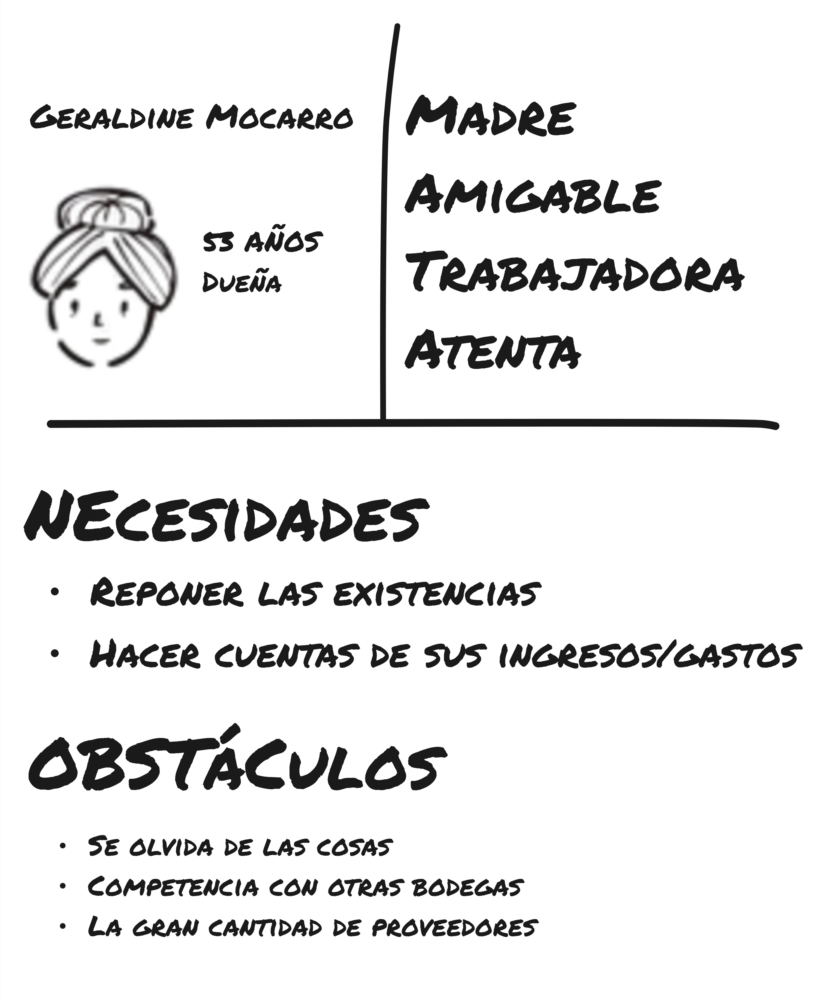
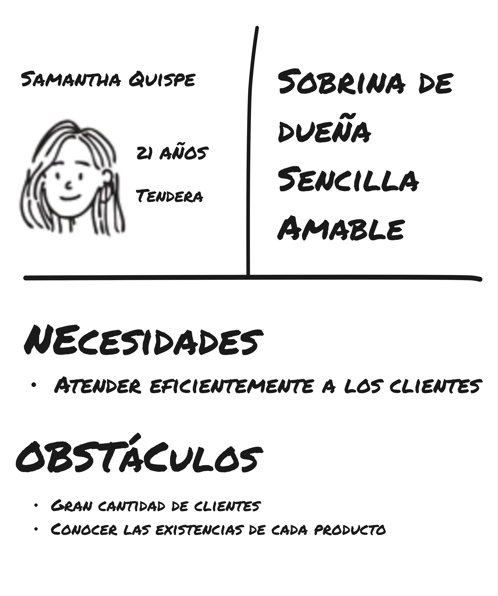
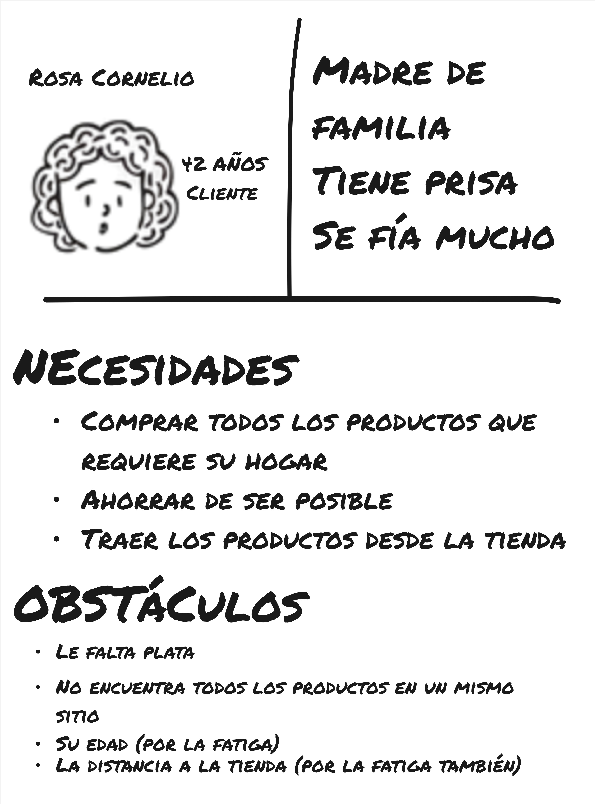

#### Lean UX Assumptions

**BUSINESS OUTCOMES**
Centramos los business outcomes en consecuencias directas típicas de adoptar la transformación digital: aumento de ganancias y reducción de errores operativos.

- Reducción de errores de gestión anuales en un 80%
- Incremento de utilidad por ventas en un 5% en un periodo de 3 meses

**USERS**
Usando un board en Miro, creamos tres protopersonas, cada uno con un rol que asumimos podría existir en el espacio del problema que estamos tratando.

- **Dueños**

- **Tenderos**

- **Clientes**

**USER OUTCOMES**
En línea con los business outcomes que planteamos, delineamos una serie de de beneficios que se alinean con las expectativas y objetivos característicos y esperables de cada uno de estos segmentos.

- **Dueños**
  - Aumentar ganancias
  - Fidelizar clientes
  - Gestionar mejor su negocio
- **Tenderos**
  - Trabajar menos y más rápido
  - Evitar llamados de atención por errores
- **Cliente**
  - Evitar la fatiga
  - Ahorrar en sus compras
  - Tener beneficios por su preferencia
  - Encontrar fácilmente los productos que busca

**FEATURES**
Para lograr esos beneficios, planteamos los siguientes posibles features en la solución

- Gestión de inventario (productos / stock)
- Pedido remoto
- Manejo de ofertas
- Gestión de ingresos y gastos
- Billetera de puntos para clientes
- Wishlist / productos favoritos
- Gestión de fiados
- Consulta de productos