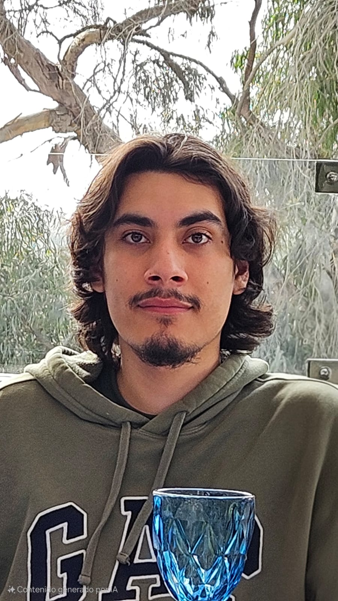
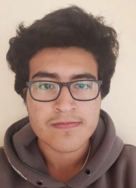
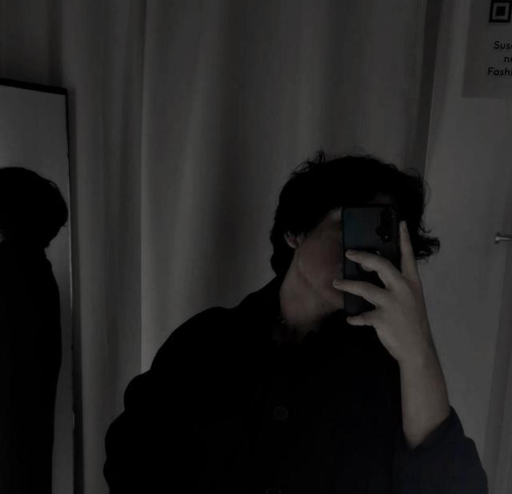
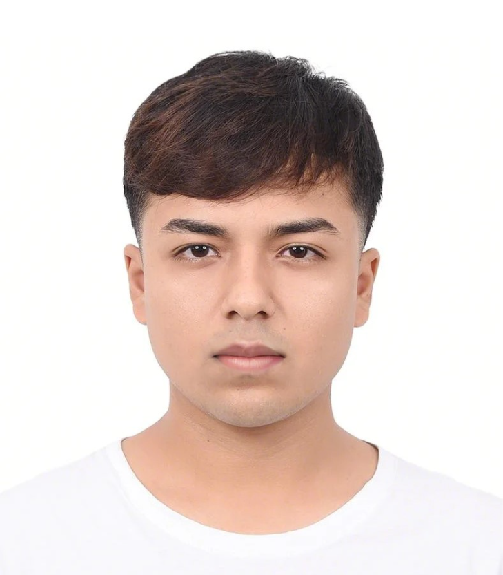

### Perfiles de los integrantes del equipo

<table>
    <thead>
        <tr>
            <th scope="col" style="width: 25%;">Fotografía</th>
            <th scope="col" style="width: 75%;">Descripción</th>
        </tr>
    </thead>
    <tbody>
        <tr>
            <td></td>
            <td><strong>Sebastían De Las Casas</strong> 
            Sebastián de Las Casas
            </td>
        </tr>
        <tr>
            <td></td>
            <td>
            <strong>Carlos Guimaraes</strong> 
            Soy estudiante de la carrera de Ingeniería de Software, estoy cursando el sexto ciclo de mi carrera y tengo 19 años. Soy una persona responsable y puntual, por lo que me gusta terminar y presentar los trabajos en los tiempos establecidos. Siempre me ha gustado la innovación y la creación de nuevas ideas. Estoy capacitado en algunos temas de edición de videos, y me considero bueno en programación. Voy a aportar al grupo de manera proactiva e intentaré aportar ideas que ayuden a mejorar el trabajo, siempre intentando mantener un ambiente positivo dentro del área de trabajo.
            </td>
        </tr>
        <tr>
            <td></td>
            <td><strong>Mauro López</strong> 
            Mauro López
            </td>
        </tr>
        <tr>
            <td></td>
            <td>
            <strong>Álvaro Orozco</strong> 
            Soy estudiante del séptimo ciclo de Ingeniería de Software. Puedo contribuir al equipo mediante habilidades de modelado de clases aplicando patrones GoF, análisis de negocio, gestión de proyectos y programación en Java, Go y Python.
            </td>
        </tr>
        <tr>
            <td></td>
            <td><strong>Henry Reaño</strong> 
            Soy estudiante de ingeniería de Software cursando el septimo ciclo de la carrera. Me desenvuelvo bien en la elicitación de requisitos, análisis de negocio y modelado de la arquitectura de un proyecto. Tengo experiencia programando en Java y C# aplicando Domain Driven Design y buenas prácticas. Soy una persona que trabaja bien bajo presión y que apoya a sus compañeros.
            </td>
        </tr>
    </tbody>
</table>

