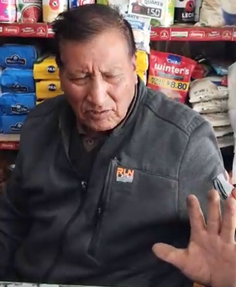
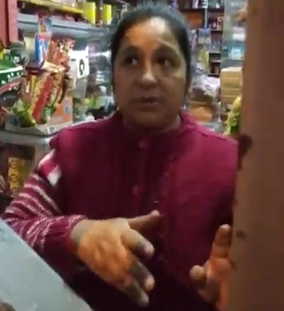

### Registro de entrevistas

**DUEÑOS**

<table>
    <thead>
        <tr>
            <th scope="row">Segmento</th>
            <td>Dueños</td>
        </tr>
    </thead>
    <tbody>
        <tr>
            <td>
                <strong>Nombre:</strong> Jose Roque Heredia 
                <strong>Edad:</strong> 75 años 
                <strong>Distrito:</strong> Surco 
                <strong>Enlace:</strong> <a href="">Entrevista en Stream</a> 
                <strong>Inicio:</strong> 00:00 - 00:00 
            </td>
            <td></td>
        </tr>
        <tr>
            <td colspan="2">
                <strong>Resumen:</strong> 
                Javier es un comerciante desde el año 1996. Para él lo más importante en su negocio es mantener el dinero constantemente reinvertido, de modo que si ve que un producto va a acabarse, solicita de forma rápida nuevos lotes a algún proveedor. Es decir, realiza el stock de productos ed forma visual e intuitiva. 
                Entre otros aspectos, comunica que en base a los proveedores, según el volumen de productos que compre, obtiene descuentos que aprovecha inteligentemente para rebajar el precio de dicho producto, asegurando que los clientes prefieran comprarlo en su negocio frente a otros, generando mejores ingresos y fidelizando más clientes. 
                Por último, respecto a fiados comenta que maneja los fiados con clientes de confianza con casa propia en la zona y que realiza el seguimiento de sus deudas en un cuaderno.
            </td>
        </tr><tr>
            <td>
                <strong>Nombre:</strong> Janet Pozo 
                <strong>Edad:</strong> 51 años 
                <strong>Distrito:</strong> San Juan de Lurigancho 
                <strong>Enlace:</strong> <a href="https://upcedupe-my.sharepoint.com/:v:/g/personal/u20221e247_upc_edu_pe/EfUXJmDtGOlHl4XDJ68tJDUBeD-FimIprGeW3eOX5GCmcA?nav=eyJyZWZlcnJhbEluZm8iOnsicmVmZXJyYWxBcHAiOiJTdHJlYW1XZWJBcHAiLCJyZWZlcnJhbFZpZXciOiJTaGFyZURpYWxvZy1MaW5rIiwicmVmZXJyYWxBcHBQbGF0Zm9ybSI6IldlYiIsInJlZmVycmFsTW9kZSI6InZpZXcifX0%3D&e=neoPlW">Entrevista en Stream</a> 
                <strong>Inicio:</strong> 04:50 - 09:38 
            </td>
            <td></td>
        </tr>
        <tr>
            <td colspan="2">
                <strong>Resumen:</strong> 
                Janet es una comerciante con 22 años de experiencia. Comparte detalles acerca de la forma en que gestiona su bodega. Para ella, lo más importante es la confianza y garantía que genera su negocio respecto a los productos, dado que de alguna manera, "trabaja con las familias". 
                Expresa además que algunos aspectos de administración del negocio se realizan "al ojo" o según proyecciones que realiza de forma intuitiva (como al comprar stock de fruta). 
                Por último, respecto a los fiados señala que una de sus principales reglas es que ningún cliente sin casa propia en la localidad puede fiarse, y que hacerlo es una manera de reducir pérdidas y fidelizar clientes.
            </td>
        </tr>
    </tbody>
</table>

**TENDEROS**

<table>
    <thead>
        <tr>
            <th scope="row">Segmento</th>
            <td>Tenderos</td>
        </tr>
    </thead>
    <tbody>
        <tr>
            <td>
                <strong>Nombre:</strong> Giannina Tarazona 
                <strong>Edad:</strong> 40 años 
                <strong>Distrito:</strong> San Juan de Lurigancho 
                <strong>Enlace:</strong> <a href="">Entrevista en Stream</a> 
                <strong>Inicio:</strong> 09:38 - 14:32 
            </td>
            <td></td>
        </tr>
        <tr>
            <td colspan="2">
                <strong>Resumen:</strong> 
                Giannina comenta que ha trabajado en una bodega, relativamente grande, similar a un minimarket. Hace mucho énfasis en las reglas que establecía el dueño sobre como manejar el negocio, como el cuaderno de fiados, turnos de los tenderos y las responsabilidades a realizar al cierre de caja. 
                Comenta además que no es muy usual que se realicen pedidos por WhatsApp.
            </td>
        </tr>
        <tr>
            <td>
                <strong>Nombre:</strong> Adilcia Ramírez 
                <strong>Edad:</strong> 41 años 
                <strong>Distrito:</strong> San Juan de Miraflores 
                <strong>Enlace:</strong> <a href="">Entrevista en Stream</a> 
                <strong>Inicio:</strong> 14:32 - 18:07 
            </td>
            <td></td>
        </tr>
        <tr>
            <td colspan="2">
                <strong>Resumen:</strong> 
                Adilcia ha trabajado como tendera hace aproximadamente 10 años, en el negocio de su cuñada. En su relato, comenta que seguía muy fielmente las indicaciones de la dueña del negocio en la atención: los precios de los productos, la política del fiado, etc. 
                Entre sus funciones como tendera destaca la venta, el cierre de caja y la gestión del inventario, que normalmente realizaba los fines de semana o a mediados de semana. 
            </td>
        </tr>
    </tbody>
</table>

**CLIENTES**

<table>
    <thead>
        <tr>
            <th scope="row">Segmento</th>
            <td>Clientes</td>
        </tr>
    </thead>
    <tbody>
        <tr>
            <td>
                <strong>Nombre:</strong> Luis Maguiña 
                <strong>Edad:</strong> 20 años 
                <strong>Distrito:</strong> Surco 
                <strong>Enlace:</strong> <a href="">Entrevista en Stream</a> 
                <strong>Inicio:</strong> 18:07 - 21:53 
            </td>
            <td></td>
        </tr>
        <tr>
            <td colspan="2">
                <strong>Resumen:</strong> 
                Luis es cliente habitual de una bodega cerca a la avenida El Derby. Comenta que tiene una serie de razones para acudir a la bodega, como la calidad de la atención o que ciertos productos los encuentra en mejor estado y calidad (por ejemplo, la fruta). 
                Comenta que sus compras suelen ser planificadas, pero ocasionalmente compra por gusto propio. Además que disfruta ir a la tienda pero no le gusta cuando se forma una larga cola debido al volumen de clientes. 
                Respecto a las funcionalidades propuestas, señala que les serían de mucha ayuda, incluso llegando a señalar que todas esas comodidades lo llevarían a comprar más seguido en la tienda por encima de los supermercados con aplicaciones como Agora.
            </td>
        </tr>
        <tr>
            <td>
                <strong>Nombre:</strong> Manuel Gutiérrez 
                <strong>Edad:</strong> 22 años 
                <strong>Distrito:</strong> La Molina 
                <strong>Enlace:</strong> <a href="">Entrevista en Stream</a> 
                <strong>Inicio:</strong> 21:53 - 24:54 
            </td>
            <td></td>
        </tr>
        <tr>
            <td colspan="2">
                <strong>Resumen:</strong> 
                Manuel es cliente habitual de una tienda. Describe que sus patrones de compra suelen ser más espontáneos, pero tiene cierta planificación de compras para los fines de semana. 
                Manuel cuenta que su bodega es su favorita principalmente por la proximidad de esta a su casa y la confianza con el dueño. 
                Sobre las funcionalidades cuenta que le serían principalmente útiles para no olvidar algunos productos en sus compras del fin de semana, que usualmente le suele ocurrir que olvida una o dos cosas.
            </td>
        </tr>
    </tbody>
</table>

