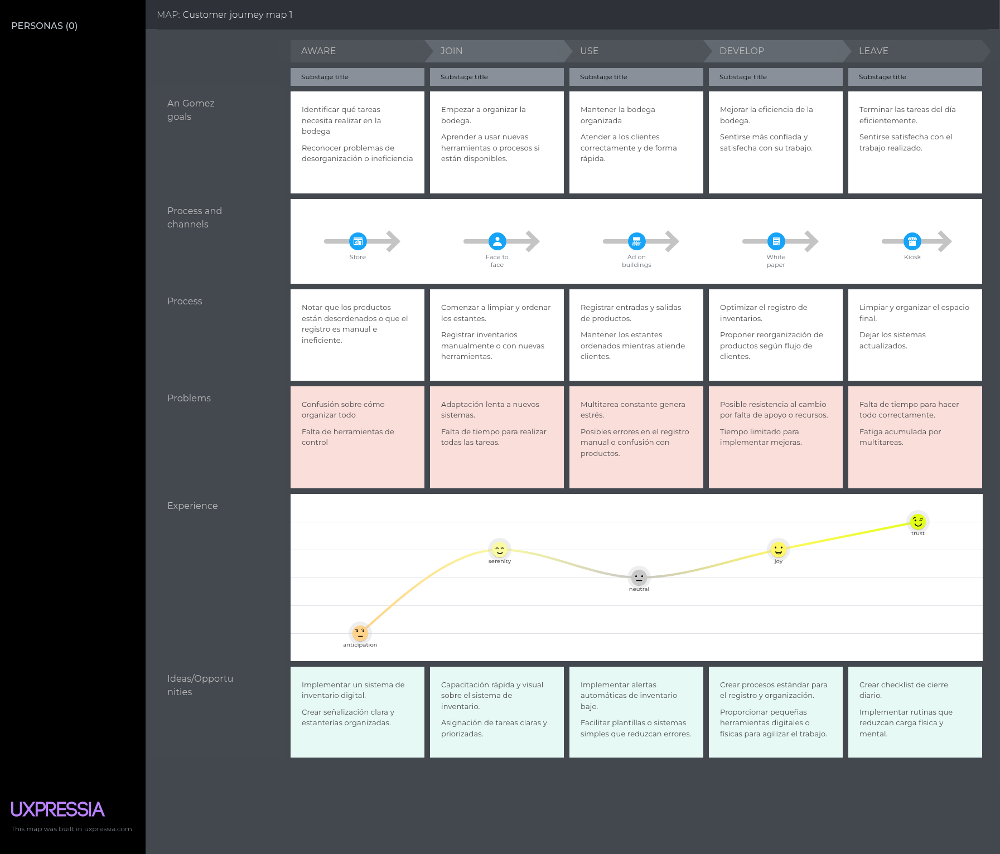

### User Journey Mapping
En esta sección se presentan los User Journey Mapping de los segmentos objetivos, que realizamos con el fin de dar a entender cómo se siente nuestro usuario en este momento, detallando cada paso que realiza y las emociones que experimenta.

- Cliente

- Tendero

- Dueño de Tienda

