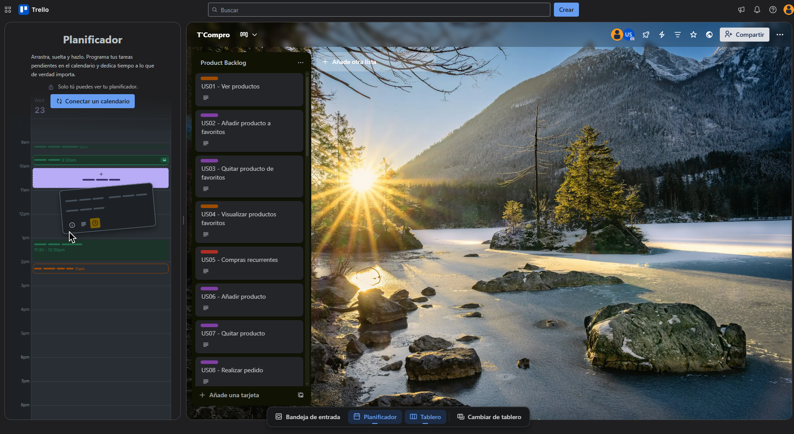

### Product Backlog

Board de Trello para la gestión del desarrollo del proyecto: [Enlace (Trello)](https://trello.com/b/m7gJMODs/tcompro)

<table>
    <thead>
        <tr>
            <th scope="col"># Orden</th>
            <th scope="col">User Story Id</th>
            <th scope="col">Título</th>
            <th scope="col">Descripción</th>
            <th scope="col">Story Points (1 / 2 / 3 / 5 / 8)</th>
        </tr>
    </thead>
    <tbody>
    <tr>
    <tr>
    <th scope="row">1</th>
    <td>TS01</td>
    <td>
       Obtener ordenes
    </td>
    <td>
       Como Developer, quiero implementar un endpoint que permita obtener todos las ordenes asociadas a un shop, customer y/o status para que los usuarios autorizados puedan visualizar y gestionar la información. 
    </td>
    <td>1</td>
    </tr>
<tr>
<tr>
    <tr>
    <th scope="row">2</th>
    <td>TS02</td>
    <td>
       Crear orden
    </td>
    <td>
        Como Developer, quiero implementar un endpoint que permita crear una orden para que los clientes puedan realizar pedidos a una bodega.
 
    </td>
    <td>2</td>
    </tr>
<tr>
<tr>
    <tr>
    <th scope="row">3</th>
    <td>TS03</td>
    <td>
      Rechazar orden
    </td>
    <td>
        Como Developer, quiero implementar un endpoint que permita rechazar orden para que las bodegas decidan si coger un pedido o no. 
    </td>
    <td>1</td>
    </tr>
<tr> 
<tr>
    <tr>
    <th scope="row">4</th>
    <td>TS04</td>
    <td>
       Aceptar orden
    </td>
    <td>
        Como Developer, quiero implementar un endpoint que permita aceptar orden para que las bodegas decidan si coger un pedido o no. 
    </td>
    <td>1</td>
    </tr>
<tr> 
<tr>
    <tr>
    <th scope="row">5</th>
    <td>TS05</td>
    <td>
       Avanzar orden
    </td>
    <td>
        Como Developer, quiero implementar un endpoint que permita avanzar los estados de una orden para mantener la trazabilidad de estados para la tienda y para el cliente con respecto a un pedido relacionado a ellos. 
    </td>
    <td>2</td>
    </tr>
<tr> 
<tr>
    <tr>
    <th scope="row">6</th>
    <td>TS06</td>
    <td>
       Cancelar orden
    </td>
    <td>
        Como Developer, quiero implementar un endpoint que permita cancelar una orden para que las bodegas o clientes decidan si continuar con su pedido o no. 
    </td>
    <td>1</td>
    </tr>
<tr> 
<tr>
    <tr>
    <th scope="row">7</th>
    <td>TS07</td>
    <td>
       Añadir producto favorito
    </td>
    <td>
        Como Developer, quiero implementar un endpoint que permita añadir un producto favorito a un cliente para que tenga acceso más rápido a productos que más aprecia. 
    </td>
    <td>1</td>
    </tr>
<tr> 
<tr>
    <tr>
    <th scope="row">8</th>
    <td>TS08</td>
    <td>
       Obtener productos favoritos
    </td>
    <td>
        Como Developer, quiero implementar un endpoint que permita devolver los productos favoritos de los clientes para que tengan acceso rápido a ellos. 
    </td>
    <td>1</td>
    </tr>
<tr> 
<tr>
    <tr>
    <th scope="row">9</th>
    <td>TS09</td>
    <td>
       Eliminar producto favorito
    </td>
    <td>
        Como Developer, quiero implementar un endpoint que permita eliminar los productos favoritos para reflejar los cambios en las necesidades del cliente. 
    </td>
    <td>1</td>
    </tr>
<tr> 
<tr>
    <tr>
    <th scope="row">10</th>
    <td>TS10</td>
    <td>
       Agregar cliente confiable
    </td>
    <td>
        Como Developer, quiero implementar un endpoint que permita vincular a un cliente con una bodega para reflejar la confianza entre ambos. 
    </td>
    <td>1</td>
    </tr>
<tr> 
<tr>
    <tr>
    <th scope="row">11</th>
    <td>TS11</td>
    <td>
      Obtener clientes confiables por bodega
    </td>
    <td>
        Como Developer, quiero implementar un endpoint que permita a las bodegas conocer sus clientes confiables para mantener actualizada su lista de confianza. 
    </td>
    <td>1</td>
    </tr>
<tr> 
<tr>
    <tr>
    <th scope="row">12</th>
    <td>TS12</td>
    <td>
      Obtener clientes confiables por cliente
    </td>
    <td>
        Como Developer, quiero implementar un endpoint que permita a los clientes conocer los perfiles de cliente confiable que tienen en cada tienda. 
    </td>
    <td>1</td>
    </tr>
<tr> 
<tr>
    <tr>
    <th scope="row">13</th>
    <td>TS13</td>
    <td>
       Crear lista de productos
    </td>
    <td>
        Como Developer, quiero implementar un endpoint que permita a clientes crear una lista de productos de compra para facilitar agregar productos a su bolsita de compras. 
    </td>
    <td>2</td>
    </tr>
<tr> 
<tr>
    <tr>
    <th scope="row">14</th>
    <td>TS14</td>
    <td>
       Eliminar lista de productos
    </td>
    <td>
        Como Developer, quiero implementar un endpoint que permita a clientes eliminar una lista de productos de compra para reflejar sus necesidades del momento. 
    </td>
    <td>1</td>
    </tr>
<tr> 
<tr>
    <tr>
    <th scope="row">15</th>
    <td>TS15</td>
    <td>
       Actualizar lista de compras
    </td>
    <td>
        Como Developer, quiero implementar un endpoint que permita a clientes actualizar una lista de compras para reflejar sus necesidades. 
    </td>
    <td>1</td>
    </tr>
<tr> 
<tr>
    <tr>
    <th scope="row">16</th>
    <td>TS16</td>
    <td>
       Obtener listas de compras
    </td>
    <td>
        Como Developer, quiero implementar un endpoint que permita a clientes obtener sus listas de compras para acceder a ellas de forma más rápida. 
    </td>
    <td>1</td>
    </tr>
<tr> 
<tr>
    <tr>
    <th scope="row">17</th>
    <td>TS17</td>
    <td>
       Recontratar a un tendero
    </td>
    <td>
        Como Developer, quiero implementar un endpoint que permita a los dueños de bodegas recontratar a tenderos que ya trabajaron en su bodega para facilitar el proceso de manejo de la bodega. 
    </td>
    <td>1</td>
    </tr>
<tr> 
<tr>
    <tr>
    <th scope="row">18</th>
    <td>TS18</td>
    <td>
       Despedir a un tendero
    </td>
    <td>
        Como Developer, quiero implementar un endpoint que permita a los dueños de bodegas despedir a tenderos para reflejar los empleados reales de la bodega en la aplicación. 
    </td>
    <td>1</td>
    </tr>
<tr> 
<tr>
    <tr>
    <th scope="row">19</th>
    <td>TS19</td>
    <td>
       Obtener tenderos por bodega
    </td>
    <td>
        Como Developer, quiero implementar un endpoint que permita a los dueños de bodegas conocer a los tenderos de su tienda para reflejar el personal real de la bodega. 
    </td>
    <td>1</td>
    </tr>
<tr> 
<tr>
    <tr>
    <th scope="row">20</th>
    <td>TS20</td>
    <td>
       Obtener tendero por correo electronico
    </td>
    <td>
        Como Developer, quiero implementar un endpoint que permita acceder a la información de un tendero para conocer sus datos personales y de contacto. 
    </td>
    <td>1</td>
    </tr>
<tr> 
<tr>
    <tr>
    <th scope="row">21</th>
    <td>TS21</td>
    <td>
       Obtener dueño por correo electronico
    </td>
    <td>
        Como Developer, quiero implementar un endpoint que permita acceder a la información de un dueño para conocer sus datos personales y de contacto. 
    </td>
    <td>1</td>
    </tr>
<tr> 
<tr>
    <tr>
    <th scope="row">22</th>
    <td>TS22</td>
    <td>
       Obtener pagos de tienda
    </td>
    <td>
        Como Developer, quiero implementar un endpoint que permita a los dueños de bodega conocer los pagos que se han realizado a su tienda para que mantengan un control correcto sobre sus finanzas. 
    </td>
    <td>1</td>
    </tr>
<tr> 
<tr>
    <tr>
    <th scope="row">23</th>
    <td>TS23</td>
    <td>
       Agregar producto a inventario de bodega
    </td>
    <td>
        Como Developer, quiero implementar un endpoint que permita a los dueños de bodega agregar productos de un catalogo maestro a su inventario para mantener su bodega con los productos más actualizados. 
    </td>
    <td>1</td>
    </tr>
<tr> 
<tr>
    <tr>
    <th scope="row">24</th>
    <td>TS24</td>
    <td>
       Actualizar producto de bodega
    </td>
    <td>
        Como Developer, quiero implementar un endpoint que permita a los dueños de bodega actualizar productos de su inventario para mantener su bodega con los productos más actualizados. 
    </td>
    <td>1</td>
    </tr>
<tr> 
<tr>
    <tr>
    <th scope="row">25</th>
    <td>TS25</td>
    <td>
       Obtener productos de inventario de bodega
    </td>
    <td>
        Como Developer, quiero implementar un endpoint que permita obtener productos en base a una bodega, disponibilidad y/o categoria. 
    </td>
    <td>1</td>
    </tr>
<tr> 
<tr>
    <tr>
    <th scope="row">26</th>
    <td>TS26</td>
    <td>
       Obtener bodegas por disponibilidad de productos
    </td>
    <td>
        Como Developer, quiero implementar un endpoint que permita obtener bodegas en base a una lista de productos para facilitar la elección de bodegas para un cliente. 
    </td>
    <td>1</td>
    </tr>
<tr> 
<tr>
    <tr>
    <th scope="row">27</th>
    <td>TS27</td>
    <td>
       Crear bodega
    </td>
    <td>
        Como Developer, quiero implementar un endpoint que permita crear bodegas para que el dueño lo maneje. 
    </td>
    <td>1</td>
    </tr>
<tr> 
<tr>
    <tr>
    <th scope="row">28</th>
    <td>TS28</td>
    <td>
       Obtener bodega por id
    </td>
    <td>
        Como Developer, quiero implementar un endpoint que permita obtener una bodega para consultar su información. 
    </td>
    <td>1</td>
    </tr>
<tr> 
<tr>
    <tr>
    <th scope="row">29</th>
    <td>TS29</td>
    <td>
       Obtener bodega por dueño
    </td>
    <td>
        Como Developer, quiero implementar un endpoint que permita obtener una bodega para consultar su información. 
    </td>
    <td>1</td>
    </tr>
<tr> 
<tr>
    <tr>
    <th scope="row">30</th>
    <td>TS30</td>
    <td>
       Crear perfil de usuario
    </td>
    <td>
        Como Developer, quiero implementar un endpoint que permita crear un perfil de usuario para que clientes, tenderos y dueños tengan acceso a las funcionalidades de la aplicación. 
    </td>
    <td>1</td>
    </tr>
<tr> 
<tr>
    <tr>
    <th scope="row">31</th>
    <td>TS31</td>
    <td>
       Obtener producto por catalor por id
    </td>
    <td>
        Como Developer, quiero implementar un endpoint que permita obtener un producto de catalogo por su identificar para conocer la información relevante del producto. 
    </td>
    <td>1</td>
    </tr>
<tr> 
<tr>
    <tr>
    <th scope="row">32</th>
    <td>TS32</td>
    <td>
       Obtener producto de catalogo por categoria
    </td>
    <td>
        Como Developer, quiero implementar un endpoint que permita obtener un producto de catalogo por su categoria para conocer la información relevante del producto. 
    </td>
    <td>1</td>
    </tr>
<tr> 
<tr>
    <tr>
    <th scope="row">33</th>
    <td>TS33</td>
    <td>
       Obtener todos los productos de catalogo
    </td>
    <td>
        Como Developer, quiero implementar un endpoint que permita obtener todos los productos del catalogo para conocer la información relevante del producto. 
    </td>
    <td>1</td>
    </tr>
<tr> 
<tr>
    <tr>
    <th scope="row">34</th>
    <td>TS34</td>
    <td>
       Pagar deuda
    </td>
    <td>
        Como Developer, quiero implementar un endpoint que permita pagar una deuda en una bodega con respecto a un pedido para que el dueño de la bodega mantenga sus finanzas estandarizadas. 
    </td>
    <td>1</td>
    </tr>
<tr> 
<tr>
    <tr>
    <th scope="row">35</th>
    <td>TS35</td>
    <td>
       Obtener deudas
    </td>
    <td>
        Como Developer, quiero implementar un endpoint que permita obtener deudas en una bodega para que el dueño pueda ordernar sus finanzas. 
    </td>
    <td>1</td>
    </tr>
<tr> 
    <th scope="row">36</th>
    <td>US18</td>
    <td>
       Añadir cliente a lista de clientes conFIABLES
    </td>
    <td>
        Como dueño quiero añadir a un cliente a la lista de conFIABLES para permitirle fiarse mediante compras en la aplicación que me facilita su seguimiento 
    </td>
    <td>5</td>
    </tr>
    <tr>
    <th scope="row">37</th>
    <td>SWR01</td>
    <td>
       About us
    </td>
    <td>
        Como visitante quiero conocer más acerca del equipo detrás del producto para evaluar qué tan confiable es su origen 
    </td>
    <td>1</td>
    </tr>
<tr>
    <tr>
    <th scope="row">38</th>
    <td>SWR02</td>
    <td>
       Beneficios dueño de bodega
    </td>
    <td>
        Como visitante del segmento objetivo dueño de bodega quiero conocer los beneficios de T'Compro para mejorar la automatización de mi bodega 
    </td>
    <td>1</td>
    </tr>
<tr>
<tr>
    <th scope="row">39</th>
    <td>US19</td>
    <td>
       Quitar cliente a lista de clientes conFIABLES
    </td>
    <td>
        Como dueño quiero quitar a un cliente de la lista de conFIABLES para evitar que los que no son responsables se sigan fiando 
    </td>
    <td>1</td>
</tr>
<tr>
    <th scope="row">40</th>
    <td>US20</td>
    <td>
       Ajustar crédito máximo
    </td>
    <td>
        Como dueño quiero determinar un monto máximo que mis clientes me pueden estar debiendo para evitar que se fíen demasiado dinero 
    </td>
    <td>2</td>
</tr>
<tr>
    <th scope="row">41</th>
    <td>US21</td>
    <td>
       Mostrar código de cliente
    </td>
    <td>
        Como cliente quiero conocer cuál es mi código único de cliente para que los bodegueros puedan añadirme a su lista de conFIABLES 
    </td>
    <td>1</td>
</tr>
<tr>
    <th scope="row">42</th>
    <td>US22</td>
    <td>
       Visualizar lista de clientes conFIABLES de bodega como tendero
    </td>
    <td>
        Como tendero quiero consultar la lista de confiables de la bodega para saber a quienes se les puede fiar y cuánto crédito llevan consumiendo 
    </td>
    <td>1</td>
</tr>
<tr>
    <th scope="row">43</th>
    <td>US26</td>
    <td>
       Ver la lista de cobros pendientes
    </td>
    <td>
        Como dueño quiero visualizar todos los fiados pendientes de cobrar para saber a quién y cuánto le debo cobrar 
    </td>
    <td>3</td>
</tr>
<tr>
    <th scope="row">44</th>
    <td>US27</td>
    <td>
       Marcar fiado como cobrado
    </td>
    <td>
        Como dueño quiero marcar un fiado como cobrado para actualizar el crédito de mi clientes que pagan sus deudas 
    </td>
    <td>1</td>
</tr>
<tr>
    <th scope="row">45</th>
    <td>US01</td>
    <td>
       Ver productos
    </td>
    <td>
        Como cliente quiero visualizar los productos que puedo comprar para organizar mi pedido lo más completo posible 
    </td>
    <td>3</td>
</tr>
<tr>
    <th scope="row">46</th>
    <td>US06</td>
    <td>
       Añadir producto
    </td>
    <td>
        Como cliente quiero añadir productos a mi carrito de compras para solventar mis necesidades del hogar 
    </td>
    <td>1</td>
</tr>
<tr>
    <th scope="row">47</th>
    <td>US07</td>
    <td>
       Quitar producto
    </td>
    <td>
        Como cliente quiero quitar productos de mi carrito de compras para eliminar un producto que sin querer escogí 
    </td>
    <td>1</td>
</tr>
<tr>
    <th scope="row">48</th>
    <td>US08</td>
    <td>
       Realizar pedido
    </td>
    <td>
        Como cliente quiero realizar el pedido de mi carrito de compras para que la bodega empiece a armarla 
    </td>
    <td>1</td>
</tr>
<tr>
    <th scope="row">49</th>
    <td>US11</td>
    <td>
       Cancelar pedido como cliente
    </td>
    <td>
        Como cliente quiero cancelar mi pedido en la bodega para pedir en otra porque se demoraron mucho en atenderme 
    </td>
    <td>1</td>
</tr>
<tr>
    <th scope="row">50</th>
    <td>US09</td>
    <td>
       Seleccionar método de pago
    </td>
    <td>
        Como cliente quiero seleccionar un método de pago para manejar correctamente el control de mis finanzas 
    </td>
    <td>2</td>
</tr>
<tr>
    <th scope="row">51</th>
    <td>US10</td>
    <td>
       Seleccionar delivery / recojo en bodega
    </td>
    <td>
        Como cliente quiero seleccionar una modalidad de recojo para tener mi pedido lo más antes posible 
    </td>
    <td>2</td>
</tr>
<tr>
    <th scope="row">52</th>
    <td>US12</td>
    <td>
       Visualizar pedido
    </td>
    <td>
        Como tendero quiero visualizar los pedidos que llegan a la bodega para organizar correctamente mi tiempo 
    </td>
    <td>2</td>
</tr>
<tr>
    <th scope="row">53</th>
    <td>US13</td>
    <td>
       Aceptar pedido
    </td>
    <td>
        Como tendero quiero aceptar un pedido de la bodega para realizar la venta 
    </td>
    <td>1</td>
</tr>
<tr>
    <th scope="row">54</th>
    <td>US14</td>
    <td>
       Rechazar pedido
    </td>
    <td>
        Como tendero quiero rechazar un pedido de la bodega para indicar que no puedo atenderlo 
    </td>
    <td>1</td>
</tr>
<tr>
    <th scope="row">55</th>
    <td>US15</td>
    <td>
       Marcar pedido como listo
    </td>
    <td>
        Como tendero quiero marcar un pedido como listo para que mi cliente sepa que puede pasar por él o que está en camino 
    </td>
    <td>1</td>
</tr>
<tr>
    <th scope="row">56</th>
    <td>US16</td>
    <td>
       Marcar pedido como entregado
    </td>
    <td>
        Como tendero quiero marcar un pedido como entregado para confirmar que entregué el producto y su cobro mediante el medio respectivo se ha efectuado 
    </td>
    <td>1</td>
</tr>
<tr>
    <th scope="row">57</th>
    <td>US17</td>
    <td>
       Cancelar pedido como tendero
    </td>
    <td>
        Como tendero quiero cancelar la atención de un pedido para dar a conocer que no me será posible atenderlo si ocurrió un problema en el proceso de atención 
    </td>
    <td>1</td>
</tr>
<tr>
    <th scope="row">58</th>
    <td>US28</td>
    <td>
       Añadir producto a la bodega desde catálogo
    </td>
    <td>
        Como dueño quiero añadir productos a mi inventario desde un catálogo maestro para que mis clientes sepan que lo pueden encontrar en mi bodega sin mucho esfuerzo 
    </td>
    <td>3</td>
</tr>
<tr>
    <th scope="row">59</th>
    <td>US29</td>
    <td>
       Quitar producto a la bodega desde catálogo
    </td>
    <td>
        Como dueño quiero eliminar productos de mi inventario para evitar que mis clientes hagan pedidos de productos que no tengo disponibles 
    </td>
    <td>1</td>
</tr>
<tr>
    <th scope="row">60</th>
    <td>US30</td>
    <td>
       Agregar precio personalizado
    </td>
    <td>
        Como dueño quiero agregar precios personalizados a los productos que ofrezco en mi bodega para que los clientes me compren más 
    </td>
    <td>1</td>
</tr>
<tr>
    <th scope="row">61</th>
    <td>US31</td>
    <td>
       Quitar precio personalizado
    </td>
    <td>
        Como dueño quiero regresar los precios de los productos a lo habitual para ajustar su precio si es necesario 
    </td>
    <td>1</td>
</tr>
<tr>
    <th scope="row">62</th>
    <td>US36</td>
    <td>
       Añadir tendero
    </td>
    <td>
        Como dueño de bodega quiero añadir tenderos para gestionar correctamente a mis trabajadores 
    </td>
    <td>5</td>
</tr>
<tr>
    <th scope="row">63</th>
    <td>US37</td>
    <td>
       Quitar tendero
    </td>
    <td>
        Como dueño de bodega quiero quitar tenderos para eliminar trabajadores que ya no son parte de mi bodega 
    </td>
    <td>1</td>
</tr>
<tr>
    <th scope="row">64</th>
    <td>US38</td>
    <td>
       Renunciar
    </td>
    <td>
        Como tendero quiero renunciar a la bodega a la que estaba asociado para evitar problemas con el dueño 
    </td>
    <td>1</td>
</tr>
<tr>
    <th scope="row">65</th>
    <td>US35</td>
    <td>
       Administrar perfil de bodega
    </td>
    <td>
        Como dueño quiero administrar la información de mi bodega para que sea fácil de identificar 
    </td>
    <td>1</td>
</tr>
<tr>
    <th scope="row">66</th>
    <td>US39</td>
    <td>
       Visualizar información de bodega para tendero
    </td>
    <td>
        Como tendero quiero visualizar información de la bodega para conocer datos relevantes sobre ella 
    </td>
    <td>1</td>
</tr>
<tr>
    <th scope="row">67</th>
    <td>US05</td>
    <td>
       Compras recurrentes
    </td>
    <td>
        Como cliente quiero una lista de mis compras recurrentes para añadirlas rápidamente a mi orden 
    </td>
    <td>2</td>
</tr>
<tr>
    <th scope="row">68</th>
    <td>US02</td>
    <td>
       Añadir producto a favoritos
    </td>
    <td>
        Como cliente quiero añadir productos a favoritos para acceder a ellos rápidamente en mis próximos pedidos. 
    </td>
    <td>1</td>
</tr>
<tr>
    <th scope="row">69</th>
    <td>US03</td>
    <td>
       Quitar producto de favoritos
    </td>
    <td>
        Como cliente quiero quitar productos de favoritos para evitar comprar productos que ya no consumo 
    </td>
    <td>1</td>
</tr>
<tr>
    <th scope="row">70</th>
    <td>US04</td>
    <td>
       Visualizar productos favoritos
    </td>
    <td>
        Como cliente quiero visualizar mis productos favoritos para añadirlos rápidamente a mi orden 
    </td>
    <td>3</td>
</tr>
<tr>
    <th scope="row">71</th>
    <td>US23</td>
    <td>
       Dashboard de ingresos según periodo de tiempo
    </td>
    <td>
        Como dueño quiero visualizar información clara de los ingresos mediante la aplicación según periodo de tiempo (día, semana, mes) para poder sacar mis cuentas fácilmente 
    </td>
    <td>5</td>
</tr>
<tr>
    <th scope="row">72</th>
    <td>US24</td>
    <td>
       Dashboard de ingresos según método de pago
    </td>
    <td>
        Como dueño quiero filtrar los ingresos del dashboard por método de pago (efectivo, virtual o fiado) para analizar cómo se están distribuyendo mis ventas según la forma de pago 
    </td>
    <td>5</td>
</tr>
<tr>
    <th scope="row">73</th>
    <td>US40</td>
    <td>
       Dashboard de ingresos según método de pago
    </td>
    <td>
        Como cliente quiero obtener recomendaciones personalizadas según mi ubicación para descubrir en qué tiendas hay los mejores precios para ciertos productos 
    </td>
    <td>5</td>
</tr>
<tr>
    <th scope="row">74</th>
    <td>US25</td>
    <td>
       Dashboard de ingresos según método de despacho
    </td>
    <td>
        Como dueño quiero filtrar los ingresos del dashboard por método de despacho (recojo en bodega o delivery) para entender mejor cómo se distribuyen las ventas según el canal de atención 
    </td>
    <td>5</td>
</tr>
<tr>
    <th scope="row">75</th>
    <td>US32</td>
    <td>
       Login mediante providers como cliente
    </td>
    <td>
        Como cliente quiero autenticarme de forma segura mediante mi cuenta de Google para acceder fácil y rápidamente a las funciones de compra 
    </td>
    <td>5</td>
</tr>
<tr>
    <th scope="row">76</th>
    <td>US33</td>
    <td>
       Login mediante providers como tendero
    </td>
    <td>
        Como tendero quiero autenticarme de forma segura mediante mi cuenta de Google para acceder fácil y rápidamente a las funcionalidades para trabajar en la bodega 
    </td>
    <td>5</td>
</tr>
    </tbody>
</table>