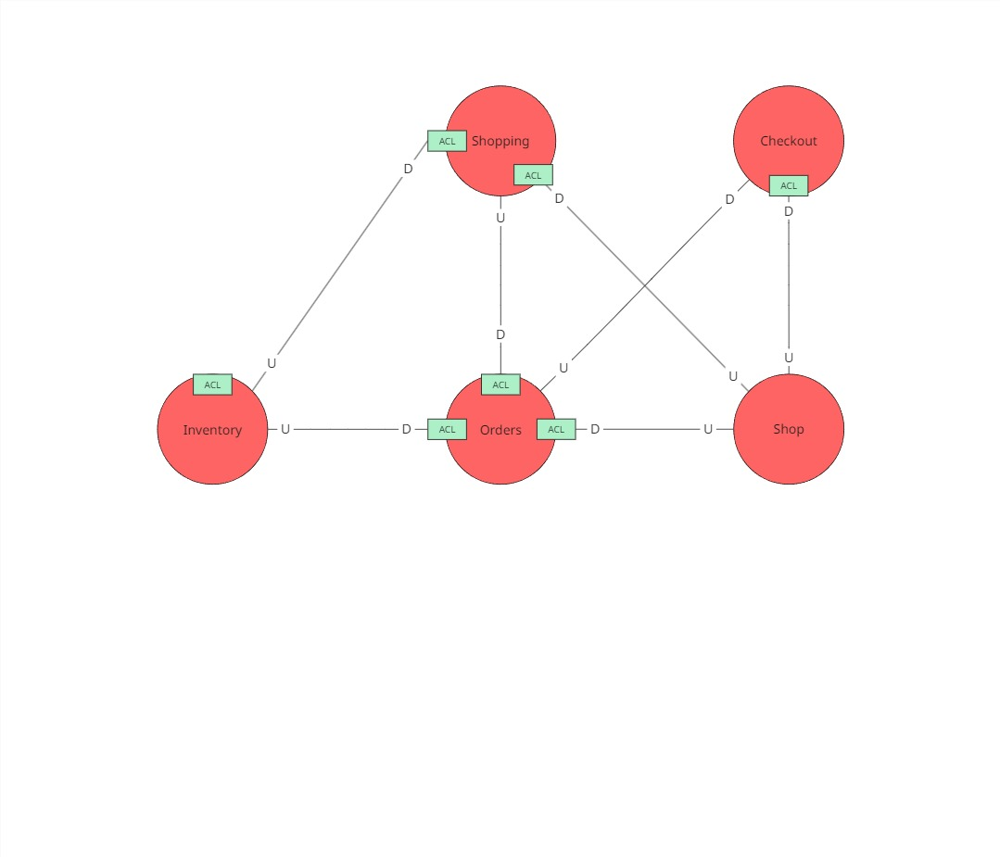
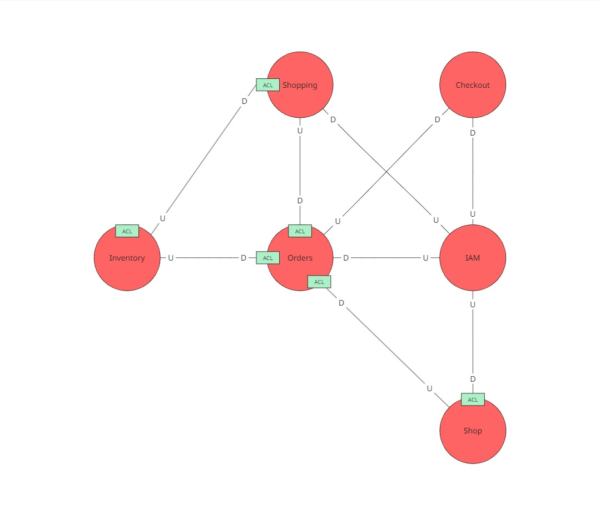
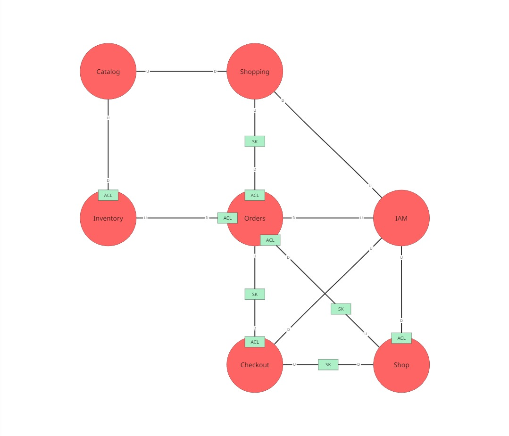

### Context Mapping

Se presenta a continuación el proceso en que se evalúa propuestas de context maps para la solución de software. Se consideran los capabilities del negocio así como las características del producto de software en cuestión.

**¿Qué pasa si dejamos que shop se encargue de la identificación de clientes, tenderos y dueños?**

En este mapping generado a simple vista se nota que el contexto de Shop está cumpliendo un rol que no debería estar cumpliendo: identificar a los usuarios del sistema. El propósito del contexto Shop es únicamente manejar las reglas de administración de las bodegas, por lo que es necesario delegar esa capabilidad a otro contexto (IAM).

**¿Qué pasa si dejamos que inventory se encargue del catálogo maestro de productos además del inventario individual de cada bodega?**

En este mapping generado se puede observar que existe una dependencia transitiva, además de que el contexto de inventory se termina contaminando: Inventory ya no reflejaría la gestión de inventario propia del problem domain, sino un conjunto semántico relacionado con los datos de los productos que sirve a la aplicación y no al negocio, contradiciendo DDD. Por tanto, se crea el bounded context Catalog, responsable de suministrar los datos de productos y aplicar políticas para su mantenimiento y actualización.

**¿Qué pasa si dividimos la responsabilidad del bounded context orders para crear otro bounded context?**

Hasta el momento, se había asumido que el propio contexto de orders iba a evaluar la idoneidad del pedido para ser atendido. En este mapping se intenta separar dicha capabilidad en un nuevo bounded context. Sin embargo, en análisis nos lleva a resaltar que, a pesar de mantner una separación mucho más fuerte entre la solución de software y el domain, realmente esta capabilidad no amerita su propio bounded context, puesto que:
- No maneja un modelo propio
- No reduce el acoplamiento actualmente existente: al contrario, lo vuelve más complejo
- Su única función sería servir a orders

Por tanto, se determina delegar esta responsabilidad al propio contexto de orders dentro de un servicio de aplicación, para mantener la distinción de nuestra solución del domain.

**MODELO FINAL**

En consecuencia, se determina que el modelo final consta de los siguientes bounded context:
- IAM
- Shopping
- Orders
- Checkout
- Shop
- Inventory
- Catalog

