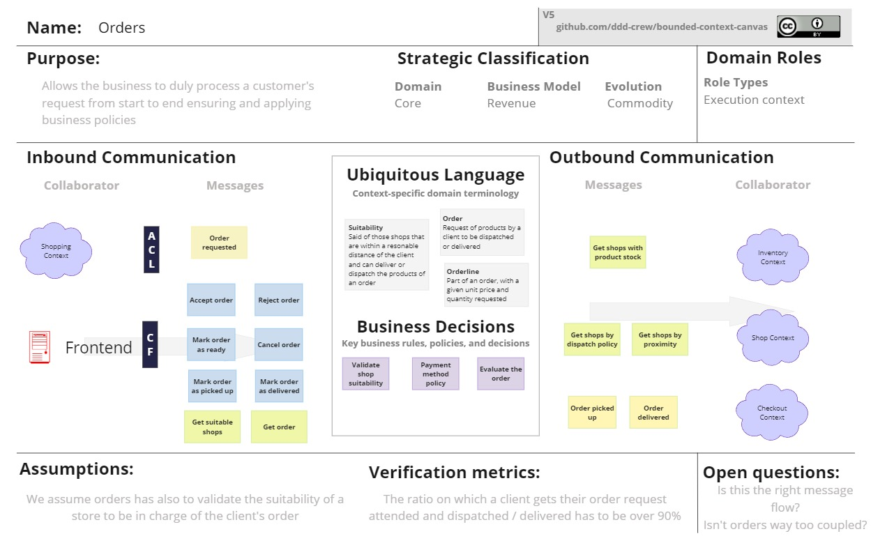
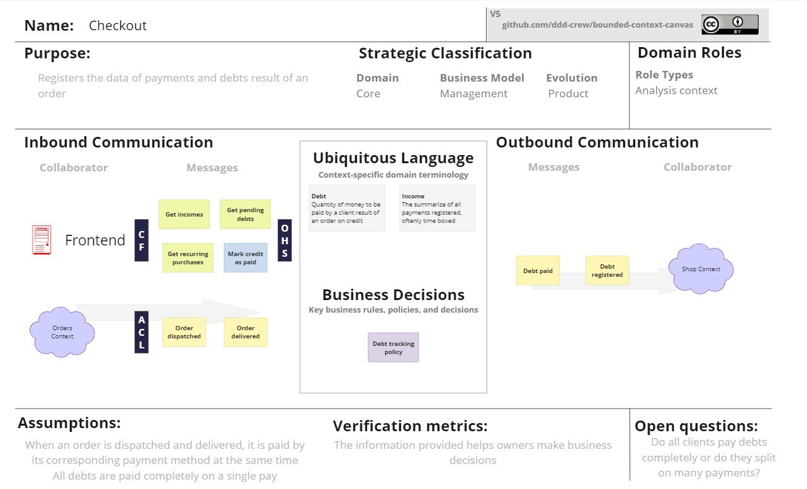

#### Bounded Context Canvases

Con el fin de documentar el proposito y relación de los contextos identificados se implemento la herramienta Bounded Context Canvas a cada contexto. 

Este proceso ayudo al equipo de desarrollo a mejorar la comprensión del dominio y la razón de ser de cada contexto. 

**ORDER CONTEXT**

Es responsable del ciclo de vida de una orden. La orden se genera en base a la idoneidad para atender el pedido bajo las condiciones solicitadas por el cliente. El ofrece como parte de la gestión de ese proceso aceptar o rechazar la atención de la orden y la posibilidad de cancelar su atención, asegurando que el despacho de la bodega mantenga autonomía sobre sus funciones según consideren necesario.

Se comunica principalmente con Shopping y con el front-end a través del API expuesta, proporcionando endpoints que permiten consultar las tiendas idóneas y recibir la solicitud del armado de una orden en base a un Shopping Bag a través de un evento de OrderRequested.

**SHOPPING CONTEXT**

Tiene como responsabilidad la planificación de las ordenes de compra. En ella los clientes eligen, en base al catálogo de productos en circulación, los productos que desean adquirir. Se trata de un contexto core y de planificación.

Interactúa principalmente con orders, para solicitar la atención de un pedido en base a una bolsa de compras.

También interactúa con el contexto de catalog. Los clientes obtienen la visión general de los productos disponibles en este contexto, quien los proporciona con sus datos completos y se los convierte al modelo local a través de ACL.

**CHECKOUT CONTEXT**

Tiene como propósito registrar los ingresos y deudas pendientes de cobrar de cada orden, así resumir los datos en información para la toma de decisiones administrativas y contables. Por ejemplo, la deuda acumulada de los clientes confiables o los ingresos al cierre de caja de cada día.

Se comunica principalmente con orders al termino del ciclo de vida de una orden, que solicita el registro de los ingresos o deudas.

También se comunica con el contexto de shop para avisar de actualizar el crédito consumido por el cliente confiable.

Por último, el front end consume la información que puede producir el contexto a partir de sus registros de datos para la toma de decisiones empresariales.

**SHOP CONTEXT**

Tiene como propósito el gestionar los tenderos y clientes confiables de una bodega, así como limitar el credito que puede ofrecer la bodega a sus clientes confiables. Se trata de un contexto de soporte, pues es necesario para el funcionamiento del dominio pero no es un diferenciador en el mercado.

Representa un contexto que cumplidor, pues permite la existencia de la bodega en si misma.
Se comunica principalmente con el front-end, a través de la API expuesta, proporcionando endpoints que permiten la consulta y modificación de las reglas administrativas de la bodega. 

También se comunica con el contexto de orders, que es uno de los principales consumidores de los datos para el armado de las ordenes asegurando el cumplimiento de las políticas de la bodega.

Por último también se comunica con checkout. Este último contexto lleva las cuentas y trazabilidad de los pagos y deudas, emitiendo eventos para que los saldos de los clientes confiables se mantengan actualizados

**INVENTORY CONTEXT**

La intención de este contexto es únicamente el manejo de existencia de productos en la bodega. No controla cantidad, sino la disponibilidad de estos en la bodega a sus clientes. Se trata de un contexto de soporte que representa el almacenamiento de productos de la bodega. Cumple el rol de ejecución forma parte del proceso operativo de una bodega.

Se comunica principalmente con el front end para la actualización de información del inventario y con orders para proveer información acerca de los productos, como el precio de venta especial que puede tener la tienda sobre un producto.

