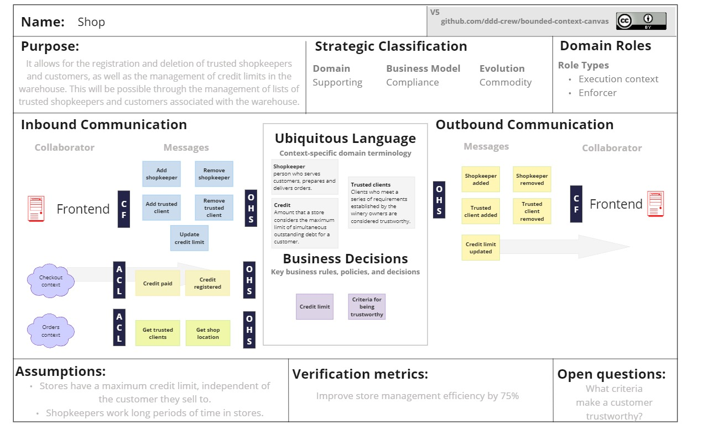
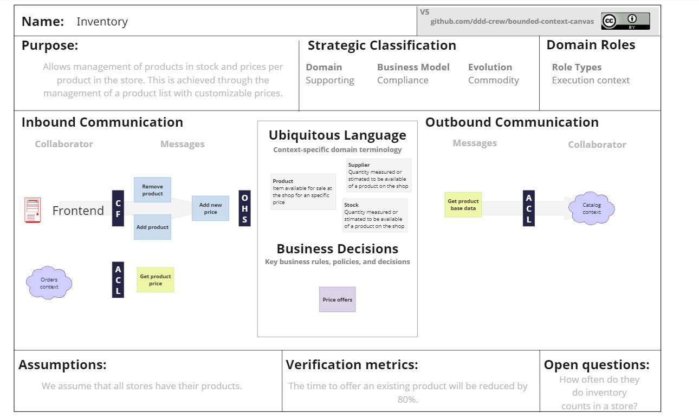

#### Bounded Context Canvases

Con el fin de documentar el proposito y relación de los contextos identificados se implemento la herramienta Bounded Context Canvas a cada contexto. 

Este proceso ayudo al equipo de desarrollo a mejorar la comprensión del dominio y la razón de ser de cada contexto. 

**ORDER CONTEXT:**

**CHECKOUT CONTEXT**

**SHOP CONTEXT**
Tiene como propósito el gestionar los tenderos y clientes confiables de una bodega, así como limitar el credito que puede ofrecer la bodega a sus clientes confiables. Se trata de un contexto de soporte, pues es necesario para el funcionamiento del dominio pero no es un diferenciador en el mercado. Representa un contexto que cumplidor, pues permite la existencia de la bodega en si misma.
Se comunica principalmente con el front-end, a través de la API expuesta, proporcionando endpoints que permiten la consulta, creación y eliminación de recursos.

**INVENTORY CONTEXT**
La intención de este contexto es únicamente el manejo de existencia de productos en la bodega. No controla cantidad, sino la presencia de un producto en el catalogo que ofrece la tienda a sus clientes. Se trata de un contexto de soporte que representa el almacenamiento de productos de la bodega. Cumple el rol de ejecución pues maneja recursos en su interior. 
