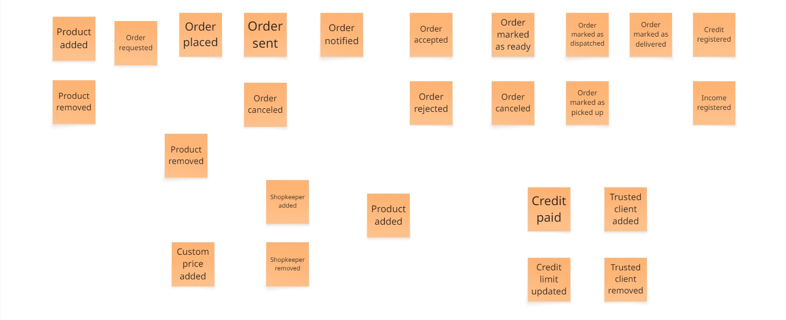
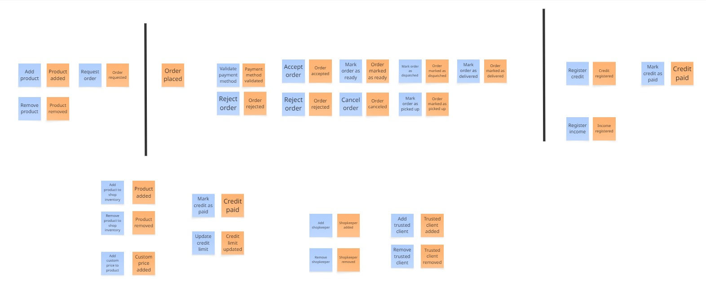
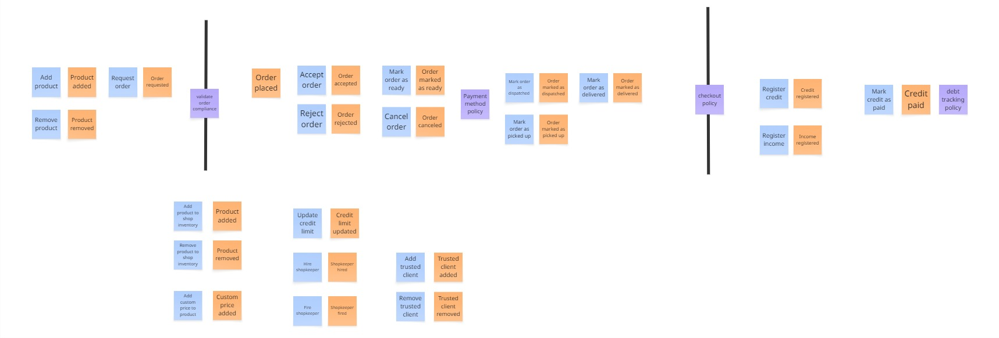
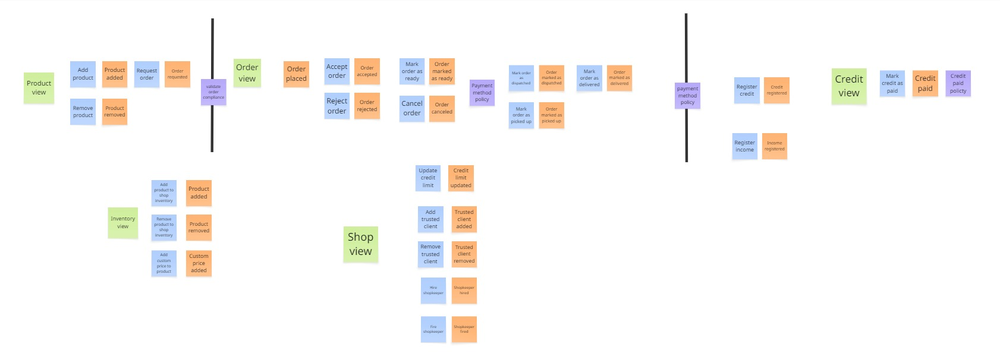
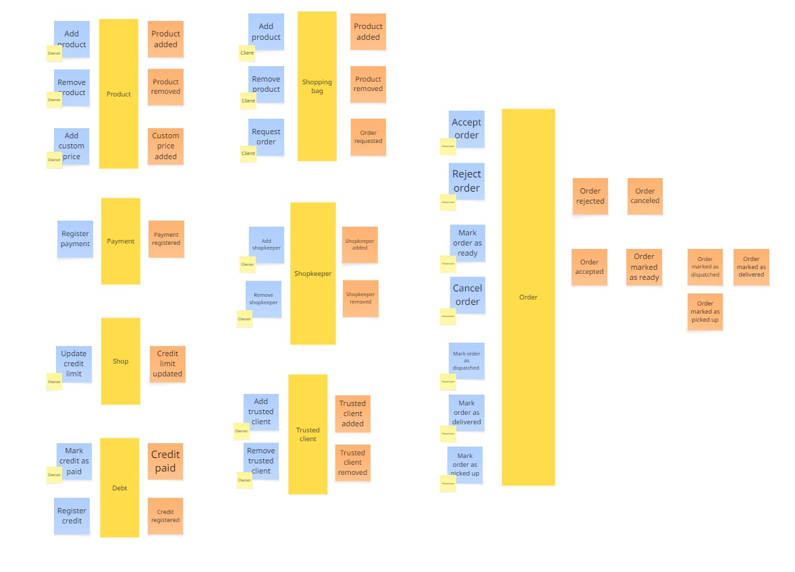

#### Candidate Context Discovery

En base al conocimiento actual del equipo sobre el dominio se ha realizado la técnica **Eventstorming**. A través de la cual se ha podido identificar los contextos del dominio. 

En pro de la documentación del proyecto se hara un resumen de lo la técnica utilizada y el proceso que ejecuto el equipo de desarrollo.

Para la identificación de los bounded context se ha utilizado la técnica start-with-simple, identificando los procesos secuencialmente de manera sencilla y pausada.

**PASO 1: IDENTIFICAR EVENTOS**

Como primer paso de la técnica de Eventstorming se identifico todos los eventos posibles en equipo. Tomando en cuenta los conocimientos del dominio en el cual estamos trabajando. Los eventos son idenfiticados con post-its naranjas y con el formato **SUSTANTIVO + VERBO EN PASADO**

**PASO 2: ORDENAR EVENTOS**

Posterior a la identificación de eventos se procede a ordenarlos en base a secuencias lógicas que se identificaron en el equipo. En este caso se puede observar en la parte superior de la imagen como se ordena los eventos necesarios para completar todo el ciclo de vida de una orden.

**PASO 3: DETERMINAR PIVOTAL POINTS**

Para darle un orden aún más claro y preciso a los eventos identificados, se determina los pivotal points del dominio. Estas segmentaciones dentro del dominio son cambios importantes y que representan un antes y después. En este caso cuando un conjunto de productos se convierten en su conjunto en una orden. Así como marcar una orden como entregada para disparar un evento de registro de ingreso monetario para la bodega. Los pivotal points son identificados con una barra negra vertical.

**PASO 4: IDENTIFICAR COMANDOS**

Habiendo identificado y ordenado eventos y puntos clave en el dominio es necesario reconocer los comandos que los desencadena. De esta manera se determina las acciones que traen por consecuente a los eventos del dominio. Los comandos son identificados con post-its azules claros y con el formato **VERBO EN PRESENTE + SUSTANTIVO**

**PASO 5: IDENTIFICAR POLITICAS**

Trabajar en un dominio implica responder a reglas especificas de negocio, en este caso se identifican 3 reglas de negocio importantes. Las tres estrechamente relacionadas con los pagos y fiados de las bodegas. Identificar las politicas del dominio nos permitira, posteriormente, dar forma a los contextos del dominio. Las politicas se identifican con post-its moradas.

**PASO 6: IDENTIFICAR VISTAS**

Eventos y comandos transcurren en distintas partes de un sistema, para evitar confusiones e ir definiendo el diseño de la aplicación se identifican a gran escala en que "pantallas" transcurren los eventos y coamndos. Las vistas son identificadas con post-its verdes.

**PASO 7: IDENTIFICAR ACTORES**

Los comandos, en su mayoría, son accionados por intervención de usuarios. En este caso se vincula gran porcentaje de los comandos a sus respectivos usuarios activadores: Dueños, tenderos y clientes. Se observa que algunos comandos no tienen actores, esto es debido a que son comandos que se activan por el sistema, más adelante se detallara a fondo. Los actores son representados por post-its amarillos justo en la esquina inferior izquierda de los comandos. 

**PASO 8: IDENTIFICAR AGREGADOS**

Posterior a la identificación de eventos, comandos, vistas, politicas y actores se tiene que definir los agregados del dominio. En este caso se identifica 6 agregados:
- Shopping bag. Encargado de almacenar los productos de un cliente, antes de ser considerado una orden.
- Inventory. Representa el stock de una bodega.
- Shop. Representa a la bodega, manejando sus tenderos, clientes confiables y politicas de fiado.
- Credit. Se trata del fiado, almacena la información necesario para su posterior pago.
- Checkout. Representa la caja financiera de la bodega, almacena los ingresos ocasionados a través de las ordenes.
- Order. Representa la orden en si misma, desde su concepción a través del shopping bag, hasta su entrega al cliente. Tiene ciertas caracteristicas propias y complejas de una orden.

**PASO 9: DEFINIR CONTEXTOS**

Finalmente, con los agregados estructurados y las politicas parametrizadas se puede definir los contextos del dominio. El equipo de desarrollo determino 4 contextos en base a las funcionalidades identificadas del dominio. Order context, que se encarga del ciclo de vida de una orden, Checkout context que se encarga de las finanzas de la bodega, Inventory context que es basicamente el stock de la bodega y Shop context, que representa a la bodega en su totalidad.
Los contextos son representados a través de las figuras que rodean a los eventos, comandos, agregados y politicas. Se observa que los contextos se comunican a través de las politicas.