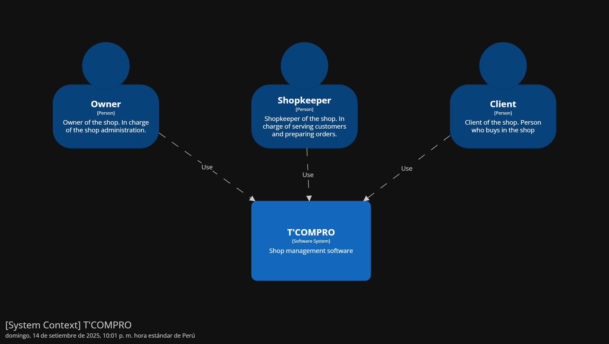

#### Software Architecture Context Level Diagrams

T'Compro es una plataforma de gestión de inventario, finanzas y pedidos para bodegas del Perú. Como se puede observar en el diagrama de contexto es utilizado por dueños de bodegas, tenderos y clientes. T'Compro almacena su información en una base de datos PostgreSQL proporcionada por Supabase. Además, cuenta con autenticación mediante JWT por un servicio externo.

