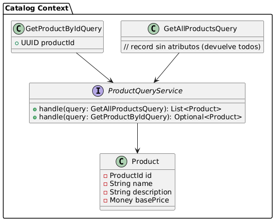

<h5 id="catalog-class-diagrams">Bounded Context Domain Layer Class Diagrams</h5>

El diagrama de clases de este contexto se centra principalmente en Product, el único aggregate de este contexto. Proporciona el nombre, descripción y precio base de cada producto que pueda ser redundado por otro contexto.
El contexto tiene dos queries que permiten la consulta de los productos, gestionados por el ProductQueryService. 

