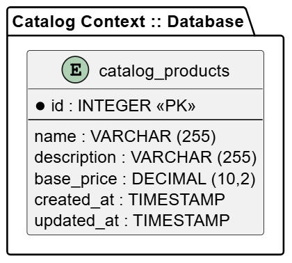

##### Bounded Context Database Design Diagram

Este contexto solo tiene una tabla, es la tabla maestra de productos de toda la aplicación. A través de esta los demás contextos podran acceder a nombre, descripción y precio base de los productos vendidos en T'Compro.

