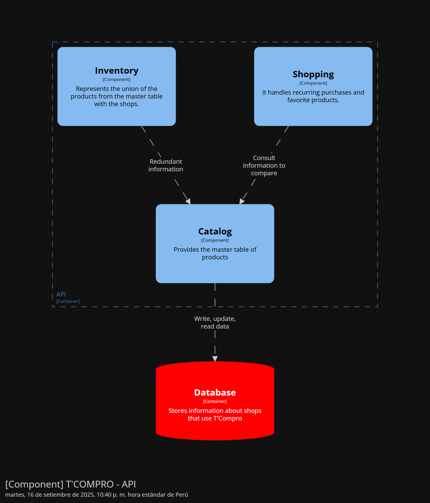

<h4 id="catalog-component-diagrams">Bounded Context Software Architecture Component Level Diagrams</h4>

El componente Catalog es un supplier de información para más contextos. Su único fin es proporcionar información de productos para gestionar el inventario de las bodegas.

