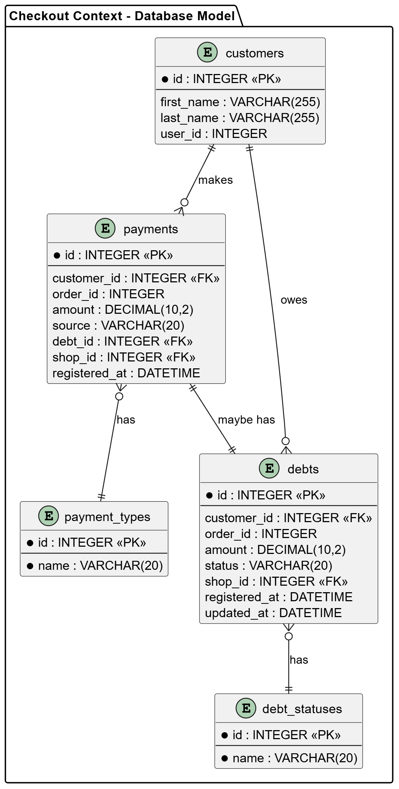

##### Bounded Context Database Design Diagram

Checkout actúa como entidad principal, mientras que Payment y Debt almacenan los registros de pagos y deudas respectivamente. Ambas entidades cuentan con una llave foránea hacia Checkout, lo que permite relacionar cada pago y deuda con su proceso de pago correspondiente.

