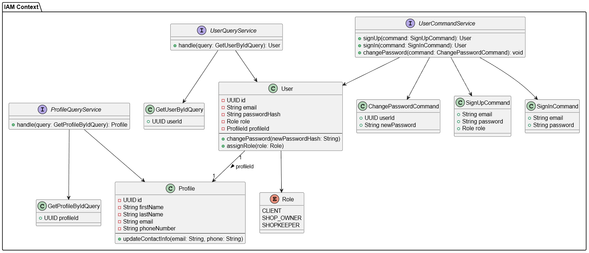

##### Bounded Context Domain Layer Class Diagrams

Las principales clases dentro de este contexto son User y Profile. User se encarga del manejo de las credenciales del usuario y su rol dentro de la aplicación. Profile se encarga de los datos personales, su relación con User es uno a uno. Es a través del SignUp que se crea tanto el User como el Profile.

