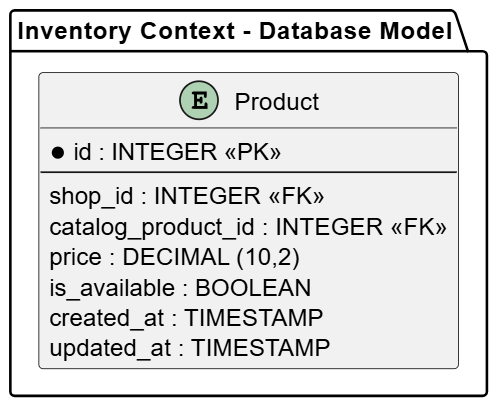

##### Bounded Context Database Design Diagram

La persistencia de los dos únicos agregados en este contexto es crucial para el buen funcionamiento de la aplicación. Tanto Inventory como Product persisten en la base de datos.

