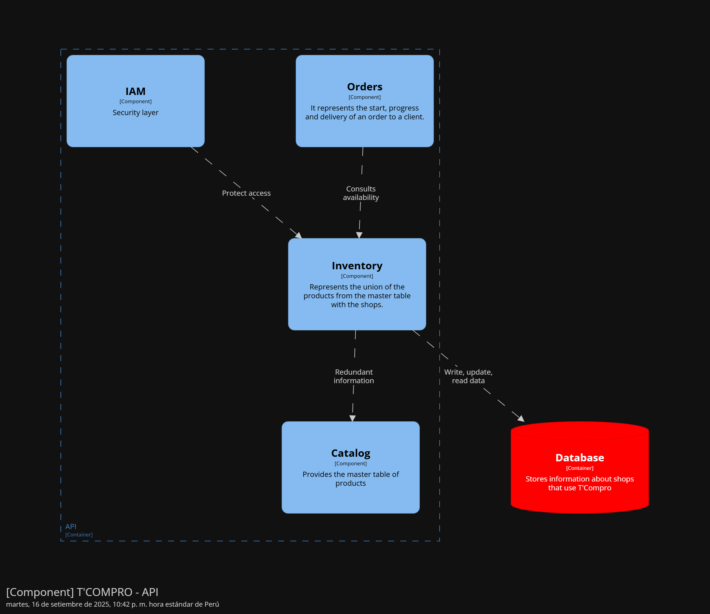

<h4 id="inventory-component-diagrams">Bounded Context Software Architecture Component Level Diagrams</h4>

El componente Inventory redunda la información de Catalog, a su vez, este componente es consultado por Store assignment y Order.

