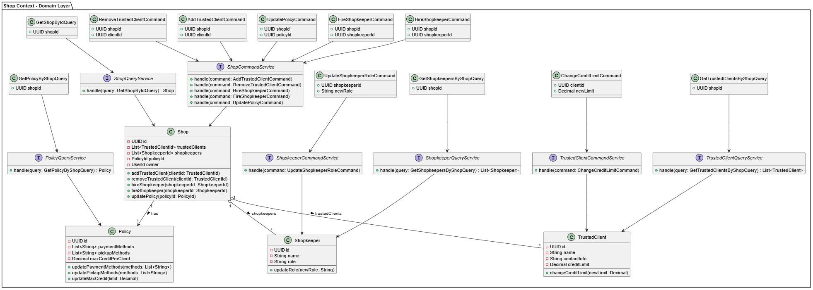

<h5 id="shop-class-diagram">Bounded Context Domain Layer Class Diagrams</h5>

Como principales clases dentro de este contexto se encuentran Shop, que es la representación lógica de la bodega, Shopkeeper, TrustedClient y Policy. Básicamente, a través de estos tres agregados, se compone la bodega en si misma. Shop puede manejar su lista de tenderos y clientes confiables a través de comandos, al igual que sus politicas. 

