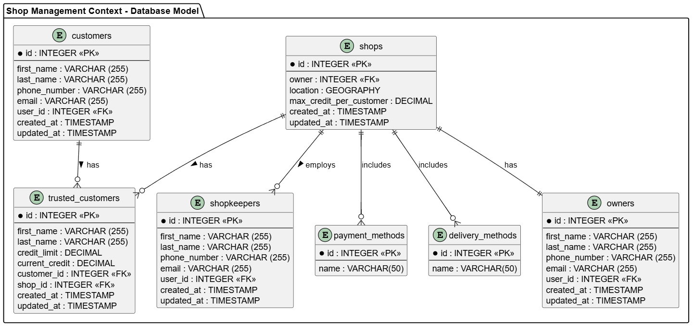

##### Bounded Context Database Design Diagram

La estructura de tablas en este contexto es sencilla, se tiene una tabla que básicamente reune IDs de otras tablas. En este caso, Shop tiene una relación uno a uno con un registro de Policy, este registro representa las policitas internas de la bodega. Shop cuenta con una lista de clientes confiables y una lista de tenderos, ambos completamente manipulables desde Shop. 

