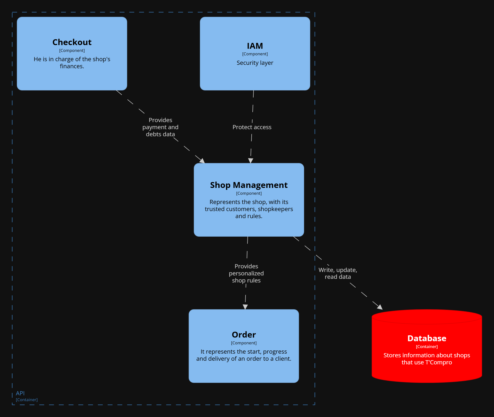

#### Bounded Context Software Architecture Component Level Diagrams

El componente Shop proporciona información relevante para las ordenes y elección de tiendas en base al carrito de productos. Es constantemente consultado por información de la bodega por otros contextos. Además, IAM protege sus endpoints.

