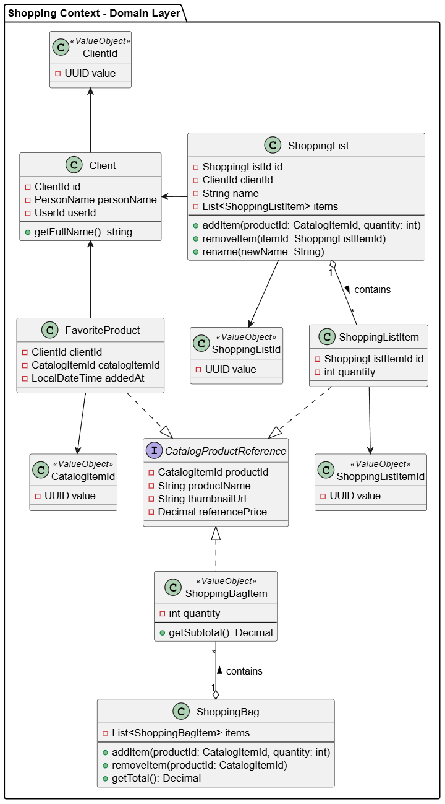

##### Bounded Context Domain Layer Class Diagrams

El componente Orders gestiona los pedidos de los clientes. Contiene como clases principales a Order y Orderline, además de un enum que permite controlar su ciclo de vida.

