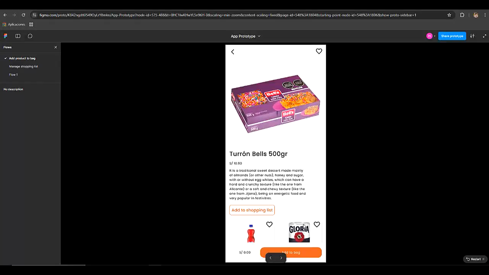

#### Mobile Applications Prototyping

**SPRINT 1**

En este primer sprint, se desarrollaron principalmente las funcionalidades core de la aplicación front end para los segmentos de Dueño y Tendero, abarcando flujos de atención de pedidos, gestión de inventario, ofertas y reglas de negocio.

Video de exploración de prototipo (T'Compro - Bodegas): [Link](https://upcedupe-my.sharepoint.com/personal/u20221e247_upc_edu_pe/_layouts/15/stream.aspx?id=%2Fpersonal%2Fu20221e247%5Fupc%5Fedu%5Fpe%2FDocuments%2Fupc%2Dpre%2D202502%2D1acc238%2D1807%2Dsoulware%2Dprototype%2Dnavigation%2Dsprint%2D1%2Emp4&nav=eyJyZWZlcnJhbEluZm8iOnsicmVmZXJyYWxBcHAiOiJTdHJlYW1XZWJBcHAiLCJyZWZlcnJhbFZpZXciOiJTaGFyZURpYWxvZy1MaW5rIiwicmVmZXJyYWxBcHBQbGF0Zm9ybSI6IldlYiIsInJlZmVycmFsTW9kZSI6InZpZXcifX0&ga=1&referrer=StreamWebApp%2EWeb&referrerScenario=AddressBarCopied%2Eview%2Eef89ba4d%2D164c%2D42a3%2Da658%2D8806a8cad528)

**SPRINT 2**

En este segundo sprint, se desarrolaron principalmente las funcionalidades core de la aplicación front end para el segmento de Cliente, abarcando flujos como el armado, modificación y eliminación de listas de compra, la exploración de productos y la comparación de tiendas para realizar un pedido.

Video de exploración de prototipo (T'Compro - Clientes): [Link](https://upcedupe-my.sharepoint.com/:v:/g/personal/u20221e247_upc_edu_pe/EfBn9PAlNgNOu961Qo-BCJgBbtN_6nXNhM_pJKHTovNTFg?nav=eyJyZWZlcnJhbEluZm8iOnsicmVmZXJyYWxBcHAiOiJTdHJlYW1XZWJBcHAiLCJyZWZlcnJhbFZpZXciOiJTaGFyZURpYWxvZy1MaW5rIiwicmVmZXJyYWxBcHBQbGF0Zm9ybSI6IldlYiIsInJlZmVycmFsTW9kZSI6InZpZXcifX0%3D&e=TQ7A1f)

