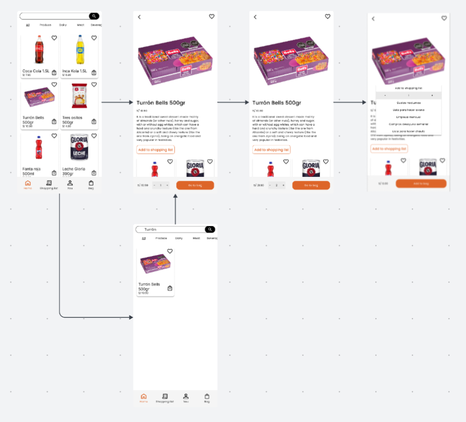
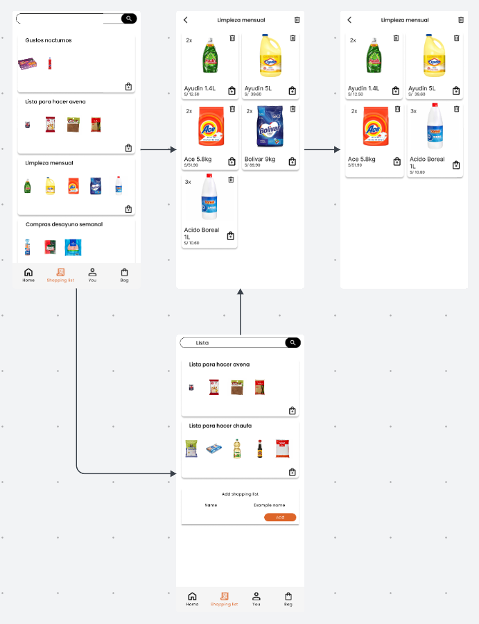
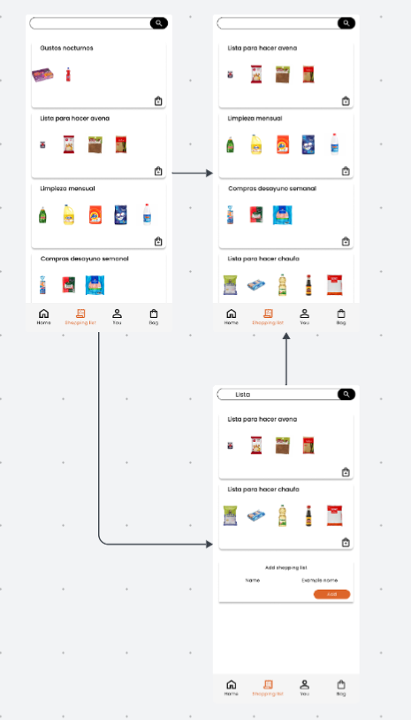
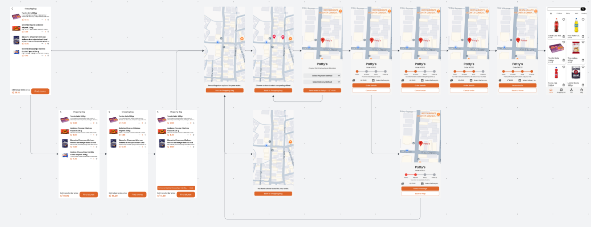

#### Mobile Applications User Flow Diagrams

**SPRINT 1**

| User Persona: Tendero. |
|----------------------------------|
| User Goal: Como tendero quiero poder aceptar o rechazar un pedido en la aplicación. | 
| Descripción: El tendero recibe una notificación de nuevo pedido y puede decidir aceptarlo para iniciar la venta o rechazarlo si no puede atenderlo. El flujo muestra ambas rutas: la confirmación del pedido aceptado y la cancelación del pedido.|
|  |

| User Persona: Dueño. |
|----------------------------------|
| User Goal: Como dueño quiero agregar productos a mi inventario. |
| Descripción: El dueño accede a la sección de inventario para añadir un nuevo producto, completando información como nombre, precio e imagen. Si los datos son válidos, el producto se agrega exitosamente; si falta información tiene que repetir el proceso.|
|  |

| User Persona: Dueño. |
|----------------------------------|
| User Goal: Como dueño quiero agregar precios personalizados a los productos que ofrezco en mi bodega para que los clientes me compren más. |
| Descripción: El dueño ingresa al inventario y selecciona un producto existente para editar su precio. Si establece un nuevo valor y lo guarda correctamente, el cambio se aplica y el producto se actualiza en la lista.|
|  |

| User Persona: Dueño. |
|----------------------------------|
| User Goal: Como dueño quiero agregar productos a mi catalogo. |
| Descripción: El dueño accede a la sección de catálogo y selecciona la opción para añadir un nuevo producto. Completa los campos requeridos, como nombre, precio e imagen. Si los datos son correctos, el producto se agrega exitosamente al catálogo.|
|  |

| User Persona: Dueño. |
|----------------------------------|
| User Goal: Como dueño de bodega quiero gestionar correctamente a mis trabajadores.|
| Descripción: El dueño de bodega accede al módulo de gestión de trabajadores y selecciona la opción para añadir un nuevo empleado. Puede hacerlo escaneando un código QR o ingresando manualmente el ID del trabajador. El sistema valida que el código o ID sea correcto y, si la verificación es exitosa, el trabajador se añade a la lista del personal. Si el código no es válido, tiene que volver a ingresar el código.|
|  |

| User Persona: Dueño. |
|----------------------------------|
| User Goal: Como dueño de bodega quiero gestionar correctamente a mis clientes conocidos. |
| Descripción: El dueño de bodega ingresa al módulo de gestión de clientes conocidos y selecciona la opción para añadir un nuevo cliente. Puede hacerlo escaneando un código QR o ingresando manualmente su ID. El sistema valida la información y, si el código es correcto, el cliente se agrega a la lista. Si el código no es válido, tiene que volver a ingresar el código.|
|  |

**SPRINT 2**

| User Persona: Cliente. |
|----------------------------------|
| User Goal: Como cliente quiero añadir un producto a una lista de compra para incluirlo como parte de una compra frecuente. |
| Descripción: El cliente busca desde home el producto que está interesado en añadir a una lista de compra recurrente. En caso de no poder encontrar el producto que se busca en la feed principal de productos, se puede recurrir a la búsqueda del producto mediante la barra de búsqueda. Finalmente, encontrado el producto, se accede a su detalle, se elige la cantidad a añadir y se lo añade a una lista. |
|  |

| User Persona: Cliente. |
|----------------------------------|
| User Goal: Como cliente quiero eliminar un producto de una lista de compra recurrente para mantener la lista actualizada solo con lo que necesito. |
| Descripción: El cliente busca desde accede a las listas de compra. Dentro de las que tenga configuradas. En caso de no poder ubicar directamente aquella que se busca, se puede optar por usar la búsqueda por el nombre configurado por el usuario. Al seleccionar una lista, se visualiza una vista con el detalle completo de la lista, mostrando todos los elementos en una grilla, con la cantidad de unidades correspondiente. Utilizando el ícono en cada card de producto, se elimina aquel que se desea dejar de incluir. |
|  |

| User Persona: Cliente. |
|----------------------------------|
| User Goal: Como cliente quiero eliminar una lista de compra recurrente para deshacerme de aquellas que ya no considero relevantes. |
| Descripción: El cliente busca desde accede a las listas de compra. Dentro de las que tenga configuradas, se busca aquella que se desea eliminar. En caso de no poder ubicar directamente aquella que se busca, se puede optar por usar la búsqueda por el nombre configurado por el usuario. Una vez ubicada la lista, haciendo uso del ícono de eliminación, se la retira del conjunto de compras recurrentes. |
|  |

| User Persona: Cliente. |
|----------------------------------|
| User Goal: Como cliente quiero comprar tiendas que ofrecen lo que busco para conseguir la mejor oferta. |
| Descripción: El cliente empieza este flujo desde su bolsa de compras. En ella, si lo desea, puede realizar ajustes como la cantidad de cada producto o quitar alguno, inclusive. Tras empezar la búsqueda de tiendas, se abrirá una interfaz con una vista de mapa, mostrando todas las tiendas que pudieran atender el pedido. En caso no se encontrara ninguna, se informa al usuario de la situación. Al encontrar tiendas y escoger alguna, se puede observar el precio específico del pedido, que puede variar de tienda a tienda dadas las ofertas que tenga para los productos o la modalidad de entrega. El usuario puede repetir este proceso de simulación de precio con cuantas tiendas desee, hasta estar conforme. Tras ello, se envía la orden, que en caso de ser aceptada, procede paso a paso, cambiando el estado de la orden, visible para el usuario en una barra de progresión. El proceso termina en caso de llegar al último estado, tras lo cual se vuelve a la vista principal. |
|  |