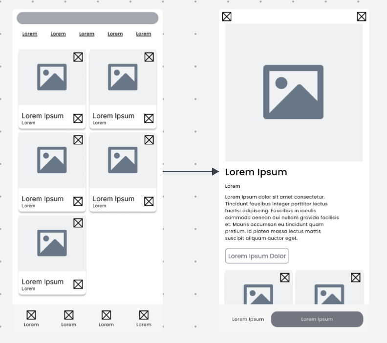
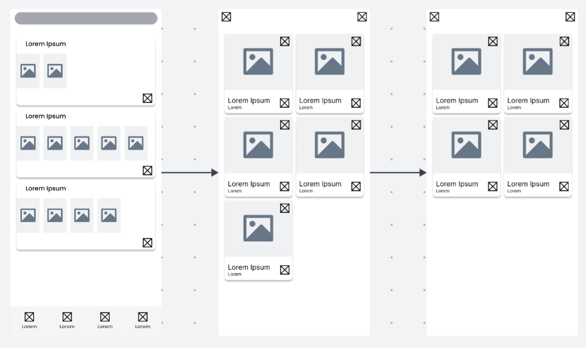
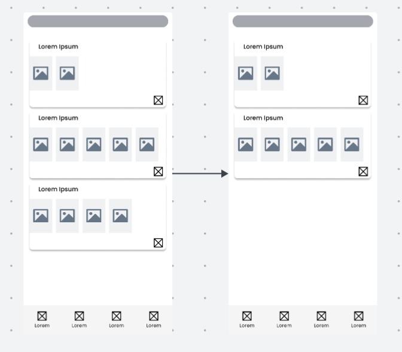
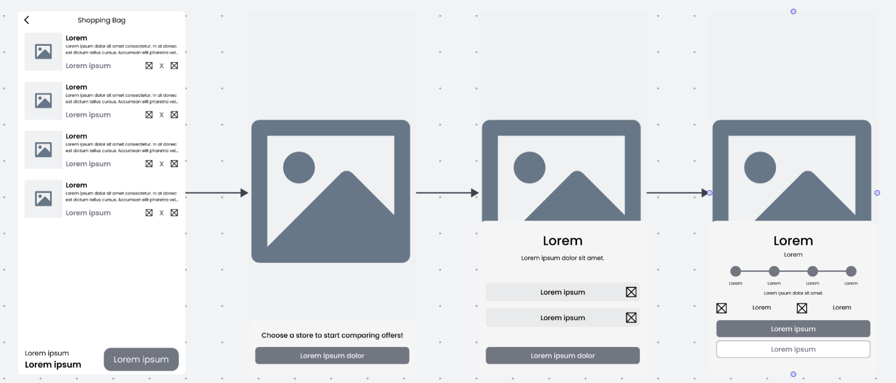

#### Mobile Applications Wireflow Diagrams

**SPRINT 1**

| User Persona: Tendero. |
|----------------------------------|
| User Goal: Como tendero quiero visualizar los pedidos que llegan a la bodega para organizar correctamente mi tiempo. |
|  |

| User Persona: Tendero. |
|----------------------------------|
| User Goal: Como tendero quiero aceptar un pedido de la bodega para realizar la venta. |
|  |

| User Persona: Tendero. |
|----------------------------------|
| User Goal: Como tendero quiero rechazar un pedido de la bodega para indicar que no puedo atenderlo. |
|  |

| User Persona: Tendero. |
|----------------------------------|
| User Goal: Como tendero quiero marcar un pedido como listo para que mi cliente sepa que puede pasar por él o que está en camino. |
|  |

| User Persona: Dueño. |
|----------------------------------|
| User Goal: Como dueño quiero eliminar productos de mi inventario para evitar que mis clientes hagan pedidos de productos que no tengo disponibles. |
|  |

| User Persona: Dueño. |
|----------------------------------|
| User Goal: Como dueño quiero agregar precios personalizados a los productos que ofrezco en mi bodega para que los clientes me compren más. |
|  |

| User Persona: Dueño. |
|----------------------------------|
| User Goal: Como dueño de bodega quiero añadir tenderos para gestionar correctamente a mis trabajadores. |
|  |

**SPRINT 2**

| User Persona: Cliente. |
|----------------------------------|
| User Goal: Como cliente quiero añadir un producto a una lista de compra para incluirlo como parte de una compra frecuente. |
|  |

| User Persona: Cliente. |
|----------------------------------|
| User Goal: Como cliente quiero eliminar un producto de una lista de compra recurrente para mantener la lista actualizada solo con lo que necesito. |
|  |

| User Persona: Cliente. |
|----------------------------------|
| User Goal: Como cliente quiero eliminar una lista de compra recurrente para deshacerme de aquellas que ya no considero relevantes. |
|  |

| User Persona: Cliente. |
|----------------------------------|
| User Goal: Como cliente quiero comprar tiendas que ofrecen lo que busco para conseguir la mejor oferta. |
|  |

