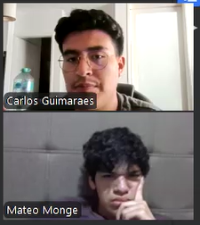

### Registro de entrevistas

**DUEÑOS**

<table>
    <thead>
        <tr>
            <th scope="row">Segmento</th>
            <td style="width:30%;">Dueños</td>
        </tr>
    </thead>
    <tbody>
        <tr>
            <td>
                <strong>Nombre:</strong> 
                <strong>Edad:</strong> 
                <strong>Distrito:</strong>  
                <strong>Enlace:</strong> <a href="">Entrevista en Stream</a> 
                <strong>Inicio:</strong> 00:00 - 00:00 
            </td>
            <td></td>
        </tr>
        <tr>
            <td colspan="2">
                <strong>Resumen:</strong> 
                 
            </td>
        </tr>
        <tr>
            <td>
                <strong>Nombre:</strong> 
                <strong>Edad:</strong> 
                <strong>Distrito:</strong>  
                <strong>Enlace:</strong> <a href="">Entrevista en Stream</a> 
                <strong>Inicio:</strong> 00:00 - 00:00 
            </td>
            <td></td>
        </tr>
        <tr>
            <td colspan="2">
                <strong>Resumen:</strong> 
                 
            </td>
        </tr>
    </tbody>
</table>

**TENDEROS**

<table>
    <thead>
        <tr>
            <th scope="row">Segmento</th>
            <td style="width:30%;">Tenderos</td>
        </tr>
    </thead>
    <tbody>
        <tr>
            <td>
                <strong>Nombre:</strong> Juan Montes 
                <strong>Edad:</strong> 22 años 
                <strong>Distrito:</strong> La Molina 
                <strong>Enlace:</strong> <a href="">Entrevista en Stream</a> 
                <strong>Inicio:</strong>... - ... 
            </td>
            <td></td>
        </tr>
        <tr>
            <td colspan="2">
                <strong>Resumen:</strong> 
                Juan nos comenta que la interfaz tanto de la landing page como de la aplicación movil le parecen amigables y funcionales. Considera que es una aplicacion que se ve facil de usar y que además cumple con las tareas que realiza como tendero. Una mejora que considera que aportaría, es que la aplicación pueda notificar cuando llegue una orden nueva, sin necesidad de estar recargando o entrado a la aplicación, ya que como tendero, también tiene que atender presencialmente y no puede estar todo el tiempo en la aplicación.
            </td>
        </tr>
        <tr>
            <td>
                <strong>Nombre:</strong> Mateo Monge 
                <strong>Edad:</strong>24 
                <strong>Distrito:</strong>Surco 
                <strong>Enlace:</strong> <a href="">Entrevista en Stream</a> 
                <strong>Inicio:</strong> ...-... 
            </td>
            <td></td>
        </tr>
        <tr>
            <td colspan="2">
                <strong>Resumen:</strong> 
                Mateo opina que la interfaz de la landing page le parece bastante llamativa y cumple con el propósito de informar acerca de las funcionalidades de la aplicación propuesta. Además, despues de haber conocido la aplicación, considera que es fácil de usar tanto para él como para los dueños de la bodega gracias a la vista de los dos tabs que contiene cada feature. Sin embargo, como recomendación basada en su gusto personal, opina que la vista de catálogo se ve un poco sobrecargada por lo cual considera que es un aspecto a mejorar de manera visual. A pesar de ello, cree que cumple con los requisitos principales para realizar de manera efectiva su labor como tendero.
            </td>
        </tr>
    </tbody>
</table>

**CLIENTES**

<table>
    <thead>
        <tr>
            <th scope="row">Segmento</th>
            <td style="width:30%;">Clientes</td>
        </tr>
    </thead>
    <tbody>
        <tr>
            <td>
                <strong>Nombre:</strong> 
                <strong>Edad:</strong> 
                <strong>Distrito:</strong>  
                <strong>Enlace:</strong> <a href="">Entrevista en Stream</a> 
                <strong>Inicio:</strong> 00:00 - 00:00 
            </td>
            <td></td>
        </tr>
        <tr>
            <td colspan="2">
                <strong>Resumen:</strong> 
                 
            </td>
        </tr>
        <tr>
            <td>
                <strong>Nombre:</strong> 
                <strong>Edad:</strong> 
                <strong>Distrito:</strong>  
                <strong>Enlace:</strong> <a href="">Entrevista en Stream</a> 
                <strong>Inicio:</strong> 00:00 - 00:00 
            </td>
            <td></td>
        </tr>
        <tr>
            <td colspan="2">
                <strong>Resumen:</strong> 
                 
            </td>
        </tr>
    </tbody>
</table>

