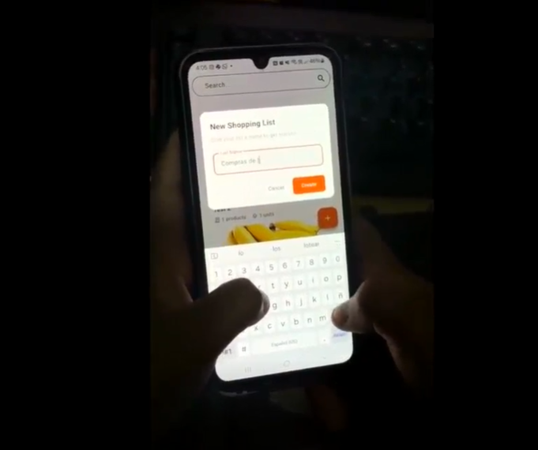
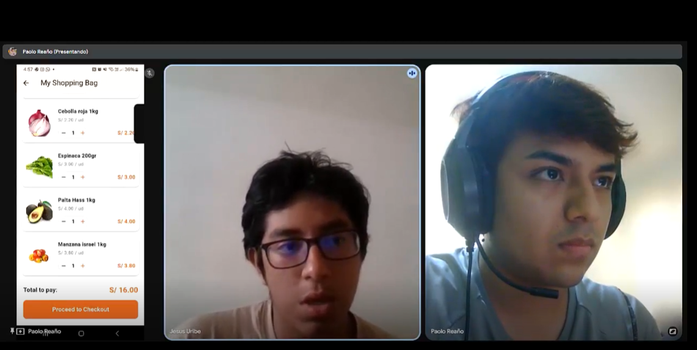
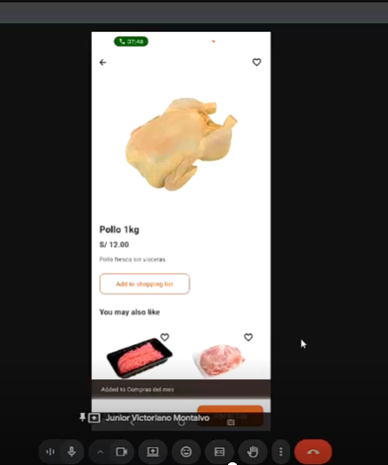
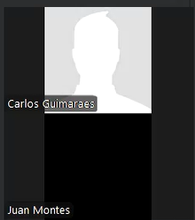

<h3 id="validation-registry">Registro de entrevistas</h3>

**CLIENTES**

<table>
    <thead>
        <tr>
            <th scope="row">Segmento</th>
            <td style="width:30%;">Clientes</td>
        </tr>
    </thead>
    <tbody>
        <tr>
            <td>
                <strong>Nombre:</strong> María Angélica Ramos Quispe 
                <strong>Edad:</strong> 21 años 
                <strong>Distrito:</strong> San Juan de Lurigancho 
                <strong>Enlace:</strong> <a href="https://upcedupe-my.sharepoint.com/personal/u20221e247_upc_edu_pe/_layouts/15/stream.aspx?id=%2Fpersonal%2Fu20221e247%5Fupc%5Fedu%5Fpe%2FDocuments%2Fupc%2Dpre%2D202502%2Dcc238%2D1807%2Dsoulware%2Dvalidation%2Dsprint%2D3%2Emp4&nav=eyJyZWZlcnJhbEluZm8iOnsicmVmZXJyYWxBcHAiOiJPbmVEcml2ZUZvckJ1c2luZXNzIiwicmVmZXJyYWxBcHBQbGF0Zm9ybSI6IldlYiIsInJlZmVycmFsTW9kZSI6InZpZXciLCJyZWZlcnJhbFZpZXciOiJNeUZpbGVzTGlua0NvcHkifX0&ga=1&referrer=StreamWebApp%2EWeb&referrerScenario=AddressBarCopied%2Eview%2E750bae49%2D162f%2D4dde%2Da1dd%2D63a233195f88&isDarkMode=false">Entrevista en Stream</a> 
                <strong>Inicio:</strong> 00:00 - 04:59 
            </td>
            <td></td>
        </tr>
        <tr>
            <td colspan="2">
                <strong>Resumen:</strong> 
                María fue rápida en tomar la aplicación y navegarla. Los sistemas de filtrado y navegación le resultaron bastante intuitivos, destacándolos positivamente. Sin embargo, también fue rápida en ayudarnos a identificar una serie de carencias: 
                Primero, dado que el teléfono en que se hizo la prueba utilizaba el modo oscuro, se pudo identificar que el modo oscuro afectaba negativamente a la visibilidad, pues la interfaz se mantenía con colores claros y el texto se volvía de un gris tenue, comportamiento que escapó del alcance de las pruebas previa al lanzamiento de la primera versión. 
                Segundo, no es posible navegar del detalle de un producto al detalle de otro producto. Este flujo de navegación fue bastante natural para ella, y el choque de la funcionalidad de la aplicación en contraste con su expectativa claramente refleja una oportunidad de mejora.
                 
            </td>
        </tr>
        <tr>
            <td>
                <strong>Nombre:</strong> Jesús Guillermo Uribe Quispe 
                <strong>Edad:</strong> 21 años 
                <strong>Distrito:</strong> San Borja 
                <strong>Enlace:</strong> <a href="https://upcedupe-my.sharepoint.com/personal/u20221e247_upc_edu_pe/_layouts/15/stream.aspx?id=%2Fpersonal%2Fu20221e247%5Fupc%5Fedu%5Fpe%2FDocuments%2Fupc%2Dpre%2D202502%2Dcc238%2D1807%2Dsoulware%2Dvalidation%2Dsprint%2D3%2Emp4&nav=eyJyZWZlcnJhbEluZm8iOnsicmVmZXJyYWxBcHAiOiJPbmVEcml2ZUZvckJ1c2luZXNzIiwicmVmZXJyYWxBcHBQbGF0Zm9ybSI6IldlYiIsInJlZmVycmFsTW9kZSI6InZpZXciLCJyZWZlcnJhbFZpZXciOiJNeUZpbGVzTGlua0NvcHkifX0&ga=1&referrer=StreamWebApp%2EWeb&referrerScenario=AddressBarCopied%2Eview%2E750bae49%2D162f%2D4dde%2Da1dd%2D63a233195f88&isDarkMode=false">Entrevista en Stream</a> 
                <strong>Inicio:</strong> 05:00 - 09:05 
            </td>
            <td></td>
        </tr>
        <tr>
            <td colspan="2">
                <strong>Resumen:</strong> 
                Jesús es desarrollador de software. Su experiencia navegando la aplicación tuvo un enfoque un poco más analítico. Destaco de la aplicación su minimalismo, resaltando que es importante que las aplicaciones móviles no cansen la vista. Además, señaló como especialmente útil la funcionalidad de las listas de compra, relacionandolo con su quehacer cotidiano. 
                En líneas generales, en esta entrevista no se encontraron las mismas falencias que en la anterior. El equipo concuerda en que se debe a que el entrevistado no tuvo una interacción directa con el dispositivo, eliminando la posibilidad de un feedback resultado de la experiencia táctil que comúnmente evoca expectativas respecto a la navegación o la distribución de los elementos.
                 
            </td>
        </tr>
        <tr>
            <td>
                <strong>Nombre:</strong> Junior Victoriano Montalvo 
                <strong>Edad: </strong> 23 años 
                <strong>Distrito:</strong> San Juan de Lurigancho 
                <strong>Enlace:</strong> <a href="https://upcedupe-my.sharepoint.com/personal/u20221e247_upc_edu_pe/_layouts/15/stream.aspx?id=%2Fpersonal%2Fu20221e247%5Fupc%5Fedu%5Fpe%2FDocuments%2Fupc%2Dpre%2D202502%2Dcc238%2D1807%2Dsoulware%2Dvalidation%2Dsprint%2D3%2Emp4&nav=eyJyZWZlcnJhbEluZm8iOnsicmVmZXJyYWxBcHAiOiJPbmVEcml2ZUZvckJ1c2luZXNzIiwicmVmZXJyYWxBcHBQbGF0Zm9ybSI6IldlYiIsInJlZmVycmFsTW9kZSI6InZpZXciLCJyZWZlcnJhbFZpZXciOiJNeUZpbGVzTGlua0NvcHkifX0&ga=1&referrer=StreamWebApp%2EWeb&referrerScenario=AddressBarCopied%2Eview%2E750bae49%2D162f%2D4dde%2Da1dd%2D63a233195f88&isDarkMode=false">Entrevista en Stream</a> 
                <strong>Inicio:</strong> 09:05 - 13:05 
            </td>
            <td></td>
        </tr>
        <tr>
            <td colspan="2">
                <strong>Resumen:</strong> 
                Junior no tuvo mucho que comentar sobre la aplicación. La distribución del espacio y la ubicación de los elementos como los sistemas de navegación y filtrado le resultaron bastante naturales. También destacó que la funcionalidad de listas de compra le sería especialmente en compras grandes que se suelen hacer a fin de mes.
                 
            </td>
        </tr>
    </tbody>
</table>

**TENDEROS**

<table>
    <thead>
        <tr>
            <th scope="row">Segmento</th>
            <td style="width:30%;">Tenderos</td>
        </tr>
    </thead>
    <tbody>
    <tr>
            <td>
                <strong>Nombre:</strong> Mateo Monge 
                <strong>Edad:</strong>24 
                <strong>Distrito:</strong>Surco 
                <strong>Enlace:</strong> <a href="https://upcedupe-my.sharepoint.com/personal/u20221e247_upc_edu_pe/_layouts/15/stream.aspx?id=%2Fpersonal%2Fu20221e247%5Fupc%5Fedu%5Fpe%2FDocuments%2Fupc%2Dpre%2D202502%2Dcc238%2D1807%2Dsoulware%2Dvalidation%2Dsprint%2D3%2Emp4&nav=eyJyZWZlcnJhbEluZm8iOnsicmVmZXJyYWxBcHAiOiJPbmVEcml2ZUZvckJ1c2luZXNzIiwicmVmZXJyYWxBcHBQbGF0Zm9ybSI6IldlYiIsInJlZmVycmFsTW9kZSI6InZpZXciLCJyZWZlcnJhbFZpZXciOiJNeUZpbGVzTGlua0NvcHkifX0&ga=1&referrer=StreamWebApp%2EWeb&referrerScenario=AddressBarCopied%2Eview%2E750bae49%2D162f%2D4dde%2Da1dd%2D63a233195f88&isDarkMode=false">Entrevista en Stream</a> 
                <strong>Inicio:</strong> 13:06 - 17:59 
            </td>
            <td></td>
        </tr>
        <tr>
            <td colspan="2">
                <strong>Resumen:</strong> 
                Mateo opina que la interfaz de la landing page le parece bastante llamativa y cumple con el propósito de informar acerca de las funcionalidades de la aplicación propuesta. Además, despues de haber conocido la aplicación, considera que es fácil de usar tanto para él como para los dueños de la bodega gracias a la vista de los dos tabs que contiene cada feature. Sin embargo, como recomendación basada en su gusto personal, opina que la vista de catálogo se ve un poco sobrecargada por lo cual considera que es un aspecto a mejorar de manera visual. A pesar de ello, cree que cumple con los requisitos principales para realizar de manera efectiva su labor como tendero.
            </td>
        </tr>
        <tr>
            <td>
                <strong>Nombre:</strong> Juan Montes 
                <strong>Edad:</strong> 22 años 
                <strong>Distrito:</strong> La Molina 
                <strong>Enlace:</strong> <a href="https://upcedupe-my.sharepoint.com/personal/u20221e247_upc_edu_pe/_layouts/15/stream.aspx?id=%2Fpersonal%2Fu20221e247%5Fupc%5Fedu%5Fpe%2FDocuments%2Fupc%2Dpre%2D202502%2Dcc238%2D1807%2Dsoulware%2Dvalidation%2Dsprint%2D3%2Emp4&nav=eyJyZWZlcnJhbEluZm8iOnsicmVmZXJyYWxBcHAiOiJPbmVEcml2ZUZvckJ1c2luZXNzIiwicmVmZXJyYWxBcHBQbGF0Zm9ybSI6IldlYiIsInJlZmVycmFsTW9kZSI6InZpZXciLCJyZWZlcnJhbFZpZXciOiJNeUZpbGVzTGlua0NvcHkifX0&ga=1&referrer=StreamWebApp%2EWeb&referrerScenario=AddressBarCopied%2Eview%2E750bae49%2D162f%2D4dde%2Da1dd%2D63a233195f88&isDarkMode=false">Entrevista en Stream</a> 
                <strong>Inicio:</strong> 18:00 - 22:47  
            </td>
            <td></td>
        </tr>
        <tr>
            <td colspan="2">
                <strong>Resumen:</strong> 
                Juan nos comenta que la interfaz tanto de la landing page como de la aplicación movil le parecen amigables y funcionales. Considera que es una aplicacion que se ve facil de usar y que además cumple con las tareas que realiza como tendero. Una mejora que considera que aportaría, es que la aplicación pueda notificar cuando llegue una orden nueva, sin necesidad de estar recargando o entrado a la aplicación, ya que como tendero, también tiene que atender presencialmente y no puede estar todo el tiempo en la aplicación.
            </td>
        </tr>
    </tbody>
</table>

