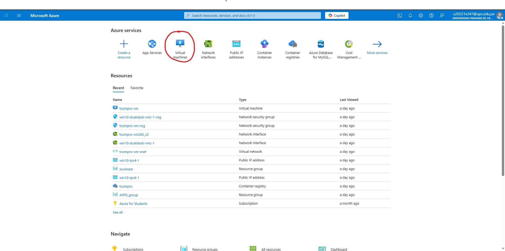
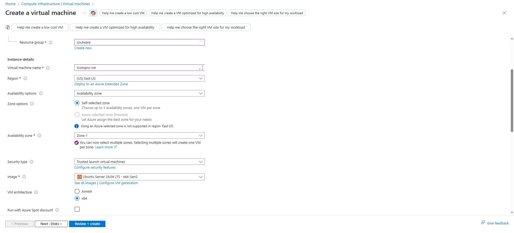
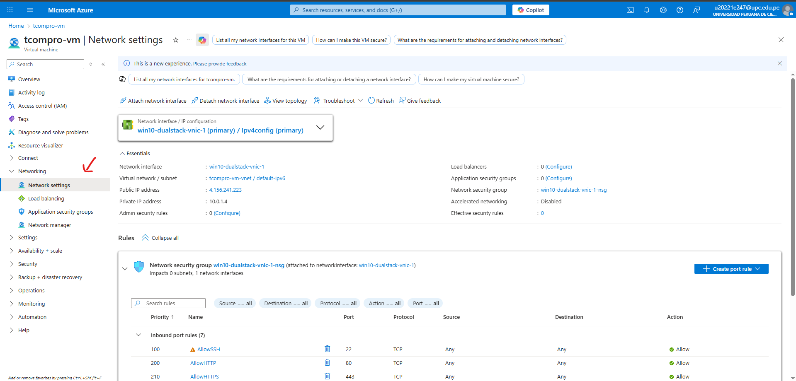
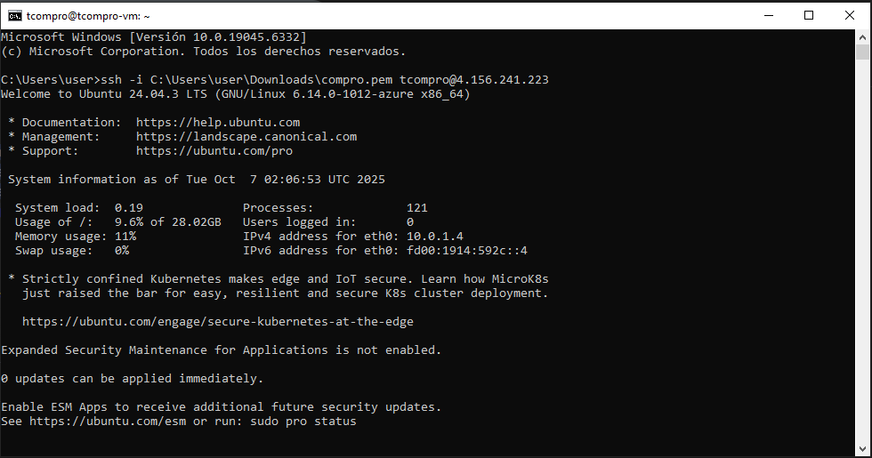
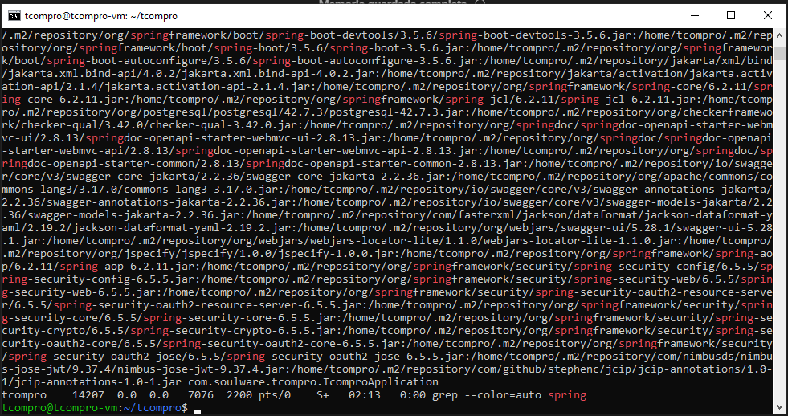
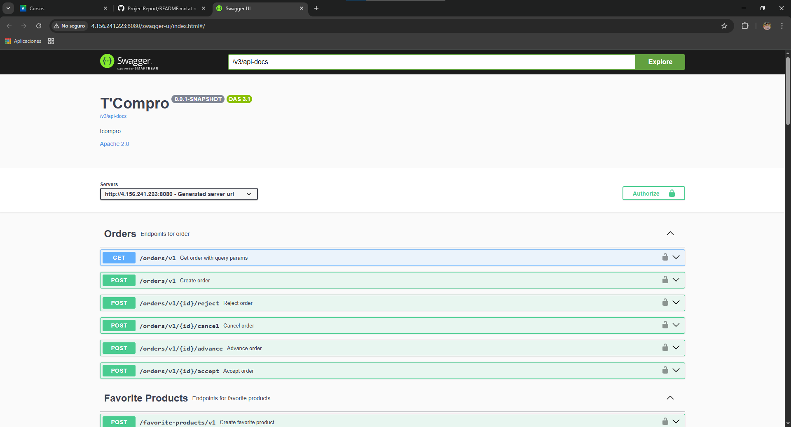

<h4 id="software-deployment-evidence-for-sprint-review-1">Software Deployment Evidence for Sprint Review</h4>

Para este primer sprint, se desplegaron los siguientes servicios / productos:

**Backend: API RESTful**

El despliegue se realizó en Azure, en un entorno de baja configuración mediante una virtual machine y contenedores Docker, asegurando soporte de IPv6 necesario para conexión con servicios utilizados para el desarrollo, como Supabase

Enlace de Swagger Documentation del API: [Enlace](http://4.156.241.223:8080/swagger-ui/index.html#/)

1. Entrar a Azure e ir a Maquinas virtuales

2. Seleccionamos la opción de crear una nueva maquina virtual

3. Configurar la maquina virtual dentro del grupo de recursos de Soulware. El sistema operativo es Ubuntu 24.04, abriento los puertos 80, 443, 22 para las conexiones externas. Posterior a las configuraciones, creamos la maquina virtual.

4. Cuando el despliegue de la maquina virtual termine, nos dirigimos a sus configuraciones de red. Dentro cambiamos a una network interface que soporte IPv6.

5. Posterior a ello, con la clave privada SSH que se genero al crear la maquina virtual, ingresamos a ella a través del CMD.

6. Dentro de la maquina virtual, ejecutamos comandos para instalar y actualizar paquetes del sistema operativo. Instalamos Java 17, Maven, Git y habilitamos el firewall para que permita la entrada en el puerto 8080. 

7. Clonamos el repositorio dentro de la maquina virtual y definimos las variables de entorno para la ejecución del backend.

8. Corremos la aplicación en segundo plano y verificamos mediante logs que se encuentre operativo.

9. Verificamos la disponibilidad del servicio a través de una computadora local.

