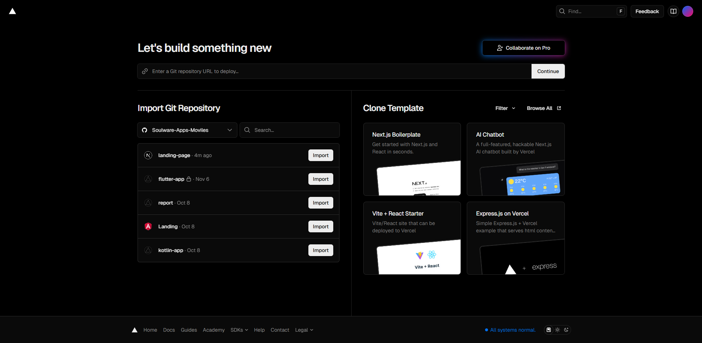
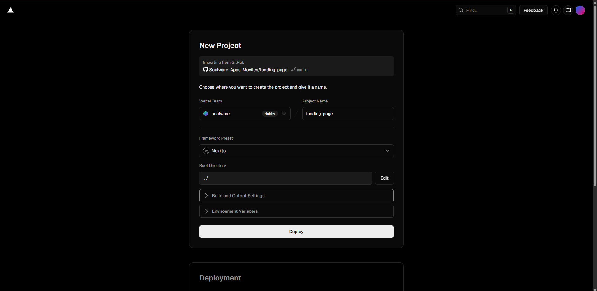

<h4 id="software-deployment-evidence-for-sprint-review-2">Software Deployment Evidence for Sprint Review</h4>

**LANDING PAGE**

Enlace a la landing page desplegada [Deploy en Vercel](https://landing-page-theta-opal-36.vercel.app/es/clientes)

Dado el desarrollo de la landing page utilizando Next.js, se optó por realizar un despliegue utlizando Vercel, plataforma para despliegue de aplicaciones de todo tipo desarrollada por el mismo equipo que desarrolla Next.js

1. Configuración de la organización

Se concede permiso a Vercel App (Aplicación de GitHub) para acceder a los proyectos de la organización y se configura su acceso al proyecto `landing-page`.

2. Configuración del proyecto

Tras elegir el proyecto, se deja la configuración básica, dado que al estar desarrollada la landing page con Next.js, Vercel proporciona una configuración predeterminada completa para proyectos de este tipo.

