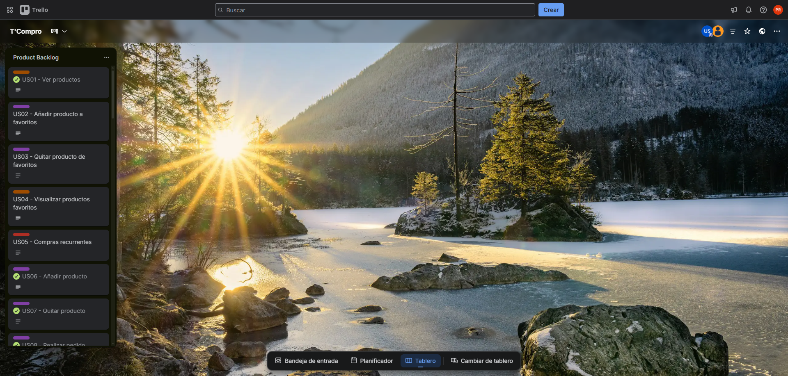

#### Sprint Backlog 2

El tablero del segundo sprint refleja las funcionalidades planificadas en el sprint planning 2, además de abarcar todas aquellas que quedaron como deuda técnica del anterior sprint.

<a href="https://trello.com/b/m7gJMODs/tcompro" target="_blank">Ver tablero en Trello</a>

<table cellpadding="6" cellspacing="0">
    <tr>
        <th colspan="8">Sprint #</th>
        <td colspan="8">Sprint 2</td>
    </tr>
    <tr>
        <th colspan="2">User Story</th>
        <th colspan="6">Work-Item / Task</th>
    </tr>
    <tr>
        <th>Id</th>
        <th>Title</th>
        <th>Id</th>
        <th>Title</th>
        <th>Description</th>
        <th>Estimation (Hours)</th>
        <th>Assigned To</th>
        <th>Status (To-Do / In-Process / To-Review / Done)</th>
    </tr>
    <tr>
        <td>SWR01</td>
        <td>Hero section - Bodegas</td>
        <td>SWR01-01</td>
        <td>Incorporar soporte i18n para textos de la sección</td>
        <td>Definir claves de traducción para los textos visibles (encabezado, subtítulo y botón de acción) en el diccionario i18n y enlazarlas al componente estático, garantizando soporte para español e inglés.</td>
        <td>1</td>
        <td>Orozco Torres, Álvaro Joaquín</td>
        <td>Done</td>
    </tr>
    <tr>
        <td>SWR01</td>
        <td>Hero section - Bodegas</td>
        <td>SWR01-02</td>
        <td>Implementar estructura HTML de la sección</td>
        <td>Desarrollar la estructura semántica HTML de la sección hero, incluyendo encabezado, subtítulo y botón de acción principal, conforme al diseño aprobado.</td>
        <td>1</td>
        <td>Orozco Torres, Álvaro Joaquín</td>
        <td>Done</td>
    </tr>
    <tr>
        <td>SWR01</td>
        <td>Hero section - Bodegas</td>
        <td>SWR01-03</td>
        <td>Aplicar estilos y diseño responsivo</td>
        <td>Implementar estilos CSS y media queries para asegurar que la sección hero mantenga su composición visual y legibilidad en dispositivos móviles, tablet y escritorio.</td>
        <td>1</td>
        <td>Orozco Torres, Álvaro Joaquín</td>
        <td>Done</td>
    </tr>
    <tr>
        <td>SWR01</td>
        <td>Hero section - Bodegas</td>
        <td>SWR01-04</td>
        <td>Configurar enlace de descarga o adquisición</td>
        <td>Vincular el botón de acción con la ruta o recurso que permite la descarga o adquisición del producto para el segmento bodegas, asegurando su correcto funcionamiento.</td>
        <td>1</td>
        <td>Orozco Torres, Álvaro Joaquín</td>
        <td>Done</td>
    </tr>
    <tr>
        <td>SWR02</td>
        <td>Funcionalidades - Bodegas</td>
        <td>SWR02-01</td>
        <td>Incorporar soporte i18n para textos de la sección</td>
        <td>Definir claves de traducción para los textos de la sección en el diccionario i18n y enlazarlas al componente estático, garantizando soporte para español e inglés.</td>
        <td>1</td>
        <td>Orozco Torres, Álvaro Joaquín</td>
        <td>Done</td>
    </tr>
    <tr>
        <td>SWR02</td>
        <td>Funcionalidades - Bodegas</td>
        <td>SWR02-02</td>
        <td>Implementar estructura HTML de la sección</td>
        <td>Crear la estructura semántica HTML que contenga los íconos, títulos y descripciones de las funcionalidades principales orientadas al segmento bodegas.</td>
        <td>1</td>
        <td>Orozco Torres, Álvaro Joaquín</td>
        <td>Done</td>
    </tr>
    <tr>
        <td>SWR02</td>
        <td>Funcionalidades - Bodegas</td>
        <td>SWR02-03</td>
        <td>Aplicar estilos y diseño responsivo</td>
        <td>Implementar el diseño CSS y media queries para asegurar una correcta visualización de la sección en distintos dispositivos y tamaños de pantalla.</td>
        <td>1</td>
        <td>Orozco Torres, Álvaro Joaquín</td>
        <td>Done</td>
    </tr>
    <tr>
        <td>SWR02</td>
        <td>Funcionalidades - Bodegas</td>
        <td>SWR02-04</td>
        <td>Integrar animaciones y efectos de entrada</td>
        <td>Agregar animaciones suaves al desplazarse o al visualizar las funcionalidades, usando librerías ligeras o CSS transitions para mejorar la experiencia visual.</td>
        <td>1</td>
        <td>Orozco Torres, Álvaro Joaquín</td>
        <td>Done</td>
    </tr>
    <tr>
        <td>SWR03</td>
        <td>Testimonios - Bodegas</td>
        <td>SWR03-01</td>
        <td>Incorporar soporte i18n para textos de la sección</td>
        <td>Definir claves de traducción para los textos de encabezados, subtítulos y testimonios en el diccionario i18n, asegurando soporte completo en español e inglés para esta sección.</td>
        <td>1</td>
        <td>Orozco Torres, Álvaro Joaquín</td>
        <td>Done</td>
    </tr>
    <tr>
        <td>SWR03</td>
        <td>Testimonios - Bodegas</td>
        <td>SWR03-02</td>
        <td>Implementar estructura HTML de testimonios</td>
        <td>Desarrollar la estructura HTML que contenga al menos tres testimonios de usuarios del segmento bodegas, incluyendo nombre, foto, ubicación y comentario, conforme al diseño establecido.</td>
        <td>1</td>
        <td>Orozco Torres, Álvaro Joaquín</td>
        <td>Done</td>
    </tr>
    <tr>
        <td>SWR03</td>
        <td>Testimonios - Bodegas</td>
        <td>SWR03-03</td>
        <td>Aplicar estilos y diseño responsivo</td>
        <td>Implementar los estilos CSS para la disposición y formato visual de los testimonios, asegurando que la sección se adapte correctamente a distintas resoluciones y dispositivos.</td>
        <td>1</td>
        <td>Orozco Torres, Álvaro Joaquín</td>
        <td>Done</td>
    </tr>
    <tr>
        <td>SWR03</td>
        <td>Testimonios - Bodegas</td>
        <td>SWR03-04</td>
        <td>Integrar carrusel o animación de transición</td>
        <td>Agregar funcionalidad de desplazamiento automático o manual de testimonios mediante un carrusel ligero o animaciones CSS, mejorando la interacción del usuario.</td>
        <td>1</td>
        <td>Orozco Torres, Álvaro Joaquín</td>
        <td>Done</td>
    </tr>
    <tr>
        <td>SWR05</td>
        <td>Hero section - Clientes</td>
        <td>SWR05-01</td>
        <td>Incorporar soporte i18n para textos de la sección</td>
        <td>Definir claves de traducción para los textos de la sección hero del segmento clientes (encabezado, subtítulo y botón de acción) en el diccionario i18n, garantizando soporte para español e inglés.</td>
        <td>1</td>
        <td>Orozco Torres, Álvaro Joaquín</td>
        <td>Done</td>
    </tr>
    <tr>
        <td>SWR05</td>
        <td>Hero section - Clientes</td>
        <td>SWR05-02</td>
        <td>Implementar estructura HTML de la sección</td>
        <td>Desarrollar la estructura semántica HTML de la sección hero específica para el segmento clientes, incluyendo encabezado, subtítulo y botón de llamada a la acción.</td>
        <td>1</td>
        <td>Orozco Torres, Álvaro Joaquín</td>
        <td>Done</td>
    </tr>
    <tr>
        <td>SWR05</td>
        <td>Hero section - Clientes</td>
        <td>SWR05-03</td>
        <td>Aplicar estilos y diseño responsivo</td>
        <td>Implementar los estilos CSS para garantizar la correcta visualización y legibilidad de la sección hero en dispositivos móviles, tablets y pantallas de escritorio.</td>
        <td>1</td>
        <td>Orozco Torres, Álvaro Joaquín</td>
        <td>Done</td>
    </tr>
    <tr>
        <td>SWR05</td>
        <td>Hero section - Clientes</td>
        <td>SWR05-04</td>
        <td>Configurar enlace de descarga o registro</td>
        <td>Vincular el botón principal de la sección hero con la página o recurso de descarga o registro correspondiente al segmento clientes, asegurando su correcto funcionamiento.</td>
        <td>1</td>
        <td>Orozco Torres, Álvaro Joaquín</td>
        <td>Done</td>
    </tr>
    <tr>
        <td>SWR06</td>
        <td>Funcionalidades - Clientes</td>
        <td>SWR06-01</td>
        <td>Incorporar soporte i18n para textos de la sección</td>
        <td>Definir claves de traducción para los textos de títulos, subtítulos y descripciones de funcionalidades en el diccionario i18n, garantizando soporte para español e inglés en esta sección.</td>
        <td>1</td>
        <td>Orozco Torres, Álvaro Joaquín</td>
        <td>Done</td>
    </tr>
    <tr>
        <td>SWR06</td>
        <td>Funcionalidades - Clientes</td>
        <td>SWR06-02</td>
        <td>Implementar estructura HTML de funcionalidades</td>
        <td>Desarrollar la estructura HTML que contenga íconos, títulos y descripciones de las funcionalidades clave orientadas a la experiencia del segmento clientes.</td>
        <td>1</td>
        <td>Orozco Torres, Álvaro Joaquín</td>
        <td>Done</td>
    </tr>
    <tr>
        <td>SWR06</td>
        <td>Funcionalidades - Clientes</td>
        <td>SWR06-03</td>
        <td>Aplicar estilos y diseño responsivo</td>
        <td>Implementar los estilos CSS y media queries necesarios para asegurar una visualización atractiva y fluida en distintos tamaños de pantalla.</td>
        <td>1</td>
        <td>Orozco Torres, Álvaro Joaquín</td>
        <td>Done</td>
    </tr>
    <tr>
        <td>SWR06</td>
        <td>Funcionalidades - Clientes</td>
        <td>SWR06-04</td>
        <td>Agregar efectos visuales o animaciones</td>
        <td>Integrar animaciones suaves o efectos visuales al mostrar las funcionalidades, utilizando CSS transitions o librerías ligeras para mejorar la experiencia de usuario.</td>
        <td>1</td>
        <td>Orozco Torres, Álvaro Joaquín</td>
        <td>Done</td>
    </tr>
    <tr>
        <td>SWR07</td>
        <td>Testimonios - Clientes</td>
        <td>SWR07-01</td>
        <td>Incorporar soporte i18n para textos de la sección</td>
        <td>Definir claves de traducción para los textos de encabezados, subtítulos y testimonios en el diccionario i18n, garantizando que el contenido se muestre correctamente en español e inglés.</td>
        <td>1</td>
        <td>Orozco Torres, Álvaro Joaquín</td>
        <td>Done</td>
    </tr>
    <tr>
        <td>SWR07</td>
        <td>Testimonios - Clientes</td>
        <td>SWR07-02</td>
        <td>Implementar estructura HTML de testimonios</td>
        <td>Desarrollar la estructura HTML que contenga múltiples testimonios del segmento clientes, incluyendo nombre, foto, ubicación y comentario de cada usuario.</td>
        <td>1</td>
        <td>Orozco Torres, Álvaro Joaquín</td>
        <td>Done</td>
    </tr>
    <tr>
        <td>SWR07</td>
        <td>Testimonios - Clientes</td>
        <td>SWR07-03</td>
        <td>Aplicar estilos y diseño responsivo</td>
        <td>Implementar estilos CSS para asegurar una presentación limpia y coherente de los testimonios, garantizando compatibilidad visual en pantallas móviles y de escritorio.</td>
        <td>1</td>
        <td>Orozco Torres, Álvaro Joaquín</td>
        <td>Done</td>
    </tr>
    <tr>
        <td>SWR07</td>
        <td>Testimonios - Clientes</td>
        <td>SWR07-04</td>
        <td>Agregar funcionalidad de carrusel o desplazamiento</td>
        <td>Integrar un carrusel o sistema de transición automática para rotar los testimonios, usando una librería ligera o animaciones CSS para mejorar la experiencia del usuario.</td>
        <td>1</td>
        <td>Orozco Torres, Álvaro Joaquín</td>
        <td>Done</td>
    </tr>
    <tr>
        <td>SWR09</td>
        <td>Internacionalización</td>
        <td>SWR09-01</td>
        <td>Investigar frameworks i18n para Next.js</td>
        <td>Realizar un análisis de los frameworks más adecuados para implementar internacionalización en Next.js, evaluando compatibilidad, facilidad de uso y mantenimiento.</td>
        <td>2</td>
        <td>Orozco Torres, Álvaro Joaquín</td>
        <td>Done</td>
    </tr>
    <tr>
        <td>SWR09</td>
        <td>Internacionalización</td>
        <td>SWR09-02</td>
        <td>Definir estructura de diccionarios i18n</td>
        <td>Establecer la organización y formato de los diccionarios de traducción para español e inglés, incluyendo claves para títulos, subtítulos, botones y secciones legales.</td>
        <td>2</td>
        <td>Orozco Torres, Álvaro Joaquín</td>
        <td>Done</td>
    </tr>
    <tr>
        <td>SWR09</td>
        <td>Internacionalización</td>
        <td>SWR09-03</td>
        <td>Realizar pruebas de funcionalidad i18n</td>
        <td>Implementar ejemplos de traducción y verificar que el cambio de idioma funcione correctamente en toda la aplicación, incluyendo rutas, menús y secciones legales.</td>
        <td>2</td>
        <td>Orozco Torres, Álvaro Joaquín</td>
        <td>Done</td>
    </tr>
    <tr>
        <td>SWR10</td>
        <td>Privacy Policy</td>
        <td>SWR10-01</td>
        <td>Crear sección HTML de Privacy Policy</td>
        <td>Desarrollar la estructura HTML que contenga toda la información de la política de privacidad, incluyendo secciones de recopilación de datos, uso, retención, seguridad y contacto.</td>
        <td>1</td>
        <td>Orozco Torres, Álvaro Joaquín</td>
        <td>Done</td>
    </tr>
    <tr>
        <td>SWR10</td>
        <td>Privacy Policy</td>
        <td>SWR10-02</td>
        <td>Aplicar estilos y diseño responsivo</td>
        <td>Diseñar y aplicar estilos CSS para la sección de Privacy Policy, garantizando que sea legible y accesible en dispositivos móviles y escritorio.</td>
        <td>1</td>
        <td>Orozco Torres, Álvaro Joaquín</td>
        <td>Done</td>
    </tr>
    <tr>
        <td>SWR10</td>
        <td>Privacy Policy</td>
        <td>SWR10-03</td>
        <td>Incluir fecha de última actualización</td>
        <td>Agregar un elemento visible que indique la fecha de la última actualización de la política de privacidad (noviembre 2025).</td>
        <td>1</td>
        <td>Orozco Torres, Álvaro Joaquín</td>
        <td>Done</td>
    </tr>
    <tr>
        <td>SWR11</td>
        <td>Términos y Condiciones de Uso</td>
        <td>SWR11-01</td>
        <td>Crear sección HTML de Términos y Condiciones</td>
        <td>Desarrollar la estructura HTML de los términos y condiciones de uso, incluyendo secciones de registro, seguridad, propiedad de contenidos, limitación de responsabilidad y contacto.</td>
        <td>1</td>
        <td>Orozco Torres, Álvaro Joaquín</td>
        <td>Done</td>
    </tr>
    <tr>
        <td>SWR11</td>
        <td>Términos y Condiciones de Uso</td>
        <td>SWR11-02</td>
        <td>Aplicar estilos y diseño responsivo</td>
        <td>Implementar estilos CSS que aseguren que la sección de términos y condiciones sea legible y accesible en dispositivos móviles y escritorio.</td>
        <td>1</td>
        <td>Orozco Torres, Álvaro Joaquín</td>
        <td>Done</td>
    </tr>
    <tr>
        <td>SWR11</td>
        <td>Términos y Condiciones de Uso</td>
        <td>SWR11-03</td>
        <td>Indicar fase MVP y fecha de actualización</td>
        <td>Agregar un aviso visible indicando que la app se encuentra en fase MVP y mostrar la fecha de la última actualización de los términos.</td>
        <td>1</td>
        <td>Orozco Torres, Álvaro Joaquín</td>
        <td>Done</td>
    </tr>
</table>