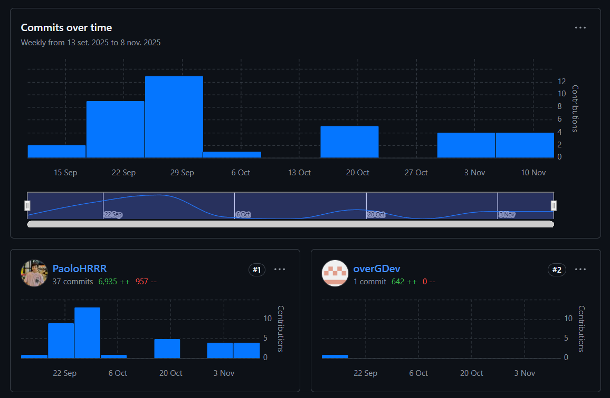
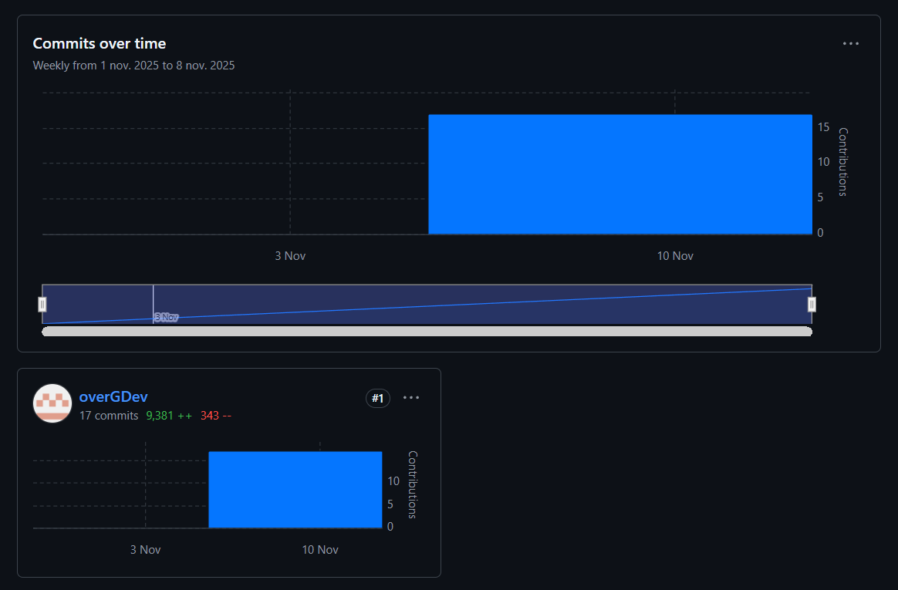

<h4 id="team-collaboration-insights-during-sprint-2">Team Collaboration Insights during Sprint</h4>

Para este primer Sprint, el equipo de desarrollo ha completo en su totalidad el Backend. Se han hecho importantes avances en la segunda versión de la aplicación móvil en kotlin y un orimer avance en la app de flutter. 

Se presentan los Insights de cada repositorio de la organización:

- Backend

- Aplicación móvil kotlin

- Aplicación móvil flutter

- Landing page

