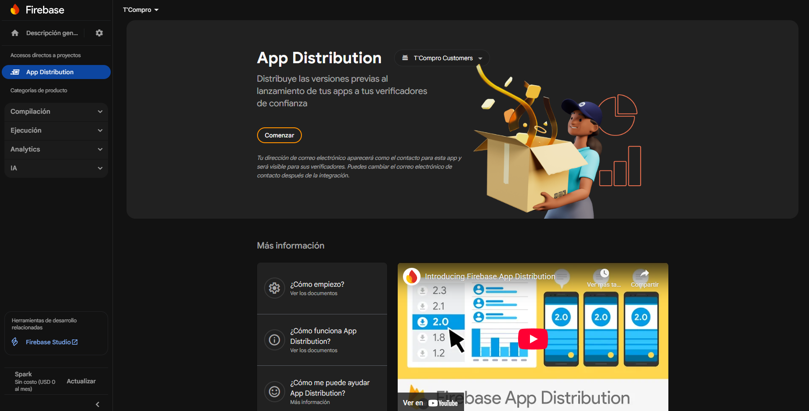
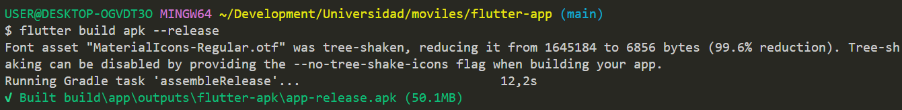
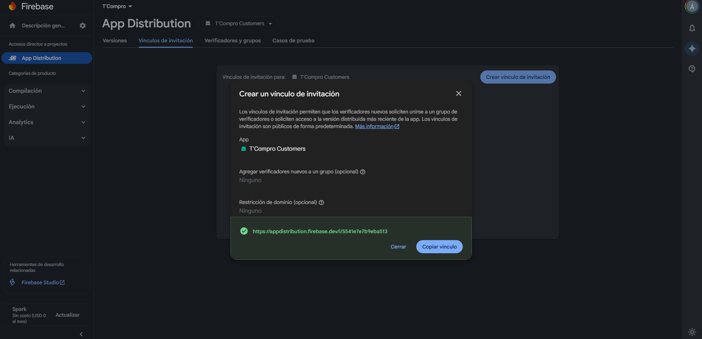
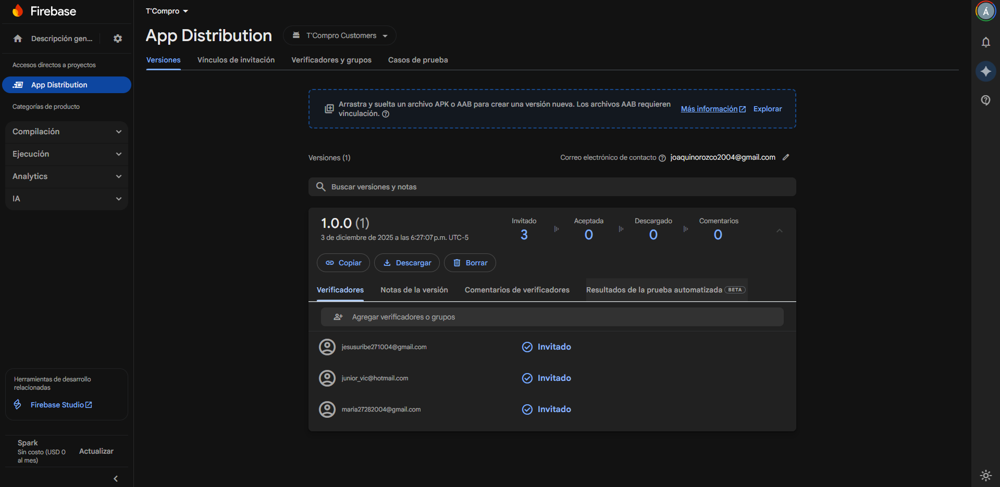

#### Software Deployment Evidence for Sprint Review

**APLICACION FLUTTER**

Se hizo el despliegue mediante Firebase App Distribution

1. Primero, se creo la aplicación dentro del proyecto de la organización

2. Luego, generamos el apk para subirlo

3. Generamos la invitación para los usuarios testers (entrevistados)

4. Enviamos las invitaciones al correo y esperamos pacientemente

