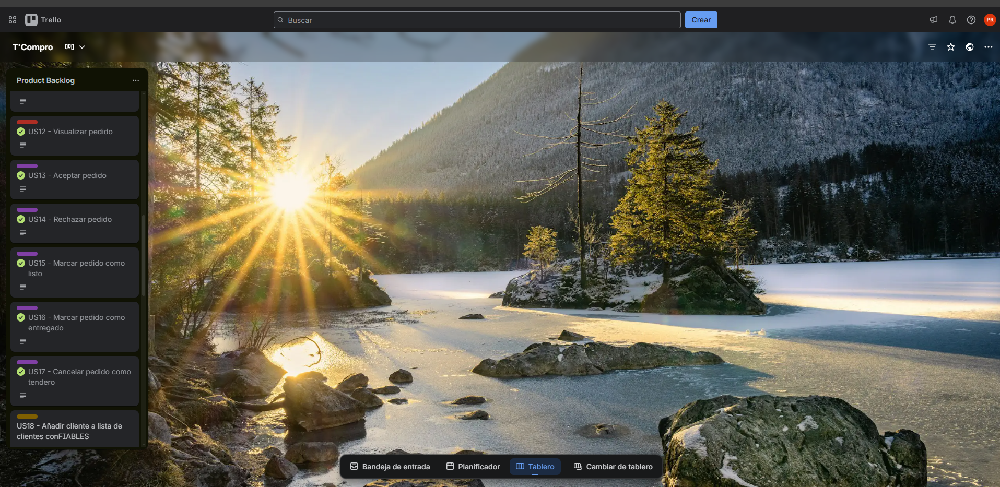

#### Sprint Backlog 3

El tablero del tercer sprint refleja las funcionalidades planificadas en el sprint planning 3, además de abarcar todas aquellas que quedaron como deuda técnica del anterior sprint.

<a href="https://trello.com/b/m7gJMODs/tcompro" target="_blank">Ver tablero en Trello</a>

<table cellpadding="6" cellspacing="0">
    <tr>
        <th colspan="8">Sprint #</th>
        <td colspan="8">Sprint 3</td>
    </tr>
    <tr>
        <th colspan="2">User Story</th>
        <th colspan="6">Work-Item / Task</th>
    </tr>
    <tr>
        <th>Id</th>
        <th>Title</th>
        <th>Id</th>
        <th>Title</th>
        <th>Description</th>
        <th>Estimation (Hours)</th>
        <th>Assigned To</th>
        <th>Status (To-Do / In-Process / To-Review / Done)</th>
    </tr>
    </tr>
        <td>US01   </td>
        <td>Ver productos</td>
        <td>US01  -01</td>
        <td>Ver productos</td>
        <td>Ver productos en la vista principal.</td>
        <td>3</td>
        <td>Reaño Delgadillo, Henry Paolo </td>
        <td>Done</td>
    </tr>
        </tr>
        <td>US06   </td>
        <td>Añadir producto al carrito de compras</td>
        <td>US06  -01</td>
        <td>Añadir producto al carrito de compras</td>
        <td>Añadir producto al carrito de compras del usuario desde la card de producto.</td>
        <td>4</td>
        <td>Orozco Torres, Alvaro Joaquin</td>
        <td>Done</td>
    </tr>
    </tr>
        <td>US07   </td>
        <td>Quitar producto al carrito de compras</td>
        <td>US07  -01</td>
        <td>Quitar producto al carrito de compras</td>
        <td>quITAR producto al carrito de compras del usuario desde el carrito de compras.</td>
        <td>3</td>
        <td>Orozco Torres, Alvaro Joaquin</td>
        <td>Done</td>
    </tr>
    </tr>
        <td>US08   </td>
        <td>Realizar pedido</td>
        <td>US08  -01</td>
        <td>Realizar pedido</td>
        <td>Realizar pedido desde el carrito de compras</td>
        <td>12</td>
        <td>Orozco Torres, Alvaro Joaquin</td>
        <td>Done</td>
    </tr>
    </tr>
        <td>US11   </td>
        <td>Cancelar pedido como cliente</td>
        <td>US08  -01</td>
        <td>Cancelar pedido</td>
        <td>Cancelar pedido desde la orden</td>
        <td>4</td>
        <td>Orozco Torres, Alvaro Joaquin</td>
        <td>Done</td>
    </tr>
    </tr>
        <td>US09   </td>
        <td>Seleccionar metodo de pago</td>
        <td>US09  -01</td>
        <td>Seleccionar metodo de pago en pedido</td>
        <td>Seleccionar metodo de pago desde la interfaz de crear pedido</td>
        <td>3</td>
        <td>Orozco Torres, Alvaro Joaquin</td>
        <td>Done</td>
    </tr>
        </tr>
        <td>US10   </td>
        <td>Seleccionar metodo de recojo</td>
        <td>US10  -01</td>
        <td>Seleccionar metodo de recojo en pedido</td>
        <td>Seleccionar metodo de recojo desde la interfaz de crear pedido</td>
        <td>3</td>
        <td>Orozco Torres, Alvaro Joaquin</td>
        <td>Done</td>
    </tr>
    </tr>
        <td>US12   </td>
        <td>Visualizar pedido</td>
        <td>US12  -01</td>
        <td>Visualizar pedid</td>
        <td>Visualizar pedido como cliente</td>
        <td>5</td>
        <td>Orozco Torres, Alvaro Joaquin</td>
        <td>Done</td>
    </tr>
    </tr>
        <td>US13   </td>
        <td>Aceptar pedido</td>
        <td>US13  -01</td>
        <td>Aceptar pedid</td>
        <td>Aceptar pedido como tendero</td>
        <td>3</td>
        <td>Orozco Torres, Alvaro Joaquin</td>
        <td>Done</td>
    </tr>
    </tr>
        <td>US14   </td>
        <td>Rechazar pedido</td>
        <td>US14  -01</td>
        <td>Rechazar pedid</td>
        <td>Rechazar pedido como tendero</td>
        <td>4</td>
        <td>Orozco Torres, Alvaro Joaquin</td>
        <td>Done</td>
    </tr>
    </tr>
        <td>US15   </td>
        <td>Marcar pedido como listo</td>
        <td>US15  -01</td>
        <td>Marcar pedido como listo</td>
        <td>Marcar pedido como listo como tendero</td>
        <td>2</td>
        <td>Orozco Torres, Alvaro Joaquin</td>
        <td>Done</td>
    </tr>
    </tr>
        <td>US16   </td>
        <td>Marcar pedido como entregado</td>
        <td>US16  -01</td>
        <td>Marcar pedido como entregado</td>
        <td>Marcar pedido como entregado como tendero</td>
        <td>3</td>
        <td>Orozco Torres, Alvaro Joaquin</td>
        <td>Done</td>
    </tr>
    </tr>
        <td>US17   </td>
        <td>Cancelar pedido</td>
        <td>US17  -01</td>
        <td>Cancelar pedido como tendero</td>
        <td>Cancelar pedido como tendero desde la vista de orden</td>
        <td>2</td>
        <td>Orozco Torres, Alvaro Joaquin</td>
        <td>Done</td>
    </tr>
        </tr>
        <td>US05   </td>
        <td>Compras recurrentes</td>
        <td>US05  -01</td>
        <td>Añadir lista de compras recurrentes</td>
        <td>Crear lista de compras recurrentes desde la vista de compras recurrentes</td>
        <td>6</td>
        <td>Reaño Delgadillo, Henry Paolo</td>
        <td>Done</td>
    </tr>
    </tr>
        <td>US02   </td>
        <td>Añadir producto a favoritos</td>
        <td>US02  -01</td>
        <td>Añadir producto a favoritos del usuario</td>
        <td>Añadir producto a favoritos desde la card del producto</td>
        <td>4</td>
        <td>Reaño Delgadillo, Henry Paolo</td>
        <td>Done</td>
    </tr>
    </tr>
        <td>US03   </td>
        <td>Quitar producto a favoritos</td>
        <td>US03  -01</td>
        <td>Quitar producto a favoritos del usuario</td>
        <td>Quitar producto a favoritos desde la card del producto</td>
        <td>2</td>
        <td>Reaño Delgadillo, Henry Paolo</td>
        <td>Done</td>
    </tr>
    </tr>
        <td>US04   </td>
        <td>Visualizar productos favoritos</td>
        <td>US04  -01</td>
        <td>Ver productos favoritos</td>
        <td>Ver productos favoritos desde la pantalla principal</td>
        <td>3</td>
        <td>Reaño Delgadillo, Henry Paolo</td>
        <td>Done</td>
    </tr>
</table>