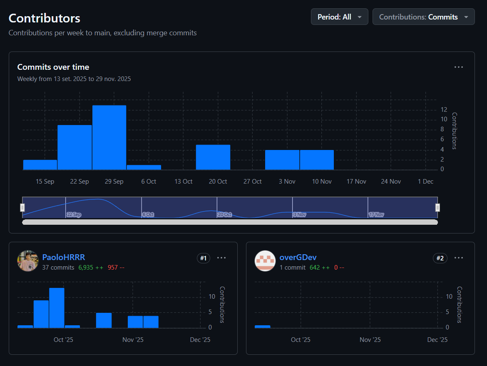
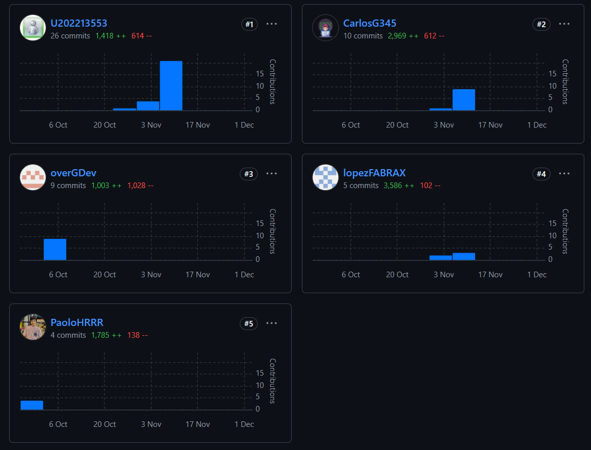
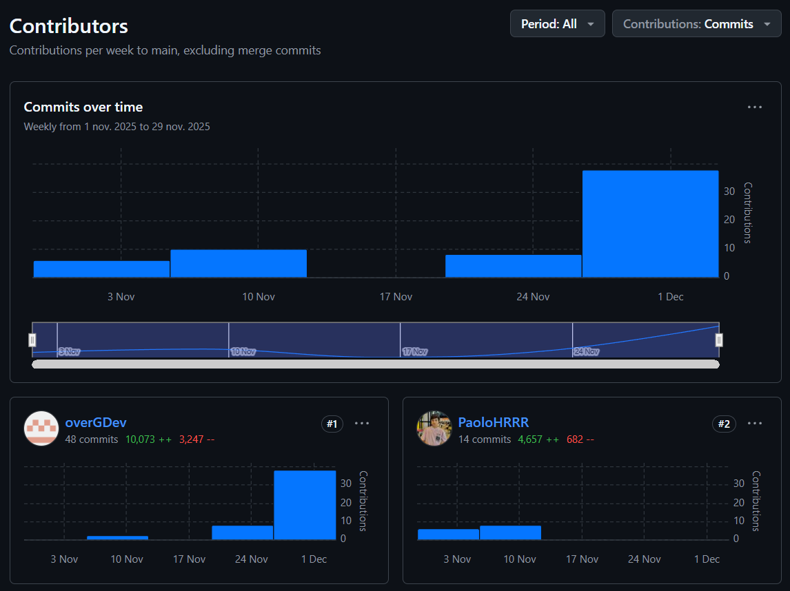
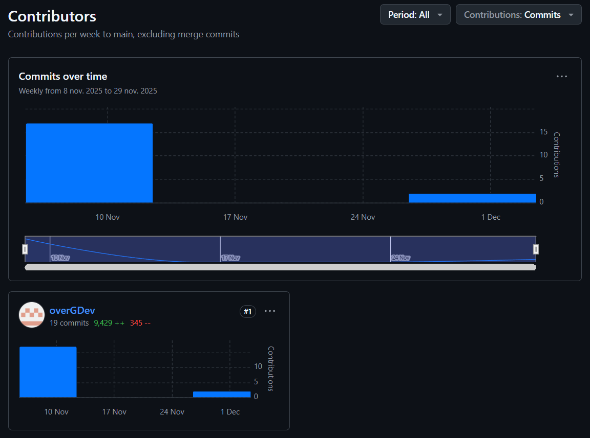

<h4 id="team-collaboration-insights-during-sprint-3">Team Collaboration Insights during Sprint</h4>

Para este tercer sprint, el equipo de desarrollo ha realizado pequeñas correciones en el Backend. Se ha completado en su totalidad el desarrollo de la aplicacion en Flutter. 

Se presentan los Insights de cada repositorio de la organización:

- Backend

- Aplicación móvil kotlin

- Aplicación móvil flutter

- Landing page

