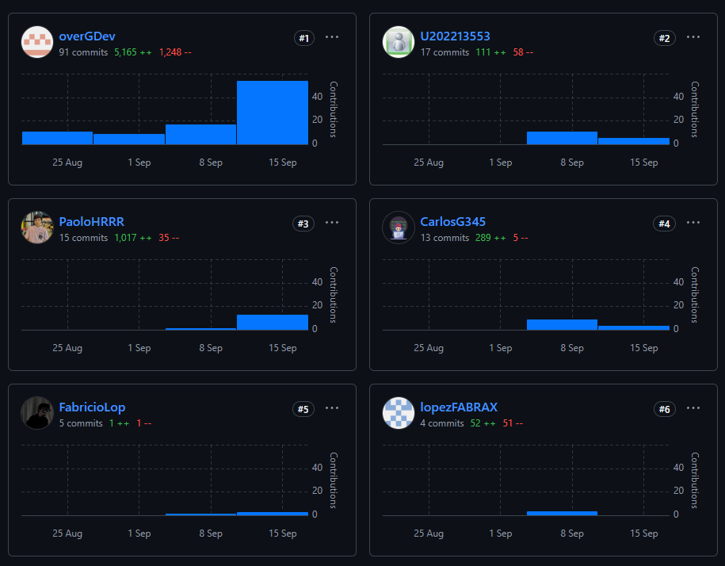

# Project Report Collaboration Insights

Enlace del repositorio del informe del proyecto: [Enlace (GitHub)](https://github.com/Soulware-Apps-Moviles/report)

**TB1**

Se presenta el resumen de commits:

**TP**

Se presenta el resumen de commits:

**TB2**

Se presenta el resumen de commits:

